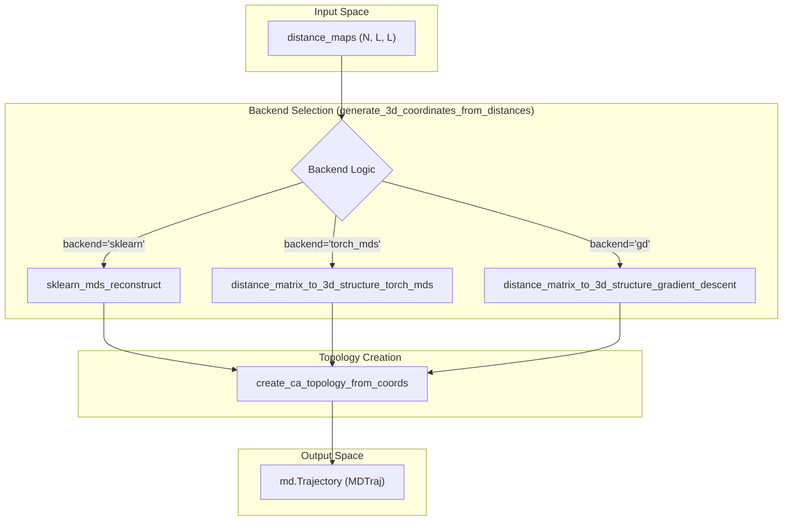

# 3D Coordinate Reconstruction (MDS)

Relevant source files

The following files were used as context for generating this wiki page:

- [starling/structure/coordinates.py](starling/structure/coordinates.py)
- [starling/structure/ensemble.py](starling/structure/ensemble.py)

3D Coordinate Reconstruction in STARLING is the process of transforming predicted pairwise distance maps (the output of the Diffusion model) into 3D Cartesian coordinates. Because the generative pipeline operates in the space of $C\alpha-C\alpha$ distances, this stage is essential for generating structural ensembles (PDB/XTC) and performing downstream biophysical analysis.

STARLING provides three distinct backends for this reconstruction, catering to different hardware availability and performance requirements:
1.  **Classical MDS**: Uses `sklearn.manifold.MDS` (CPU-based).
2.  **Torch MDS (SMACOF)**: A batched GPU implementation of the Scaling by Majorizing a Complicated Function (SMACOF) algorithm.
3.  **Gradient Descent**: A PyTorch-based optimization approach using `torch.optim`.

### Data Flow and Reconstruction Logic

The reconstruction process is orchestrated by `generate_3d_coordinates_from_distances` [starling/structure/coordinates.py:273-392](). It takes a stack of distance maps and returns a coordinate trajectory and associated metadata.

#### System Entity Mapping
The following diagram maps the logical reconstruction steps to the internal function calls within `starling/structure/coordinates.py`.

**Reconstruction Data Flow**

**Sources:** [starling/structure/coordinates.py:273-440]()

---

### Reconstruction Backends

#### 1. Classical Scikit-Learn MDS
This backend utilizes the standard `MDS` class from `sklearn.manifold` [starling/structure/coordinates.py:9](). It is highly stable but operates on the CPU and processes frames sequentially, making it the slowest option for large ensembles.
*   **Function**: `sklearn_mds_reconstruct` [starling/structure/coordinates.py:443-488]()
*   **Parameters**: Uses `dissimilarity='precomputed'`, `n_init=1`, and `max_iter=300`.

#### 2. Batched GPU SMACOF (`torch_mds`)
The `torch_mds` backend implements the SMACOF algorithm using PyTorch tensors, allowing for massive parallelization across frames on a GPU [starling/structure/coordinates.py:123-233]().
*   **Implementation**: It computes the Guttman transform in batches [starling/structure/coordinates.py:228-229]().
*   **Device Support**: Specifically optimized for CUDA. On macOS (MPS), it includes a fallback check because certain MPS operations in older macOS versions (<=14) are slower than CPU execution [starling/structure/coordinates.py:134-140]().
*   **Convergence**: Monitors stress history and stops when `torch.abs(old_stress - stress) < tol` [starling/structure/coordinates.py:213-216]().

#### 3. Gradient Descent
This backend treats coordinate reconstruction as a direct optimization problem, minimizing the Mean Squared Error (MSE) between the target distances and the distances calculated from the current 3D coordinates.
*   **Loss Function**: `loss_function` [starling/structure/coordinates.py:61-97]() calculates MSE on the upper triangle of the distance matrices.
*   **Optimizer**: Uses `torch.optim.Adam` [starling/structure/coordinates.py:534]().
*   **Precision**: Automatically adjusts `torch.dtype` based on the device; `mps` uses `float32` while others use `float64` for stability [starling/structure/coordinates.py:15-42]().

**Sources:** [starling/structure/coordinates.py:123-233](), [starling/structure/coordinates.py:443-488](), [starling/structure/coordinates.py:491-564]()

---

### Initialization and Topology

#### Incremental Coordinate Initialization
For the Gradient Descent backend, STARLING uses a specific initialization strategy rather than random noise. The `create_incremental_coordinates` function [starling/structure/coordinates.py:100-121]() generates a random walk where each subsequent $C\alpha$ is placed at a fixed distance (default 3.8 Å) from the previous one in a random direction. This provides a more physically plausible starting point for the optimizer.

#### MDTraj Integration
Once coordinates are generated, they are wrapped in an `mdtraj.Trajectory` object. Since STARLING only predicts $C\alpha$ positions, a "minimal" topology must be created.
*   **Function**: `create_ca_topology_from_coords` [starling/structure/coordinates.py:395-440]()
*   **Logic**: It creates a `mdtraj.Topology` object, adds a chain, and populates it with $C\alpha$ atoms named "CA" within residues corresponding to the input sequence [starling/structure/coordinates.py:417-432]().

**Entity Mapping: Coordinate to Trajectory**
| Code Entity | Role |
| :--- | :--- |
| `create_incremental_coordinates` | Generates initial $C\alpha$ chain for GD optimization. |
| `generate_3d_coordinates_from_distances` | Main entry point for coordinate generation. |
| `create_ca_topology_from_coords` | Converts raw numpy/torch arrays into `md.Trajectory`. |
| `Ensemble.build_ensemble_trajectory` | High-level method that triggers reconstruction and caches results. |

**Sources:** [starling/structure/coordinates.py:100-121](), [starling/structure/coordinates.py:395-440](), [starling/structure/ensemble.py:265-334]()

---

### Configuration and Performance

Reconstruction parameters are typically managed via the `Ensemble` class or passed through the `generate` API.

| Parameter | Default | Description |
| :--- | :--- | :--- |
| `backend` | `'torch_mds'` | Selection of reconstruction algorithm. |
| `batch_size` | `100` | Number of frames processed simultaneously in `torch_mds`. |
| `n_iter` | `300` | Maximum iterations for convergence. |
| `tol` | `1e-4` | Convergence tolerance for stress/loss. |
| `device` | `configs.DEVICE` | Target hardware (cpu, cuda, mps). |

#### Error Handling
The `check_for_errors` method in the `Ensemble` class [starling/structure/ensemble.py:181-263]() scans the reconstructed coordinates for impossible intermolecular distances (e.g., $C\alpha$ distances < 2.0 Å). If `remove_errors=True`, these frames are purged from the ensemble [starling/structure/ensemble.py:245-251]().

**Sources:** [starling/structure/ensemble.py:181-263](), [starling/structure/coordinates.py:123-168](), [starling/configs.py:27-35]()

---