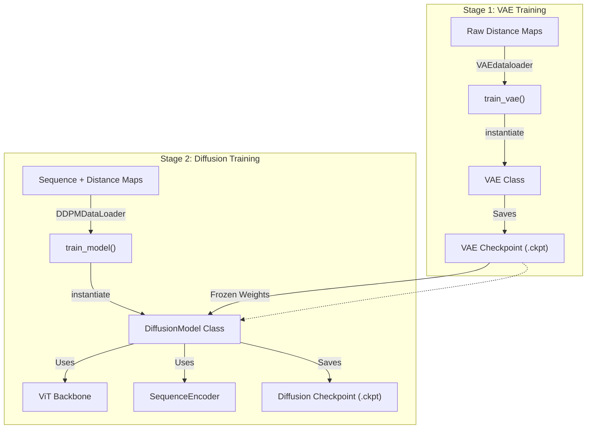

# Training

Relevant source files

The following files were used as context for generating this wiki page:

- [starling/configs/trainer/vae_trainer.yaml](starling/configs/trainer/vae_trainer.yaml)
- [starling/configs/vae_configs.yaml](starling/configs/vae_configs.yaml)
- [starling/models/diffusion.py](starling/models/diffusion.py)
- [starling/training/__init__.py](starling/training/__init__.py)
- [starling/training/diffusion_train.py](starling/training/diffusion_train.py)
- [starling/training/vae_train.py](starling/training/vae_train.py)

STARLING utilizes a two-stage training pipeline to learn the generative mapping from protein sequences to structural ensembles. The process first trains a **Variational Autoencoder (VAE)** to compress distance maps into a low-dimensional latent space, followed by a **Latent Diffusion Model (DDPM)** that learns to generate these latents conditioned on protein sequences and physical parameters like ionic strength.

The training infrastructure is built on **PyTorch Lightning** for distributed orchestration, **Hydra** for hierarchical configuration management, and **Weights & Biases (WandB)** for experiment tracking.

### Training Workflow and System Mapping

The following diagram illustrates how high-level training concepts map to specific code entities and the data flow between the two stages.

**Training System Data Flow**

**Sources:** [starling/training/vae_train.py:106-191](), [starling/training/diffusion_train.py:136-190](), [starling/models/diffusion.py:138-144]()

---

### Shared Infrastructure

Both training pipelines share a common infrastructure designed for scalability and reproducibility:

*   **PyTorch Lightning:** Manages the training loop, distributed data parallel (DDP) strategy, and precision (e.g., `bf16-mixed`) [starling/training/vae_train.py:172-184](), [starling/training/diffusion_train.py:123-133]().
*   **Hydra Configuration:** Configurations are split into `dataloader`, `trainer`, and `model` groups, allowing modular overrides via CLI or YAML files [starling/configs/vae_configs.yaml:1-5]().
*   **Experiment Tracking:** `WandbLogger` is integrated into both entrypoints to track losses, learning rates, and model gradients [starling/training/vae_train.py:168-170](), [starling/training/diffusion_train.py:115-119]().
*   **Checkpointing:** The `ModelCheckpoint` callback automatically saves the "last" state and the "best" model based on `epoch_val_loss` [starling/training/vae_train.py:35-48](), [starling/training/diffusion_train.py:39-52]().

---

### VAE Training (Stage 1)

The VAE training stage focuses on learning a robust latent representation of protein distance maps. The `train_vae` entrypoint supports training from scratch, resuming from a `last.ckpt`, or fine-tuning existing weights with new hyperparameters [starling/training/vae_train.py:106-116]().

Key features include:
*   **Factory Setup:** The `setup_vae_model` function uses Hydra's `instantiate` to build the VAE architecture [starling/training/vae_train.py:79-98]().
*   **Effective Batch Size:** The dataloader automatically calculates the effective batch size based on the number of GPUs and nodes to ensure consistent gradient updates across distributed setups [starling/training/vae_train.py:151-154]().

For details on VAE loss functions, KLD scheduling, and configuration, see **[VAE Training](#6.1)**.

**Sources:** [starling/training/vae_train.py:79-191](), [starling/configs/trainer/vae_trainer.yaml:1-12]()

---

### Diffusion Model Training (Stage 2)

Once a VAE is trained, its encoder is frozen and used to project distance maps into latents for the Diffusion Model. The `train_model` script orchestrates the training of the `ViT` backbone and `SequenceEncoder` [starling/training/diffusion_train.py:81-112]().

Key features include:
*   **Latent Scaling:** The `DiffusionModel` registers a `latent_space_scaling_factor` buffer, which is used to normalize the VAE latent space to unit variance, improving diffusion stability [starling/models/diffusion.py:156-160]().
*   **Conditioning:** The model is trained to denoise latents conditioned on sequence embeddings and ionic strength values [starling/models/diffusion.py:71-75]().
*   **SNR Weighting:** Supports `min_snr_loss` to balance the loss across different diffusion timesteps [starling/models/diffusion.py:79-80]().

For details on the diffusion process, ViT architecture, and multi-node setup, see **[Diffusion Model Training](#6.2)**.

**Sources:** [starling/training/diffusion_train.py:81-112](), [starling/models/diffusion.py:55-187]()

---

### Data Loading and Preprocessing

Training requires high-throughput data access. STARLING supports two primary data formats:
1.  **HDF5 (.h5):** Standard for local, high-speed access to structured datasets [starling/training/vae_train.py:61-65]().
2.  **WebDataset (.tar):** Optimized for distributed training on cloud filesystems or large clusters, utilizing a sharded pipeline [starling/training/vae_train.py:66-72]().

The preprocessing pipeline handles sequence tokenization via the `StarlingTokenizer`, distance map symmetrization, and the generation of attention masks for the `SequenceEncoder`.

For details on the data pipeline and supported formats, see **[Data Loading and Preprocessing](#6.3)**.

**Sources:** [starling/training/vae_train.py:58-76](), [starling/training/diffusion_train.py:62-78]()

---