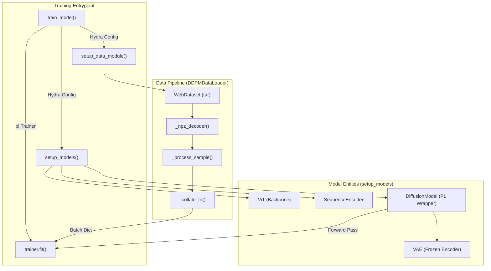
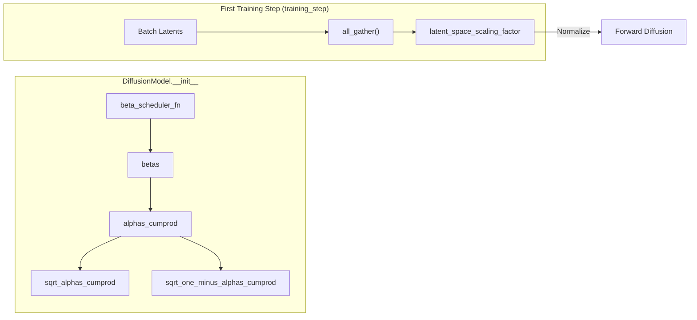

# Diffusion Model Training

Relevant source files

The following files were used as context for generating this wiki page:

- [hubconf.py](hubconf.py)
- [starling/configs/dataloader/dataloader.yaml](starling/configs/dataloader/dataloader.yaml)
- [starling/configs/diffusion/diffusion.yaml](starling/configs/diffusion/diffusion.yaml)
- [starling/configs/trainer/trainer.yaml](starling/configs/trainer/trainer.yaml)
- [starling/data/argument_parser.py](starling/data/argument_parser.py)
- [starling/data/ddpm_loader_tar.py](starling/data/ddpm_loader_tar.py)
- [starling/inference/model_loading.py](starling/inference/model_loading.py)
- [starling/models/diffusion.py](starling/models/diffusion.py)
- [starling/training/config.yaml](starling/training/config.yaml)
- [starling/training/diffusion_train.py](starling/training/diffusion_train.py)

The diffusion training pipeline in STARLING is responsible for training a Denoising Diffusion Probabilistic Model (DDPM) to generate protein distance map latents. The process involves a Vision Transformer (ViT) backbone conditioned on protein sequences and ionic strength, operating within the latent space of a pre-trained Variational Autoencoder (VAE).

## Training Entrypoint and Configuration

The primary entrypoint for training is the `train_model` function located in `starling/training/diffusion_train.py` [starling/training/diffusion_train.py:141-198](). It utilizes **Hydra** for configuration management, loading parameters from a hierarchical structure in `starling/configs/` [starling/training/diffusion_train.py:136-140]().

### Configuration Hierarchy
*   **`trainer/trainer.yaml`**: Controls hardware settings (`cuda`, `num_nodes`), training duration (`num_epochs`), and precision (`bf16-mixed`) [starling/configs/trainer/trainer.yaml:1-12]().
*   **`diffusion/diffusion.yaml`**: Defines diffusion-specific parameters like the `beta_scheduler` (e.g., "cosine"), `timesteps` (default 1000), and the path to the pre-trained `distance_map_encoder` [starling/configs/diffusion/diffusion.yaml:3-12]().
*   **`dataloader/dataloader.yaml`**: Specifies the data source type (`tar` or `h5`) and associated paths [starling/configs/dataloader/dataloader.yaml:1-16]().

**Sources:** [starling/training/diffusion_train.py:136-140](), [starling/configs/trainer/trainer.yaml:1-12](), [starling/configs/diffusion/diffusion.yaml:3-12](), [starling/configs/dataloader/dataloader.yaml:1-16]()

---

## Data Module Setup

The `setup_data_module` function initializes the dataset based on the configuration [starling/training/diffusion_train.py:62-79](). STARLING supports two primary data formats:

1.  **WebDataset (tar)**: Handled by `DDPMDataLoader`. This is the preferred method for large-scale multi-node training as it streams data from `.tar` or `.tar.zst` shards [starling/data/ddpm_loader_tar.py:20-56]().
2.  **HDF5 (h5)**: A standard format for smaller, localized datasets [starling/training/diffusion_train.py:65-69]().

### Data Flow in `DDPMDataLoader`
The pipeline decodes `.npz` files containing latents, sequences, and ionic strength metadata [starling/data/ddpm_loader_tar.py:138-153]().

| Step | Function | Description |
| :--- | :--- | :--- |
| **Decoding** | `_npz_decoder` | Uses `io.BytesIO` to load numpy arrays from raw bytes [starling/data/ddpm_loader_tar.py:129-137](). |
| **Processing** | `_process_sample` | Extracts `latents`, `sequence`, and `ionic_strength` from the decoded sample [starling/data/ddpm_loader_tar.py:138-153](). |
| **Collation** | `_collate_fn` | Pads sequences to the maximum length in the batch and generates `attention_mask` [starling/data/ddpm_loader_tar.py:155-191](). |

**Sources:** [starling/training/diffusion_train.py:62-79](), [starling/data/ddpm_loader_tar.py:20-191]()

---

## Model Architecture and Initialization

The model is initialized via `setup_models`, which instantiates three core components [starling/training/diffusion_train.py:81-112]():

1.  **ViT (Vision Transformer)**: The backbone model used for denoising. In the training script, it is configured with 12 layers, a hidden dimension of 512, and 8 attention heads [starling/training/diffusion_train.py:88]().
2.  **SequenceEncoder**: Encodes the protein sequence into a representation that conditions the ViT via cross-attention [starling/training/diffusion_train.py:89]().
3.  **DiffusionModel**: The `pl.LightningModule` wrapper that manages the forward/reverse diffusion mathematics [starling/models/diffusion.py:55-70]().

### Latent Scaling Factor Initialization
Per Rombach et al. (2021), the latent space is normalized to unit variance. The `DiffusionModel` registers a `latent_space_scaling_factor` buffer [starling/models/diffusion.py:158-160](). During the first training step, the model calculates the standard deviation of the initial batch of latents across all distributed nodes using `all_gather` and updates this scaling factor to ensure stable training [starling/models/diffusion.py:207-228]().

### Fine-Tuning Logic
If `config.trainer.fine_tune` is set to `true`, the model loads weights from the specified checkpoint while allowing the optimizer to restart or continue based on the `pl.Trainer` configuration [starling/training/diffusion_train.py:98-110]().

**Sources:** [starling/training/diffusion_train.py:81-112](), [starling/models/diffusion.py:55-228]()

---

## System Entity Mapping

The following diagrams bridge the conceptual training pipeline with the specific code entities.

### Training Logic Overview

**Sources:** [starling/training/diffusion_train.py:62-112](), [starling/data/ddpm_loader_tar.py:20-191]()

### Diffusion Process Initialization

**Sources:** [starling/models/diffusion.py:158-228]()

---

## Distributed Training Configuration

STARLING is designed for multi-node distributed training using PyTorch Lightning. The `effective_batch_size` is calculated to ensure consistent gradient updates across different hardware configurations [starling/training/diffusion_train.py:157-162]().

$$EffectiveBatchSize = CUDA\_Devices \times Num\_Nodes \times Batch\_Size\_Per\_GPU$$

### Trainer Settings
The `setup_trainer` function configures the `pl.Trainer` with the following key parameters [starling/training/diffusion_train.py:122-133]():
*   **`accelerator="auto"`**: Automatically selects CUDA or CPU.
*   **`precision="bf16-mixed"`**: Uses BFloat16 mixed precision for reduced memory footprint and faster computation on supported hardware (e.g., A100/H100 GPUs).
*   **`gradient_clip_val`**: Prevents exploding gradients, typically set to 1.0.

**Sources:** [starling/training/diffusion_train.py:122-162](), [starling/configs/trainer/trainer.yaml:1-7]()

---