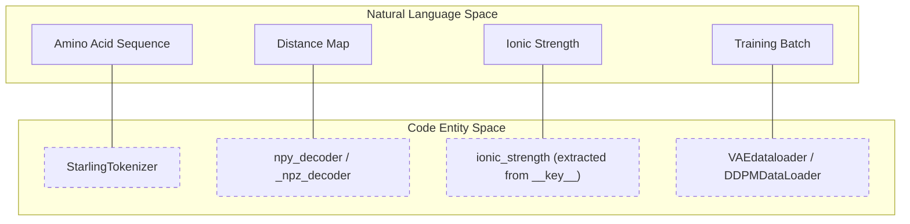
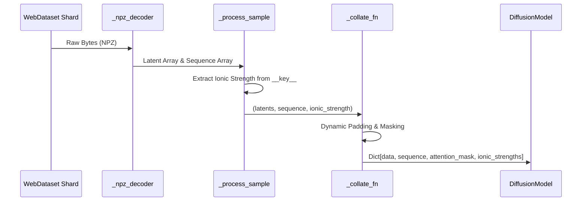

# Data Loading and Preprocessing

Relevant source files

The following files were used as context for generating this wiki page:

- [hubconf.py](hubconf.py)
- [starling/configs/dataloader/vae_dataloader.yaml](starling/configs/dataloader/vae_dataloader.yaml)
- [starling/data/VAE_loader_tar.py](starling/data/VAE_loader_tar.py)
- [starling/data/data_wrangler.py](starling/data/data_wrangler.py)
- [starling/data/ddpm_loader_tar.py](starling/data/ddpm_loader_tar.py)
- [starling/data/schedulers.py](starling/data/schedulers.py)
- [starling/data/tokenizer.py](starling/data/tokenizer.py)
- [starling/inference/model_loading.py](starling/inference/model_loading.py)
- [starling/models/attention.py](starling/models/attention.py)
- [starling/models/blocks.py](starling/models/blocks.py)
- [starling/models/transformer.py](starling/models/transformer.py)
- [starling/models/vae_components.py](starling/models/vae_components.py)
- [starling/tests/test_tokenizer.py](starling/tests/test_tokenizer.py)

This page details the infrastructure used for high-performance data loading and preprocessing in STARLING. The system supports two primary training stages: the Variational Autoencoder (VAE) and the Latent Diffusion Model (DDPM). It utilizes `webdataset` for scalable streaming of large-scale protein ensemble data and a specialized tokenizer for amino acid sequences.

## Data Infrastructure Overview

STARLING implements a multi-stage data pipeline that bridges raw protein data (distance maps and sequences) to model-ready tensors. The pipeline is designed to handle massive datasets stored in sharded `.tar` formats or compressed `.h5` files.

### Natural Language to Code Entity Mapping

The following diagram maps high-level data concepts to their specific implementations in the codebase.

**Data Entity Association**

**Sources:** [starling/data/tokenizer.py:1-47](), [starling/data/VAE_loader_tar.py:16-50](), [starling/data/ddpm_loader_tar.py:20-56]()

## Tokenization and Sequence Handling

The `StarlingTokenizer` is a lightweight, byte-level tokenizer optimized for protein sequences. It maps 20 standard amino acids plus a padding token to integer IDs.

### StarlingTokenizer Implementation
The tokenizer uses `bytearray` translation tables for O(1) encoding and decoding performance [starling/data/tokenizer.py:50-62]().

*   **Vocab:** Maps characters `A, C, D, E, F, G, H, I, K, L, M, N, P, Q, R, S, T, V, W, Y` to IDs `1-20`.
*   **Padding:** The character `"0"` and ID `0` are reserved for padding [starling/data/tokenizer.py:25-47]().
*   **Validation:** Unknown characters encountered during `encode` raise a `KeyError` [starling/data/tokenizer.py:71-74]().
*   **Post-processing:** During `decode`, all `0` tokens are automatically stripped to return the original sequence string [starling/data/tokenizer.py:89-93]().

### Sequence Padding and Masking
In the training pipeline, sequences are dynamically padded to the maximum length within a batch [starling/data/ddpm_loader_tar.py:171-175](). An `attention_mask` is generated where `True` indicates a real residue and `False` indicates padding [starling/data/ddpm_loader_tar.py:177-182]().

**Sources:** [starling/data/tokenizer.py:1-93](), [starling/data/ddpm_loader_tar.py:155-191]()

## VAE Data Pipeline

The `VAEdataloader` is responsible for loading distance maps for VAE training. It supports sharded WebDatasets (`.tar`, `.tar.gz`, `.tar.zst`) [starling/data/VAE_loader_tar.py:60-63]().

### Ionic Strength and Sequence Filtering
A unique feature of the VAE loader is the `apply_filter` mechanism, which uses an `acceptance_probs.csv` file to rebalance the dataset based on sequence length [starling/data/VAE_loader_tar.py:29-43]().

1.  **Decoding:** `_npz_decoder` extracts the `array` from `.npz` files [starling/data/VAE_loader_tar.py:127-136]().
2.  **Filtering:** `_filter_sample` uses a random probability check against the `accept_prob_table` indexed by sequence length [starling/data/VAE_loader_tar.py:113-125]().
3.  **Batching:** Samples are batched and converted to tensors, typically maintaining a channel dimension `(B, 1, L, L)` [starling/data/VAE_loader_tar.py:144-148]().

**Sources:** [starling/data/VAE_loader_tar.py:16-165](), [starling/configs/dataloader/vae_dataloader.yaml:1-11]()

## DDPM Data Pipeline

The `DDPMDataLoader` extends the infrastructure to include conditioning variables required for diffusion, specifically the sequence and ionic strength.

### Data Flow for Diffusion Conditioning
The pipeline extracts the ionic strength from the file metadata (the `__key__` in the WebDataset) and pairs the latent distance map with its corresponding sequence.

**DDPM Data Loading Logic**

**Sources:** [starling/data/ddpm_loader_tar.py:97-153](), [starling/data/ddpm_loader_tar.py:155-191]()

### Key Functions
*   **`npy_decoder`**: Uses `io.BytesIO` to load numpy arrays directly from webdataset streams [starling/data/ddpm_loader_tar.py:16-17]().
*   **`_process_sample`**: Extracts `distance_map.npz` (or latents) and `sequence.npz`, then parses the ionic strength from the filename (e.g., `..._150mM`) [starling/data/ddpm_loader_tar.py:138-153]().
*   **`_collate_fn`**: Performs the final tensor conversion and ensures `ionic_strengths` are unsqueezed for the model's MLP conditioning [starling/data/ddpm_loader_tar.py:183]().

**Sources:** [starling/data/ddpm_loader_tar.py:16-191]()

## Preprocessing Utilities

The `data_wrangler.py` module provides standalone utilities for manual data manipulation.

| Function | Purpose | Implementation Detail |
| :--- | :--- | :--- |
| `one_hot_encode` | Converts amino acid strings to 3D one-hot tensors | Uses `aa_to_int` mapping [starling/data/data_wrangler.py:9-55]() |
| `MaxPad` | Pads 2D distance maps to a fixed square size | Uses `np.pad` with `constant_values=0` [starling/data/data_wrangler.py:58-80]() |
| `symmetrize` | Ensures a distance map is perfectly symmetric | Mirrors the upper triangle to the lower triangle [starling/data/data_wrangler.py:128-141]() |
| `load_hdf5_compressed` | Efficiently reads specific frames from H5 files | Supports `hdf5plugin` for compressed datasets [starling/data/data_wrangler.py:83-106]() |

**Sources:** [starling/data/data_wrangler.py:1-141]()

---