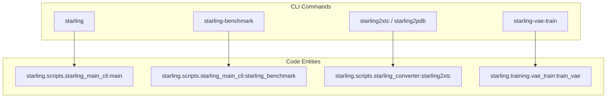
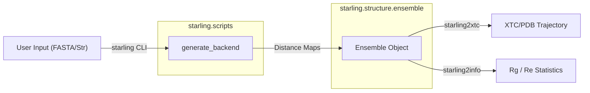

# CLI and Scripts

Relevant source files

The following files were used as context for generating this wiki page:

- [pyproject.toml](pyproject.toml)
- [starling/scripts/starling_converter.py](starling/scripts/starling_converter.py)
- [starling/scripts/starling_main_cli.py](starling/scripts/starling_main_cli.py)

STARLING provides a comprehensive suite of command-line interfaces (CLIs) for generating protein ensembles, benchmarking performance, and converting data between various formats. These tools are registered as entry points in the package configuration, allowing them to be called directly from the terminal after installation.

The CLI tools are primarily organized into three categories:
1.  **Generation and Benchmarking**: Main entry points for creating ensembles from sequences and profiling model performance.
2.  **Data Conversion**: Utilities for transforming `.starling` files into standard formats like PDB, XTC, or NumPy arrays.
3.  **Search and Training**: Specialized tools for building similarity indices and executing model training pipelines.

### CLI Entry Point Mapping

The following diagram maps the user-facing CLI commands to their respective implementation functions within the codebase.

**CLI to Code Entity Mapping**

**Sources:** [pyproject.toml:49-65](), [starling/scripts/starling_main_cli.py:45-54](), [starling/scripts/starling_converter.py:14-17]()

---

### Generation and Benchmarking
The primary interface for STARLING is the `starling` command. It wraps the `generate()` function to produce structural ensembles from sequence inputs. It supports various flags for controlling the number of conformations, ionic strength, and the sampling device (CPU/GPU).

For performance analysis, the `starling-benchmark` tool provides automated profiling of runtime, memory usage, and structural metrics like Radius of Gyration ($R_g$) across different sequence lengths and batch sizes.

*   **Key Components**: `starling.scripts.starling_main_cli.main`, `starling.frontend.ensemble_generation.generate`.
*   **For details, see [Generation CLI: starling and starling-benchmark](#7.1)**.

**Sources:** [starling/scripts/starling_main_cli.py:13-13](), [starling/scripts/starling_main_cli.py:45-202](), [starling/scripts/starling_main_cli.py:211-219]()

---

### Data Conversion Utilities
STARLING uses a custom `.starling` serialization format for ensembles (managed by the `Ensemble` class). To facilitate integration with other molecular dynamics (MD) analysis tools, the `starling-converter` suite provides several utilities. These tools follow a "Load-Transform-Save" pattern, often involving 3D reconstruction via Multidimensional Scaling (MDS) if coordinates are not already present in the source file.

| Command | Output Format | Primary Use Case |
| :--- | :--- | :--- |
| `starling2xtc` | `.xtc` + `.pdb` | MD analysis in GROMACS/VMD |
| `starling2pdb` | Multi-model `.pdb` | Visualization |
| `starling2numpy` | `.npy` | Custom analysis of distance maps |
| `starling2info` | Stdout | Metadata and summary statistics |
| `xtc2starling` | `.starling` | Importing external trajectories |

*   **Key Components**: `starling.scripts.starling_converter`, `starling.structure.ensemble.Ensemble`.
*   **For details, see [Data Conversion CLI: starling-converter Tools](#7.2)**.

**Sources:** [starling/scripts/starling_converter.py:14-112](), [starling/scripts/starling_converter.py:167-207](), [pyproject.toml:56-63]()

---

### Data Flow Architecture
The CLI scripts act as a bridge between raw user input (FASTA, strings) and the internal `Ensemble` data structures.

**Data Flow: Sequence to Analysis**

**Sources:** [starling/scripts/starling_main_cli.py:185-200](), [starling/scripts/starling_converter.py:51-62](), [starling/scripts/starling_converter.py:180-205]()

---

### Training and Search Entry Points
Beyond ensemble generation, STARLING includes scripts for model development and large-scale sequence searching:
*   **Training**: `starling-vae-train` and `starling-ddpm-train` execute the training pipelines defined in the `starling.training` module, utilizing Hydra for configuration management.
*   **Search**: `starling-search` and `starling-pretokenize` interface with the FAISS-based similarity search engine to identify ensembles similar to a query sequence.

**Sources:** [pyproject.toml:50-51](), [pyproject.toml:64-65]()

---