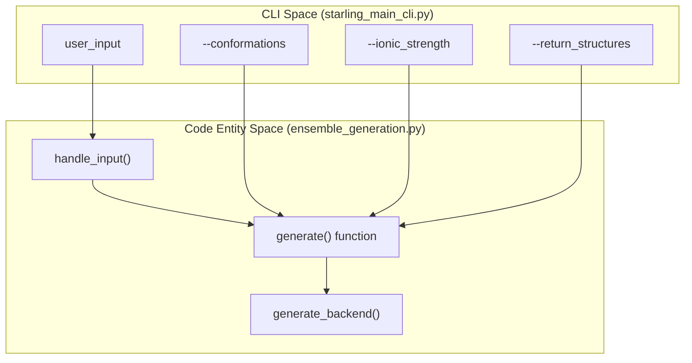
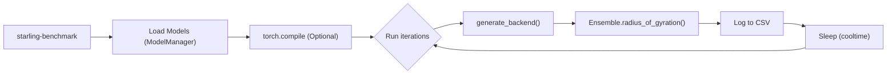

# Generation CLI: starling and starling-benchmark

Relevant source files

The following files were used as context for generating this wiki page:

- [changelog.md](changelog.md)
- [docs/autosummary/starling.structure.ensemble.Ensemble.rst](docs/autosummary/starling.structure.ensemble.Ensemble.rst)
- [docs/getting_started.rst](docs/getting_started.rst)
- [docs/usage/cli.rst](docs/usage/cli.rst)
- [docs/usage/ensemble_generation.rst](docs/usage/ensemble_generation.rst)
- [starling/frontend/ensemble_generation.py](starling/frontend/ensemble_generation.py)
- [starling/scripts/starling_main_cli.py](starling/scripts/starling_main_cli.py)

This page provides a technical reference for the primary command-line interfaces (CLIs) provided by the STARLING package. These tools serve as the main entry points for generating protein ensembles and profiling model performance.

## 1. The `starling` CLI

The `starling` command is the high-level entry point for generating structural ensembles from protein sequences. It acts as a wrapper around the `starling.frontend.ensemble_generation.generate` function [starling/scripts/starling_main_cli.py:185-200]().

### 1.1 Input Handling and Data Flow
The CLI supports multiple input formats, which are parsed by `handle_input` [starling/frontend/ensemble_generation.py:10-140]().

| Input Type | Description | Implementation Details |
|:---|:---|:---|
| **Raw String** | A single amino acid sequence | Parsed as a single sequence entry [starling/frontend/ensemble_generation.py:107-120](). |
| **FASTA File** | Standard `.fasta` or `.FASTA` | Parsed via `protfasta.read_fasta` [starling/frontend/ensemble_generation.py:88-90](). |
| **TSV File** | `.tsv` or `.in` files | Expected format: `name\tsequence` [starling/frontend/ensemble_generation.py:95-105](). |
| **List/Dict** | Programmatic inputs | Converted to a standard internal dictionary [starling/frontend/ensemble_generation.py:123-134](). |

### 1.2 Core Command Arguments
The CLI exposes parameters to control the diffusion process, hardware utilization, and output formats [starling/scripts/starling_main_cli.py:46-156]().

*   **Generation Control**:
    *   `-c`, `--conformations`: Total structures to sample (default: 400).
    *   `-s`, `--steps`: Diffusion steps (default: 25).
    *   `--ionic_strength`: Salt concentration in mM (20, 150, or 300).
*   **Hardware/Performance**:
    *   `-d`, `--device`: Target device (`cpu`, `cuda`, `mps`).
    *   `-b`, `--batch_size`: Parallel samples per forward pass.
    *   `--num-cpus`: Max CPUs for MDS reconstruction.
*   **Output Management**:
    *   `-o`, `--output_directory`: Path to save `.starling` and trajectory files.
    *   `-r`, `--return_structures`: Triggers 3D coordinate reconstruction (MDS).

### 1.3 System Mapping: CLI to Backend
The following diagram illustrates how CLI arguments map to the underlying Python backend entities.

**Diagram: CLI Argument to Code Entity Mapping**

**Sources:** [starling/scripts/starling_main_cli.py:46-201](), [starling/frontend/ensemble_generation.py:10-182]()

---

## 2. The `starling-benchmark` Tool

The `starling-benchmark` utility is designed for runtime profiling and hardware optimization. It allows developers to measure the throughput of the diffusion models under varying loads [starling/scripts/starling_main_cli.py:211-219]().

### 2.1 Key Features
*   **Runtime Profiling**: Measures the total time for generation and 3D reconstruction [starling/scripts/starling_main_cli.py:270-280]().
*   **Rg Tracking**: Automatically calculates the Radius of Gyration for the generated ensemble to ensure physical consistency during benchmarks [starling/scripts/starling_main_cli.py:278-279]().
*   **Torch Compile Support**: Supports testing `torch.compile` (via `compile=True`) to measure speedups from kernel fusion and graph capture [starling/scripts/starling_main_cli.py:218]().
*   **Cool-down Periods**: Includes a `cooltime` parameter (default 600s) to allow GPU thermals to stabilize between heavy runs [starling/scripts/starling_main_cli.py:216]().

### 2.2 Execution Flow
The benchmark tool executes a sequence of generations, typically using Alpha-Synuclein as the default test sequence [starling/scripts/starling_main_cli.py:208]().

**Diagram: Benchmarking Execution Logic**

**Sources:** [starling/scripts/starling_main_cli.py:211-285]()

---

## 3. Implementation Details

### 3.1 MDS Reconstruction Control
When `--return_structures` is enabled, the CLI passes `num_cpus_mds` and `num_mds_init` to the backend [starling/scripts/starling_main_cli.py:193-194](). This controls the parallelization of the Multi-Dimensional Scaling (MDS) algorithm used to convert distance maps into 3D coordinates [starling/frontend/ensemble_generation.py:169-170]().

### 3.2 Information and Versioning
The CLI provides two utility flags for environment inspection:
*   `--info`: Prints the locations of the VAE and DDPM weights currently in use, along with default configuration values from `starling.configs` [starling/scripts/starling_main_cli.py:23-40]().
*   `--version`: Outputs the current version string from `starling._version` [starling/scripts/starling_main_cli.py:162-164]().

### 3.3 Error Handling in CLI
The CLI implements basic sanity checks before invoking the backend:
1.  **Device Check**: Validates that the requested device (e.g., `cuda`, `mps`) is available [starling/scripts/starling_main_cli.py:14]().
2.  **Output Directory**: Verifies that the target directory for saving ensembles exists [starling/scripts/starling_main_cli.py:174-179]().
3.  **Sequence Cleaning**: The `clean_sequence` helper ensures only standard canonical amino acids are processed, converting to uppercase and raising errors for invalid residues [starling/frontend/ensemble_generation.py:66-74]().

**Sources:** [starling/scripts/starling_main_cli.py:1-201](), [starling/frontend/ensemble_generation.py:10-182](), [docs/usage/cli.rst:9-52]()

---