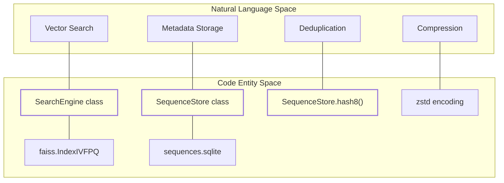
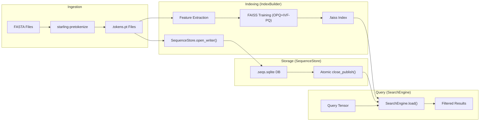

# Index Construction and SequenceStore

<details>
<summary>Relevant source files</summary>

The following files were used as context for generating this wiki page:

- [starling/configs.py](starling/configs.py)
- [starling/scripts/starling_pretokenize.py](starling/scripts/starling_pretokenize.py)
- [starling/search/__init__.py](starling/search/__init__.py)
- [starling/search/builder.py](starling/search/builder.py)
- [starling/search/search_engine.py](starling/search/search_engine.py)
- [starling/search/search_utils.py](starling/search/search_utils.py)
- [starling/search/similarity_search.py](starling/search/similarity_search.py)
- [starling/search/store.py](starling/search/store.py)

</details>


This page provides a technical reference for the STARLING search engine's indexing and storage subsystem. It covers the construction of high-performance FAISS indices, the SQLite-backed metadata storage, and the data encoding strategies used to manage billion-scale protein ensemble searches.

## Overview of Indexing Architecture

The STARLING search system is designed to handle massive datasets of protein sequence embeddings. It employs a two-tiered architecture:
1.  **FAISS Index**: A vector database optimized for Approximate Nearest Neighbor (ANN) search using Product Quantization (PQ) and Inverted File (IVF) structures `[starling/search/builder.py:10-16]()`.
2.  **SequenceStore**: A disk-resident SQLite database that stores raw sequences, headers, and metadata, allowing for efficient filtering and exact reranking without loading all sequences into memory `[starling/search/store.py:9-15]()`.

### Code Entity Mapping: Indexing Subsystem

The following diagram maps high-level indexing concepts to the specific classes and files implementing them.

**Diagram: Indexing Architecture Mapping**

**Sources:** `[starling/search/search_engine.py:93-134]()`, `[starling/search/store.py:216-230]()`, `[starling/search/builder.py:5-16]()`.

---

## Index Construction with `IndexBuilder`

The `IndexBuilder` class manages the end-to-end pipeline of discovering sharded feature files and training a FAISS index.

### Shard Discovery and Feature Loading
The builder expects features to be stored in sharded `.pt` files following a specific directory structure `[starling/search/builder.py:82-90]()`.
- **Discovery**: `IndexBuilder._discover_files` uses a regex (default: `uniref50_idrs_only_(\d{6})`) to extract shard IDs and verify file existence `[starling/search/builder.py:136-150]()`.
- **Feature Extraction**: `_extract_features_from_data` handles various input formats, including raw tensors and dictionaries of headers to tensors, ensuring all features are converted to `float32` `[starling/search/builder.py:207-230]()`.

### OPQ+IVF-PQ Training Pipeline
The `build_index` method implements a sophisticated training process `[starling/search/builder.py:29-39]()`:

1.  **OPQ (Optimized Product Quantization)**: If `use_opq=True`, a linear transformation is learned to rotate the data, minimizing quantization error `[starling/search/builder.py:10-16]()`.
2.  **IVF (Inverted File)**: The space is partitioned into `nlist` clusters. Search is limited to the most relevant clusters (defined by `nprobe` at query time) `[starling/search/builder.py:51-56]()`.
3.  **PQ (Product Quantization)**: Vectors are split into `m` sub-vectors, each quantized into `nbits` (usually 8) `[starling/search/builder.py:57-67]()`.

| Parameter | Role | Recommendation |
| :--- | :--- | :--- |
| `sample_size` | Training vectors | 100-1000 per IVF cluster `[starling/search/builder.py:45-49]()` |
| `nlist` | IVF clusters | sqrt(N) to N/1000 `[starling/search/builder.py:51-54]()` |
| `m` | PQ subquantizers | Must divide vector dimension `[starling/search/builder.py:57-61]()` |
| `use_gpu` | Acceleration | Dramatically faster training `[starling/search/builder.py:107-107]()` |

**Sources:** `[starling/search/builder.py:41-79]()`, `[starling/search/builder.py:153-230]()`.

---

## SequenceStore: Metadata and SQLite Schema

The `SequenceStore` provides indexed access to sequences using a single SQLite table `[starling/search/store.py:20-34]()`.

### Database Schema
```sql
CREATE TABLE sequences (
    gid       INTEGER PRIMARY KEY,  -- Global ID matching FAISS index
    len       INTEGER NOT NULL,     -- Sequence length for pre-filtering
    hash8     INTEGER,              -- 8-byte hash for deduplication
    seq       BLOB NOT NULL,        -- Encoded (possibly compressed) sequence
    shard     INTEGER,              -- Source shard tracking
    local_idx INTEGER,              -- Local index in shard
    header    BLOB                  -- Encoded FASTA header
);
CREATE INDEX idx_len ON sequences(len);
CREATE INDEX idx_hash8 ON sequences(hash8);
```
**Sources:** `[starling/search/store.py:22-34]()`.

### Blob Encoding and Zstd Compression
To save space, sequences and headers are stored as BLOBs with a 1-byte header flag `[starling/search/store.py:89-97]()`:
- `0x00`: Plain UTF-8 string.
- `0x01`: Zstd-compressed UTF-8 string.

The `encode_seq` and `decode_seq` static methods handle this transformation transparently `[starling/search/store.py:143-149]()`.

### Deduplication with `hash8`
During construction, an 8-byte hash is generated for each sequence using `SequenceStore.hash8(seq)` `[starling/search/store.py:145-145]()`. This hash is used by the `ExactMatchFilter` during search to skip full sequence comparisons unless hashes match `[starling/search/search_utils.py:129-141]()`.

---

## Data Flow: Construction to Search

The following diagram illustrates how data moves from raw FASTA files into the searchable index and how the `SequenceStore` is populated.

**Diagram: Construction Data Flow**

**Sources:** `[starling/scripts/starling_pretokenize.py:8-11]()`, `[starling/search/builder.py:91-96]()`, `[starling/search/store.py:99-109]()`, `[starling/search/search_engine.py:156-196]()`.

---

## Reliability and Atomic Operations

STARLING implements patterns to ensure database integrity during heavy indexing tasks.

### Atomic Publish Pattern
The `SequenceStore` avoids corrupting active databases by building in a temporary file `[starling/search/store.py:102-107]()`.
1. `open_writer(path)` creates a unique `.tmp` file.
2. `insert_rows(rows)` performs bulk inserts using `executemany` for speed `[starling/search/store.py:54-55]()`.
3. `close_publish()` performs a final `ANALYZE`, closes the connection, and uses `os.replace()` for an atomic move to the final destination `[starling/search/store.py:57-58]()`.

### Read-Only Performance
When used for searching, `SearchEngine` opens the `SequenceStore` in an immutable, read-only mode `[starling/search/store.py:113-120]()`. This prevents locking issues and allows multiple concurrent search processes to access the same SQLite file without overhead.

**Sources:** `[starling/search/store.py:99-120]()`, `[starling/search/search_engine.py:186-196]()`.

---