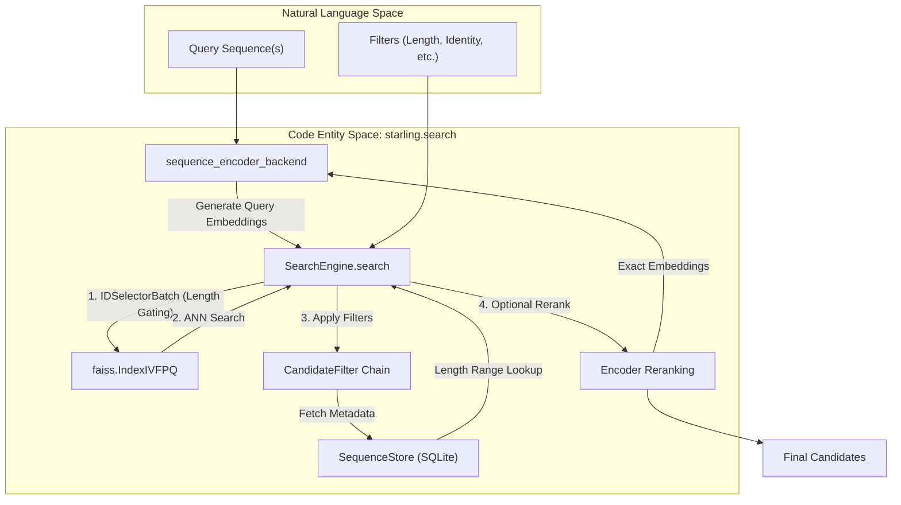
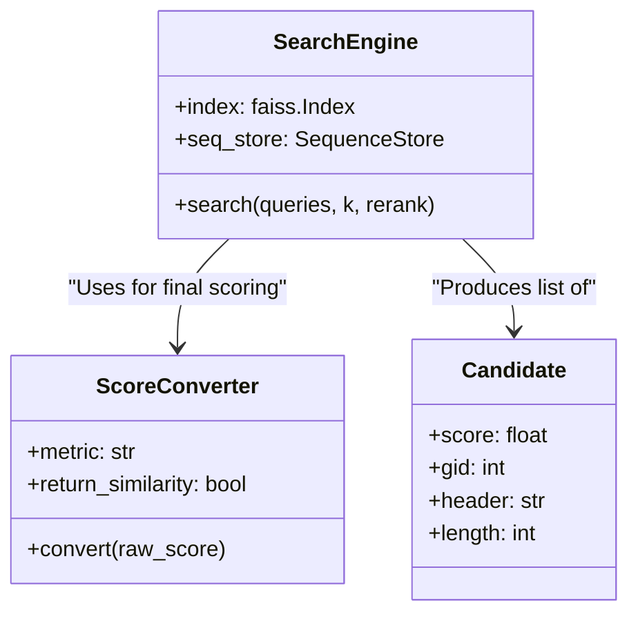

# Querying and Filtering

<details>
<summary>Relevant source files</summary>

The following files were used as context for generating this wiki page:

- [starling/inference/benchmark_mds.py](starling/inference/benchmark_mds.py)
- [starling/inference/generation.py](starling/inference/generation.py)
- [starling/scripts/starling_pretokenize.py](starling/scripts/starling_pretokenize.py)
- [starling/scripts/starling_search.py](starling/scripts/starling_search.py)
- [starling/search/__init__.py](starling/search/__init__.py)
- [starling/search/builder.py](starling/search/builder.py)
- [starling/search/search_engine.py](starling/search/search_engine.py)
- [starling/search/search_utils.py](starling/search/search_utils.py)
- [starling/search/similarity_search.py](starling/search/similarity_search.py)
- [starling/search/store.py](starling/search/store.py)

</details>


Similarity search in STARLING enables high-performance retrieval of protein sequences and ensembles based on embedding distance. The `SearchEngine` provides a unified interface for Approximate Nearest Neighbor (ANN) search, multi-level filtering (length, identity, exact matches), and high-precision reranking using the diffusion model's sequence encoder.

## Search Pipeline Overview

The search process follows a multi-stage execution flow designed to maximize recall while minimizing expensive sequence alignments and GPU transfers.

### Data Flow Diagram

The following diagram illustrates the transition from a user query sequence to the final filtered and reranked results.

**Search Engine Execution Flow**

**Sources:** [starling/search/search_engine.py:93-134](), [starling/search/search_engine.py:228-360](), [starling/search/store.py:215-230]()

---

## Candidate Discovery and Length Pre-filtering

The search begins by generating query embeddings via `sequence_encoder_backend` [starling/inference/generation.py:64-79](). These embeddings are then passed to `SearchEngine.search` [starling/search/search_engine.py:228]().

### Length Gating
To optimize performance, STARLING supports **Length Gating** using FAISS `IDSelectorBatch`. If `length_min` or `length_max` are provided:
1. The `SequenceStore` queries its SQLite `idx_len` index to retrieve all Global IDs (GIDs) within the specified length range [starling/search/store.py:32]().
2. These GIDs are wrapped in a `faiss.IDSelectorBatch` [starling/search/search_engine.py:330-336]().
3. The FAISS index restricts the ANN search exclusively to these GIDs, significantly reducing the search space and improving accuracy for length-constrained queries.

### Overfetching
Because post-search filters (like sequence identity) may prune results, the engine uses an `overfetch` factor to retrieve more candidates than requested (`k`) [starling/search/search_engine.py:198-212]().

**Sources:** [starling/search/search_engine.py:324-340](), [starling/search/store.py:77-79]()

---

## CandidateFilter Chain

After the initial ANN retrieval, candidates are passed through a chain of `CandidateFilter` objects [starling/search/search_utils.py:165-177](). Filters are ordered by computational cost, where the most expensive (alignment-based identity) occurs last.

| Filter Class | Purpose | Data Source |
|:---|:---|:---|
| `ValidGidFilter` | Removes invalid/empty results from FAISS | FAISS GID |
| `L2DistanceFilter` | Prunes by distance threshold | FAISS Score |
| `CosineSimFilter` | Prunes by similarity threshold | FAISS Score |
| `LengthFilter` | Enforces specific length ranges | `SequenceStore` metadata |
| `ExactMatchFilter` | Removes sequences identical to query | `SequenceStore` + `hash8` |
| `SequenceIdentityFilter` | Prunes by sequence identity percentage | `SequenceStore` + Alignment |

### Exact Match and Identity Filtering
The `ExactMatchFilter` utilizes an 8-byte hash (`hash8`) stored in the `SequenceStore` for O(1) initial comparison before falling back to a full sequence string comparison [starling/search/search_utils.py:129-141](). The `SequenceIdentityFilter` performs local or global alignment to enforce diversity in search results [starling/search/search_utils.py:143-163]().

**Sources:** [starling/search/search_utils.py:72-82](), [starling/search/search_engine.py:388-420]()

---

## Reranking and Score Conversion

### Encoder Reranking
While the FAISS index uses compressed vectors (Product Quantization), the `SearchEngine` can optionally perform **Reranking** for higher precision [starling/search/search_engine.py:438-460]().
1. The engine fetches raw sequences for the top-N candidates from the `SequenceStore`.
2. These sequences are passed back to `sequence_encoder_backend` to generate full-precision embeddings.
3. Distances are re-calculated using the exact embeddings, and candidates are re-sorted.

### Score Conversion
The `ScoreConverter` utility standardizes outputs regardless of the underlying metric [starling/search/search_utils.py:18-33]().

* **Cosine Metric:** FAISS returns inner products. `ScoreConverter` can return these as similarities $[0, 1]$ or distances $(1 - \text{similarity})$.
* **L2 Metric:** FAISS returns squared L2 distances. `ScoreConverter` passes these through as distances.

**Metric Handling Logic**


**Sources:** [starling/search/search_utils.py:219-230](), [starling/search/search_engine.py:438-460](), [starling/inference/generation.py:64-79]()

---

## CLI Usage

The `starling_search` script provides a command-line interface for these operations [starling/scripts/starling_search.py:1-7]().

### Building an Index
To build an index with sequence metadata, the sequences must first be processed by `starling-pretokenize` [starling/scripts/starling_pretokenize.py:1-11](). The `IndexBuilder` then creates the `.faiss` index and the `.seqs.sqlite` store [starling/search/builder.py:80-96]().

### Querying via CLI
The `query` command supports all filtering parameters:
```bash
starling_search query --index myindex.faiss \
    --seq "MKTLLIL..." \
    --k 20 \
    --length-min 50 --length-max 200 \
    --exclude-exact \
    --rerank
```
The results are written to CSV or JSONL, including the metadata retrieved from the `SequenceStore` [starling/scripts/starling_search.py:108-157]().

**Sources:** [starling/scripts/starling_search.py:69-105](), [starling/search/builder.py:152-190]()

---