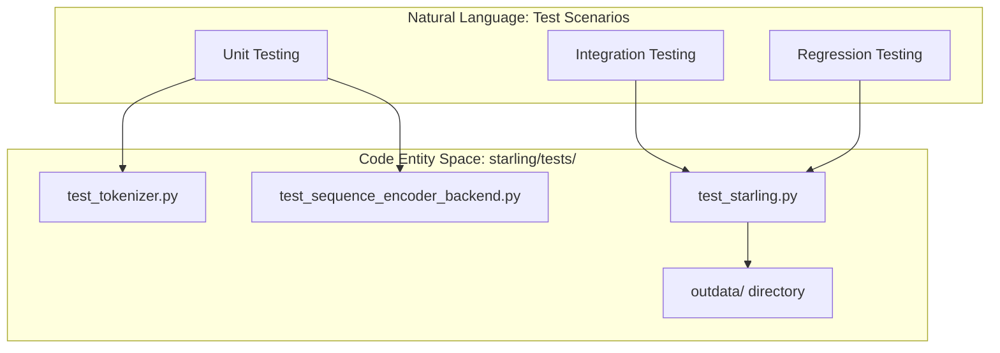
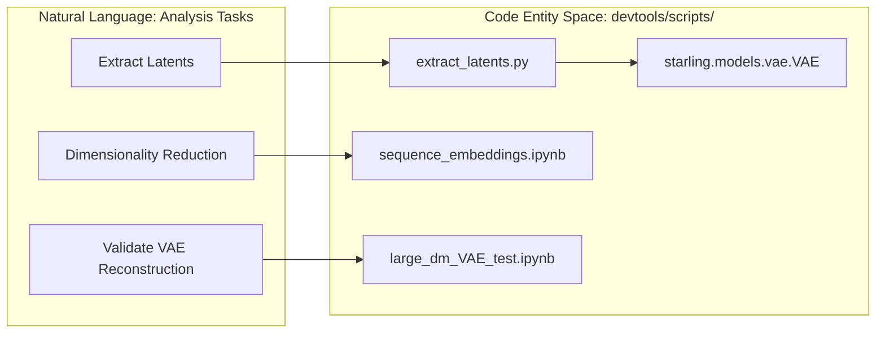

# Testing and Development Tools

Relevant source files

The following files were used as context for generating this wiki page:

- [demos/basic_usage.ipynb](demos/basic_usage.ipynb)
- [demos/constraining_ensembles.ipynb](demos/constraining_ensembles.ipynb)
- [demos/structural_ensemble.ipynb](demos/structural_ensemble.ipynb)
- [devtools/scripts/.ipynb_checkpoints/large_dm_VAE_test-checkpoint.ipynb](devtools/scripts/.ipynb_checkpoints/large_dm_VAE_test-checkpoint.ipynb)
- [devtools/scripts/extract_latents.py](devtools/scripts/extract_latents.py)
- [devtools/scripts/large_dm_VAE_test.ipynb](devtools/scripts/large_dm_VAE_test.ipynb)
- [devtools/scripts/latent_PCA.ipynb](devtools/scripts/latent_PCA.ipynb)
- [devtools/scripts/sequence_embeddings.ipynb](devtools/scripts/sequence_embeddings.ipynb)
- [starling/data/tokenizer.py](starling/data/tokenizer.py)
- [starling/samplers/ddpm_sampler.py](starling/samplers/ddpm_sampler.py)
- [starling/tests/.gitignore](starling/tests/.gitignore)
- [starling/tests/outdata/readme.md](starling/tests/outdata/readme.md)
- [starling/tests/test_sequence_encoder_backend.py](starling/tests/test_sequence_encoder_backend.py)
- [starling/tests/test_sequence_encoder_backend_integration.py](starling/tests/test_sequence_encoder_backend_integration.py)
- [starling/tests/test_starling.py](starling/tests/test_starling.py)
- [starling/tests/test_tokenizer.py](starling/tests/test_tokenizer.py)

This page provides an overview of the STARLING test suite, developer scripts, and demonstration notebooks. These tools are designed to ensure model reliability, facilitate research-level analysis of latent spaces, and provide users with practical examples of ensemble generation and reweighting.

## Test Suite

The STARLING test suite consists of unit tests for core components and end-to-end integration tests that exercise the full generative pipeline. Tests are organized to validate everything from basic amino acid tokenization to complex coordinate reconstruction via MDS.

*   **Unit Tests**: Focus on individual components like the `StarlingTokenizer` [starling/data/tokenizer.py:1-1]() and `sequence_encoder_backend` [starling/inference/generation.py:1-1]().
*   **Integration Tests**: Validate the interaction between the VAE and Diffusion models, often requiring real model weights to be present.
*   **Regression Tests**: Ensure that ensemble statistics (e.g., Radius of Gyration, End-to-End distance) remain consistent across code changes [starling/tests/test_starling.py:124-126]().

### Test Organization

| Test File | Focus Area | Key Symbols Validated |
| :--- | :--- | :--- |
| `test_starling.py` | End-to-end generation & I/O | `generate`, `Ensemble`, `load_ensemble` |
| `test_tokenizer.py` | Amino acid mapping | `StarlingTokenizer.encode`, `decode` |
| `test_sequence_encoder_backend.py` | Latent conditioning logic | `sequence_encoder_backend` |
| `test_sequence_encoder_backend_integration.py` | Real model weight loading | `ModelManager`, `DEFAULT_ENCODER_WEIGHTS_PATH` |

For detailed instructions on running tests and a reference for the `outdata` directory, see [Test Suite](#9.1).

**Sources:** [starling/tests/test_starling.py:1-154](), [starling/tests/test_tokenizer.py:1-66](), [starling/tests/test_sequence_encoder_backend.py:1-124](), [starling/tests/test_sequence_encoder_backend_integration.py:1-62]().

---

## Developer Tools and Demo Notebooks

STARLING includes a variety of scripts and notebooks in the `devtools/scripts/` and `demos/` directories. These are intended for developers performing deep analysis of the model's latent space or for users learning the API.

### Latent Analysis and Extraction
Tools like `extract_latents.py` allow for the bulk processing of distance maps through the `VAE` encoder to generate latent vectors for downstream analysis, such as Principal Component Analysis (PCA) [devtools/scripts/extract_latents.py:30-64]().

### Educational Demos
The `demos/` directory contains interactive Jupyter notebooks that walk through common use cases:
*   **Basic Usage**: Generating distance maps and using the `Ensemble` object [demos/basic_usage.ipynb:8-20]().
*   **Structural Ensembles**: Reconstructing 3D trajectories and visualizing them with Matplotlib [demos/structural_ensemble.ipynb:8-14]().
*   **Constrained Generation**: Applying `DistanceConstraint`, `RgConstraint`, or `HelicityConstraint` to bias the sampling process [demos/constraining_ensembles.ipynb:8-20]().

### Bridging NL Space to Code Space

The following diagrams illustrate how high-level development tasks map to specific code entities within the STARLING repository.

**Diagram: Testing Infrastructure Data Flow**

**Sources:** [starling/tests/test_starling.py:22-24](), [starling/tests/test_tokenizer.py:6-15](), [starling/tests/test_sequence_encoder_backend.py:45-53]().

**Diagram: Developer Workflow for Latent Analysis**

**Sources:** [devtools/scripts/extract_latents.py:82-118](), [devtools/scripts/sequence_embeddings.ipynb:21-22](), [devtools/scripts/large_dm_VAE_test.ipynb:13-16]().

For a full guide to the available scripts and how to use the demo notebooks, see [Developer Tools and Demo Notebooks](#9.2).

**Sources:** [devtools/scripts/extract_latents.py:1-118](), [demos/basic_usage.ipynb:1-180](), [demos/structural_ensemble.ipynb:1-180](), [demos/constraining_ensembles.ipynb:1-180]().

---