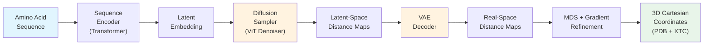

**STARLING** (con**ST**ruction of intrinsic**A**lly diso**R**dered proteins ensembles efficient**L**y v**I**a multi-dime**N**sional **G**enerative models) is a latent-space probabilistic denoising diffusion model for predicting coarse-grained conformational ensembles of intrinsically disordered proteins (IDPs) and intrinsically disordered regions (IDRs). Developed in the Holehouse lab, STARLING transforms an amino acid sequence into a structurally diverse ensemble of 3D conformations — in seconds on GPU, minutes on CPU — enabling rapid computational characterization of disordered protein physics.

Sources: [README.md](/README.md#L1-L27), [starling/__init__.py](/starling/__init__.py#L1-L14)

---

## What Problem Does STARLING Solve?

Intrinsically disordered proteins lack a stable folded structure, instead populating a broad ensemble of interconverting conformations. Experimental characterization of these ensembles is difficult and often indirect (e.g., SAXS, NMR chemical shifts, FRET). Traditional molecular dynamics simulations can sample these ensembles but require microsecond-to-millisecond timescales — computationally prohibitive for routine use. **STARLING bridges this gap** by using deep generative models to *directly predict* the conformational ensemble from sequence alone, producing hundreds of structures in the time a single MD step would take.

Sources: [README.md](/README.md#L16-L27)

---

## How STARLING Works — End-to-End Pipeline

At a high level, STARLING implements a **two-stage latent diffusion pipeline** that converts a 1D amino acid sequence into a set of 3D protein conformations:



| Stage | Component | Input → Output | Model Architecture |
|-------|-----------|----------------|-------------------|
| **1. Encoding** | Sequence Encoder | Amino acid string → Context embedding (512-dim) | 12-layer Transformer, 8 heads |
| **2. Latent Diffusion** | DDIM/DDPM Sampler + ViT Denoiser | Noise + Context → Latent distance maps | Vision Transformer with DiT blocks, patch size 3 |
| **3. Decoding** | VAE Decoder | Latent maps → Real-space distance maps | ResNet-based VAE (encoder/decoder) |
| **4. Reconstruction** | MDS + Gradient Descent | Distance maps → 3D Cα coordinates | Multi-start metric MDS + torch.optim refinement |

The pipeline is **conditionally generated**: the sequence encoder produces a per-protein context vector that steers the diffusion process toward physically realistic distance maps for that specific sequence. Ionic strength (solvent conditions) is included as an additional conditioning variable.

Sources: [starling/inference/model_loading.py](/starling/inference/model_loading.py#L16-L61), [starling/models/vit.py](/starling/models/vit.py#L31-L78), [starling/models/vae.py](/starling/models/vae.py#L86-L151), [starling/samplers/ddim_sampler.py](/starling/samplers/ddim_sampler.py#L19-L58), [starling/structure/coordinates.py](/starling/structure/coordinates.py#L1-L80)

---

## Core Capabilities

STARLING provides four major capabilities beyond basic ensemble generation:

| Capability | Description | Entry Point |
|------------|-------------|-------------|
| **Ensemble Generation** | Produce N conformations from sequence with optional 3D structure output | `starling.generate()` or `starling` CLI |
| **Constraint-Guided Sampling** | Steer diffusion with Rg, end-to-end distance, or helicity constraints during generation | `constraint` parameter in `generate()` |
| **BME Reweighting** | Reweight ensembles against experimental observables (SAXS, NMR, FRET) using Bayesian Maximum Entropy | `ensemble.reweight_bme()` |
| **Similarity Search** | FAISS-powered ANN search across a pre-built database of ~1M protein embeddings | `starling.search.SearchEngine` |

> [!TIP]
> The `generate()` function is the single unified entry point for both Python API and CLI usage. It handles input parsing, sequence validation, model loading, diffusion sampling, distance-map decoding, and optional 3D reconstruction — all in one call.

Sources: [starling/frontend/ensemble_generation.py](/starling/frontend/ensemble_generation.py#L160-L260), [starling/inference/constraints.py](/starling/inference/constraints.py#L41-L78), [starling/structure/bme.py](/starling/structure/bme.py#L1-L48), [starling/search/search_engine.py](/starling/search/search_engine.py#L1-L59)

---

## Project Architecture

The `starling` package is organized into clearly separated subsystems, each with a distinct responsibility:

```
starling/
├── frontend/          # High-level user-facing APIs
│   ├── ensemble_generation.py   ← generate() and input handling
│   └── starling_viz.py         ← Visualization helpers
├── inference/         # Inference orchestration
│   ├── generation.py           ← Backend: encoder → sampler → decoder → MDS
│   ├── model_loading.py        ← Lazy ModelManager singleton
│   ├── constraints.py          ← Constraint-guided sampling (Rg, distance, helicity)
│   └── benchmark_mds.py        ← Performance profiling
├── models/            # Neural network architectures
│   ├── transformer.py          ← SequenceEncoder, DiTBlock, SinusoidalPosEmb
│   ├── vit.py                  ← Vision Transformer denoiser with patch embedding
│   ├── vae.py                  ← Variational Autoencoder (ResNet encoder/decoder)
│   ├── diffusion.py            ← DiffusionModel: q_sample, noise scheduling
│   └── attention.py            ← Self/Cross attention modules
├── samplers/          # Diffusion sampling strategies
│   ├── ddim_sampler.py         ← DDIM (fast, deterministic)
│   ├── ddpm_sampler.py         ← DDPM (stochastic baseline)
│   └── plms_sampler.py         ← PLMS (Pseudo Linear Multi-Step)
├── structure/         # Post-inference structure tools
│   ├── ensemble.py             ← Ensemble object (distance maps + analysis)
│   ├── coordinates.py          ← MDS + gradient descent 3D reconstruction
│   └── bme.py                  ← Bayesian Maximum Entropy reweighting
├── search/            # Similarity search infrastructure
│   ├── search_engine.py        ← FAISS-powered SearchEngine
│   ├── builder.py              ← Index construction
│   └── store.py                ← SQLite-backed sequence store
├── data/              # Data handling utilities
│   ├── tokenizer.py            ← StarlingTokenizer (byte-level AA encoding)
│   ├── schedulers.py           ← Beta schedules (cosine, linear, sigmoid)
│   └── distributions.py        ← DiagonalGaussianDistribution for VAE
├── configs/           # YAML model configuration files
├── configs.py         ← Global defaults, paths, user config override
└── scripts/           # CLI entry points
    ├── starling_main_cli.py
    ├── starling_converter.py
    └── starling_search.py
```

Sources: [starling/__init__.py](/starling/__init__.py#L1-L14), [starling/configs.py](/starling/configs.py#L1-L35)

---

## Model Specifications

STARLING v2.0.0 ships with two pre-trained checkpoints, both loaded lazily on first use and cached for the session lifetime:

| Model | Checkpoint | Architecture | Role |
|-------|-----------|--------------|------|
| **Sequence Encoder** | `STARLING_v2.0.0_ViT_VAE_2025_10_14.ckpt` | VAE (ResNet-based) | Encodes distance maps to/from latent space; provides conditioning embeddings |
| **Diffusion Model** | `STARLING_v2.0.0_ViT_DDPM_2025_10_14.ckpt` | DiffusionModel wrapping ViT(12 layers, 512 dim, 8 heads) | Denoises latent distance maps conditioned on sequence context |

Models are auto-downloaded from GitHub Releases on first run and cached in `~/.starling_weights/`. Custom checkpoints can be provided via `encoder_path` / `ddpm_path` arguments or the `STARLING_ENCODER_PATH` / `STARLING_DDPM_PATH` environment variables. Optional `torch.compile()` acceleration is available for CUDA workloads.

Sources: [starling/configs.py](/starling/configs.py#L14-L15), [starling/inference/model_loading.py](/starling/inference/model_loading.py#L16-L131)

---

## Key Design Decisions

| Decision | Rationale |
|----------|-----------|
| **Latent-space diffusion** (not pixel-space) | Compressing distance maps through the VAE reduces the dimensionality the diffusion model must learn, enabling faster sampling and higher-quality outputs. This follows the Latent Diffusion Model paradigm (Rombach et al., 2021). |
| **Vision Transformer denoiser** (not U-Net) | ViT with DiT blocks provides superior global receptive field for capturing long-range residue-residue correlations across the distance map. |
| **MDS + gradient refinement** for 3D reconstruction | Distance maps are not perfectly embeddable in 3D. Multi-start MDS provides an initial guess; gradient descent on the distance-matching loss refines coordinates to minimize distortion. |
| **Lazy singleton ModelManager** | Models are loaded once and reused across multiple `generate()` calls, avoiding repeated GPU memory allocation and weight downloads. |
| **User-configurable defaults** | A `configs.py` file in `~/.starling_weights/` can override any global default, enabling per-user customization without code changes. |

Sources: [starling/inference/model_loading.py](/starling/inference/model_loading.py#L63-L100), [starling/models/diffusion.py](/starling/models/diffusion.py#L55-L63), [starling/configs.py](/starling/configs.py#L54-L69)

---

## Installation & Quick Verification

STARLING requires **Python ≥ 3.10** and is distributed on PyPI as `idptools-starling`:

```bash
conda create -n starling python=3.11 -y && conda activate starling
pip install idptools-starling
starling --help    # verify installation
```

A Docker image and Google Colab notebook are also available for zero-install usage. The package is typed (`py.typed` marker included) and supports CPU, CUDA, and Apple MPS backends with automatic device selection.

Sources: [README.md](/README.md#L40-L67), [starling/configs.py](/starling/configs.py#L17-L24)

---

## What STARLING Is — And Isn't

| ✅ STARLING Is | ❌ STARLING Isn't |
|---|---|
| A **sequence-to-ensemble** predictor for IDPs/IDRs | A folded protein structure predictor (use AlphaFold/EsmFold) |
| A **coarse-grained** (Cα-only) conformational sampler | An all-atom molecular dynamics engine |
| A **generative model** producing statistically diverse ensembles | A deterministic single-structure oracle |
| Validated on sequences up to **380 residues** | Designed for arbitrarily long proteins or multi-chain complexes |
| A tool for **experimental integration** via BME reweighting | A replacement for careful biophysical experiment design |

Sources: [starling/configs.py](/starling/configs.py#L23), [starling/structure/ensemble.py](/starling/structure/ensemble.py#L42-L75)

---

## Where to Go Next

The documentation is organized to take you from first use to deep technical understanding:

1. **[Quick Start](2-quick-start)** — Get your first ensemble running in under 5 minutes
2. **[CLI Reference](3-cli-reference)** — Complete command-line tool documentation
3. **[Architecture Overview](4-architecture-overview)** — Detailed system design and data flow
4. **[Sequence Encoder](5-sequence-encoder)** → **[VAE Latent Space](6-vae-latent-space)** → **[Diffusion Model Design](7-diffusion-model-design)** → **[Sampling Strategies](8-sampling-strategies)** — The generative pipeline, stage by stage
5. **[Ensemble Object API](9-ensemble-object-api)** → **[Distance Map to 3D Coordinates](10-distance-map-to-3d-coordinates)** → **[BME Reweighting](11-bme-reweighting)** — Working with generated ensembles
6. **[Constraint Types](12-constraint-types)** → **[Constraint-Guided Sampling](13-constraint-guided-sampling)** — Steering generation with priors
7. **[Similarity Search](16-similarity-search)** — Finding related sequences in the FAISS index
