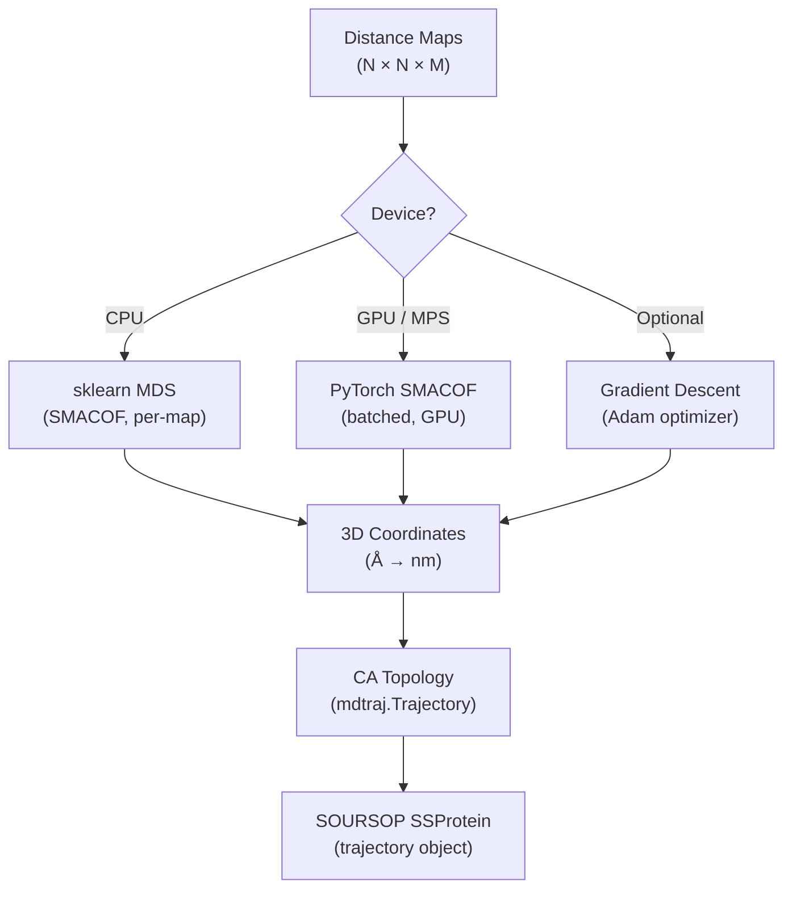
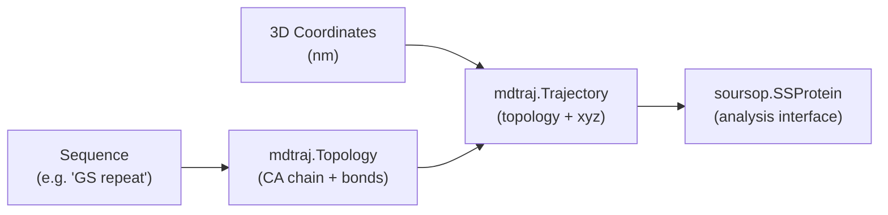

STARLING's generative pipeline produces **pairwise distance maps** — symmetric N×N matrices of inter-residue Cα–Cα distances — rather than explicit 3D structures. Converting these distance maps back into Cartesian coordinates is the critical **embedding step** that bridges the model's latent output and physically realizable protein conformations. This page explains the mathematical foundations, the three reconstruction algorithms STARLING provides, and how the `Ensemble` object orchestrates the full distance-to-structure workflow.

## The Embedding Problem

A distance map **D** ∈ ℝ^(N×N) encodes all pairwise distances between N residues. Recovering coordinates **X** ∈ ℝ^(N×3) such that ‖xᵢ − xⱼ‖ ≈ Dᵢⱼ is an instance of **multidimensional scaling (MDS)** — the inverse of the distance-matrix operation. This problem is under-determined (any rotation, reflection, or translation of **X** yields the same **D**), but for structural biology purposes any valid embedding suffices since observables like Rg and Rh are rotation-invariant.

The key challenge is that sampled distance maps from the diffusion model may not be perfectly **Euclidean** — small violations of the triangle inequality can exist — so the embedding algorithm must be robust to approximate distance matrices. STARLING addresses this with three complementary methods, each with distinct trade-offs in speed, accuracy, and hardware requirements.



Sources: [coordinates.py](starling/structure/coordinates.py#L502-L581), [ensemble.py](starling/structure/ensemble.py#L729-L807)

## Reconstruction Algorithms

### SMACOF via scikit-learn (CPU Path)

The default CPU method delegates to `sklearn.manifold.MDS` with `dissimilarity="precomputed"`, which implements the **SMACOF** (Scaling by MAjorizing a COmplicated Function) algorithm. SMACOF iteratively minimizes the **stress** function:

**Stress(X) = Σᵢ<ⱼ (‖xᵢ − xⱼ‖ − Dᵢⱼ)²**

Each distance map is embedded independently in a sequential loop. The number of independent restarts (`n_init`) and parallel CPU cores (`n_jobs`) are configurable, with defaults drawn from `configs.DEFAULT_MDS_NUM_INIT` (4) and `configs.DEFAULT_CPU_COUNT_MDS` (min of `n_init` and `os.cpu_count()`).

| Parameter | Default | Effect |
|-----------|---------|--------|
| `n_components` | 3 | Fixed for 3D embedding |
| `dissimilarity` | `"precomputed"` | Input is a distance matrix, not raw features |
| `n_init` | 4 | More restarts → better chance of global minimum, but slower |
| `n_jobs` | `min(n_init, cpu_count)` | Parallelism across restarts |
| `normalized_stress` | `"auto"` | Version-consistent behavior across scikit-learn releases |

Sources: [coordinates.py](starling/structure/coordinates.py#L255-L307), [configs.py](starling/configs.py#L19-L20)

### SMACOF via PyTorch (GPU / MPS Path)

When a GPU device is available, STARLING uses a custom **batched SMACOF implementation** built entirely in PyTorch. This avoids the Python-loop overhead of the scikit-learn path by processing all conformations in parallel through batched tensor operations.

The core iteration follows the standard SMACOF Guttman transform: at each step, a weight matrix **B** is constructed where Bᵢⱼ = −Dᵢⱼ / ‖xᵢ − xⱼ‖ for off-diagonal elements and the diagonal is set so rows sum to zero. The update rule is **X_new = (1/N) · B · X**, followed by centering. Convergence is tracked via stress and stops early when `|stress_old − stress_new| < tol`. The batched formulation uses `torch.bmm` for the matrix multiply and `torch.where` masks to avoid updating already-converged samples within a batch.

| Parameter | Default | Effect |
|-----------|---------|--------|
| `batch_size` | 100 | Number of maps per GPU batch |
| `n_iter` | 300 | Maximum SMACOF iterations per batch |
| `tol` | 1e-4 | Convergence tolerance on stress change |
| `device` | `"cuda"` | Compute device |
| `progress_bar` | `True` | Show tqdm progress over batches |

> [!TIP]
> On Apple MPS, the PyTorch SMACOF path can be **1.5–2× slower** than CPU due to fallback on unsupported operations (particularly the `nonzero` op on macOS ≤ 14). The dispatcher in `generate_3d_coordinates_from_distances` automatically routes to the CPU sklearn path when `device="cpu"` is specified. If you're on Apple Silicon and encounter slowdowns, explicitly pass `device="cpu"` to `build_ensemble_trajectory`.

Sources: [coordinates.py](starling/structure/coordinates.py#L123-L252), [coordinates.py](starling/structure/coordinates.py#L550-L579)

### Gradient Descent (Alternative Method)

A third method uses **Adam-optimized gradient descent** to minimize the MSE between the target distance matrix and the pairwise distances computed from the current coordinate estimate. The loss is computed over the upper triangle only (to avoid double-counting):

**L(X) = MSE(D_upper, ‖X‖_upper)**

Coordinates are initialized with an **incremental chain** — each residue placed 3.8 Å (the standard Cα–Cα bond length) from its predecessor in a random direction — rather than purely random positions. This physics-informed initialization provides a better starting point for the optimizer, reducing the number of iterations needed to converge.

| Parameter | Default | Effect |
|-----------|---------|--------|
| `num_iterations` | 5000 | Gradient descent steps |
| `learning_rate` | 1e-3 | Adam optimizer step size |
| `device` | `"cuda:0"` | Compute device |
| `verbose` | `True` | Print loss every 100 iterations |

> [!TIP]
> MPS does not support `float64` tensors. The helper `get_tensor_dtype` automatically downcasts to `float32` on MPS devices. In practice, gradient descent on MPS is currently slower than CPU — the support is provided for future compatibility as Apple improves MPS performance.

Sources: [coordinates.py](starling/structure/coordinates.py#L310-L380), [coordinates.py](starling/structure/coordinates.py#L100-L120), [coordinates.py](starling/structure/coordinates.py#L15-L42)

## Method Dispatch Logic

The parent function `generate_3d_coordinates_from_distances` acts as the **single entry point** for all reconstruction. It selects the algorithm based on the resolved device string:

| Device | Algorithm | Rationale |
|--------|-----------|-----------|
| `"cpu"` | sklearn MDS (sequential) | No GPU overhead; sklearn's SMACOF is well-optimized for single maps |
| `"cuda"` / `"mps"` | PyTorch SMACOF (batched) | Exploits GPU parallelism across the full ensemble |

Both paths convert the output from Ångströms to nanometers (dividing by `configs.CONVERT_ANGSTROM_TO_NM = 10`) before returning, ensuring compatibility with mdtraj's nm-based coordinate convention.

Sources: [coordinates.py](starling/structure/coordinates.py#L502-L581), [configs.py](starling/configs.py#L21)

## Topology Construction

Once 3D coordinates are obtained, STARLING builds a **Cα-only backbone topology** via `create_ca_topology_from_coords`. This function constructs an `mdtraj.Topology` with one chain, one residue per amino acid (using the one-to-three letter code mapping from `configs.AA_ONE_TO_THREE`), and a single Cα carbon atom per residue. Adjacent Cα atoms are bonded, yielding a minimal but valid topology for downstream analysis.

The resulting `mdtraj.Trajectory` is then wrapped into a **SOURSOP `SSProtein`** object via `SSTrajectory(TRJ=traj).proteinTrajectoryList[0]`, which provides the rich analysis interface (distance maps, radius of gyration, PDB/XTC I/O) used throughout STARLING.



Sources: [coordinates.py](starling/structure/coordinates.py#L426-L481), [ensemble.py](starling/structure/ensemble.py#L802-L806)

## Ensemble Integration

The `Ensemble` object provides the highest-level interface to distance-to-coordinate reconstruction through two access points:

### `build_ensemble_trajectory()`

This method explicitly triggers reconstruction with full control over the algorithm parameters:

```python
ensemble.build_ensemble_trajectory(
    batch_size=100,          # GPU batch size
    num_cpus_mds=4,          # CPU cores for sklearn MDS
    num_mds_init=4,          # Independent MDS restarts
    device=None,             # None → auto-detect (GPU if available)
    force_recompute=False,   # Re-use cached trajectory?
    progress_bar=True,       # Show tqdm bar
)
```

The trajectory is **lazily computed and cached** — subsequent calls return the cached `SSProtein` object unless `force_recompute=True`. The device is resolved through `utilities.check_device()`, which auto-detects CUDA → MPS → CPU in priority order.

### `trajectory` Property

Accessing `ensemble.trajectory` automatically calls `build_ensemble_trajectory()` with defaults if no trajectory has been built yet. This makes the common case — simply inspecting or saving structures — require zero configuration:

```python
ensemble = generate("GSrepeat30", conformations=200, return_single_ensemble=True)
# Accessing .trajectory triggers reconstruction on first use
traj = ensemble.trajectory
```

Sources: [ensemble.py](starling/structure/ensemble.py#L729-L837), [utilities.py](starling/utilities.py#L148-L245)

## Quality Validation

Reconstruction quality can be assessed at two levels:

### Distance Map Validation (`check_for_errors`)

Scans the raw distance maps for **physically impossible** inter-residue distances before reconstruction. A pair of residues separated by |i − j| positions cannot be more than |i − j| × bond-length apart — violations indicate a corrupted or poorly sampled map.

### Trajectory Validation (`check_for_errors_trajectory`)

After reconstruction, this method re-extracts Cα–Cα distance maps from the 3D coordinates and checks for the same physical violations. This catches **reconstruction artifacts** — cases where the MDS embedding introduces unphysical geometry even though the source distance map was valid. Both methods support `remove_errors=True` to prune bad frames, keeping the distance maps and trajectory in sync.

Sources: [ensemble.py](starling/structure/ensemble.py#L181-L342)

## Reconstruction Quality Comparison

| Algorithm | Speed (200 confs, 60 res) | GPU Required | Batch Processing | Robustness to Non-Euclidean D |
|-----------|---------------------------|--------------|------------------|-------------------------------|
| sklearn MDS | Moderate (sequential) | No | No (per-map loop) | High (well-tested SMACOF) |
| PyTorch SMACOF | Fast (parallel) | Yes | Yes (batched) | High (same algorithm) |
| Gradient Descent | Slow (many iterations) | Optional | No | Moderate (local minima risk) |

For production use, **PyTorch SMACOF on CUDA** is the recommended default. The gradient descent method is primarily useful for debugging or as a reference implementation, since it provides explicit per-iteration loss tracking that SMACOF does not expose in the same way.

Sources: [coordinates.py](starling/structure/coordinates.py#L123-L380)

## Saving Reconstructed Structures

Once coordinates are embedded, the `Ensemble` provides two export paths:

- **`save_trajectory(filename_prefix, pdb_trajectory=False)`** — Writes the 3D ensemble as a PDB topology file + XTC trajectory (default), or as a single multi-model PDB if `pdb_trajectory=True`. This only saves the structural data, not the source distance maps.
- **`save(filename_prefix)`** — Persists the full STARLING object (distance maps + trajectory + metadata) in the `.starling` format, with optional compression (gzip/lzma) and precision reduction (float16).

Sources: [ensemble.py](starling/structure/ensemble.py#L839-L916)

## Next Steps

- Learn how the `Ensemble` object wraps distance maps and coordinates together: [Ensemble Object API](9-ensemble-object-api)
- Understand how Bayesian Maximum Entropy reweighting improves ensemble-experiment agreement: [BME Reweighting](11-bme-reweighting)
- Explore how constraints can shape the sampling to produce distance maps that embed more cleanly: [Constraint-Guided Sampling](13-constraint-guided-sampling)