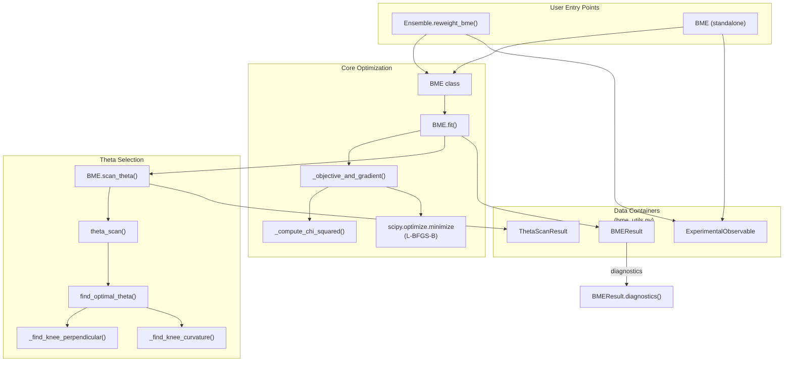

Bayesian Maximum Entropy (BME) reweighting is a principled framework for refining generative ensembles against experimental observables. Rather than discarding or regenerating conformations, BME assigns **optimized per-frame weights** that bring calculated ensemble averages into agreement with experimental data while minimally perturbing the prior distribution — a constraint measured by relative entropy (KL divergence). This makes it the natural bridge between STARLING's unsupervised generative pipeline and the quantitative demands of biophysical validation.

Sources: [bme.py](starling/structure/bme.py#L1-L85), [bme_utils.py](starling/structure/bme_utils.py#L1-L18)

## Mathematical Foundation

The BME objective function finds the weight distribution **w** that minimizes the relative entropy $D_{KL}(w \| w_0)$ to the prior weights $w_0$ subject to matching experimental observables. Through Lagrange duality, this becomes an unconstrained optimization over multipliers $\boldsymbol{\lambda}$:

$$\gamma(\boldsymbol{\lambda}) = \log Z(\boldsymbol{\lambda}) + \boldsymbol{\lambda}^T \mathbf{F}^{exp} + \frac{\theta}{2} \sum_i \lambda_i^2 \sigma_i^2$$

where $Z(\boldsymbol{\lambda})$ is the partition function, $\mathbf{F}^{exp}$ are experimental values, $\sigma_i^2$ are experimental variances, and $\theta$ is the regularization strength controlling the bias–variance trade-off. The reweighted probabilities are:

$$w_i = \frac{w_{0,i} \exp\!\bigl(-\boldsymbol{\lambda}^T \mathbf{O}_i^{calc}\bigr)}{Z(\boldsymbol{\lambda})}$$

The gradient $\nabla_\lambda \gamma = \mathbf{F}^{exp} + \theta \boldsymbol{\Sigma}^2 \boldsymbol{\lambda} - \langle\mathbf{O}^{calc}\rangle_w$ drives L-BFGS-B optimization with analytically computed Jacobians (`jac=True`) for efficient convergence. Both objective and gradient are scaled by $1/\theta$ for numerical stability.

Sources: [bme.py](starling/structure/bme.py#L233-L305)

## Architecture Overview

The BME system is organized across two modules with clear separation of concerns — optimization logic in `bme.py` and data containers plus utilities in `bme_utils.py`:



Sources: [bme.py](starling/structure/bme.py#L108-L122), [bme_utils.py](starling/structure/bme_utils.py#L24-L86), [ensemble.py](starling/structure/ensemble.py#L35-L39)

## Constraint Types

Each experimental observable carries a **constraint type** that determines how deviations from the experimental value are penalized. This is critical for encoding asymmetric physical knowledge — for example, a SAXS-derived radius is an equality constraint, while a FRET efficiency that merely sets an upper bound on distance should use an inequality constraint.

| Constraint | Lagrange Bound | Penalty Logic | Use Case |
|---|---|---|---|
| `"equality"` | $\lambda \in (-\infty, +\infty)$ | Always penalize $\|F_{calc} - F_{exp}\|$ | Rg from SAXS, Rh from NMR |
| `"upper"` | $\lambda \geq 0$ | Penalize only if $F_{calc} > F_{exp}$ | Maximum end-to-end distance |
| `"lower"` | $\lambda \leq 0$ | Penalize only if $F_{calc} < F_{exp}$ | Minimum compactness |

The bounds on $\lambda$ are enforced by the L-BFGS-B optimizer: a positive $\lambda$ for `"upper"` constraints pushes the calculated value downward, while a negative $\lambda$ for `"lower"` constraints pushes it upward. Equality constraints allow unrestricted $\lambda$ values.

Sources: [bme_utils.py](starling/structure/bme_utils.py#L24-L85), [bme.py](starling/structure/bme.py#L187-L231)

## The Theta Parameter

The regularization parameter $\theta$ governs the fundamental trade-off in BME reweighting. **Small $\theta$** allows the optimizer to aggressively reweight frames to fit experiment, producing low $\chi^2$ but potentially concentrating weight on a few conformations (low effective sample size). **Large $\theta$** strongly regularizes toward the prior, preserving ensemble diversity but potentially leaving $\chi^2$ high.

The effective fraction of ensemble frames is quantified by:

$$\Phi = \exp(-D_{KL}) = \exp\!\Bigl(-\sum_i w_i \log \frac{w_i}{w_{0,i}}\Bigr)$$

where $\Phi = 1$ means no reweighting (all prior weights preserved) and $\Phi \to 0$ means extreme concentration. The default $\theta = 0.5$ provides a moderate starting point, but the recommended workflow uses **automatic theta selection** via L-curve analysis.

Sources: [bme_utils.py](starling/structure/bme_utils.py#L11-L12), [bme.py](starling/structure/bme.py#L466-L476)

## Automatic Theta Selection

When `auto_theta=True` (the default), `BME.fit()` runs a **theta scan** — fitting the BME model across a logarithmically-spaced grid of $\theta$ values — and selects the optimal point via L-curve knee detection. The L-curve plots $\chi^2$ (fit quality) against KL divergence (ensemble distortion), and the knee represents the point of maximum curvature where further improvement in fit comes at disproportionate cost to ensemble diversity.

Two knee-finding methods are available:

| Method | Algorithm | Characteristics |
|---|---|---|
| `"perpendicular"` | Maximum perpendicular distance from the line connecting L-curve endpoints | Robust, intuitive; classic knee detection |
| `"curvature"` | Maximum Menger curvature via 3-point formula | More sensitive to local curvature; can detect subtle knees |

The scan produces a `ThetaScanResult` with full diagnostics per $\theta$, enabling visual inspection of the L-curve via `ThetaScanResult.plot()` and summary reporting via `ThetaScanResult.print_summary()`.

Sources: [bme_utils.py](starling/structure/bme_utils.py#L470-L601), [bme_utils.py](starling/structure/bme_utils.py#L604-L683), [bme.py](starling/structure/bme.py#L307-L398)

## Ensemble Integration (Recommended Path)

The primary interface for BME reweighting is through the `Ensemble` class, which caches the BME result and propagates optimized weights transparently to all observable computation methods. Once `reweight_bme()` is called, any subsequent call with `use_bme_weights=True` automatically applies the cached weights:

```python
from starling import generate
import numpy as np
from starling.structure.bme import ExperimentalObservable

# Generate or load an ensemble
ensemble = generate("GS"*30, conformations=200)

# Compute calculated observables for each frame
rg_values = ensemble.radius_of_gyration()
ete_values = ensemble.end_to_end_distance()
calculated = np.column_stack([rg_values, ete_values])

# Define experimental constraints
obs_rg = ExperimentalObservable(23.0, 2.0, name="Rg", constraint="equality")
obs_ete = ExperimentalObservable(55.0, 5.0, name="End-to-end", constraint="upper")

# Perform BME reweighting (auto theta by default)
result = ensemble.reweight_bme([obs_rg, obs_ete], calculated)

# All observable methods accept use_bme_weights=True
reweighted_rg = ensemble.radius_of_gyration(return_mean=True, use_bme_weights=True)
reweighted_ete = ensemble.end_to_end_distance(return_mean=True, use_bme_weights=True)
reweighted_rij = ensemble.rij(5, 15, return_mean=True, use_bme_weights=True)
```

The `Ensemble` class stores the BME instance and result as private cache (`__bme`, `__bme_result`), ensuring weights are applied consistently without re-fitting on each call. Methods like `radius_of_gyration()`, `end_to_end_distance()`, `local_radius_of_gyration()`, and `rij()` all support the `use_bme_weights` flag.

Sources: [bme.py](starling/structure/bme.py#L26-L47), [ensemble.py](starling/structure/ensemble.py#L110-L112), [ensemble.py](starling/structure/ensemble.py#L344-L383)

## Standalone BME Usage

For workflows outside the `Ensemble` class — or when applying BME to custom observables not directly supported by STARLING — the `BME` class can be used independently:

```python
from starling.structure.bme import BME, ExperimentalObservable
import numpy as np

# Define observables
obs_rg = ExperimentalObservable(value=25.0, uncertainty=2.0, name="Rg")
obs_ete = ExperimentalObservable(value=70.0, uncertainty=5.0,
                                  constraint="upper", name="End-to-end")

# Calculated values: shape (n_frames, n_observables)
calculated = np.random.randn(1000, 2) * 2 + np.array([24, 65])

# Create and fit with manual theta
bme = BME([obs_rg, obs_ete], calculated, theta=0.5)
result = bme.fit(verbose=True)

# Apply weights to any observables from the same frames
reweighted_means = bme.predict(calculated)

# Or run theta scan for optimal regularization
scan = bme.scan_theta(theta_range=(0.01, 10.0), n_points=15, method="curvature")
scan.print_summary()
fig = scan.plot(show=True)
```

The `predict()` method computes weighted averages using the fitted weights and is useful for projecting BME weights onto observables that were not part of the fitting process (e.g., cross-validation observables).

Sources: [bme.py](starling/structure/bme.py#L49-L84), [bme.py](starling/structure/bme.py#L620-L679)

## BMEResult Diagnostics

The `BMEResult` dataclass provides a rich diagnostic interface for assessing reweighting quality. The `diagnostics()` method computes two complementary effective sample size measures:

| Metric | Formula | Sensitivity |
|---|---|---|
| $N_{eff}^{(S)}$ (entropy-based) | $N \cdot \Phi = N \cdot e^{-D_{KL}}$ | Standard BME measure; captures overall information loss |
| $N_{eff}^{(2)}$ (Rényi-2) | $1 / \sum_i w_i^2$ | More sensitive to a few dominant weights; always $\leq N_{eff}^{(S)}$ |

The diagnostic system generates **structured warnings** when: (1) $\Phi < 0.5$ indicates significant ensemble diversity loss, (2) $N_{eff}^{(2)} < 0.1N$ shows extreme weight concentration, (3) weight range exceeds 3 orders of magnitude, or (4) final $\chi^2 > 2 \times n_{observables}$ indicates poor experimental fit. A formatted report is available via `print_diagnostics()`:

```python
result = ensemble.reweight_bme(observables, calculated)
result.print_diagnostics(warn_threshold=0.5)
```

Sources: [bme_utils.py](starling/structure/bme_utils.py#L92-L300)

## API Reference

### Core Classes

| Class | Module | Purpose |
|---|---|---|
| `ExperimentalObservable` | `bme_utils` | Dataclass: `(value, uncertainty, constraint, name)` |
| `BME` | `bme` | Optimizer: fits Lagrange multipliers via scipy |
| `BMEResult` | `bme_utils` | Result container: weights, $\chi^2$, $\Phi$, diagnostics |
| `ThetaScanResult` | `bme_utils` | Scan container: per-$\theta$ metrics, optimal selection |

### Key Methods

| Method | On | Description |
|---|---|---|
| `BME.fit(theta, auto_theta, ...)` | `BME` | Execute reweighting; auto-select $\theta$ if `auto_theta=True` |
| `BME.scan_theta(theta_range, ...)` | `BME` | Scan $\theta$ grid and return `ThetaScanResult` |
| `BME.predict(calculated_values)` | `BME` | Apply fitted weights to compute weighted averages |
| `BMEResult.diagnostics(warn_threshold)` | `BMEResult` | Compute N_eff, weight stats, warnings |
| `BMEResult.print_diagnostics()` | `BMEResult` | Formatted diagnostic report |
| `ThetaScanResult.plot()` | `ThetaScanResult` | L-curve + weight distribution visualization |
| `ThetaScanResult.print_summary()` | `ThetaScanResult` | Formatted scan summary |

### Constants

| Constant | Value | Purpose |
|---|---|---|
| `DEFAULT_THETA` | 0.5 | Fallback regularization when none specified |
| `DEFAULT_MAX_ITERATIONS` | 50000 | scipy optimizer iteration cap |
| `DEFAULT_OPTIMIZER` | `"L-BFGS-B"` | Bounded optimizer supporting `jac=True` |
| `LAMBDA_INIT_SCALE` | 1e-3 | Std dev for random Lagrange initialization |
| `MIN_WEIGHT_THRESHOLD` | 1e-50 | Numerical floor for weights |

> [!TIP]
> Always inspect `BMEResult.diagnostics()` after fitting — a low $\Phi$ (effective fraction) means the reweighted ensemble is effectively dominated by a small subset of frames, which may indicate incompatible experimental constraints or an overly small $\theta$. Use `scan_theta()` to visualize the L-curve and verify the chosen $\theta$ sits at a reasonable knee.

> [!TIP]
> When mixing equality and inequality constraints, note that inequality constraints (`"upper"` / `"lower"`) only activate when the calculated ensemble average violates the bound. If the unweighted ensemble already satisfies an inequality constraint, its Lagrange multiplier will remain at zero and the constraint effectively drops out of the optimization.

Sources: [bme.py](starling/structure/bme.py#L108-L685), [bme_utils.py](starling/structure/bme_utils.py#L1-L684)

## Next Steps

- For the Ensemble API that hosts `reweight_bme()`, see [Ensemble Object API](9-ensemble-object-api)
- For constraint type theory and usage patterns, see [Constraint Types](12-constraint-types)
- For the full generative pipeline that produces ensembles prior to reweighting, see [Sampling Strategies](8-sampling-strategies)