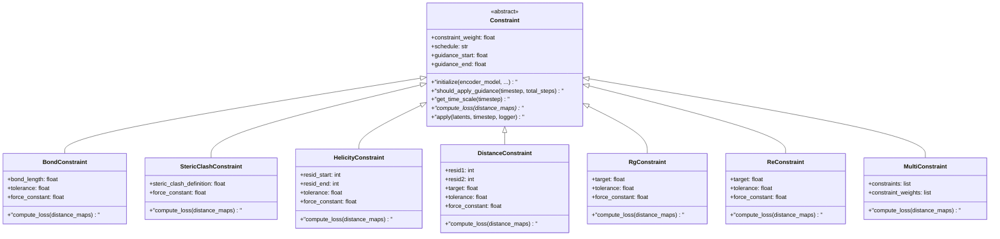
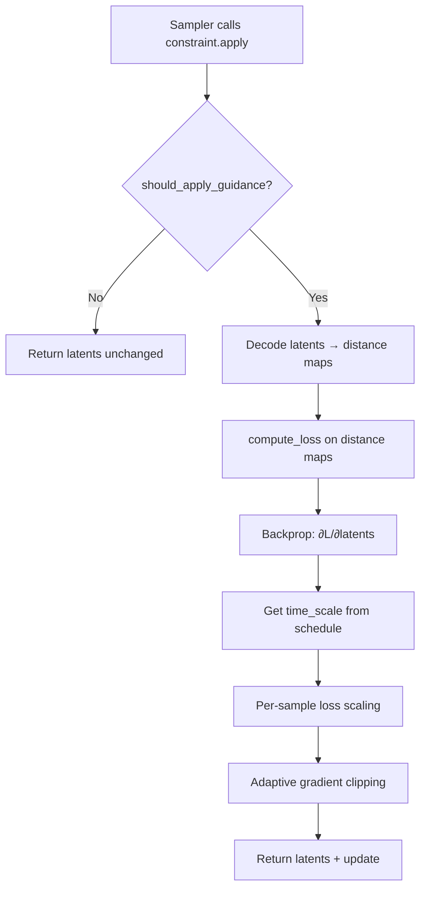

STARLING provides a gradient-based constraint system that steers the diffusion sampling process in latent space, enabling ensemble generation that satisfies biophysical priors. Each constraint defines a loss over decoded distance maps, backpropagates through the VAE decoder, and applies a scaled gradient update to the latent representation at each denoising step. This page catalogs every built-in constraint, its physical meaning, and the parameters that control its behavior.

## The Flat-Bottom Harmonic Potential

Every constraint in STARLING shares the same mathematical core: a **flat-bottom harmonic potential**. Rather than penalizing any deviation from a target value, the potential defines a *tolerance band* within which the loss is exactly zero. Only deviations exceeding the tolerance incur a quadratic penalty:

$$L = \frac{1}{2} k \cdot \text{ReLU}(|x - x_{\text{target}}| - \epsilon)^2$$

where *k* is the `force_constant`, *x* is the current value, *x*_target is the constraint target, and *ε* is the `tolerance`. This design is critical for protein structure: small fluctuations are physically expected, and penalizing them would over-constrain the ensemble. The `tolerance` parameter defines the width of the flat region (the "bottom" of the well), while `force_constant` controls the steepness of the walls beyond that region.

Sources: [constraints.py](starling/inference/constraints.py#L284-L326), [constraints.py](starling/inference/constraints.py#L439-L468)

## Constraint Class Hierarchy

All constraints descend from the abstract `Constraint` base class, which provides the shared mechanics for scheduling, gradient computation, adaptive clipping, and per-sample loss scaling. Concrete subclasses implement only `compute_loss`.



The `Constraint` base class carries parameters that govern *when* and *how strongly* the guidance is applied, while each subclass adds domain-specific parameters (target distances, residue indices, etc.) and implements the `compute_loss` method that operates on decoded distance maps.

Sources: [constraints.py](starling/inference/constraints.py#L41-L282)

## Constraint Reference

The table below summarizes every constraint type with its unique parameters and the physical quantity it controls.

| Constraint | Key Parameters | Physical Target | Loss Computed Over |
|---|---|---|---|
| **BondConstraint** | `bond_length=3.81`, `tolerance=0.0`, `force_constant=2.0` | Cα–Cα bond distance (Å) | First off-diagonal of distance map |
| **StericClashConstraint** | `steric_clash_definition=5.0`, `force_constant=2.0` | Minimum non-bonded distance (Å) | Upper triangle (offset ≥ 2) |
| **HelicityConstraint** | `resid_start`, `resid_end`, `tolerance=0.0`, `force_constant=2.0` | Ideal α-helix distance pattern | Submatrix `[resid_start:resid_end, resid_start:resid_end]` |
| **DistanceConstraint** | `resid1`, `resid2`, `target`, `tolerance=0.0`, `force_constant=2.0` | Pairwise distance between two residues (Å) | Single element `dm[resid1, resid2]` |
| **RgConstraint** | `target`, `tolerance=0.0`, `force_constant=2.0` | Radius of gyration (Å) | Full distance map (global property) |
| **ReConstraint** | `target`, `tolerance=0.0`, `force_constant=2.0` | End-to-end distance (Å) | Single element `dm[0, N-1]` |
| **MultiConstraint** | `constraints` (list) | Weighted combination of any constraints | Aggregated per-sub-constraint |

Sources: [constraints.py](starling/inference/constraints.py#L284-L646)

### BondConstraint

Penalizes deviations of the Cα–Cα virtual bond length from the ideal value of **3.81 Å** (the standard peptide backbone distance). The loss is computed over the first super-diagonal of the distance map (i.e., all *d(i, i+1)* pairs). The default `bond_length` of 3.81 Å reflects the physical distance between consecutive Cα atoms in a polypeptide chain; the `tolerance` parameter allows the bond to fluctuate within a flat-bottom well before the harmonic penalty activates.

```python
from starling.inference.constraints import BondConstraint

# Require bonds within 3.81 ± 0.5 Å
bond = BondConstraint(bond_length=3.81, tolerance=0.5, force_constant=2.0)
```

Sources: [constraints.py](starling/inference/constraints.py#L284-L326)

### StericClashConstraint

Prevents physically impossible steric clashes by penalizing non-bonded residue pairs whose distance falls below `steric_clash_definition` (default **5.0 Å**). Only the upper triangle with offset ≥ 2 is considered (i.e., *d(i, j)* where *j ≥ i + 2*), excluding bonded neighbors and the diagonal. The loss uses a one-sided harmonic: only distances *below* the threshold are penalized, with no penalty for larger separations.

```python
from starling.inference.constraints import StericClashConstraint

# Penalize any non-bonded pair closer than 5.0 Å
steric = StericClashConstraint(steric_clash_definition=5.0, force_constant=2.0)
```

Sources: [constraints.py](starling/inference/constraints.py#L329-L378)

### HelicityConstraint

Enforces α-helical geometry over a specified residue range by comparing the distance map against an ideal helix reference. The reference is generated by `helix_dm()` at a fixed length of 384 positions and then masked to the `[resid_start, resid_end]` sub-region. Only the upper triangle (offset ≥ 1) of the sub-region contributes to the loss. This constraint is particularly useful for modeling proteins with known helical segments in otherwise disordered regions.

```python
from starling.inference.constraints import HelicityConstraint

# Enforce helicity for residues 150–160 (0-indexed)
helix = HelicityConstraint(resid_start=150, resid_end=160, tolerance=0.0, force_constant=2.0)
```

Sources: [constraints.py](starling/inference/constraints.py#L381-L436), [utilities.py](starling/utilities.py#L1-L20)

### DistanceConstraint

The most flexible constraint: pins the pairwise distance between any two residues to a target value. This directly encodes experimental observations such as FRET distances, crosslinking data, or NMR distance restraints. The loss is computed from the single element `distance_maps[:, :, resid1, resid2]`.

```python
from starling.inference.constraints import DistanceConstraint

# Constrain residues 10 and 100 to be 30 Å apart
dist = DistanceConstraint(resid1=10, resid2=100, target=30.0, tolerance=1.0, force_constant=2.0)
```

Sources: [constraints.py](starling/inference/constraints.py#L439-L468)

### RgConstraint

Constrains the **radius of gyration** of the entire structure, a global compaction measure. Rg is computed directly from the distance map without converting to 3D coordinates, using the identity: *Rg = √(Σd_ij² / 2N²)*. This is computationally efficient and differentiable through the distance map. Typical use cases include matching SAXS-derived Rg values or exploring the compaction landscape of an IDP.

```python
from starling.inference.constraints import RgConstraint

# Target Rg of 40 Å with a softer force constant
rg = RgConstraint(target=40.0, tolerance=2.0, force_constant=0.1)
```

> [!TIP]
> Use a lower `force_constant` (e.g., 0.1–0.5) for `RgConstraint` and `ReConstraint` compared to local constraints like `DistanceConstraint`. Global properties respond to many distance map entries simultaneously, so the effective gradient magnitude is much larger. A high force constant on global constraints can destabilize the sampling trajectory.

Sources: [constraints.py](starling/inference/constraints.py#L471-L543)

### ReConstraint

Constrains the **end-to-end distance** — the distance between the first and last Cα atoms. This is a single-element lookup at `distance_maps[:, :, 0, sequence_length-1]`, making it the cheapest constraint to evaluate. Like Rg, it is a global property of the chain, so softer force constants are recommended.

```python
from starling.inference.constraints import ReConstraint

# Target end-to-end distance of 100 Å
re = ReConstraint(target=100.0, tolerance=5.0, force_constant=1.0)
```

Sources: [constraints.py](starling/inference/constraints.py#L546-L570)

### MultiConstraint

Combines multiple constraints into a single optimization step, applying each constraint's own `constraint_weight` as a relative scaling factor. The `MultiConstraint` delegates `initialize()` to every sub-constraint and sums the weighted per-batch losses. This is the mechanism for simultaneously enforcing, for example, a target Rg *and* a specific inter-residue distance.

```python
from starling.inference.constraints import (
    DistanceConstraint, RgConstraint, MultiConstraint
)

combined = MultiConstraint(constraints=[
    DistanceConstraint(resid1=10, resid2=100, target=30, constraint_weight=1.0),
    RgConstraint(target=40, force_constant=0.1, constraint_weight=0.5),
])
```

Sources: [constraints.py](starling/inference/constraints.py#L573-L646)

## Shared Scheduling and Guidance Parameters

Beyond constraint-specific parameters, every `Constraint` inherits scheduling controls that determine *when* during the diffusion trajectory the guidance is active and *how* its strength varies over time.



The `apply` method orchestrates the full guidance pipeline: decode the current latent to a distance map, compute the constraint loss, backpropagate to the latent, scale by the time schedule and per-sample loss, clip the gradient, and return the updated latent.

| Parameter | Default | Purpose |
|---|---|---|
| `constraint_weight` | `1.0` | Overall multiplicative weight on the gradient update |
| `schedule` | `"cosine"` | Time-dependent strength: `"cosine"`, `"bell_shaped"`, or `"linear"` |
| `guidance_start` | `0.0` | Normalized start of the guidance window (0 = noise, 1 = clean) |
| `guidance_end` | `1.0` | Normalized end of the guidance window |
| `verbose` | `True` | Enable `ConstraintLogger` output |

Sources: [constraints.py](starling/inference/constraints.py#L41-L114), [constraints.py](starling/inference/constraints.py#L203-L282)

### Scheduling Functions

The `schedule` parameter selects how guidance strength varies across the denoising trajectory. The diffusion process runs from high timesteps (noisy) to low timesteps (clean). The `guidance_start` and `guidance_end` parameters define a window within this trajectory where guidance is active, using the *reverse* fraction (so `guidance_start=0.0` means "start guiding from the beginning of denoising").

| Schedule | Formula | Behavior |
|---|---|---|
| `"cosine"` | cos²(t/total · π/2) | Strong guidance early, tapering smoothly to zero at the end |
| `"bell_shaped"` | sin(t̃π) · exp(-(t̃-0.6)²/0.1) | Ramps up, peaks at ~60% through denoising, then decays |
| `"linear"` (fallback) | 1 - t/total | Linear decay from full strength to zero |

The **cosine schedule** is the default and works well for most scenarios — it applies strong corrections early when the latent is still coarse, then lets the model refine the structure on its own. The **bell-shaped schedule** can be preferable when you want to avoid perturbing either the initial coarse layout or the final fine-grained refinement, concentrating guidance in the middle of the trajectory.

Sources: [constraints.py](starling/inference/constraints.py#L116-L157), [constraints.py](starling/inference/constraints.py#L274-L282)

### Adaptive Gradient Clipping

The `apply` method includes two stabilization mechanisms. **Per-sample loss scaling** weights each sample's gradient by its relative loss magnitude (clamped to a maximum factor of 2.0), so samples that already satisfy the constraint receive smaller updates. **Adaptive gradient clipping** caps each sample's gradient norm at 1.0, preventing any single sample from receiving an destructively large update. These mechanisms operate automatically and require no user configuration.

Sources: [constraints.py](starling/inference/constraints.py#L226-L254)

## How Constraints Integrate with Sampling

Constraints are injected into the DDIM sampling loop. After each denoising step, the sampler checks whether a constraint is provided and, if so, calls `constraint.apply(x, step, logger)` on the current latent. The constraint decodes the latent to a distance map, computes the loss, and returns a gradient-perturbed latent. This happens at every timestep (except step 0) within the guidance window, creating a continuous pressure toward the constraint target throughout the denoising process.

> [!TIP]
> Constraint-guided sampling is significantly slower than unconstrained generation because each `apply` call requires a full VAE decode and backpropagation. For a 10-step DDIM run with an active constraint, expect roughly 10 extra forward+backward passes through the decoder. Use fewer `steps` or narrower `guidance_start`/`guidance_end` windows to mitigate this cost.

Sources: [ddim_sampler.py](starling/samplers/ddim_sampler.py#L194-L229), [ddim_sampler.py](starling/samplers/ddim_sampler.py#L127-L137)

## ConstraintLogger

The `ConstraintLogger` provides real-time monitoring of constraint application during sampling. It displays a `tqdm` progress bar with the current loss and gradient norm for each active constraint, updated at every diffusion step. It is automatically created and managed by the sampler when a constraint is passed to `sample()`, but can also be used manually for custom sampling loops.

| Logger Method | Purpose |
|---|---|
| `setup()` | Initialize the progress bar |
| `update(timestep, constraint_name, metrics)` | Record metrics for a step |
| `close()` | Clean up the progress bar |

Sources: [constraints.py](starling/inference/constraints.py#L649-L720)

## Next Steps

Now that you understand each constraint type and its parameters, learn how to apply them in practice with the full sampling pipeline in [Constraint-Guided Sampling](13-constraint-guided-sampling). For combining constraints with experimental data, see [BME Reweighting](11-bme-reweighting).