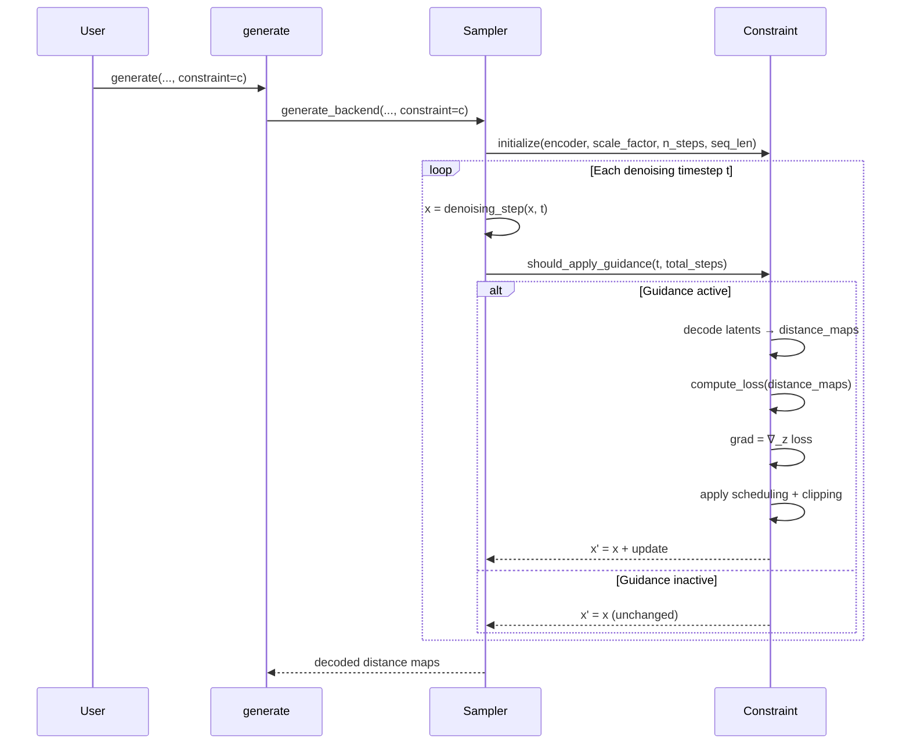

Constraint-guided sampling in STARLING steers the diffusion denoising process toward biophysically plausible structures by injecting gradient-based corrections at each timestep. Rather than post-hoc filtering or rejection sampling, constraints operate **inside the generative loop**, modifying latent representations so that decoded distance maps satisfy user-specified structural properties before sampling completes.

## The Guidance Mechanism

At each denoising step, the sampler produces an intermediate latent **z**. When a constraint is active, STARLING temporarily enables autograd on **z**, decodes it through the VAE to obtain a distance map **D**, evaluates the constraint loss ℒ(**D**), and computes ∇_z ℒ. The latent is then updated as:

> **z′** = **z** − w · s(t) · ℓ(**D**) · clip(∇_z ℒ)

where **w** is `constraint_weight`, **s(t)** is a time-dependent schedule, and **ℓ(D)** is a per-sample loss scaling factor that prevents already-satisfied samples from being over-corrected. Gradient norms are clipped per-sample to a maximum of 1.0, ensuring stability across heterogeneous batches.

The critical design insight is that guidance is applied in **latent space**, not distance-map space. This means the gradient must propagate through the VAE decoder, coupling the constraint signal to the generative model's internal representation. The `latent_space_scaling_factor` stored on the DDPM model normalizes latents before decoding to keep gradients numerically well-conditioned.

Sources: [constraints.py](starling/inference/constraints.py#L203-L272)

## Scheduling and Temporal Gating

Constraint influence is not uniform across the denoising trajectory. Three mechanisms control *when* and *how strongly* guidance is applied:

| Mechanism | Parameters | Description |
|---|---|---|
| **Guidance window** | `guidance_start`, `guidance_end` | Normalized fraction of the reverse process during which the constraint is active. Default `[0.0, 1.0]` applies at all steps. |
| **Time schedule** | `schedule` | `"cosine"` (default) decays as cos²(πt/2T); `"bell_shaped"` peaks at 60% through sampling; `"linear"` decays linearly. |
| **Adaptive clip threshold** | (internal) | Starts at 2.0 and decays to 1.0 via cosine schedule, allowing larger corrections early when latents are noisier. |

The guidance window uses the *reverse* fraction (1 − t/T) so that `guidance_start=0.0` corresponds to the beginning of denoising (noisiest state) and `guidance_end=1.0` corresponds to the final step. This lets you, for example, defer constraint application to the last 30% of sampling by setting `guidance_start=0.7`.

Sources: [constraints.py](starling/inference/constraints.py#L96-L183)

## Constraint Types and Their Loss Functions

All constraint subclasses implement `compute_loss(distance_maps) → (per_batch_loss, mean_loss)` using a **flat-bottom harmonic potential**: excess = ReLU(|deviation| − tolerance), loss = ½ · k · excess². The tolerance creates a dead zone where satisfied constraints contribute zero gradient.

### BondConstraint

Penalizes deviations of adjacent Cα–Cα distances from the ideal bond length (default 3.81 Å). Operates on the first off-diagonal of the distance map.

```python
from starling.inference.constraints import BondConstraint
bond = BondConstraint(bond_length=3.81, tolerance=1.0, force_constant=2.0)
```

### StericClashConstraint

Penalizes non-adjacent residue pairs (|i − j| ≥ 2) whose distance falls below `steric_clash_definition` (default 5.0 Å). Uses an upper-triangular mask to avoid double-counting and self-contacts.

```python
from starling.inference.constraints import StericClashConstraint
steric = StericClashConstraint(steric_clash_definition=5.0, force_constant=2.0)
```

### HelicityConstraint

Enforces α-helical geometry on a residue range by comparing decoded distances against an ideal helix reference distance map. The reference is generated by `helix_dm(L=384)` and a distance-dependent weight matrix (1/(d_ref + ε)) upweights shorter-range contacts. The mask restricts the loss to the upper triangle of the specified residue window.

```python
from starling.inference.constraints import HelicityConstraint
helix = HelicityConstraint(resid_start=10, resid_end=25, tolerance=0.5, force_constant=2.0)
```

### DistanceConstraint

Constrains the pairwise distance between two specific residues to a target value. Ideal for encoding experimental FRET measurements or cross-link mass spectrometry data.

```python
from starling.inference.constraints import DistanceConstraint
fret = DistanceConstraint(resid1=5, resid2=50, target=25.0, tolerance=2.0, force_constant=2.0)
```

### RgConstraint

Constrains the radius of gyration computed directly from the distance map: Rg = √(Σd²_ij / 2N²). No 3D coordinates are needed—the calculation operates on pairwise distances alone.

```python
from starling.inference.constraints import RgConstraint
rg = RgConstraint(target=18.0, tolerance=1.0, force_constant=2.0)
```

### ReConstraint

Constrains the end-to-end distance (residue 0 to residue N) to a target value, controlling overall chain extension or compaction.

```python
from starling.inference.constraints import ReConstraint
re = ReConstraint(target=40.0, tolerance=3.0, force_constant=2.0)
```

Sources: [constraints.py](starling/inference/constraints.py#L284-L570)

## Combining Multiple Constraints

`MultiConstraint` aggregates an arbitrary list of constraints into a single optimization step. Each sub-constraint retains its own `constraint_weight`, `guidance_start`, and `guidance_end`, allowing fine-grained control over relative strengths and activation windows. The combined loss is the weighted sum of all per-constraint losses.

```python
from starling.inference.constraints import MultiConstraint, RgConstraint, HelicityConstraint

combined = MultiConstraint(
    constraints=[
        RgConstraint(target=18.0, tolerance=1.0, force_constant=2.0, constraint_weight=1.5),
        HelicityConstraint(resid_start=5, resid_end=20, tolerance=0.5, force_constant=2.0, constraint_weight=1.0),
    ],
    schedule="cosine",
)
```

> [!TIP]
> When combining constraints with different physical units (Šfor distances, Ų for Rg), adjust `constraint_weight` so that each constraint's loss contributes comparable magnitudes. Monitor the `ConstraintLogger` output (loss, grad_norm per step) to diagnose imbalance.

Sources: [constraints.py](starling/inference/constraints.py#L573-L646)

## Integration with the Sampling Loop

Constraints are injected into the denoising loop through the `constraint` parameter on both the high-level `generate()` function and the low-level sampler `sample()` / `p_sample_loop()` methods. The initialization chain proceeds as follows:



At the frontend level, the constraint is passed directly through to the backend:

```python
from starling.frontend.ensemble_generation import generate
from starling.inference.constraints import RgConstraint

ensemble = generate(
    "MIEQKLKAEEKSEKRQKIAEKQAQKQKEQAQKI",
    conformations=500,
    constraint=RgConstraint(target=15.0, tolerance=1.0),
    return_single_ensemble=True,
)
```

The sampler automatically initializes the constraint before the loop begins, providing it with the encoder model, latent scaling factor, total step count, and sequence length. The `ConstraintLogger` displays real-time diagnostics (loss and gradient norm) as a secondary progress bar during sampling.

Sources: [ensemble_generation.py](starling/frontend/ensemble_generation.py#L160-L393), [ddpm_sampler.py](starling/samplers/ddpm_sampler.py#L150-L200), [ddim_sampler.py](starling/samplers/ddim_sampler.py#L127-L199)

## Per-Sample Adaptive Scaling

Within a batch, different samples may satisfy the constraint to varying degrees. The `apply()` method computes **per-sample loss scaling** as ℓ_i = loss_i / mean(loss), clamped to a maximum of 2.0. This ensures that samples already close to the target receive smaller corrections while outliers receive proportionally larger nudges, preventing the batch mean from masking individual violations.

Combined with per-sample gradient norm clipping (each sample's update is independently scaled to a maximum L2 norm of 1.0), this two-level adaptation makes constraint guidance robust across heterogeneous batches without requiring manual per-sample tuning.

Sources: [constraints.py](starling/inference/constraints.py#L226-L254)

## Parameter Reference

| Parameter | Default | Scope | Description |
|---|---|---|---|
| `constraint_weight` | 1.0 | All constraints | Global multiplier on the gradient update |
| `schedule` | `"cosine"` | All constraints | Temporal schedule: `"cosine"`, `"bell_shaped"`, or `"linear"` |
| `guidance_start` | 0.0 | All constraints | Normalized start of guidance window (0 = noisiest) |
| `guidance_end` | 1.0 | All constraints | Normalized end of guidance window (1 = cleanest) |
| `tolerance` | 0.0 | Per-type | Flat-bottom width before penalty activates (Å) |
| `force_constant` | 2.0 | Per-type | Harmonic potential strength k |
| `bond_length` | 3.81 | BondConstraint | Target Cα–Cα bond length (Å) |
| `steric_clash_definition` | 5.0 | StericClashConstraint | Minimum allowed non-bonded distance (Å) |
| `resid_start`, `resid_end` | — | HelicityConstraint | Residue range for helical enforcement |
| `resid1`, `resid2`, `target` | — | DistanceConstraint | Residue pair and target distance (Å) |
| `target` | — | RgConstraint, ReConstraint | Target value (Å) |

Sources: [constraints.py](starling/inference/constraints.py#L41-L78)

## Next Steps

- Review the full catalog of constraint types and their biophysical motivation at [Constraint Types](12-constraint-types).
- See how constraint-guided ensembles interact with BME reweighting at [BME Reweighting](11-bme-reweighting).
- Understand the latent space that constraints operate within at [VAE Latent Space](6-vae-latent-space).