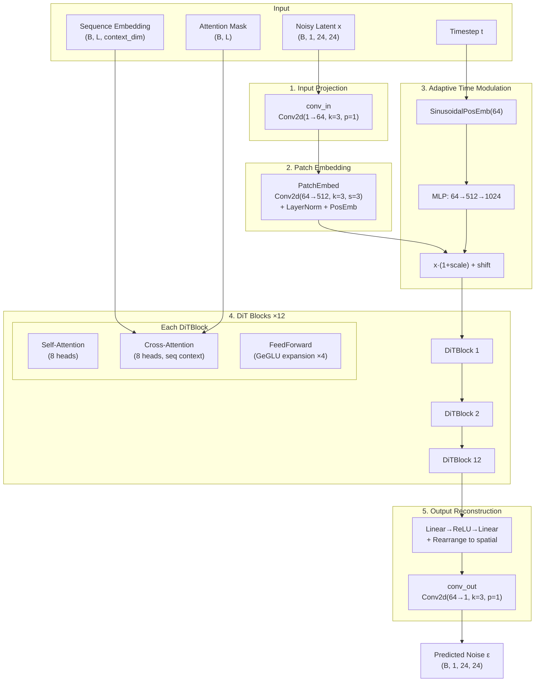
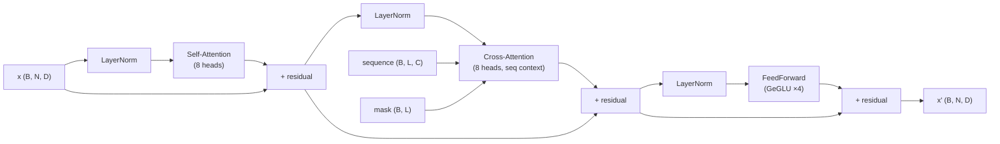

The **Vision Transformer Denoiser** (ViT Denoiser) is the central neural network responsible for predicting noise at each diffusion timestep within Starling's latent diffusion pipeline. Unlike conventional U-Net denoisers prevalent in image diffusion models, Starling adopts a patch-based Vision Transformer architecture that reasons over spatial patches of the latent distance map through self-attention while simultaneously attending to protein sequence embeddings via cross-attention. This design enables the denoiser to capture **long-range spatial correlations** across the entire distance map in a single attention operation — a critical capability for protein structure generation where residues far apart in sequence may be proximal in 3D space.

Sources: [vit.py](starling/models/vit.py#L1-L123), [transformer.py](starling/models/transformer.py#L1-L385), [attention.py](starling/models/attention.py#L1-L361)

## Architecture Overview

The ViT Denoiser transforms a noisy latent representation (shape `B×1×24×24`) into a noise prediction of identical shape, conditioned on both the diffusion timestep and a protein sequence embedding. The data flow proceeds through five distinct stages: **input projection**, **patchification**, **adaptive time modulation**, **stacked DiT blocks**, and **output reconstruction**.



Sources: [vit.py](starling/models/vit.py#L31-L122), [transformer.py](starling/models/transformer.py#L296-L339)

## Patch Embedding

The `PatchEmbed` module converts the intermediate feature map into a sequence of patch tokens suitable for transformer processing. A **strided convolution** serves as both the patch extraction and projection mechanism — each `patch_size × patch_size` spatial region is linearly projected into `embed_dim` dimensions in a single operation, avoiding the information loss of naïve flattening. Following projection, `LayerNorm` stabilizes the token representations and a **learned positional embedding** (shape `1 × num_tokens × embed_dim`) injects spatial awareness. With the default `patch_size=3` and a 24×24 spatial resolution, the token sequence length is `(24/3)² = 64` tokens.

| Parameter | Value | Derivation |
|-----------|-------|------------|
| Input channels | 64 (BASE) | Output of `conv_in` |
| Patch size | 3 | Kernel and stride of patchifying Conv2d |
| Embedding dimension | 512 | Matches sequence encoder output |
| Number of tokens | 64 | `(24 × 24) / 3²` |
| Positional embedding | Learned | `nn.Parameter`, shape `(1, 64, 512)` |

Sources: [vit.py](starling/models/vit.py#L9-L28)

## Timestep Conditioning via Adaptive Modulation

Timestep information is injected through an **adaptive scale-and-shift** mechanism inspired by DiT (Scalable Diffusion Models with Transformers). The continuous timestep is first encoded into sinusoidal positional embeddings, then expanded through a two-layer MLP with SiLU activation to produce a `2 × embed_dim` conditioning vector. This vector is split into **scale** and **shift** parameters that modulate every patch token:

```
scale, shift = time_mlp(t).chunk(2, dim=-1)
x = x * (1 + scale) + shift
```

This affine modulation — applied once before the transformer stack — serves as an efficient global conditioning mechanism. It communicates "how noisy" the current latent is to all subsequent attention layers without per-layer conditioning overhead. The sinusoidal encoding uses a base frequency of `θ = 10000`, consistent with the standard transformer positional encoding convention.

Sources: [vit.py](starling/models/vit.py#L62-L110), [transformer.py](starling/models/transformer.py#L15-L58)

## DiTBlock: Self-Attention, Cross-Attention, FeedForward

Each of the 12 `DiTBlock` layers follows a **pre-norm residual architecture** with three sub-layers: self-attention, cross-attention, and a feed-forward network. The self-attention layer enables each spatial patch token to attend to all other patch tokens, capturing global spatial correlations across the entire distance map. The cross-attention layer then conditions these spatial representations on the protein sequence embedding — each patch token queries the sequence context (keyed and valued from the sequence encoder output), allowing the denoiser to learn which sequence regions influence which spatial regions. The feed-forward network uses a **GeGLU** activation (gated GELU), which projects to `4 × embed_dim` before reducing back, providing the non-linear transformation capacity.



Sources: [transformer.py](starling/models/transformer.py#L296-L339), [attention.py](starling/models/attention.py#L11-L79)

## Multi-Head Attention Implementation

The `MultiHeadAttention` module implements a unified interface for both self-attention and cross-attention through a `context_dim` parameter — when `context_dim` differs from `embed_dim`, the key and value projections map from `context_dim` to `embed_dim` (cross-attention); otherwise, they map within `embed_dim` (self-attention). The implementation leverages PyTorch's **`F.scaled_dot_product_attention`** (≥2.0), which automatically dispatches to FlashAttention or memory-efficient attention kernels when available. Attention masking supports both query and context masks, combined via outer-product logic to produce a `(B, num_heads, N, S)` boolean mask that prevents attention to padding tokens in variable-length protein sequences.

| Property | Self-Attention | Cross-Attention |
|----------|---------------|-----------------|
| Query source | Patch tokens | Patch tokens |
| Key/Value source | Patch tokens | Sequence tokens |
| Query dim | 512 | 512 |
| Context dim | 512 | 512 |
| Number of heads | 8 | 8 |
| Head dimension | 64 | 64 |
| Masking | None (fixed 64 tokens) | Sequence mask (variable length) |

Sources: [attention.py](starling/models/attention.py#L11-L79), [attention.py](starling/models/attention.py#L82-L159)

## Output Reconstruction

The output path mirrors the input path in reverse: the `out_projection` module first maps each token from `embed_dim` back to `BASE × patch_size²` via a two-layer MLP with ReLU, then **rearranges** the token sequence into a spatial feature map using the einops `Rearrange` operation with explicit `(h, w, p1, p2, c)` dimension unpacking. This reconstructs a `(B, 64, 24, 24)` intermediate feature map. A final `conv_out` (Conv2d with 64 input channels → 1 output channel, kernel size 3, padding 1) produces the single-channel noise prediction at the original 24×24 resolution.

Sources: [vit.py](starling/models/vit.py#L80-L94), [vit.py](starling/models/vit.py#L117-L121)

## Default Configuration

The ViT Denoiser is instantiated with a fixed configuration during diffusion training. The following table enumerates every architectural parameter and its default value as used in the training pipeline.

| Parameter | Default | Description |
|-----------|---------|-------------|
| `num_layers` | 12 | Number of stacked DiTBlock layers |
| `embed_dim` | 512 | Token embedding dimension throughout the transformer |
| `num_heads` | 8 | Attention heads per self/cross-attention layer |
| `context_dim` | 512 | Sequence encoder output dimension (cross-attention key/value) |
| `patch_size` | 3 | Spatial patch size for tokenization |
| `BASE` | 64 | Internal channel dimension for conv_in / conv_out |
| Spatial resolution | 24×24 | Fixed latent space size (single-channel) |
| Token count | 64 | `(24 / 3)²` patches per sample |
| FFN expansion | 4× | GeGLU feed-forward hidden dimension multiplier |

The instantiation in the training pipeline uses `ViT(12, 512, 8, 512)`, where `context_dim` equals `embed_dim` because the sequence encoder (configured as 12 layers, 512 embed_dim, 8 heads) produces output in the same dimensionality space.

Sources: [diffusion_train.py](starling/training/diffusion_train.py#L81-L112), [sequence_encoder.yaml](starling/configs/sequence_encoder/sequence_encoder.yaml#L1-L3)

## Forward Pass Signature

The ViT denoiser's forward method accepts four inputs and returns a single output:

```python
def forward(self, x, timestep, sequence, mask) -> torch.Tensor:
```

| Argument | Shape | Type | Description |
|----------|-------|------|-------------|
| `x` | `(B, 1, 24, 24)` | `torch.Tensor` | Noisy latent distance map |
| `timestep` | `(B, 1)` | `torch.Tensor` | Diffusion timestep (continuous) |
| `sequence` | `(B, L, 512)` | `torch.Tensor` | Sequence encoder output (context) |
| `mask` | `(B, L)` | `torch.Tensor` | Boolean attention mask for padding |
| **Returns** | `(B, 1, 24, 24)` | `torch.Tensor` | Predicted noise ε(x_t, t, seq) |

Within the `DiffusionModel` training loop, the ViT is invoked as `self.model(x_noised, t, labels, mask)`, where `labels` are the pre-computed sequence encoder outputs and `x_noised` is the latent encoding after forward diffusion at timestep `t`.

Sources: [vit.py](starling/models/vit.py#L96-L122), [diffusion.py](starling/models/diffusion.py#L296-L302)

## Relationship to the Diffusion Pipeline

The ViT Denoiser operates within a **latent diffusion** framework. The outer `DiffusionModel` module handles the forward diffusion process (adding noise to VAE-encoded distance maps via `q_sample`), loss computation (MSE between predicted and true noise, optionally with min-SNR weighting), and the reverse sampling trajectory. The denoiser itself is purely a **noise prediction network** — it receives a noised latent and estimates the noise component, which the sampler then uses to iteratively denoise. The sequence conditioning flows through the `SequenceEncoder` first, producing the `(B, L, 512)` context tensor that the ViT's cross-attention layers consume.

> [!TIP]
> The ViT denoiser replaces the conventional U-Net architecture typically used in diffusion models. The key architectural advantage is that self-attention operates over all 64 patch tokens simultaneously — every patch can directly attend to every other patch regardless of spatial distance. This is particularly important for protein distance maps where long-range residue contacts (far apart in sequence but close in 3D) must be resolved jointly during denoising.

> [!TIP]
> The adaptive time modulation (`x * (1 + scale) + shift`) is applied only once before the transformer stack, not per-layer as in full AdaLN-Zero DiT. This is a design tradeoff: it reduces parameter count and computation while still providing strong timestep conditioning, but may limit the denoiser's ability to exhibit highly timestep-dependent behavior across different transformer depths.

Sources: [diffusion.py](starling/models/diffusion.py#L55-L187), [diffusion.py](starling/models/diffusion.py#L253-L326)

## Next Steps

- Understand how the denoiser is loaded, compiled, and deployed for inference: [Model Loading & Compilation](15-model-loading-and-compilation)
- Explore the sampling algorithms that drive the reverse diffusion using this denoiser: [Sampling Strategies](8-sampling-strategies)
- Examine the sequence encoder that produces the cross-attention context: [Sequence Encoder](5-sequence-encoder)
- Review the full diffusion model design wrapping this denoiser: [Diffusion Model Design](7-diffusion-model-design)