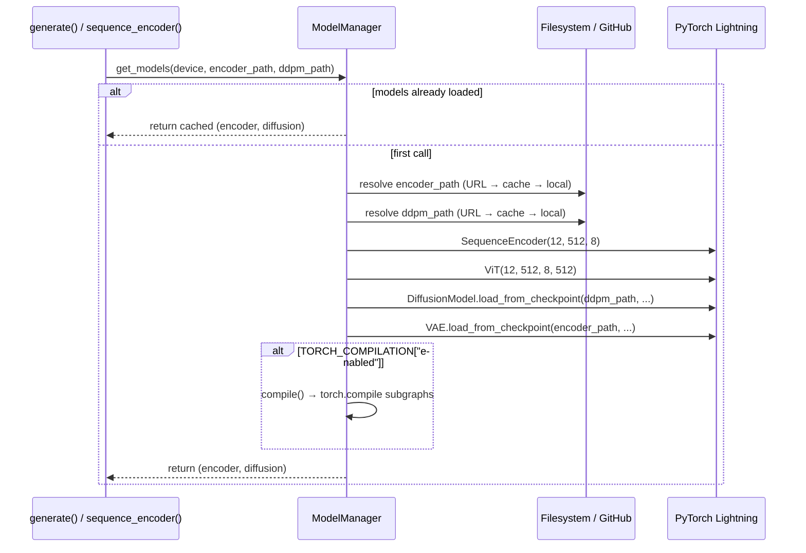
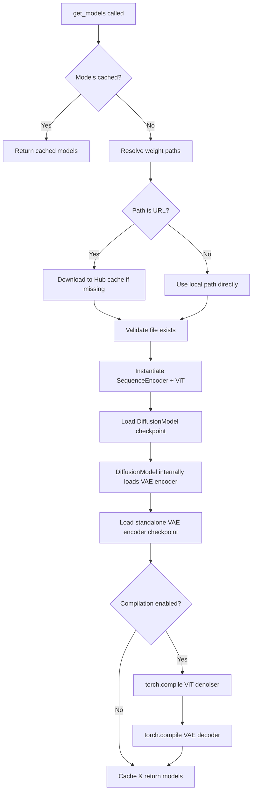

Starling's model loading infrastructure governs how the two core pretrained models—the **VAE distance-map encoder** and the **ViT-conditioned diffusion model**—are resolved, fetched, deserialized, and optionally compiled for accelerated inference. The system implements a lazy-loading singleton pattern with multi-source weight resolution (local filesystem, environment variables, and GitHub Releases URLs), PyTorch Hub integration, and selective `torch.compile`-based Just-In-Time compilation of inference-critical subgraphs.

## Weight Resolution & Source Priority

Starling ships two checkpoint files that must be available at runtime:

| Checkpoint | Default Filename | Role |
|---|---|---|
| **VAE Encoder** | `STARLING_v2.0.0_ViT_VAE_2025_10_14.ckpt` | Compresses distance maps into latent space; decodes latent samples back to distance maps |
| **DDPM** | `STARLING_v2.0.0_ViT_DDPM_2025_10_14.ckpt` | Denoising diffusion model with ViT backbone and sequence encoder |

The resolution order for each checkpoint follows a strict priority chain. Environment variables override everything, falling back to GitHub Releases URLs hosted under the `idptools/starling` repository:

```
STARLING_ENCODER_PATH env var  →  https://github.com/idptools/starling/releases/download/v2.0.0/<filename>
STARLING_DDPM_PATH env var    →  https://github.com/idptools/starling/releases/download/v2.0.0/<filename>
```

When a URL is detected (the default), the `ModelManager.load_from_path_or_url` inner function downloads the checkpoint into PyTorch Hub's cache directory (`torch.hub.get_dir() + "/checkpoints/"`) using `torch.hub.download_url_to_file`, skipping the download if the file already exists locally. This design ensures that first-time users incur a one-time download cost, while subsequent runs resolve instantly from cache. Users who need air-gapped deployments or custom model variants can point the environment variables at local `.ckpt` paths to bypass network access entirely.

Sources: [configs.py](starling/configs.py#L8-L91), [model_loading.py](starling/inference/model_loading.py#L21-L46)

## User Configuration Overrides

Beyond environment variables, Starling supports a Python-based user config file located at `~/.starling_weights/configs.py`. When this file exists, the `load_user_config()` function executes it at import time and overrides any matching global variable in `starling.configs`—including `DEFAULT_ENCODE_WEIGHTS`, `DEFAULT_DDPM_WEIGHTS`, `DEFAULT_MODEL_DIR`, and all compilation settings. This mechanism allows persistent per-user customization without modifying the installed package:

```python
# ~/.starling_weights/configs.py
DEFAULT_ENCODE_WEIGHTS = "my_custom_vae.ckpt"
DEFAULT_DDPM_WEIGHTS = "my_custom_ddpm.ckpt"
TORCH_COMPILATION = {"enabled": True, "options": {"mode": "reduce-overhead"}}
```

Sources: [configs.py](starling/configs.py#L42-L69)

## ModelManager & Lazy-Loading Architecture

The `ModelManager` class is the central orchestrator for model lifecycle management. It maintains two instance attributes—`encoder_model` and `diffusion_model`—both initialized to `None` and populated on first access through the `get_models()` method. This lazy-loading pattern ensures that the substantial memory and compute cost of deserializing two deep models is deferred until actually needed:



The checkpoint loading process reconstructs two composite models. The **diffusion model** checkpoint is loaded via `DiffusionModel.load_from_checkpoint`, which receives three constructor arguments: a freshly instantiated `ViT(12, 512, 8, 512)` denoiser, a freshly instantiated `SequenceEncoder(12, 512, 8)`, and the `encoder_path` string. Inside `DiffusionModel.__init__`, the `distance_map_encoder` path triggers a *nested* checkpoint load—`VAE.load_from_checkpoint(distance_map_encoder)`—which freezes the VAE's parameters for use as a fixed latent-space encoder during diffusion training validation. Separately, the top-level `encoder_model` is loaded as another `VAE.load_from_checkpoint` instance for inference-time decoding of sampled latents back to distance maps.

The model architecture parameters `(12, 512, 8)` correspond to `num_layers=12`, `embed_dim=512`, `num_heads=8`, matching the values in the sequence encoder configuration. The ViT's `context_dim=512` aligns with the sequence encoder's output embedding dimension, ensuring the cross-attention layers in the DiT blocks can consume sequence conditioning vectors without dimension mismatch.

> [!TIP]
> The `ModelManager` singleton is instantiated at module level in `generation.py` as `model_manager = ModelManager()`. Because `ensemble_generation.py` imports from `generation`, all calls to `generate()` or `sequence_encoder()` within a single Python session share the same loaded models—avoiding redundant deserialization on repeated invocations.

Sources: [model_loading.py](starling/inference/model_loading.py#L16-L101), [diffusion.py](starling/models/diffusion.py#L55-L143), [generation.py](starling/inference/generation.py#L23-L26), [sequence_encoder.yaml](starling/configs/sequence_encoder/sequence_encoder.yaml#L1-L3)

## PyTorch Compilation Pipeline

Starling integrates `torch.compile` for Just-In-Time graph compilation of inference-critical model subgraphs. Compilation is **disabled by default** (`TORCH_COMPILATION["enabled"] = False`) and must be explicitly activated—either through the `set_compilation_options()` API, the user config file, or by setting `TORCH_COMPILATION` globals before model loading.

### Compiled Subgraphs

When compilation is enabled, the `ModelManager.compile()` method selectively compiles two subgraphs rather than the entire model hierarchy:

| Subgraph | Access Path | Rationale |
|---|---|---|
| **ViT Denoiser** | `diffusion_model.model` | The ViT forward pass is the bottleneck during iterative denoising (called once per timestep per sample) |
| **VAE Decoder** | `encoder_model.decoder` | The ResNet decoder is called once per conformation to map latent samples back to distance maps |

The `SequenceEncoder` is intentionally **not compiled** (the relevant line is commented out in source), as its forward pass is invoked only once per sequence and does not benefit meaningfully from compilation overhead amortization.

### Compilation Options

The default compilation configuration provides sensible defaults while exposing the full `torch.compile` parameter surface:

```python
TORCH_COMPILATION = {
    "enabled": False,
    "options": {
        "mode": "default",        # "default" | "reduce-overhead" | "max-autotune"
        "fullgraph": True,       # Compile entire forward graph
        "backend": "inductor",   # Triton-based backend
        "dynamic": None,         # Dynamic shape handling
    },
}
```

The three `mode` values represent a tradeoff spectrum:

| Mode | Compilation Time | Inference Speed | Best For |
|---|---|---|---|
| `"default"` | Moderate | Good | General use, first-time compilation |
| `"reduce-overhead"` | Fast | Moderate | Reducing Python overhead without aggressive optimization |
| `"max-autotune"` | Slow (kernel search) | Best | Repeated inference on fixed hardware; highest throughput |

### Programmatic Configuration

The top-level `starling.set_compilation_options()` function provides the canonical API for runtime compilation control. It accepts any valid `torch.compile` keyword argument and automatically invalidates cached models when settings change—resetting the `ModelManager` singleton so that subsequent `get_models()` calls re-load and re-compile with updated options:

```python
import starling

# Enable compilation with reduced overhead
starling.set_compilation_options(enabled=True, mode="reduce-overhead")

# Advanced: full autotuning with Triton CUDA graphs
starling.set_compilation_options(
    enabled=True,
    mode="max-autotune",
    backend="inductor",
    fullgraph=False,
    dynamic=True,
    options={"triton.cudagraphs": True}
)

# Generate ensembles with compiled models
results = starling.generate("MDEKRMKGLGL")
```

The invalidation logic in `set_compilation_options()` checks whether `model_manager.encoder_model` is already populated; if so, it replaces the singleton with a fresh `ModelManager()` instance. This ensures that stale compiled graphs don't persist across configuration changes.

> [!TIP]
> Compilation is a **one-time upfront cost** that can take 30–120 seconds depending on mode and hardware. After compilation, all subsequent inference calls bypass Python interpretation entirely, yielding 1.5–4× speedups. For interactive notebooks or scripts that call `generate()` multiple times, the amortized benefit is substantial. For single-call scripts, the compilation overhead may exceed the savings—use `"reduce-overhead"` mode or leave compilation disabled.

Sources: [configs.py](starling/configs.py#L27-L35), [model_loading.py](starling/inference/model_loading.py#L95-L130), [__init__.py](starling/__init__.py#L16-L76)

## Training-Time Compilation

Separate from inference compilation, the `VAE` class supports `torch.compile` during training via its `setup()` hook. When `stage == "fit"` and `compile_mode` is not `None`, the `encode`, `decode`, and `forward` methods are individually compiled with the specified mode:

```python
# In VAE.setup() — triggered only during PyTorch Lightning training
if stage == "fit" and self.compile_mode is not None:
    self.encode = torch.compile(self.encode, mode=self.compile_mode)
    self.decode = torch.compile(self.decode, mode=self.compile_mode)
    self.forward = torch.compile(self.forward, mode=self.compile_mode)
```

The `compile_mode` for training is configured in the VAE model YAML as `"max-autotune-no-cudagraphs"`. This training compilation path is entirely independent from the inference-time `ModelManager.compile()` flow and is only active when the model is being trained through PyTorch Lightning's `Trainer.fit()`.

Sources: [vae.py](starling/models/vae.py#L251-L257), [model.yaml](starling/configs/vae_model/model.yaml#L15-L16)

## PyTorch Hub Integration

Starling registers a `hubconf.py` entry point that exposes model loading through PyTorch Hub's standard interface:

```python
import torch
encoder, diffusion = torch.hub.load("idptools/starling", "starling_model", pretrained=True, device="cuda")
```

The `starling_model()` function instantiates a fresh `ModelManager` and calls `get_models()`, returning the `(encoder_model, diffusion_model)` tuple. Note that this creates a **new** `ModelManager` instance distinct from the singleton in `generation.py`, so Hub-loaded models do not share state with models loaded through `starling.generate()`.

Sources: [hubconf.py](hubconf.py#L1-L18)

## Device Placement & Checkpoint Mapping

Both checkpoint loads use PyTorch Lightning's `load_from_checkpoint` with the `map_location=device` parameter, ensuring that model weights are placed directly on the target device (CPU, CUDA, or MPS) during deserialization—avoiding an intermediate CPU→GPU transfer. The `device` parameter defaults to `"cpu"` in `get_models()` for cross-platform compatibility, but is typically overridden to `"cuda"` or `"mps"` by the `check_device()` utility in the generation frontend when GPU hardware is detected.

Sources: [model_loading.py](starling/inference/model_loading.py#L48-L61), [utilities.py](starling/utilities.py#L148-L200)

## Loading Flow Summary



For deeper understanding of the compiled model architectures themselves, see [Vision Transformer Denoiser](14-vision-transformer-denoiser) for the ViT internals and [VAE Latent Space](6-vae-latent-space) for the encoder/decoder structure. For configuration of all loading and compilation parameters, see [Configuration Reference](17-configuration-reference).