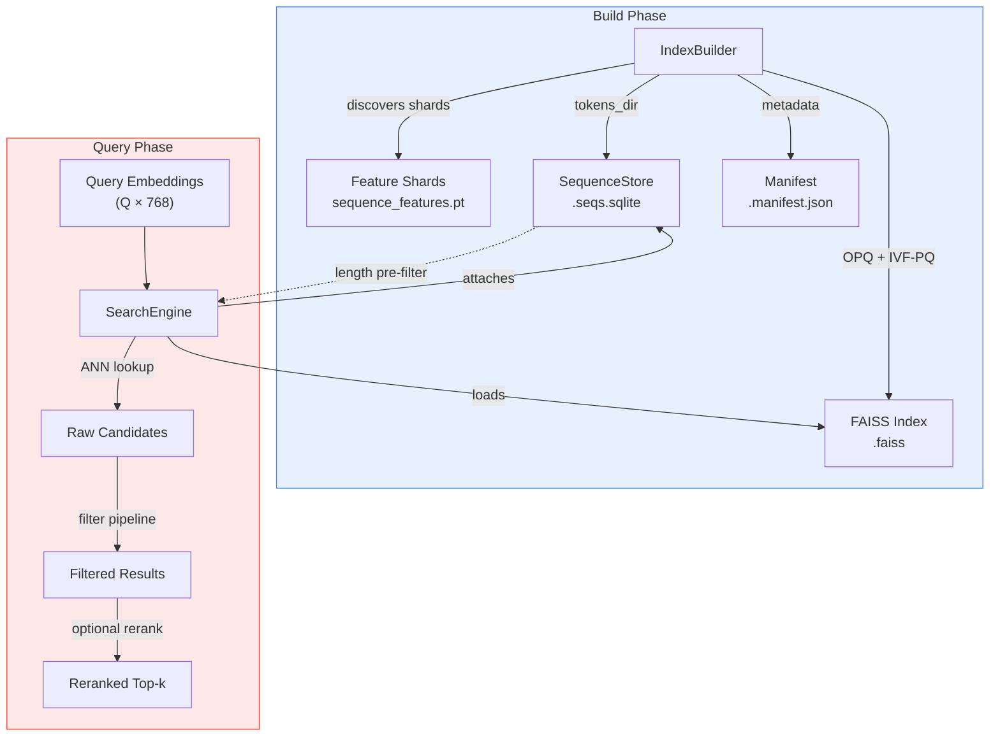
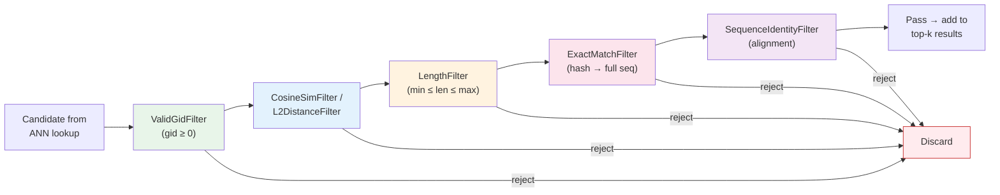
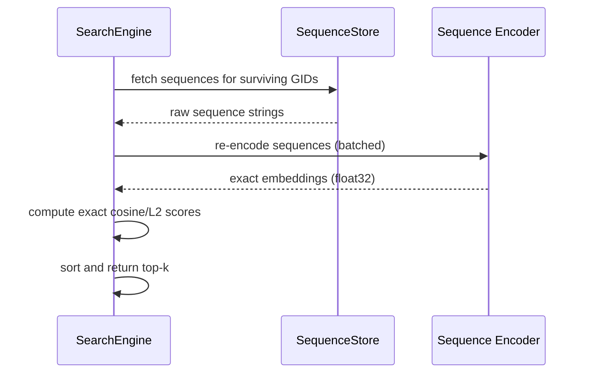

STARLING's similarity search subsystem provides **FAISS-backed approximate nearest neighbor (ANN) search** over protein sequence embeddings, with a multi-layer filtering pipeline, exact reranking, and a SQLite-backed metadata store. It is the mechanism by which generated or query sequences find their structural neighbors in large-scale databases — bridging the gap between the generative pipeline's latent space and real-world sequence repositories.

## Architecture Overview

The search module is organized into four cooperating components, each with a distinct responsibility in the build-then-query lifecycle:



The **build phase** constructs a compressed FAISS index and a sidecar SQLite database from sharded feature files. The **query phase** loads these artifacts into a `SearchEngine` and executes ANN search with configurable filtering and optional exact rescoring. The two phases are fully decoupled — indices are portable artifacts that can be shared across environments.

Sources: [\_\_init\_\_.py](/starling/search/__init__.py#L1-L36), [builder.py](/starling/search/builder.py#L1-L200)

## Index Construction with IndexBuilder

The `IndexBuilder` transforms sharded embedding files into a production-ready FAISS index. It applies **OPQ + IVF-PQ compression** — a three-stage quantization strategy that reduces 768-dimensional float32 vectors (~3 KB each) to ~64–128 byte codes while preserving retrieval quality.

| Parameter | Default | Role |
|-----------|---------|------|
| `sample_size` | 655,360 | Training vectors for quantizer learning |
| `nlist` | 16,384 | IVF partitions (auto-reduced if training set too small) |
| `m` | 64 | PQ subquantizers (must divide embedding dimension) |
| `nbits` | 8 | Bits per subquantizer codebook entry |
| `use_opq` | `True` | Learned rotation for improved quantization |
| `use_gpu` | `True` | GPU-accelerated training |
| `compress_sequences` | `False` | zstd compression in sidecar SQLite |

The builder discovers feature shards by globbing `**/sequence_features.pt` under the specified `root`, parses shard IDs from directory names, and sorts them numerically to guarantee stable GID assignment. It validates dimensional consistency across shards and auto-adjusts `nlist` downward (to the nearest power of 2) when the training sample count is insufficient for the requested partition count.

**Quick build example:**

```python
from starling.search import IndexBuilder, build_index

# Functional API
index = build_index(
    root="/data/feature_shards",
    index_path="/data/uniref_index.faiss",
    tokens_dir="/data/tokenized_sequences",
    metric="cosine",
    sample_size=655_360,
    nlist=16384,
    m=64,
)

# Object-oriented API (more control)
builder = IndexBuilder(root="/data/feature_shards", metric="cosine")
index = builder.build_index(
    index_path="/data/uniref_index.faiss",
    tokens_dir="/data/tokenized_sequences",
    use_opq=True,
    use_gpu=True,
)
```

The build produces three artifacts: the `.faiss` index file, a `.manifest.json` with metadata (dimension, total vectors, IVF-PQ configuration, build date), and a `.seqs.sqlite` sequence store when `tokens_dir` is provided.

Sources: [builder.py](/starling/search/builder.py#L450-L649), [builder.py](/starling/search/builder.py#L200-L399)

## Sequence Metadata Store

The `SequenceStore` is a SQLite-backed database that provides **O(log N) indexed lookups** for sequence data required by filters and reranking. It follows a build-then-publish pattern that guarantees atomicity: the writer constructs the database in an isolated temp file, then atomically replaces the live path via `os.replace()`.

| Operation | Method | Indexed? | Notes |
|-----------|--------|----------|-------|
| Single seq fetch | `get_seq(gid)` | ✓ (PK) | LRU-cached (32K entries) |
| Header + length | `get_header_len(gid)` | ✓ (PK) | Single row lookup |
| Batch metadata | `get_many_meta(gids)` | ✓ (PK) | Temp table JOIN for large batches |
| Length range query | `get_gids_by_length_range(min, max)` | ✓ (len) | Used for IVF ID selector |
| Bulk insert | `insert_rows(rows)` | — | Write-optimized PRAGMAs |
| Hash computation | `hash8(seq)` | — | SHA1 truncated to 8 bytes |

**Schema:**

```sql
CREATE TABLE sequences (
    gid       INTEGER PRIMARY KEY,
    len       INTEGER NOT NULL,
    hash8     INTEGER,          -- 8-byte hash for dedup
    seq       BLOB NOT NULL,    -- [flag:1B][payload] (0=UTF-8, 1=zstd)
    shard     INTEGER,
    local_idx INTEGER,
    header    BLOB              -- same encoding as seq
);
CREATE INDEX idx_len ON sequences(len);
CREATE INDEX idx_hash8 ON sequences(hash8);
```

Sequences and headers use a 1-byte flag prefix for encoding: `0x00` for plain UTF-8, `0x01` for zstd-compressed payload. This allows mixed compressed/uncompressed data within the same database. Readers open with `immutable=1` and `mode=ro` — they never lock and support unlimited concurrent access across threads and processes.

Sources: [store.py](/starling/search/store.py#L1-L200), [store.py](/starling/search/store.py#L400-L587)

## SearchEngine: Querying the Index

The `SearchEngine` is the primary query interface. It wraps a trained FAISS index and optional `SequenceStore` to provide high-level search with multi-level filtering and exact reranking.

### Loading

```python
from starling.search import SearchEngine, load_engine

# Functional API
engine = load_engine("/data/uniref_index.faiss", metric="cosine")

# Class method (equivalent)
engine = SearchEngine.load("/data/uniref_index.faiss", metric="cosine", verbose=True)
```

The loader reads the `.faiss` file and automatically attaches a sibling `.seqs.sqlite` if present. If the sequence store is absent, filters and reranking that depend on it will raise a `RuntimeError` at query time.

### Core Search Method

The `search()` method orchestrates the full pipeline: ANN lookup → metadata collection → filter application → optional reranking. Its signature exposes every tunable knob:

| Parameter | Default | Purpose |
|-----------|---------|---------|
| `queries` | *(required)* | Query embeddings, shape `(Q, D)` |
| `k` | 10 | Final results per query |
| `nprobe` | `None` | IVF probe count (higher = better recall, slower) |
| `return_similarity` | `False` | Return cosine similarity ∈ [0,1] vs. distance |
| `length_min` / `length_max` | `None` | Sequence length bounds |
| `max_cosine_similarity` | `None` | Upper similarity threshold (exclude near-duplicates) |
| `exclude_exact` | `False` | Remove exact sequence matches |
| `sequence_identity_max` | `None` | Upper identity fraction threshold |
| `overfetch` | `None` | Multiply `k` before filtering (auto: 5× if filters active) |
| `rerank` | `False` | Re-embed candidates and rescore exactly |
| `rerank_device` | `None` | Device for reranking encoder |

**Basic search:**

```python
import torch

queries = torch.randn(10, 768)
queries = torch.nn.functional.normalize(queries, dim=1)

results = engine.search(queries=queries, k=100, nprobe=128, return_similarity=True)
# results[i] = [(score, gid, header, length), ...] for query i
```

> [!TIP]
> For cosine metric, always L2-normalize query vectors before passing them to `search()`. The method normalizes defensively, but pre-normalization avoids unnecessary computation. Higher `nprobe` values dramatically improve recall at modest latency cost — typical production values range from 64 to 256.

Sources: [search_engine.py](/starling/search/search_engine.py#L1-L200), [search_engine.py](/starling/search/search_engine.py#L760-L957)

## Multi-Level Filter Pipeline

Filters are applied as a sequential pipeline where the first failing filter short-circuits evaluation for that candidate. The ordering is deliberately chosen to push **cheap operations before expensive ones** — embedding-level checks before metadata lookups before full sequence comparisons before alignment computations.



| Filter | Cost | Triggered By | Requires SeqStore? |
|--------|------|-------------|---------------------|
| `ValidGidFilter` | Negligible | Always active | No |
| `CosineSimFilter` | Negligible | `max_cosine_similarity` | No |
| `L2DistanceFilter` | Negligible | `min_l2_distance` | No |
| `LengthFilter` | O(1) lookup | `length_min` / `length_max` | Yes (for length data) |
| `ExactMatchFilter` | Hash compare + full seq | `exclude_exact` | Yes |
| `SequenceIdentityFilter` | Alignment computation | `sequence_identity_max` | Yes |

The **overfetch** mechanism compensates for filter-induced result loss. When any filter beyond `ValidGidFilter` is active and `overfetch` is not explicitly set, the engine automatically requests `5 × k` candidates from FAISS, then filters down to the desired `k`.

### Length Pre-Filtering Optimization

When `length_min` and/or `length_max` are specified, the engine performs a **two-stage length optimization**: first, it queries the SQLite `idx_len` index to collect all GIDs in the length range, then passes these as an `IDSelectorBatch` to FAISS via `SearchParametersIVF`. This restricts the ANN search to only the relevant IVF partitions, providing a significant speedup over post-hoc filtering when the length range is narrow relative to the full database.

Sources: [search_utils.py](/starling/search/search_utils.py#L200-L384), [search_engine.py](/starling/search/search_engine.py#L200-L399)

## Exact Reranking

The reranking path addresses a fundamental accuracy limitation of compressed ANN search: IVF-PQ scores are **approximate** because they operate on quantized representations. When high precision matters, the reranking stage re-embeds surviving candidate sequences through the full STARLING encoder and recomputes exact scores.



Reranking is enabled with `rerank=True` and is controlled by three additional parameters: `rerank_device` (CUDA device or CPU), `rerank_batch_size` (encoder batch size, default 64), and `rerank_ionic_strength` (forwarded to the encoder's deterministic dropout logic). The encoder import is lazy — `starling.inference.generation.sequence_encoder_backend` — so reranking incurs no startup cost unless activated.

> [!TIP]
> Reranking is expensive: it requires a full forward pass through the encoder for every unique candidate across all queries. Use it only for final-curation passes where precision is critical. For exploratory searches, increasing `nprobe` (e.g., 128→256) is a cheaper way to improve recall.

Sources: [search_engine.py](/starling/search/search_engine.py#L600-L760), [search_engine.py](/starling/search/search_engine.py#L760-L957)

## Common Search Patterns

The filter parameters compose naturally to serve distinct analytical goals:

| Pattern | Goal | Key Parameters |
|---------|------|----------------|
| **Near-duplicate removal** | Find similar but non-identical sequences | `exclude_exact=True`, `max_cosine_similarity=0.99`, `nprobe=256` |
| **Length-focused neighborhood** | Sequences within ±ΔL of a target length | `length_min=L-50`, `length_max=L+50`, `k=1000` |
| **Diverse similar sequences** | Broad coverage with identity ceiling | `max_cosine_similarity=0.80`, `sequence_identity_max=0.70`, `length_min=50`, `length_max=500` |
| **High-precision curation** | Exact scores for top candidates | `rerank=True`, `rerank_device="cuda:0"`, `nprobe=128` |

**Near-duplicate search example:**

```python
results = engine.search(
    queries=queries,
    k=100,
    nprobe=256,
    exclude_exact=True,
    max_cosine_similarity=0.99,
    return_similarity=True,
)
```

**Length-constrained search with reranking:**

```python
results = engine.search(
    queries=queries,
    k=50,
    nprobe=128,
    length_min=100,
    length_max=300,
    rerank=True,
    rerank_device="cuda:0",
    query_sequences=sequence_list,  # required for rerank
)
```

## Custom Filter Extension

The `CandidateFilter` abstract base class enables custom filtering logic beyond the built-in set. A filter implements two methods: `apply(candidate, query_seq) → bool` (return `True` to keep) and `get_name() → str` (for logging).

```python
from starling.search.search_utils import CandidateFilter, Candidate

class MinScoreFilter(CandidateFilter):
    """Exclude candidates below a minimum score threshold."""
    def __init__(self, min_score: float):
        self.min_score = min_score

    def apply(self, candidate: Candidate, query_seq: str = None) -> bool:
        return candidate.score >= self.min_score

    def get_name(self) -> str:
        return "min_score"
```

Custom filters can be composed with the built-in pipeline by subclassing `SearchEngine` or by pre-filtering result lists before passing them to downstream analysis.

Sources: [search_utils.py](/starling/search/search_utils.py#L200-L384)

## Score Conversion Semantics

The `ScoreConverter` handles the non-trivial mapping between FAISS raw scores and user-facing output, which depends on both the metric and the `return_similarity` flag:

| Metric | FAISS Raw Output | `return_similarity=True` | `return_similarity=False` |
|--------|-----------------|------------------------|--------------------------|
| **cosine** | Inner product (higher = more similar) | Similarity ∈ [0, 1] | Distance = 1 − similarity |
| **l2** | Squared L2 distance (lower = more similar) | Distance (no conversion) | Distance (no conversion) |

For cosine metric with normalized vectors, the inner product equals cosine similarity directly. The converter ensures the output semantics are consistent regardless of which combination is chosen.

Sources: [search_utils.py](/starling/search/search_utils.py#L330-L384)

## Sequence Identity Computation

The built-in identity function (`_seq_identity`) is a **fast ungapped heuristic**: it counts exact character matches over the overlapping prefix of two sequences and divides by a configurable denominator. It does **not** perform alignment — no gaps, no insertions, no deletions.

| Denominator Mode | Formula | Use Case |
|-----------------|---------|----------|
| `query` | matches / len(query) | Default; identity relative to query |
| `target` | matches / len(target) | Identity relative to database hit |
| `max` | matches / max(len1, len2) | Most conservative |
| `min` | matches / min(len1, len2) | Least conservative |
| `avg` | matches / 0.5×(len1+len2) | Balanced |

This heuristic is suitable for coarse filtering (e.g., `sequence_identity_max=0.95` to exclude near-identical hits) but will underestimate true identity for sequences with short indels. For alignment-accurate identity, provide a custom `identity_func` to `SequenceIdentityFilter`.

Sources: [search_engine.py](/starling/search/search_engine.py#L400-L530)

## Artifacts Summary

The build phase produces a self-contained set of files that can be deployed independently of the training infrastructure:

| File | Format | Contains |
|------|--------|----------|
| `index.faiss` | FAISS binary | Trained OPQ+IVF-PQ index with all vectors |
| `index.faiss.manifest.json` | JSON | Build metadata (dim, total, nlist, m, nbits, date) |
| `index.faiss.seqs.sqlite` | SQLite | Sequences, headers, lengths, hashes, shard provenance |

The query phase requires only the `.faiss` file for basic ANN search. The `.seqs.sqlite` file is optional but required for any filter or reranking operation that needs sequence content or metadata.

---

**Next steps**: For the encoder that produces the embeddings fed into this search system, see [Sequence Encoder](5-sequence-encoder). For how search results feed into ensemble construction, see [Ensemble Object API](9-ensemble-object-api). For the full parameter reference, see [Configuration Reference](17-configuration-reference).