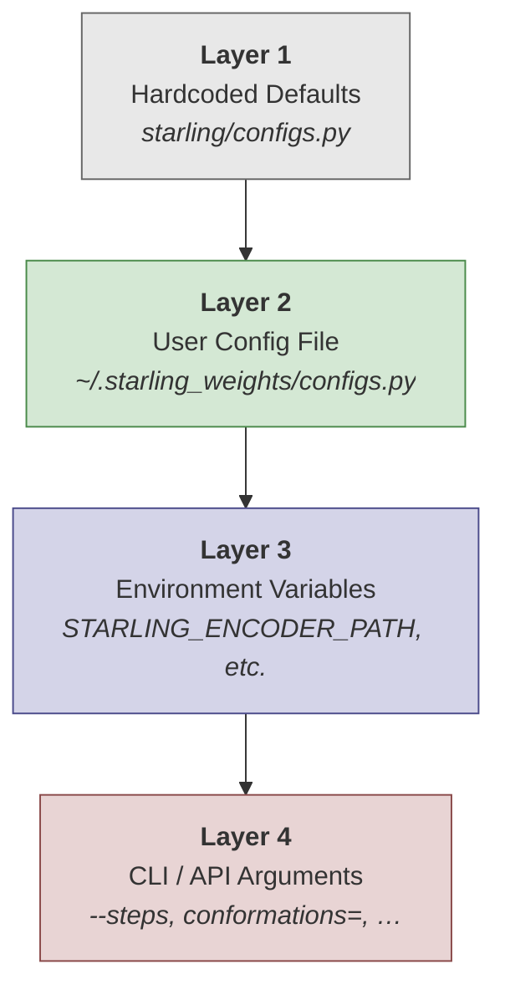
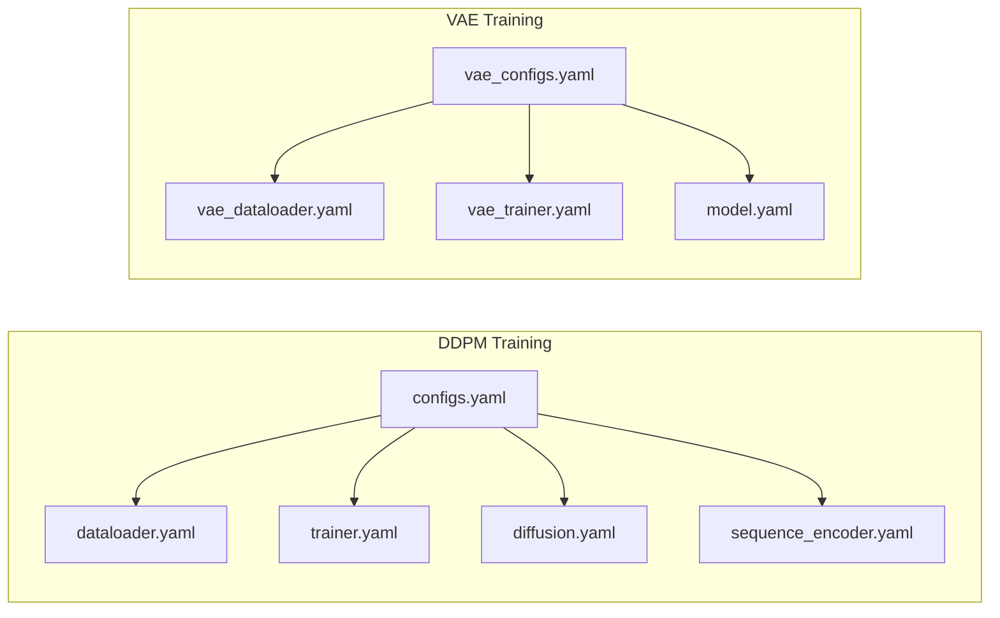

Starling's configuration system operates across **three tiers** — hardcoded defaults, a user-level override file, and environment variables — each with increasing priority. Understanding this hierarchy is essential for customizing model paths, inference parameters, and search artifact locations without modifying the installed package.

## Configuration Hierarchy

Starling resolves runtime parameters through a strict precedence chain. Later layers silently override earlier ones, and the system prints a confirmation when a user-config override is applied.



**Layer 1** ships with the package and defines sensible defaults. **Layer 2** is an optional Python file you create in `~/.starling_weights/` — any variable name that matches a Layer 1 symbol is overridden at import time. **Layer 3** uses environment variables (e.g., `STARLING_ENCODER_PATH`) to redirect model weights and search artifacts, which is particularly useful in containerized or CI environments. **Layer 4** — CLI flags or Python API keyword arguments — provides per-call overrides and always wins.

Sources: [configs.py](/starling/configs.py#L1-L69), [ensemble_generation.py](/starling/frontend/ensemble_generation.py#L160-L182)

## Runtime Defaults (Layer 1)

The table below enumerates every configurable constant defined in `starling/configs.py`, its default value, and its purpose.

| Variable | Default | Description |
|---|---|---|
| `DEFAULT_MODEL_DIR` | `~/.starling_weights` | Base directory for downloaded model checkpoints |
| `DEFAULT_ENCODE_WEIGHTS` | `STARLING_v2.0.0_ViT_VAE_2025_10_14.ckpt` | VAE encoder checkpoint filename |
| `DEFAULT_DDPM_WEIGHTS` | `STARLING_v2.0.0_ViT_DDPM_2025_10_14.ckpt` | Diffusion (DDPM) checkpoint filename |
| `DEFAULT_ENCODER_WEIGHTS_PATH` | `STARLING_ENCODER_PATH` env or GitHub release URL | Resolved path or URL for the encoder weights |
| `DEFAULT_DDPM_WEIGHTS_PATH` | `STARLING_DDPM_PATH` env or GitHub release URL | Resolved path or URL for the DDPM weights |
| `DEFAULT_NUMBER_CONFS` | `400` | Conformations generated per sequence |
| `DEFAULT_BATCH_SIZE` | `100` | Sampling batch size |
| `DEFAULT_STEPS` | `30` | Number of denoising diffusion steps |
| `DEFAULT_MDS_NUM_INIT` | `4` | Independent MDS initializations per sequence |
| `DEFAULT_STRUCTURE_GEN` | `"mds"` | 3D reconstruction backend (currently only `mds`) |
| `DEFAULT_IONIC_STRENGTH` | `150` | Ionic strength in mM |
| `DEFAULT_SAMPLER` | `"ddim"` | Diffusion sampler: `"ddim"`, `"ddpm"`, or `"plms"` |
| `MAX_SEQUENCE_LENGTH` | `380` | Maximum residue count; longer sequences are silently skipped |
| `UNET_LABELS_DIM` | `512` | Label-embedding dimension inside the U-Net / ViT denoiser |
| `CONVERT_ANGSTROM_TO_NM` | `10` | Multiplication factor for Å → nm conversion |
| `DEFAULT_CPU_COUNT_MDS` | `min(DEFAULT_MDS_NUM_INIT, os.cpu_count())` | CPU workers for MDS refinement |
| `VALID_AA` | `"ACDEFGHIKLMNPQRSTVWY"` | Canonical 20 amino-acid alphabet |

Sources: [configs.py](/starling/configs.py#L6-L97)

## User Config Override (Layer 2)

You can override any Layer 1 variable by creating a plain Python file at `~/.starling_weights/configs.py`. At import time, `starling` discovers this file, executes it as a module, and copies every matching symbol name into the `starling.configs` namespace. Each override is printed to stdout for transparency.

**Example `~/.starling_weights/configs.py`:**

```python
# Override inference defaults
DEFAULT_NUMBER_CONFS = 1000
DEFAULT_STEPS = 50
DEFAULT_BATCH_SIZE = 200

# Enable PyTorch compilation for faster repeated inference
TORCH_COMPILATION = {
    "enabled": True,
    "options": {
        "mode": "reduce-overhead",
        "fullgraph": True,
        "backend": "inductor",
        "dynamic": None,
    },
}
```

The `load_user_config()` function iterates over `vars(user_config)`, skipping dunder names, and only replaces keys that already exist in `globals()` — misspelled variable names are silently ignored, so verify that the `[Starling Config] Overriding …` message appears for each override you expect.

> [!TIP]
> Because the user config is a regular Python file, you can import helper modules or compute values dynamically (e.g., `DEFAULT_CPU_COUNT_MDS = max(1, os.cpu_count() - 2)`). However, avoid side effects — the file is executed at **import time**, which means any print statements or I/O will run every time `starling` is imported.

Sources: [configs.py](/starling/configs.py#L42-L69)

## Environment Variable Overrides (Layer 3)

Environment variables take precedence over both hardcoded defaults and the user config file for model-weight and search-artifact paths. They are resolved immediately after the user config is loaded.

### Model Weight Paths

| Variable | Overrides | Fallback |
|---|---|---|
| `STARLING_ENCODER_PATH` | `DEFAULT_ENCODER_WEIGHTS_PATH` | GitHub Releases URL for v2.0.0 |
| `STARLING_DDPM_PATH` | `DEFAULT_DDPM_WEIGHTS_PATH` | GitHub Releases URL for v2.0.0 |

Setting these to a local file path or an alternative HTTP URL causes `ModelManager` to load from that location instead of downloading from the official release. When a URL is provided, PyTorch's `hub.download_url_to_file` caches the file under `torch.hub.get_dir()/checkpoints/`.

### Search Artifact Paths

| Variable | Overrides | Fallback |
|---|---|---|
| `STARLING_FAISS_INDEX_PATH` | `DEFAULT_FAISS_INDEX_PATH` | `~/.starling_search/<index_name>` |
| `STARLING_SEQSTORE_PATH` | `DEFAULT_SEQSTORE_DB_PATH` | `~/.starling_search/<seqstore_name>` |
| `STARLING_FAISS_MANIFEST_PATH` | `DEFAULT_FAISS_MANIFEST_PATH` | `~/.starling_search/<manifest_name>` |
| `STARLING_ZENODO_FAISS_URL` | `ZENODO_FAISS_INDEX_URL` | Zenodo record 17342150 |
| `STARLING_ZENODO_SEQSTORE_URL` | `ZENODO_SEQSTORE_URL` | Zenodo record 17342150 |
| `STARLING_ZENODO_MANIFEST_URL` | `ZENODO_MANIFEST_URL` | Zenodo record 17342150 |
| `STARLING_FAISS_INDEX_MD5` | `FAISS_INDEX_MD5` | Hardcoded MD5 digest |
| `STARLING_SEQSTORE_MD5` | `SEQSTORE_MD5` | Hardcoded MD5 digest |
| `STARLING_FAISS_MANIFEST_MD5` | `MANIFEST_MD5` | Hardcoded MD5 digest |

The `ensure_search_artifacts()` function checks whether each artifact exists locally; if missing and `download=True`, it downloads from the configured URL with resume support and optional MD5 verification. Downloads are written to a `.part` temporary file and atomically renamed on success.

Sources: [configs.py](/starling/configs.py#L82-L178), [model_loading.py](/starling/inference/model_loading.py#L21-L46)

## PyTorch Compilation Settings

The `TORCH_COMPILATION` dictionary controls whether `torch.compile` is applied to the diffusion model's ViT denoiser and the VAE decoder after loading. By default compilation is **disabled**.

| Key | Default | Options |
|---|---|---|
| `enabled` | `False` | `True` / `False` |
| `options.mode` | `"default"` | `"default"`, `"reduce-overhead"`, `"max-autotune"` |
| `options.fullgraph` | `True` | `True` / `False` — attempt to compile the entire forward pass as a single graph |
| `options.backend` | `"inductor"` | Any backend accepted by `torch.compile` |
| `options.dynamic` | `None` | `True` / `False` / `None` — handle dynamic tensor shapes |

When enabled, compilation occurs once during `ModelManager.get_models()` and applies the full `options` dict as keyword arguments to `torch.compile`. Subsequent inferences benefit from kernel fusion and reduced Python overhead, but the first call incurs a significant one-time compilation cost.

Sources: [configs.py](/starling/configs.py#L27-L35), [model_loading.py](/starling/inference/model_loading.py#L95-L130)

## Training YAML Configs (Hydra)

The `starling/configs/` directory contains Hydra-composed YAML files used **exclusively during model training**. These are not consulted at inference time — they are packaging artifacts for `starling-vae-train` and `starling-ddpm-train` CLI entry points.

### Composition Structure



### Diffusion Training — `diffusion.yaml`

| Parameter | Default | Description |
|---|---|---|
| `type` | `"discrete"` | Diffusion type (only `discrete` supported) |
| `discrete.beta_scheduler` | `"cosine"` | Noise schedule |
| `discrete.timesteps` | `1000` | Training diffusion timesteps |
| `discrete.set_lr` | `0.0001` | Learning rate |
| `discrete.config_scheduler` | `"CosineAnnealingLR"` | LR scheduler |
| `discrete.min_snr_loss` | `False` | Whether to use min-SNR weighting |
| `discrete.min_snr_gamma` | `5.0` | Gamma for min-SNR loss |

### Sequence Encoder — `sequence_encoder.yaml`

| Parameter | Default | Description |
|---|---|---|
| `num_layers` | `12` | Transformer encoder layers |
| `embed_dim` | `512` | Embedding dimension |
| `num_heads` | `8` | Multi-head attention heads |

### VAE Model — `vae_model/model.yaml`

| Parameter | Default | Description |
|---|---|---|
| `model_type` | `"Resnet18"` | Encoder architecture |
| `in_channels` | `1` | Input channels (grayscale distance maps) |
| `latent_dim` | `1` | Latent distribution dimensionality parameter |
| `dimension` | `384` | Latent space dimension |
| `loss_type` | `"nll"` | Reconstruction loss |
| `KLD_weight` | `1e-6` | KL-divergence loss weight |
| `KLD_warmup_fraction` | `0` | Fraction of epochs for KLD warm-up |
| `KLD_scheduler_type` | `"cyclical"` | KLD annealing schedule |
| `set_lr` | `0.00001` | Learning rate |
| `optimizer` | `"Adam"` | Optimizer |
| `norm` | `"instance"` | Normalization type |
| `base` | `64` | Base channel count |
| `compile_mode` | `"max-autotune-no-cudagraphs"` | `torch.compile` mode for training |

### Trainer — `trainer.yaml` / `vae_trainer.yaml`

| Parameter | Trainer Default | VAE Trainer Default | Description |
|---|---|---|---|
| `cuda` | `1` | `1` | Number of GPUs |
| `num_nodes` | `1` | `1` | Distributed nodes |
| `num_workers` | `8` | `8` | DataLoader workers |
| `num_epochs` | `50` | `1` | Training epochs |
| `gradient_clip_val` | `1.0` | `1.0` | Gradient clipping |
| `precision` | `"bf16-mixed"` | `"bf16-mixed"` | Mixed-precision mode |
| `output_path` | `"20mM_model"` | `"ionic-strength-model"` | Checkpoint output directory |
| `fine_tune` | `False` | `True` | Resume from checkpoint |
| `checkpoint` | `null` | path to `.ckpt` | Checkpoint to resume from |

### Dataloader — `dataloader.yaml` / `vae_dataloader.yaml`

| Parameter | DDPM Default | VAE Default | Description |
|---|---|---|---|
| `type` | `"tar"` | `"tar"` | Dataset format: `"tar"` or `"h5"` |
| `tar.batch_size` | `64` | `16` | Per-GPU batch size |
| `tar.num_workers` | `8` | `8` | DataLoader workers |
| `tar.prefetch_factor` | `4` | `4` | Prefetch multiplier |
| `tar.train_size` | `null` | `11_420_000` | Estimated training set size |
| `tar.val_size` | `null` | `2_450_000` | Estimated validation set size |

Sources: [configs.yaml](/starling/configs/configs.yaml#L1-L8), [diffusion.yaml](/starling/configs/diffusion/diffusion.yaml#L1-L12), [sequence_encoder.yaml](/starling/configs/sequence_encoder/sequence_encoder.yaml#L1-L3), [model.yaml](/starling/configs/vae_model/model.yaml#L1-L17), [trainer.yaml](/starling/configs/trainer/trainer.yaml#L1-L12), [vae_trainer.yaml](/starling/configs/trainer/vae_trainer.yaml#L1-L12), [dataloader.yaml](/starling/configs/dataloader/dataloader.yaml#L1-L16), [vae_dataloader.yaml](/starling/configs/dataloader/vae_dataloader.yaml#L1-L18)

## CLI Argument Mapping

The `starling` CLI exposes the most commonly adjusted inference parameters as flags. Each flag's default is pulled from `starling.configs`, so Layer 2 overrides propagate automatically.

| CLI Flag | Config Variable | API Parameter | Default |
|---|---|---|---|
| `-c / --conformations` | `DEFAULT_NUMBER_CONFS` | `conformations` | `400` |
| `-s / --steps` | `DEFAULT_STEPS` | `steps` | `30` |
| `-b / --batch_size` | `DEFAULT_BATCH_SIZE` | `batch_size` | `100` |
| `-d / --device` | *(auto-detect)* | `device` | `None` |
| `--num-cpus` | `DEFAULT_CPU_COUNT_MDS` | `num_cpus_mds` | `min(4, cpu_count)` |
| `--num-mds-init` | `DEFAULT_MDS_NUM_INIT` | `num_mds_init` | `4` |
| `--ionic_strength` | `DEFAULT_IONIC_STRENGTH` | `ionic_strength` | `150` |
| `-r / --return_structures` | — | `return_structures` | `False` |
| `-o / --output_directory` | — | `output_directory` | `"."` |
| `--outname` | — | `output_name` | `None` |
| `-v / --verbose` | — | `verbose` | `False` |
| `--disable_progress_bar` | — | `show_progress_bar` | `True` |
| `--info` | — | *(prints config summary and exits)* | — |
| `--version` | — | *(prints version and exits)* | — |

The `--info` flag is particularly useful for debugging: it prints the resolved model-weight paths, key defaults, and the auto-detected device without running inference.

Sources: [starling_main_cli.py](/starling/scripts/starling_main_cli.py#L45-L200), [ensemble_generation.py](/starling/frontend/ensemble_generation.py#L160-L244)

## Amino Acid Mapping Dictionaries

Two lookup tables are exported for residue-code conversion. These are used internally during sequence validation and can be imported directly.

| Dictionary | Key → Value | Example |
|---|---|---|
| `AA_THREE_TO_ONE` | 3-letter → 1-letter | `"ALA" → "A"` |
| `AA_ONE_TO_THREE` | 1-letter → 3-letter | `"A" → "ALA"` |

Both dictionaries cover the 20 canonical residues defined in `VALID_AA`.

Sources: [configs.py](/starling/configs.py#L97-L125)

## Quick Configuration Recipe

Below is a minimal `~/.starling_weights/configs.py` that balances quality and speed for typical IDP ensemble generation:

```python
# Higher-quality ensembles
DEFAULT_NUMBER_CONFS = 800
DEFAULT_STEPS = 50

# Use more parallel MDS jobs if you have the cores
DEFAULT_MDS_NUM_INIT = 8

# Enable torch compilation for repeated inference runs
TORCH_COMPILATION = {
    "enabled": True,
    "options": {
        "mode": "reduce-overhead",
        "fullgraph": True,
        "backend": "inductor",
        "dynamic": None,
    },
}
```

After creating or editing this file, run `starling --info` to confirm that your overrides are active — you should see `[Starling Config] Overriding …` lines for each variable you changed.

For deeper exploration of how these parameters flow through the generative pipeline, see [Architecture Overview](4-architecture-overview) and [Sampling Strategies](8-sampling-strategies). To learn how constraints interact with sampler parameters, refer to [Constraint-Guided Sampling](13-constraint-guided-sampling).