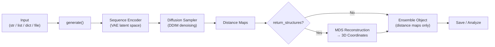

Get from zero to your first intrinsically disordered protein ensemble in under five minutes. This page walks through installation, your first generation run (CLI and Python), and the essential analysis operations you'll use on every `Ensemble` object — nothing more, nothing less.

---

## Installation

STARLING requires **Python ≥ 3.10** and depends on PyTorch. The recommended workflow starts with a fresh conda environment:

```bash
conda create -n starling python=3.11 -y
conda activate starling
pip install idptools-starling
```

Alternatively, install the bleeding-edge version directly from GitHub:

```bash
pip install git+https://github.com/idptools/starling.git
```

Verify the installation succeeded by running the CLI help banner — if it prints, you're ready:

```bash
starling --help
```

> [!TIP]
> On first use STARLING automatically downloads the pre-trained VAE and diffusion model weights (~200 MB) to `~/.starling_weights/`. Subsequent runs reuse the cached weights. Set `STARLING_ENCODER_PATH` and `STARLING_DDPM_PATH` environment variables to override the default download locations.

A Docker image is also available for containerized workflows — see the [Docker documentation](docker/readme.md) for details.

Sources: [README.md](/README.md#L49-L68), [pyproject.toml](/pyproject.toml#L8-L12), [starling/configs.py](/starling/configs.py#L8-L16)

---

## Your First Ensemble (CLI)

The `starling` command-line tool is the fastest path from sequence to ensemble. Pass a raw amino-acid sequence, specify the number of conformations with `-c`, and add `-r` to reconstruct 3D structures:

```bash
starling MDVFMKGLSKAKEGVVAAAEKTKQGVAEAAGKTKEGVLYVGSKTKEGVVHGVATVAEKTKEQVTNVGGAVVTGVTAVAQKTVEGAGSIAAATGFVKKDQLGKNEEGAPQEGILEDMPVDPDNEAYEMPSEEGYQDYEPEA \
  --outname synuclein -c 400 -r
```

This produces three files in the current directory:

| File | Description |
|------|-------------|
| `synuclein.starling` | Binary archive — distance maps + metadata (re-loadable) |
| `synuclein_STARLING.pdb` | PDB topology file for the ensemble |
| `synuclein_STARLING.xtc` | Compressed XTC trajectory with all conformations |

The CLI also accepts `.fasta` files, `.tsv` files (`name<TAB>sequence`), and `.seq.in` files for batch processing. The core flags you'll reach for most often:

| Flag | Default | Purpose |
|------|---------|---------|
| `-c, --conformations` | 400 | Number of conformations to sample |
| `--steps` | 30 | DDIM denoising steps (fewer = faster, less accurate) |
| `-d, --device` | auto | Compute device: `cpu`, `cuda:0`, `mps` |
| `--ionic_strength` | 150 | Solvent ionic strength in mM (20, 150, or 300) |
| `-r, --return_structures` | off | Generate PDB + XTC 3D coordinates |
| `--outname` | auto | Output filename prefix (single sequence only) |
| `-o, --output_directory` | `.` | Directory for output files |

Sources: [README.md](/README.md#L77-L112), [starling/scripts/starling_main_cli.py](/starling/scripts/starling_main_cli.py#L54-L99), [starling/configs.py](/starling/configs.py#L18-L28)

---

## Your First Ensemble (Python)

The Python API mirrors the CLI but gives you live `Ensemble` objects to inspect and analyze programmatically. The two symbols you'll use most are [`generate`](/starling/frontend/ensemble_generation.py#L111-L525) and [`load_ensemble`](/starling/structure/ensemble.py):

```python
from starling import generate, load_ensemble

# Generate an ensemble of 100 conformations at physiological ionic strength
sequence = "MQDRVKRPMNAFIVWSRDQRRKMALENPRMRNSEISKQLGYQWKMLTEAEKWPFFQEAQKLQAMHREKYPNYKYRPRRKAKMLPK"
ensemble = generate(sequence, conformations=100, ionic_strength=150, return_single_ensemble=True)

# Immediately compute biophysical observables
mean_rg = ensemble.radius_of_gyration(return_mean=True)
print(f"Mean Rg: {mean_rg:.2f} Å")

# Persist to disk and reload later
ensemble.save("my_ensemble")
reloaded = load_ensemble("my_ensemble.starling")
```

The `generate` function accepts multiple input formats — a single sequence string, a list of strings, a `{name: sequence}` dictionary, or a path to a FASTA/TSV file. When `return_single_ensemble=True`, it returns a bare `Ensemble` object; otherwise it returns a `dict` keyed by sequence name.



The `generate()` function's most important parameters for everyday use:

| Parameter | Default | Purpose |
|-----------|---------|---------|
| `conformations` | 400 | Number of conformations to sample per sequence |
| `ionic_strength` | 150 | Solvent ionic strength in mM (20, 150, or 300) |
| `steps` | 30 | Number of DDIM denoising steps |
| `device` | auto | `None` selects best available accelerator |
| `return_structures` | `False` | Include 3D coordinate reconstruction |
| `return_single_ensemble` | `False` | Return bare `Ensemble` instead of `dict` |
| `constraint` | `None` | Apply a constraint during sampling |
| `batch_size` | 100 | Batch size for sampling iterations |

> [!TIP]
> Sequences longer than 380 residues are automatically skipped with a warning — this is the current model context window. Sequences with non-canonical residues raise a `ValueError` at input validation time, before any GPU work begins.

Sources: [starling/__init__.py](/starling/__init__.py#L6-L9), [starling/frontend/ensemble_generation.py](/starling/frontend/ensemble_generation.py#L111-L200), [starling/structure/ensemble.py](/starling/structure/ensemble.py#L1-L60), [demos/basic_usage.ipynb](/demos/basic_usage.ipynb)

---

## Analyzing the Ensemble Object

Once you have an `Ensemble`, a suite of analysis methods is available immediately — no extra imports required. All methods that return per-conformation arrays also accept `return_mean=True` for a single scalar, and `use_bme_weights=True` once you've performed BME reweighting.

### Key Analysis Methods

| Method | Returns | Description |
|--------|---------|-------------|
| `radius_of_gyration()` | `ndarray` or `float` | Global Rg for each conformation (Å) |
| `local_radius_of_gyration(start, end)` | `ndarray` or `float` | Rg over a residue sub-region |
| `hydrodynamic_radius()` | `ndarray` or `float` | Rh via Nygaard or Kirkwood-Riseman |
| `end_to_end_distance()` | `ndarray` or `float` | N-to-C distance per conformation (Å) |
| `rij(i, j)` | `ndarray` or `float` | Distance between residues i and j (0-indexed) |
| `distance_maps(return_mean=True)` | `ndarray` | Mean or per-frame distance maps |
| `contact_map(contact_thresh=11)` | `ndarray` | Contact probability map (threshold in Å) |
| `check_for_errors(remove_errors=True)` | `list` | Find & optionally remove physically impossible frames |

### Quick Analysis Example

```python
from starling import generate

ensemble = generate("GS" * 30, conformations=200, return_single_ensemble=True)

# Radius of gyration
all_rg = ensemble.radius_of_gyration()            # array of 200 values
mean_rg = ensemble.radius_of_gyration(return_mean=True)  # single float

# End-to-end distance
ete = ensemble.end_to_end_distance()

# Residue-residue distance (0-indexed: residue 10 → 11th residue)
d_11_51 = ensemble.rij(10, 50)

# Contact map at 12 Å threshold
contacts = ensemble.contact_map(contact_thresh=12.0, return_mean=True)

# Hydrodynamic radius (Nygaard mode by default)
rh = ensemble.hydrodynamic_radius(return_mean=True)
```

### Saving, Loading, and 3D Trajectories

```python
# Save the full .starling archive (distance maps + metadata)
ensemble.save("my_protein")

# Reload from disk
from starling import load_ensemble
reloaded = load_ensemble("my_protein.starling")

# Generate and save a 3D trajectory (PDB topology + XTC)
ensemble.save_trajectory("my_protein")          # .pdb + .xtc
ensemble.save_trajectory("my_protein", pdb_trajectory=True)  # multi-model .pdb only
```

The `.starling` archive is the canonical storage format — it preserves the raw distance maps and all metadata, enabling lossless round-tripping. The PDB/XTC files are derived products for visualization in tools like VMD, PyMOL, or MDAnalysis.

Sources: [starling/structure/ensemble.py](/starling/structure/ensemble.py#L349-L500), [starling/structure/ensemble.py](/starling/structure/ensemble.py#L850-L920), [demos/basic_usage.ipynb](/demos/basic_usage.ipynb)

---

## Choosing Ionic Strength

STARLING's generative model was trained at three solvent conditions. Selecting the one closest to your experimental setup improves physical realism:

| Ionic Strength | Condition | When to Use |
|---------------|-----------|-------------|
| 20 mM | Low salt | Dilute in vitro experiments, NMR at low salt |
| 150 mM | Physiological | Cell-mimicking conditions (default) |
| 300 mM | High salt | Crowded environments, high-salt buffers |

```python
# Low salt ensemble
ensemble_low = generate(sequence, ionic_strength=20, return_single_ensemble=True)

# Physiological (default)
ensemble_phys = generate(sequence, ionic_strength=150, return_single_ensemble=True)

# High salt
ensemble_high = generate(sequence, ionic_strength=300, return_single_ensemble=True)
```

Sources: [starling/configs.py](/starling/configs.py#L25-L26), [demos/basic_usage.ipynb](/demos/basic_usage.ipynb)

---

## Performance at a Glance

STARLING is **very fast on GPUs** (seconds for a typical 140-residue IDR at 400 conformations) and **very fast on Apple Silicon** via the MPS backend. CPU inference runs in minutes rather than seconds — still practical for most use cases. To explicitly select a device:

```python
# Force GPU
ensemble = generate(sequence, device="cuda:0", return_single_ensemble=True)

# Apple Silicon
ensemble = generate(sequence, device="mps", return_single_ensemble=True)

# Explicit CPU
ensemble = generate(sequence, device="cpu", return_single_ensemble=True)
```

For repeat GPU workloads, enable PyTorch compilation to amortize kernel launch overhead:

```python
import starling
starling.set_compilation_options(enabled=True, mode="reduce-overhead")
ensemble = starling.generate(sequence, return_single_ensemble=True)
```

Sources: [README.md](/README.md#L114-L116), [starling/__init__.py](/starling/__init__.py#L23-L77), [starling/configs.py](/starling/configs.py#L30-L39)

---

## Troubleshooting First Run

| Symptom | Cause | Fix |
|---------|-------|-----|
| `starling: command not found` | pip install didn't add to PATH | Use `python -m starling.scripts.starling_main_cli` or reinstall in active env |
| Long download on first `generate()` | Model weights fetching (~200 MB) | Wait; cached in `~/.starling_weights/` after first download |
| `ValueError: Invalid amino acid detected` | Non-canonical residue in sequence | Remove or convert non-standard residues before passing to STARLING |
| `Warning: Sequence … is too long` | Sequence exceeds 380 residues | STARLING's max context is 380; split or trim the sequence |
| `FileNotFoundError` on output | Output directory doesn't exist | Create the directory first or use an existing path |

Sources: [starling/frontend/ensemble_generation.py](/starling/frontend/ensemble_generation.py#L28-L106), [starling/configs.py](/starling/configs.py#L26-L27)

---

## Where to Go Next

You now have a working STARLING installation and can generate + analyze ensembles. Here's the logical progression for deeper exploration:

1. **[CLI Reference](3-cli-reference)** — complete flag reference, batch processing with FASTA/TSV, file conversion tools (`starling2pdb`, `starling2xtc`)
2. **[Architecture Overview](4-architecture-overview)** — understand the three-stage pipeline (encoder → diffusion → MDS reconstruction)
3. **[Ensemble Object API](9-ensemble-object-api)** — full method catalog, BME reweighting, error diagnostics
4. **[Constraint-Guided Sampling](12-constraint-guided-sampling)** — steer ensembles with distance, Rg, or helicity constraints
5. **[BME Reweighting](11-bme-reweighting)** — refine ensembles against experimental observables (SAXS, FRET, NMR)

If you find STARLING useful in your research, please cite:

> Novak, B., Lotthammer, J. M., Emenecker, R. J. & Holehouse, A. S. **Accurate predictions of disordered protein ensembles with STARLING.** *Nature* **652**, 240–250 (2026).
