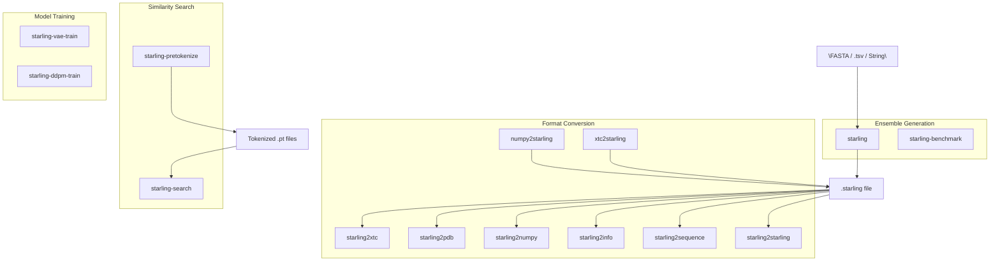
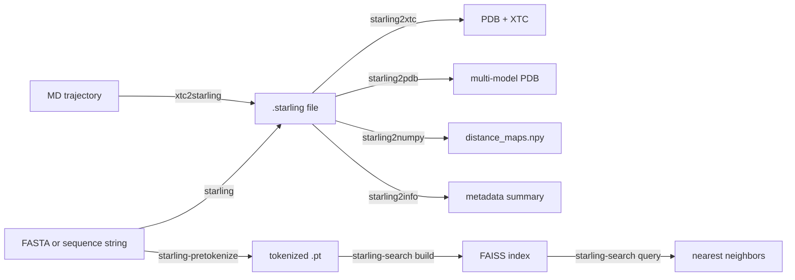

Starling provides a suite of command-line tools that cover the full lifecycle of intrinsically disordered protein ensemble generation — from sequence input through conformational sampling, format conversion, similarity search, and performance benchmarking. Every CLI command is installed automatically when you `pip install idptools-starling` and is defined as a console script entry point in the project configuration. This page documents each command's purpose, arguments, and typical usage patterns.

Sources: [pyproject.toml](/pyproject.toml#L50-L66)

## Command Overview

The Starling CLI is organized into **four functional groups**: ensemble generation, format conversion, similarity search, and model training. The diagram below shows how these groups relate to one another and to the core data formats.



| Group | Command | Purpose |
|---|---|---|
| **Generation** | `starling` | Generate IDP conformational ensembles from sequence |
| **Generation** | `starling-benchmark` | Benchmark runtime and output quality |
| **Conversion** | `starling2xtc` | `.starling` → PDB topology + XTC trajectory |
| **Conversion** | `starling2pdb` | `.starling` → multi-model PDB |
| **Conversion** | `starling2numpy` | `.starling` → NumPy distance map array |
| **Conversion** | `starling2info` | Display `.starling` ensemble metadata |
| **Conversion** | `starling2sequence` | Print sequence from `.starling` to stdout |
| **Conversion** | `starling2starling` | Repair or error-check a `.starling` file |
| **Conversion** | `numpy2starling` | Legacy NumPy array → `.starling` (backwards compat) |
| **Conversion** | `xtc2starling` | XTC trajectory → `.starling` |
| **Search** | `starling-search` | Build & query FAISS similarity indexes |
| **Search** | `starling-pretokenize` | Pre-tokenize FASTA for index building |
| **Training** | `starling-vae-train` | Train the VAE sequence encoder |
| **Training** | `starling-ddpm-train` | Train the diffusion denoising model |

Sources: [pyproject.toml](/pyproject.toml#L50-L66)

---

## `starling` — Ensemble Generation

This is the **primary command** for generating conformational ensembles. It accepts a protein sequence (or a file containing sequences), runs the full generative pipeline (VAE encoding → diffusion sampling → MDS reconstruction), and writes the result as a `.starling` file.

### Input Formats

The `user_input` positional argument is flexible — it can be any of the following:

| Input Type | Example | Notes |
|---|---|---|
| **FASTA file** | `sequences.fasta` | Parsed with `protfasta`; duplicate names cause an error |
| **TSV / seq.in file** | `seqs.tsv` or `seqs.in` | Tab-separated `name\tsequence` lines |
| **Raw sequence string** | `"MDVFMKGLSK"` | Single sequence passed inline |

### Arguments

| Flag | Type | Default | Description |
|---|---|---|---|
| `user_input` | str | *(required)* | Sequence, FASTA path, or TSV path |
| `-c` / `--conformations` | int | 400 | Number of conformations to generate |
| `-d` / `--device` | str | auto-detect | Compute device (`cpu`, `cuda`, `mps`) |
| `-s` / `--steps` | int | 30 | Diffusion model sampling steps |
| `-b` / `--batch_size` | int | 100 | Sampling batch size |
| `-o` / `--output_directory` | str | `.` | Output directory |
| `--outname` | str | None | Custom output filename prefix (single sequence only) |
| `-r` / `--return_structures` | flag | False | Generate 3D coordinates (PDB + XTC) |
| `--num-cpus` | int | min(4, cpu_count) | Max CPUs for MDS reconstruction |
| `--num-mds-init` | int | 4 | Parallel MDS jobs (match `--num-cpus` for best performance) |
| `--ionic_strength` | int | 150 | Ionic strength in mM |
| `--disable_progress_bar` | flag | off | Suppress the progress bar |
| `-v` / `--verbose` | flag | off | Enable verbose logging |
| `--info` | flag | off | Print configuration info and exit |
| `--version` | flag | off | Print version and exit |

### Examples

```bash
# Generate 400 conformations from a raw sequence
starling "MDVFMKGLSKAKEGVVAAAEKTKQGVAEAAG" -o ./output

# Generate 1000 conformations with 3D structure output
starling sequences.fasta -c 1000 -r -o ./ensembles

# Check Starling configuration and model paths
starling --info
```

> [!TIP]
> For fastest generation, set `--num-mds-init` equal to `--num-cpus`. Each MDS job is independent, so parallelizing across all available cores avoids the single-thread bottleneck of distance-map-to-coordinate reconstruction.

Sources: [starling_main_cli.py](/starling/scripts/starling_main_cli.py#L37-L197), [configs.py](/starling/configs.py#L14-L25), [ensemble_generation.py](/starling/frontend/ensemble_generation.py#L8-L79)

---

## `starling-benchmark` — Performance Benchmarking

Runs a controlled benchmark of ensemble generation, measuring runtime and mean radius of gyration across varying numbers of conformations. By default, it generates 10 linearly spaced conformations counts between 10 and 1000, with a hardware cooldown between runs.

### Arguments

| Flag | Type | Default | Description |
|---|---|---|---|
| `--device` | str | auto-detect | Compute device |
| `--batch-size` | int | 100 | Sampling batch size |
| `--steps` | int | 30 | Diffusion steps |
| `--sequence` | str | α-synuclein | Protein sequence to benchmark |
| `--cooltime` | int | 20 | Seconds to wait between runs |
| `--single-run` | int | 0 | Run a single benchmark at this conformation count |
| `--compile` | flag | off | Enable `torch.compile` (CUDA only) |

### Output

Benchmark results are saved as CSV files: `runtime_matrix_*.csv` and `rg_matrix_*.csv`, each with columns `[conformations, value]`.

```bash
# Single benchmark: 500 conformations on GPU
starling-benchmark --single-run 500 --device cuda

# Full sweep with compilation enabled
starling-benchmark --compile --device cuda
```

Sources: [starling_main_cli.py](/starling/scripts/starling_main_cli.py#L210-L367)

---

## Format Conversion Commands

Starling uses a custom **`.starling`** archive format (HDF5-based) to store distance maps, metadata, and optional 3D structures. The converter commands below let you transform these archives into standard structural biology formats and vice versa.

### `starling2xtc` — Convert to PDB + XTC

Generates a PDB topology file and an XTC trajectory from a `.starling` ensemble. If 3D structures have not yet been reconstructed, MDS reconstruction is triggered automatically.

| Flag | Type | Default | Description |
|---|---|---|---|
| `input_file` | str | *(required)* | Input `.starling` file |
| `-o` / `--output` | str | `.` | Output path |
| `--device` | str | None | Device for MDS reconstruction |
| `--remove-errors` | flag | off | Remove frames with physically impossible distances |

Sources: [starling_converter.py](/starling/scripts/starling_converter.py#L14-L45)

### `starling2pdb` — Convert to PDB Trajectory

Same as `starling2xtc` but outputs a multi-model PDB file instead of PDB+XTC.

| Flag | Type | Default | Description |
|---|---|---|---|
| `input_file` | str | *(required)* | Input `.starling` file |
| `-o` / `--output` | str | `.` | Output path |
| `--device` | str | None | Device for MDS reconstruction |
| `--remove-errors` | flag | off | Remove frames with physically impossible distances |

Sources: [starling_converter.py](/starling/scripts/starling_converter.py#L48-L80)

### `starling2numpy` — Convert to NumPy Array

Extracts the distance map tensor from a `.starling` file and saves it as a `.npy` file.

| Flag | Type | Default | Description |
|---|---|---|---|
| `input_file` | str | *(required)* | Input `.starling` file |
| `-o` / `--output` | str | `.` | Output path |

Sources: [starling_converter.py](/starling/scripts/starling_converter.py#L83-L103)

### `starling2info` — Display Ensemble Metadata

Prints a summary of the ensemble: number of conformations, generation date, model weight paths, radius of gyration, end-to-end distance, and whether 3D structures are included.

```bash
starling2info my_protein.starling
```

**Example output:**
```
-------------------------------
STARLING Generated ensemble
-------------------------------
Number of conformations     : 400
Generate with STARLING      : 2.0.0
Generate on ....            : Mon Oct 14 10:00:00 2025
Average radius of gyration  : 3.72
Average end-to-end distance : 8.15
Sequence                    : MDVFMKGLSKAKEGVVAAAEKTKQGVAEAAG
Structures?                 : [X] (400 structures)
-------------------------------
```

Sources: [starling_converter.py](/starling/scripts/starling_converter.py#L106-L155)

### `starling2sequence` — Print Sequence

Writes the amino acid sequence associated with a `.starling` file to stdout.

```bash
starling2sequence my_protein.starling
# Output: MDVFMKGLSKAKEGVVAAAEKTKQGVAEAAG
```

Sources: [starling_converter.py](/starling/scripts/starling_converter.py#L158-L175)

### `starling2starling` — Repair / Error-Check

Re-processes a `.starling` file, optionally scanning for erroneous conformations (frames with impossible inter-residue distances) and writing a corrected archive.

| Flag | Type | Default | Description |
|---|---|---|---|
| `input_file` | str | *(required)* | Input `.starling` file |
| `-o` / `--output` | str | `.` | Output path |
| `--error-check` | flag | off | Scan ensemble for issues |
| `--remove-errors` | flag | off | Remove bad conformers and save |
| `--overwrite` | flag | off | Overwrite the input file in-place |

Sources: [starling_converter.py](/starling/scripts/starling_converter.py#L158-L213)

### `numpy2starling` — Legacy NumPy to `.starling`

Converts a previously generated NumPy distance map array into the `.starling` format. **This command exists for backwards compatibility** and will be removed in a future version.

| Flag | Type | Default | Description |
|---|---|---|---|
| `input_file` | str | *(required)* | Input `.npy` file |
| `-s` / `--sequence` | str | None | Amino acid sequence (required unless `-p` provided) |
| `-o` / `--output` | str | `.` | Output path |
| `-x` / `--xtc` | str | None | XTC trajectory file |
| `-p` / `--pdb` | str | None | PDB topology file |
| `--build-structures` | flag | off | Reconstruct 3D ensemble |

Sources: [starling_converter.py](/starling/scripts/starling_converter.py#L216-L305)

### `xtc2starling` — XTC Trajectory to `.starling`

Converts an MD trajectory (XTC + PDB) into a `.starling` ensemble by computing inter-residue distance maps from the trajectory frames.

| Flag | Type | Default | Description |
|---|---|---|---|
| `--xtc` | str | *(required)* | Input XTC trajectory |
| `--pdb` | str | *(required)* | PDB topology file |
| `-o` / `--output` | str | `.` | Output path |

```bash
xtc2starling --xtc simulation.xtc --pdb topology.pdb -o ./converted
```

Sources: [starling_converter.py](/starling/scripts/starling_converter.py#L308-L395)

---

## `starling-search` — Similarity Search

A two-phase CLI for building and querying FAISS-based nearest-neighbor indexes over protein sequence embeddings. Use the `build` subcommand to create an index from pre-tokenized data, and the `query` subcommand to find similar sequences.

### `starling-search build`

Builds a FAISS index from tokenized sequence data. Requires a tokens directory previously created by `starling-pretokenize`.

| Flag | Type | Default | Description |
|---|---|---|---|
| `--root` | str | *(required)* | Root directory for index artifacts |
| `--index` | str | *(required)* | Output FAISS index path |
| `--tokens` | str | *(required)* | Directory of tokenized `.pt` files |
| `--metric` | `cosine` \| `l2` | `cosine` | Distance metric |
| `--sample-size` | int | 655360 | Training sample size for IVF |
| `--nlist` | int | 16384 | Number of IVF cells |
| `--m` | int | 64 | Product quantization sub-quantizers |
| `--nbits` | int | 8 | Bits per PQ sub-code |
| `--nprobe` | int | 16 | Cells to probe at search time |
| `--use-gpu` | flag | on | Enable GPU for index building |
| `--gpu-device` | int | 0 | GPU device index |
| `--opq` | flag | off | Use OPQ rotation |
| `--compress` | flag | off | Compress stored sequences |
| `--shard-regex` | str | None | Regex to filter token shards |
| `--verbose` | flag | on | Verbose logging |

```bash
starling-search build --root /data/starling --tokens /data/tokens --index myindex.faiss
```

Sources: [starling_search.py](/starling/scripts/starling_search.py#L28-L72)

### `starling-search query`

Queries a built FAISS index with one or more protein sequences. If `--index default` is used or the file is missing, Starling automatically downloads and caches the default pre-built index from Zenodo.

| Flag | Type | Default | Description |
|---|---|---|---|
| `--index` | str | `default` | FAISS index path (or `default` to auto-fetch) |
| `--metric` | `cosine` \| `l2` | `cosine` | Distance metric (must match build) |
| `--seq` | str\* | None | Query sequences (pass multiple with repeats) |
| `--k` | int | 10 | Number of nearest neighbors |
| `--nprobe` | int | 64 | Cells to probe |
| `--exclude-exact` | flag | on | Exclude exact matches |
| `--sequence-identity-max` | float | None | Max sequence identity filter |
| `--identity-denominator` | str | `query` | Identity denominator: `query`, `target`, `max`, `min`, `avg` |
| `--max-cosine-similarity` | float | None | Max cosine similarity threshold |
| `--min-l2-distance` | float | None | Min L2 distance threshold |
| `--length-min` | int | None | Minimum target sequence length |
| `--length-max` | int | None | Maximum target sequence length |
| `--rerank` | flag | on | Enable re-ranking with structure-aware comparison |
| `--rerank-ionic-strength` | int | None | Ionic strength for re-ranking |
| `--device` | str | `cuda:0` | Compute device |
| `--batch-size` | int | 256 | Embedding batch size |
| `--ionic-strength` | int | 150 | Ionic strength for embeddings (mM) |
| `--out` | str | `nearest_neighbors` | Output basename (extension auto-set) |
| `--out-format` | `csv` \| `jsonl` | `csv` | Output format |
| `--verbose` | flag | on | Verbose logging |

```bash
# Query the default index for two sequences
starling-search query --seq "MDVFMKGLSKAKEGVV" --seq "MSTESDQLV" --k 20 --out results

# Query with re-ranking and sequence identity filter
starling-search query --index myindex.faiss --seq "MDVFMKGLSK" \
  --k 50 --rerank --sequence-identity-max 0.8 --out-format jsonl
```

**Query output columns** (CSV/JSONL): `query_index`, `query_seq`, `rank`, `gid`, `score`, `similarity`, `header`, `length`, `sequence`. A companion `.fasta` file with hit sequences is also written.

> [!TIP]
> Use `--index default` on first run to let Starling auto-download the pre-built search index (~GB-scale) from Zenodo. Subsequent queries will use the cached copy at `~/.starling_search/`. Set environment variables `STARLING_FAISS_INDEX_PATH` and `STARLING_SEQSTORE_PATH` to override cache locations.

Sources: [starling_search.py](/starling/scripts/starling_search.py#L74-L112), [starling_search.py](/starling/scripts/starling_search.py#L230-L337), [configs.py](/starling/configs.py#L157-L208)

---

## `starling-pretokenize` — FASTA Pre-Tokenization

Tokenizes FASTA protein sequence files using Starling's sequence encoder, producing `.pt` tensor files required by `starling-search build`. Supports parallel processing across multiple workers.

| Flag | Type | Default | Description |
|---|---|---|---|
| `fastas` | str\* | None | Input FASTA file paths |
| `--sequences` | str | None | Text file listing absolute FASTA paths (one per line) |
| `-o` / `--output` | str | *(required)* | Output directory |
| `--combined` | flag | off | Write all entries into a single combined `.pt` file |
| `--prefix` | str | `pretokenized` | Combined output filename prefix |
| `--workers` | int | 1 | Parallel worker processes |
| `--no-progress` | flag | off | Disable progress bars |

```bash
# Tokenize individual FASTA files
starling-pretokenize uniprot_sprot.fasta swissprot.fasta -o ./tokens

# Tokenize from a path list file, combined output, 4 workers
starling-pretokenize --sequences fasta_list.txt -o ./tokens --combined --prefix all_seqs --workers 4
```

**Output**: Per-FASTA `<basename>.tokens.pt` files (or a single `<prefix>.pt` with `--combined`), each containing a list of `{header, sequence, tokenized}` dictionaries.

Sources: [starling_pretokenize.py](/starling/scripts/starling_pretokenize.py#L1-L126)

---

## Training Commands

These commands are intended for **advanced users** who want to retrain or fine-tune Starling's neural network components. Both use Hydra configuration and PyTorch Lightning, with optional Weights & Biases logging.

### `starling-vae-train` — Train VAE Encoder

Trains the Vision Transformer VAE that encodes protein sequences into latent representations. Configuration is managed via Hydra YAML files.

```bash
starling-vae-train  # uses default Hydra config from starling/training/config.yaml
```

Sources: [pyproject.toml](/pyproject.toml#L50-L51), [vae_train.py](/starling/training/vae_train.py#L1-L50)

### `starling-ddpm-train` — Train Diffusion Model

Trains the ViT-based diffusion denoising model that generates distance maps conditioned on VAE latent vectors. Also configured via Hydra.

```bash
starling-ddpm-train  # uses default Hydra config
```

Sources: [pyproject.toml](/pyproject.toml#L52), [diffusion_train.py](/starling/training/diffusion_train.py#L1-L50)

---

## Default Configuration Values

The following table summarizes the built-in defaults that govern CLI behavior. All values can be overridden by creating a `~/.starling_weights/configs.py` file or by setting the corresponding environment variables.

| Parameter | Default | Environment Override |
|---|---|---|
| Model directory | `~/.starling_weights/` | — |
| VAE weights | `STARLING_v2.0.0_ViT_VAE_2025_10_14.ckpt` | `STARLING_ENCODER_PATH` |
| DDPM weights | `STARLING_v2.0.0_ViT_DDPM_2025_10_14.ckpt` | `STARLING_DDPM_PATH` |
| Conformations | 400 | — |
| Batch size | 100 | — |
| Diffusion steps | 30 | — |
| MDS init jobs | 4 | — |
| Ionic strength | 150 mM | — |
| Max sequence length | 380 residues | — |
| Default sampler | DDIM | — |
| Search index dir | `~/.starling_search/` | `STARLING_FAISS_INDEX_PATH` |

Sources: [configs.py](/starling/configs.py#L12-L30), [configs.py](/starling/configs.py#L157-L208)

---

## Quick Reference: Common Workflows

The following flowchart shows the most common CLI workflows from sequence input to final structural output.



**Typical ensemble generation workflow:**
```bash
# Step 1: Generate ensemble
starling my_protein.fasta -c 1000 -r -o ./results

# Step 2: Inspect metadata
starling2info ./results/my_protein.starling

# Step 3: Convert to XTC for downstream analysis
starling2xtc ./results/my_protein.starling -o ./results/my_protein --remove-errors
```

**Typical search workflow:**
```bash
# Step 1: Pre-tokenize a database
starling-pretokenize uniprot.fasta -o ./tokens --combined

# Step 2: Build the index
starling-search build --root ./search --tokens ./tokens --index my_index.faiss

# Step 3: Query with a sequence of interest
starling-search query --index my_index.faiss --seq "MDVFMKGLSKAKEGVVAAAEKTKQGVAEAAG" --k 20
```

To understand what happens inside the `starling` command's generative pipeline, see [Architecture Overview](4-architecture-overview). For details on the `.starling` format and the Ensemble object, see [Ensemble Object API](9-ensemble-object-api).