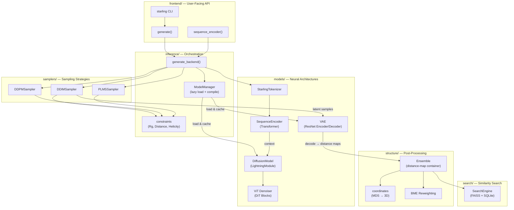

STARLING implements a **latent-space probabilistic denoising diffusion model** for predicting coarse-grained conformational ensembles of intrinsically disordered proteins. The system is architecturally organized as a two-stage generative pipeline — a VAE compresses protein distance maps into a learned latent space, and a conditional diffusion model learns to denoise within that space, guided by sequence-encoded context. This page maps the full system architecture, from the top-level API surface down to the model internals and post-processing subsystems.

Sources: [__init__.py](/starling/__init__.py#L1-L77), [README.md](/README.md#L1-L200)

## System Architecture

The diagram below captures the primary data flow through STARLING, from amino acid sequence input through to 3D structural output. Each labeled node corresponds to a concrete module within the `starling/` package.

Sources: [ensemble_generation.py](/starling/frontend/ensemble_generation.py#L1-L200), [generation.py](/starling/inference/generation.py#L1-L200), [model_loading.py](/starling/inference/model_loading.py#L1-L131)

## Two-Stage Generative Pipeline

STARLING's generative core follows the **latent diffusion** paradigm established by Rombach et al. (2021). The design decouples representation learning (the VAE) from generative modeling (the diffusion process), yielding several practical advantages: the diffusion model operates on a compact 24×24 latent grid rather than the full N×N distance map, the VAE's decoder can be shared across training and inference, and the latent space exhibits smoother manifold geometry that is easier for the denoiser to navigate.

| Stage | Component | Input | Output | Purpose |
|-------|-----------|-------|--------|---------|
| **1 — Encoding** | `SequenceEncoder` | Tokenized amino acid sequence + ionic strength | Context embedding `(B, L, 512)` | Translates protein sequence into conditioning signal for the denoiser |
| **2a — Diffusion** | `DiffusionModel` + `ViT` | Noisy latent + timestep + context | Denoised latent `(B, 1, 24, 24)` | Iteratively removes noise from latent space, conditioned on sequence |
| **2b — Decoding** | `VAE.decoder` | Denoised latent | Distance map `(N, N)` | Maps latent back to full pairwise residue distance space |

The **VAE** (`starling.models.vae.VAE`) uses a ResNet-based encoder/decoder architecture (ResNet18 or ResNet34 variants) with a diagonal Gaussian latent distribution. During training, the ELBO loss combines reconstruction loss (MSE or NLL) with a Kullback-Leibler divergence regularizer, whose weight is controlled by a cyclical or linear warmup schedule via `KLDWeightScheduler`. The **diffusion model** (`starling.models.diffusion.DiffusionModel`) wraps a `ViT` denoiser within a PyTorch Lightning module, managing the full forward/noise schedule (cosine, linear, or sigmoid β-schedules) and registering all diffusion process buffers (α, ᾱ, posterior variance) as model buffers.

Sources: [vae.py](/starling/models/vae.py#L1-L200), [diffusion.py](/starling/models/diffusion.py#L1-L200), [vit.py](/starling/models/vit.py#L1-L123)

## Sequence Encoder & Tokenization

The `StarlingTokenizer` provides a fast, byte-level translation table mapping the 20 canonical amino acids to integer IDs (1–20, with 0 reserved for padding). It avoids regex or dictionary lookups entirely, using Python's `bytes.translate()` for both encoding and decoding. The `SequenceEncoder` is a 12-layer Transformer encoder (embed dim 512, 8 attention heads) that consumes tokenized sequences and produces per-residue embeddings. These embeddings serve as the **cross-attention context** for the ViT denoiser at every denoising step, anchoring the generative process to the specific protein sequence.

Ionic strength conditioning (20, 150, or 300 mM) is injected alongside the sequence tokens, allowing the model to modulate its predictions based on solvent conditions — a critical factor for disordered proteins whose conformational ensembles are highly sensitive to electrostatic screening.

Sources: [tokenizer.py](/starling/data/tokenizer.py#L1-L94), [transformer.py](/starling/models/transformer.py#L1-L200)

## ViT Denoiser Architecture

The denoiser (`starling.models.vit.ViT`) is a **Vision Transformer** operating on the 24×24 latent grid. Its architecture follows the **Diffusion Transformer (DiT)** design pattern: the latent is patchified (default patch size 3), projected into token embeddings with learned positional encodings, and processed through 12 `DiTBlock` layers that each apply **adaptive layer normalization** (AdaLN) conditioned on the timestep, plus **cross-attention** against the sequence encoder's context.

The forward pass applies: (1) a `Conv2d` stem to lift the single-channel latent to 64 channels, (2) patch embedding via `PatchEmbed`, (3) timestep-dependent scale/shift modulation (adaptive normalization), (4) 12 DiT blocks with self-attention and cross-attention to sequence context, (5) linear projection back to patch tokens, and (6) a final `Conv2d` to produce a single-channel residual prediction. This architecture replaces the U-Net denoiser common in earlier diffusion models, offering superior scaling behavior and more uniform compute across spatial resolutions.

Sources: [vit.py](/starling/models/vit.py#L1-L123), [attention.py](/starling/models/attention.py#L1-L100)

## Sampling Strategies

STARLING provides three samplers, each implementing a different trajectory through the diffusion process:

| Sampler | Module | Speed | Stochasticity | Key Characteristic |
|---------|--------|-------|---------------|-------------------|
| **DDIM** | `samplers.ddim_sampler` | ★★★ Fast | Deterministic (η=0) | Non-Markovian process; generates in far fewer steps than training timesteps |
| **DDPM** | `samplers.ddpm_sampler` | ★ Slow | Stochastic | Full Markov chain; matches training objective exactly |
| **PLMS** | `samplers.plms_sampler` | ★★ Moderate | Pseudo-linear | Pseudo Linear Multi-Step; better than DDIM for some distributions |

All three samplers share a common interface: they accept a `DiffusionModel`, a `VAE` encoder, and a conditioning sequence, and they return decoded distance maps. **DDIM** is the default sampler (30 steps by default) and is recommended for production use due to its 10–100× speed advantage over DDPM. All samplers support **constraint-guided sampling** — when a `Constraint` object is provided, the sampler applies gradient-based guidance during the denoising trajectory to steer generated conformations toward satisfying the constraint.

Sources: [ddim_sampler.py](/starling/samplers/ddim_sampler.py#L1-L200), [ddpm_sampler.py](/starling/samplers/ddpm_sampler.py#L1-L80), [plms_sampler.py](/starling/samplers/plms_sampler.py#L1-L80)

## Ensemble Object & Structure Reconstruction

The `Ensemble` class (`starling.structure.ensemble.Ensemble`) is the central data container throughout STARLING. It wraps a `(n_conformations, n_residues, n_residues)` numpy array of symmetrized distance maps and the corresponding amino acid sequence, providing lazy, cached computation of derived observables:

- **Radius of gyration** (Rg) and **hydrodynamic radius** (Rh)
- **End-to-end distance**
- **Contact maps** at configurable distance thresholds
- **3D coordinate trajectories** via multidimensional scaling (MDS)
- **BME reweighting** results (cached)

3D coordinate reconstruction (`starling.structure.coordinates`) converts distance maps to Cartesian coordinates through a two-phase approach: **sklearn MDS** provides initial coordinates, followed by **PyTorch gradient descent** refinement that minimizes the MSE between the target and reconstructed pairwise distances. Multiple parallel MDS initializations (default 4) are run to avoid local minima. The resulting trajectories are represented as SOURSOP `SSProtein` objects and can be exported as PDB topology + XTC trajectory files.

Sources: [ensemble.py](/starling/structure/ensemble.py#L1-L200), [coordinates.py](/starling/structure/coordinates.py#L1-L200)

## Constraint-Guided Sampling

The constraint system (`starling.inference.constraints`) enables steering the diffusion process toward conformations that satisfy experimental or structural requirements. Three constraint types are provided:

| Constraint | Class | Observable | Guidance Mode |
|------------|-------|------------|---------------|
| **Radius of Gyration** | `RgConstraint` | ⟨Rg⟩ | Gradient-based latent perturbation |
| **Distance** | `DistanceConstraint` | d(i, j) for specific residue pairs | Gradient-based latent perturbation |
| **Helicity** | `HelicityConstraint` | Fraction helical residues | Gradient-based latent perturbation |

All constraints inherit from an abstract `Constraint` base class that provides time-dependent scheduling (cosine, bell-shaped), adaptive gradient clipping, and a configurable guidance window (`guidance_start` / `guidance_end`) that controls when during the denoising process the constraint is applied. The `ConstraintLogger` tracks constraint satisfaction across denoising steps for diagnostics.

Sources: [constraints.py](/starling/inference/constraints.py#L1-L200)

## BME Reweighting

Bayesian Maximum Entropy reweighting (`starling.structure.bme`) provides a principled framework for integrating experimental observables (SAXS, FRET, NMR, etc.) into the ensemble. The `BME` optimizer reweights individual conformations to minimize relative entropy (KL divergence from the uniform prior) subject to matching experimental constraints, which can be **equality** (match within uncertainty), **upper bound**, or **lower bound** constraints. Results are cached within the `Ensemble` object and automatically propagate through all downstream observable calculations when `use_bme_weights=True` is specified.

Sources: [bme.py](/starling/structure/bme.py#L1-L100)

## Model Management & Compilation

The `ModelManager` singleton (`starling.inference.model_loading.ModelManager`) implements **lazy loading** with caching — models are loaded from disk (or downloaded from GitHub Releases) on first access and reused across subsequent calls. This is critical for batch workflows where `generate()` is called repeatedly. The manager also supports **PyTorch compilation** via `torch.compile()`, which is disabled by default but can be enabled programmatically through `starling.set_compilation_options()`. When compilation is active, the ViT denoiser and VAE decoder are compiled (typically with the `inductor` backend), providing significant inference speedups on CUDA at the cost of a one-time compilation overhead.

Model weights default to downloading from GitHub Releases URLs but can be overridden via environment variables (`STARLING_ENCODER_PATH`, `STARLING_DDPM_PATH`) or a local `~/.starling_weights/` directory.

Sources: [model_loading.py](/starling/inference/model_loading.py#L1-L131), [configs.py](/starling/configs.py#L1-L200)

## Similarity Search

The search subsystem (`starling.search`) provides high-performance **approximate nearest neighbor (ANN)** search over protein embedding space, built on FAISS indices with SQLite-backed sequence metadata. The `SearchEngine` supports multi-level filtering (cosine similarity bounds, sequence length gating, exact match exclusion, sequence identity thresholds), exact reranking of top-k candidates using the full encoder, and batch query processing. Pre-built indices are hosted on Zenodo and cached locally under `~/.starling_search/`.

Sources: [search_engine.py](/starling/search/search_engine.py#L1-L80), [configs.py](/starling/configs.py#L150-L200)

## Module Map

The table below summarizes every subpackage within `starling/` and its architectural role:

| Subpackage | Role | Key Exports |
|------------|------|-------------|
| `frontend/` | High-level API surface | `generate()`, `sequence_encoder()`, `handle_input()` |
| `inference/` | Orchestration, model loading, constraints | `ModelManager`, `generate_backend()`, `Constraint` subclasses |
| `models/` | Neural network architectures | `VAE`, `DiffusionModel`, `ViT`, `SequenceEncoder`, attention modules |
| `samplers/` | Diffusion sampling strategies | `DDIMSampler`, `DDPMSampler`, `PLMSSampler` |
| `data/` | Tokenization, dataloading, schedules | `StarlingTokenizer`, `DiagonalGaussianDistribution`, β-schedules |
| `structure/` | Ensemble representation & post-processing | `Ensemble`, `BME`, coordinate reconstruction |
| `search/` | FAISS similarity search | `SearchEngine`, `CandidateFilter` subclasses |
| `training/` | Training loops | `diffusion_train`, `vae_train` |
| `scripts/` | CLI entry points | `starling_main_cli`, `starling_converter`, `starling_search` |
| `configs/` | YAML configuration files | Model, dataloader, trainer, diffusion configs |

> [!TIP]
> When using STARLING in batch workflows, call `generate()` once per sequence but rely on the `ModelManager` singleton to avoid re-loading weights. For maximum GPU throughput, enable compilation with `starling.set_compilation_options(enabled=True, mode="reduce-overhead")` — the one-time compilation cost amortizes quickly over many inferences.

> [!TIP]
> The `Ensemble` object computes all observables lazily and caches results. If you modify distance maps after construction, call the relevant methods with `force_recompute=True` or construct a new `Ensemble` to avoid stale cache hits.

Sources: [__init__.py](/starling/__init__.py#L1-L77), [configs.py](/starling/configs.py#L1-L200)

## Where to Go Next

The architecture overview maps the terrain — the following pages descend into each subsystem in detail, following the generative pipeline's natural order:

1. **[Sequence Encoder](5-sequence-encoder)** — How tokenization and the Transformer encoder produce sequence context embeddings
2. **[VAE Latent Space](6-vae-latent-space)** — The ResNet VAE architecture, KL scheduling, and latent space geometry
3. **[Diffusion Model Design](7-diffusion-model-design)** — The DiffusionModel Lightning module, noise schedules, and training objective
4. **[Sampling Strategies](8-sampling-strategies)** — DDIM, DDPM, and PLMS sampler internals and performance trade-offs
5. **[Ensemble Object API](9-ensemble-object-api)** — The `Ensemble` class API, lazy computation, and serialization
6. **[Constraint-Guided Sampling](13-constraint-guided-sampling)** — How constraints steer the denoising trajectory
7. **[Vision Transformer Denoiser](14-vision-transformer-denoiser)** — DiT blocks, AdaLN, patch embedding, and cross-attention details