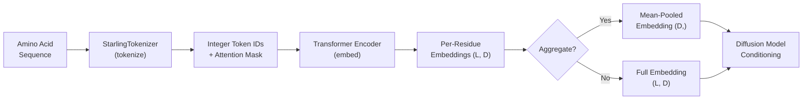
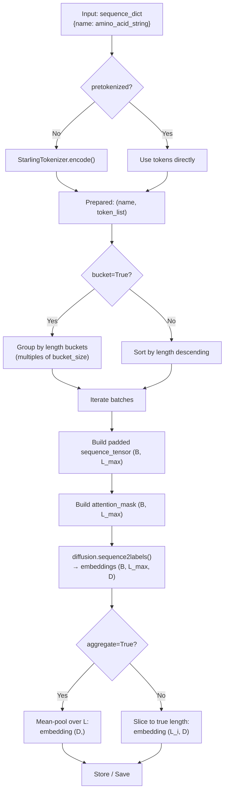

The **Sequence Encoder** is the component that transforms raw amino acid sequences into continuous vector representations (embeddings) that condition STARLING's latent diffusion model. It sits at the very first stage of the generative pipeline — before the VAE latent space and before diffusion sampling — translating discrete biological sequences into the mathematical objects the denoiser requires. Understanding this component is essential for anyone who wants to reason about how sequence information flows into generated distance maps and, ultimately, into 3D structural ensembles.

## Architectural Role

The sequence encoder occupies a precise position in STARLING's generative pipeline: it is the **sole bridge** between discrete amino acid sequences and the continuous conditioning signal fed to the denoising network. Without it, the diffusion model would have no sequence-specific information to guide its denoising trajectory, and every generated structure would be unconditionally sampled from the learned prior — biologically meaningless.



The encoder is owned by the `DiffusionModel` as `self.sequence_encoder` and invoked through the `sequence2labels` method, which simply delegates to the encoder's forward pass with the tokenized sequences, their attention mask, and the ionic strength conditioning scalar.

Sources: [diffusion.py](starling/models/diffusion.py#L55-L137), [diffusion.py](starling/models/diffusion.py#L228-L251)

## Tokenization: From Residues to Integers

Before the transformer can operate, amino acid sequences must be converted into integer token IDs. This is the responsibility of `StarlingTokenizer`, a lightweight, byte-level tokenizer that maps the 20 standard amino acids to the integer range `[1, 20]`, with `0` reserved for padding.

| Amino Acid | Token ID | Amino Acid | Token ID | Amino Acid | Token ID |
|:----------:|:--------:|:----------:|:--------:|:----------:|:--------:|
| A (Ala)    | 1        | G (Gly)    | 6        | P (Pro)    | 13       |
| C (Cys)    | 2        | H (His)    | 7        | Q (Gln)    | 14       |
| D (Asp)    | 3        | I (Ile)    | 8        | R (Arg)    | 15       |
| E (Glu)    | 4        | K (Lys)    | 9        | S (Ser)    | 16       |
| F (Phe)    | 5        | L (Leu)    | 10       | T (Thr)    | 17       |
| —          | —        | M (Met)    | 11       | V (Val)    | 18       |
| —          | —        | N (Asn)    | 12       | W (Trp)    | 19       |
| —          | —        | —          | —        | Y (Tyr)    | 20       |

The tokenizer is optimized for bulk processing using Python's `bytes.translate` — a C-level lookup table that maps each ASCII byte to its vocabulary ID in a single pass. This avoids per-character Python loops and is significantly faster for long sequences or large batches. Decoding uses the same table-driven approach, stripping padding tokens (`0`) before reverse translation. Unknown characters raise a `KeyError` at the position where they occur.

```python
from starling.data.tokenizer import StarlingTokenizer

tok = StarlingTokenizer()
ids = tok.encode("ACDE")   # [1, 2, 3, 4]
seq = tok.decode(ids)       # "ACDE"
```

> [!TIP]
> Non-canonical residues (B, J, O, U, X, Z) are **not** in the vocabulary and will raise `KeyError` during encoding. The frontend's `handle_input` validates and filters these before they reach the tokenizer, but if you call the tokenizer directly, you must ensure your sequences contain only the 20 standard amino acids.

Sources: [tokenizer.py](starling/data/tokenizer.py#L1-L94)

## The Transformer Encoder Architecture

The sequence encoder is a **Transformer encoder** that processes tokenized sequences through stacked self-attention and feed-forward layers. Its key architectural elements, defined in `starling/models/transformer.py`, include:

- **Self-Attention** (`MultiHeadAttention`): Captures pairwise residue relationships across the full sequence, enabling the encoder to learn long-range dependencies critical for protein structure.
- **GeGLU Feed-Forward** (`GeGLU` + `Linear`): A gated activation variant where the output is `x * GELU(gate)`, providing richer gradient flow than standard ReLU-based feed-forward layers.
- **Adaptive Layer Normalization** (`AdaLayerNorm`): Injects conditioning information (ionic strength + timestep) by generating dynamic scale (γ) and shift (β) parameters from the conditioning vector, rather than using static learned parameters.
- **Sinusoidal Positional Embeddings** (`SinusoidalPosEmb`): Encodes positional information using sine and cosine functions with a configurable base frequency θ, allowing the model to distinguish residues by position.

The encoder takes three inputs during its forward pass:

| Input | Shape | Description |
|-------|-------|-------------|
| `sequences` | `(B, L)` | Batch of token ID sequences (integers 0–20) |
| `sequence_mask` | `(B, L)` | Boolean attention mask — `True` for real residues, `False` for padding |
| `ionic_strength` | `(1, 1)` | Scalar ionic strength in mM, used as a global conditioning signal |

The output is a tensor of shape `(B, L, D)` where `D` is the embedding dimension — one dense vector per residue per sequence.

Sources: [transformer.py](starling/models/transformer.py#L1-L200), [transformer.py](starling/models/transformer.py#L194-L200)

## The Encoding Pipeline: `sequence_encoder_backend`

The high-level entry point for encoding sequences is `sequence_encoder_backend` in `starling.inference.generation`. This function orchestrates the full pipeline from raw amino acid strings to embedding tensors, handling tokenization, batching, padding, and optional aggregation.

### Step-by-Step Flow



### Key Parameters

| Parameter | Default | Purpose |
|-----------|---------|---------|
| `sequence_dict` | required | Dictionary mapping sequence names to amino acid strings (or pre-tokenized ID lists) |
| `device` | required | Compute device (`"cuda"`, `"cpu"`, `"mps"`) |
| `batch_size` | required | Number of sequences processed per forward pass |
| `ionic_strength` | required | Ionic strength in mM, injected as a conditioning signal to the encoder |
| `pretokenized` | `False` | Skip tokenization — values are already integer token ID collections |
| `bucket` | `False` | Group sequences into coarse length buckets to reduce padding waste |
| `bucket_size` | `32` | Bucket resolution when `bucket=True`; sequences with `L // bucket_size` in the same bucket are batched together |
| `aggregate` | `True` | Mean-pool per-residue embeddings into a single vector per sequence |
| `free_cuda_cache` | `False` | Call `torch.cuda.empty_cache()` after each batch |
| `return_on_cpu` | `True` | Transfer embeddings to CPU before returning |

### Batching and Padding Strategy

Sequences within a batch are padded to the length of the longest sequence in that batch using token `0` (the padding/reserved token). The corresponding attention mask marks real residues as `True` and padding positions as `False`, ensuring the transformer's self-attention ignores padded positions. To minimize wasted computation, sequences are sorted by length in descending order before batching. When `bucket=True`, an additional coarse-grained grouping by length quantile further reduces variance in sequence lengths within each batch — particularly beneficial when processing datasets with broad length distributions.

> [!TIP]
> When encoding large protein sets with highly varied lengths, enable `bucket=True` with an appropriate `bucket_size`. This can reduce padding waste by 30–50% compared to simple length-sorted batching, as sequences of similar length are guaranteed to share batches rather than being interleaved with much longer or shorter sequences.

### Aggregation Modes

The encoder produces per-residue embeddings of shape `(L, D)`. Two modes are available:

- **Aggregated** (`aggregate=True`): Mean-pools across the sequence dimension, producing a single `(D,)` vector per sequence. This is the default and is used when the embedding serves as a global conditioning signal.
- **Per-residue** (`aggregate=False`): Returns the full `(L, D)` tensor, preserving position-specific information. Useful for downstream tasks that require residue-level features such as contact prediction or per-residue similarity search.

Sources: [generation.py](starling/inference/generation.py#L64-L232)

## Integration with the Diffusion Model

The sequence encoder is not called in isolation during normal generation — it is invoked internally by the `DiffusionModel` during both training and inference. The `DiffusionModel.sequence2labels` method is the single point of dispatch:

```python
# Inside DiffusionModel (starling/models/diffusion.py)
def sequence2labels(self, sequences, sequence_mask, ionic_strength):
    encoded = self.sequence_encoder(sequences, sequence_mask, ionic_strength)
    return encoded
```

During **training**, the `p_loss` method calls `sequence2labels` to convert raw sequence tokens into conditioning labels before the denoiser predicts noise. During **inference** (sampling), the same path is followed: the encoded sequence embedding is passed as the `labels` argument to the denoiser's forward pass, steering the reverse diffusion process toward distance maps consistent with the input sequence.

The `sequence_encoder_backend` function provides a standalone interface for computing embeddings without running the full diffusion pipeline — useful for pre-computing embeddings for similarity search, visualization, or transfer learning.

Sources: [diffusion.py](starling/models/diffusion.py#L228-L251), [diffusion.py](starling/models/diffusion.py#L253-L326)

## Ionic Strength Conditioning

A distinctive feature of STARLING's sequence encoder is its **ionic strength conditioning**. The ionic strength (in mM) is passed as an additional scalar input to the encoder, which incorporates it into the adaptive layer normalization mechanism. This allows the encoder to produce sequence representations that are aware of the solution conditions under which the protein exists — critical because ionic strength directly affects electrostatic interactions and, consequently, the ensemble of viable conformations.

The ionic strength tensor is shaped as `(1, 1)` and broadcast during the encoder's forward pass. In the high-level `generate` API, it defaults to `configs.DEFAULT_IONIC_STRENGTH` (150 mM, approximating physiological conditions).

Sources: [generation.py](starling/inference/generation.py#L64-L128), [ensemble_generation.py](starling/frontend/ensemble_generation.py#L160-L245)

## One-Hot Encoding (Legacy)

A separate `one_hot_encode` function exists in `starling.data.data_wrangler` for legacy compatibility. It maps sequences to `(N, L, 21)` one-hot tensors using the same amino acid vocabulary. This function is **not** used in the current generative pipeline — the transformer encoder operates on integer token IDs directly, which are far more memory-efficient and compatible with learned embedding layers.

| Aspect | One-Hot (`data_wrangler`) | Tokenized (`StarlingTokenizer`) |
|--------|---------------------------|----------------------------------|
| Input representation | `(N, L, 21)` float32 | `(N, L)` int64 |
| Memory per residue | 21 × 4 = 84 bytes | 8 bytes |
| Used in pipeline | No (legacy) | Yes (active) |
| Supports batching | Manual padding required | Integrated with attention mask |

Sources: [data_wrangler.py](starling/data/data_wrangler.py#L9-L55)

## Data Flow Summary

The following table traces a single sequence through every transformation from input string to conditioning signal:

| Stage | Input | Output | Component |
|-------|-------|--------|-----------|
| 1. Input validation | Raw string | Cleaned string | `handle_input` |
| 2. Tokenization | `"ACDEFGHIK"` | `[1,2,3,4,5,6,7,8,9]` | `StarlingTokenizer.encode` |
| 3. Padding + Masking | Token list | `(1, L_max)` tensor + `(1, L_max)` bool mask | `sequence_encoder_backend` |
| 4. Transformer encoding | Tokens + mask + ionic | `(1, L_max, D)` embeddings | `DiffusionModel.sequence2labels` |
| 5. Trimming | Padded embeddings | `(1, L, D)` per-residue embeddings | Slice by true length |
| 6. Aggregation | `(1, L, D)` | `(D,)` | Mean-pool (if `aggregate=True`) |

Sources: [generation.py](starling/inference/generation.py#L176-L222), [tokenizer.py](starling/data/tokenizer.py#L63-L76)

---

**Next in the pipeline**: The embeddings produced by the sequence encoder condition the diffusion model's denoising process within the VAE's compressed latent space. Continue reading at [VAE Latent Space](6-vae-latent-space) to understand how distance maps are compressed, or jump to [Diffusion Model Design](7-diffusion-model-design) to see how these embeddings steer the reverse diffusion process.