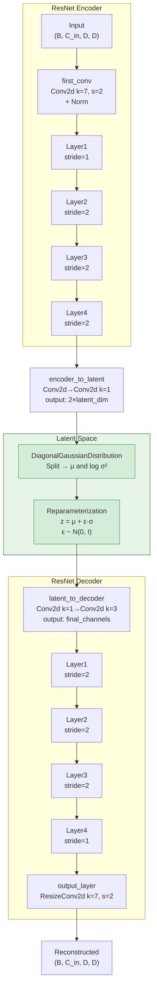

The Variational Autoencoder (VAE) is the first stage of Starling's two-stage generative pipeline, compressing protein distance maps into a structured latent representation that the downstream diffusion model operates within. This latent space is not a flat vector — it is a **spatial feature map** that preserves the 2D geometry of distance maps at reduced resolution, enabling the diffusion model to denoise structure in a compressed, semantically richer space rather than in the raw pixel domain. This design follows the Latent Diffusion Model paradigm (Rombach et al., 2022), where a VAE first learns a perceptually compressed representation and a diffusion model then generates within that compressed space.

Sources: [vae.py](starling/models/vae.py#L86-L151), [vae.py](starling/models/vae.py#L446-L470)

## Architecture Overview

The VAE implements a symmetric **ResNet encoder–decoder** architecture with a diagonal Gaussian latent distribution sandwiched between them. The encoder progressively downsamples the input distance map through four ResNet stages, projects the final feature map into mean and log-variance channels via a bottleneck convolution, and then the reparameterization trick produces a sampled latent tensor. The decoder mirrors this process in reverse, upsampling through four ResNet stages back to the original spatial resolution.

The encoder reduces spatial dimensions by a factor of 2⁴ = 16 (one initial stride-2 convolution plus three stride-2 ResNet layers), so a distance map of size **D × D** produces a latent feature map of size **(D/16) × (D/16)**. The channel count expands from the base width through each stage, following the standard ResNet doubling pattern.

Sources: [vae.py](starling/models/vae.py#L202-L245), [vae_components.py](starling/models/vae_components.py#L13-L105)

## Encoder–Decoder Construction

Both the encoder and decoder are built from the same ResNet block families. The **encoder** uses `ResBlockEncBasic` blocks (expansion=1) with strided convolutions for downsampling, while the **decoder** uses `ResBlockDecBasic` blocks (contraction=1) with `ResizeConv2d` upsampling — which performs nearest-neighbor interpolation followed by convolution to avoid checkerboard artifacts common with `ConvTranspose2d`.

| Architecture | Block Configuration | Encoder Blocks | Decoder Blocks |
|---|---|---|---|
| **ResNet18** | `[2, 2, 2, 2]` | 8 total residual blocks | 8 total residual blocks |
| **ResNet34** | `[3, 4, 6, 3]` | 16 total residual blocks | 16 total residual blocks |

Each encoder stage doubles the channel width (base → 2×base → 4×base → 8×base for Basic blocks), while the decoder reverses this progression. The `base` parameter (default: 64) controls the starting channel count and thus the overall model capacity.

Sources: [vae_components.py](starling/models/vae_components.py#L220-L256), [blocks.py](starling/models/blocks.py#L259-L368)

## Latent Bottleneck Design

The transition between encoder output and latent space — and between latent space and decoder input — is handled by two small convolutional sequences that act as learned projections:

| Layer | Structure | Input Channels | Output Channels | Purpose |
|---|---|---|---|---|
| **encoder_to_latent** | Conv2d(k=3, s=1, p=1) → Conv2d(k=1, s=1) | `final_channels` | `2 × latent_dim` | Project features to μ and log σ² |
| **latent_to_decoder** | Conv2d(k=1, s=1) → Conv2d(k=3, s=1, p=1) | `latent_dim` | `final_channels` | Project sampled z back to decoder space |

The `encoder_to_latent` layer outputs `2 × latent_dim` channels because the `DiagonalGaussianDistribution` splits them evenly into mean (μ) and log-variance (log σ²) along the channel dimension. The `latent_to_decoder` layer receives only `latent_dim` channels — the sampled latent z — and must expand back to the full channel width the decoder expects.

Sources: [vae.py](starling/models/vae.py#L223-L245), [distributions.py](starling/data/distributions.py#L5-L26)

## Diagonal Gaussian Distribution

The latent space is modeled as a **diagonal (factorized) Gaussian** — each spatial position in the latent feature map has its own independent mean and variance, with no covariance between positions. The `DiagonalGaussianDistribution` class encapsulates this:

- **Parameter splitting**: The incoming tensor with `2 × latent_dim` channels is chunked into μ and log σ² along dim=1.
- **Numerical stability**: log σ² is clamped to **[−30, 20]** before exponentiation, preventing overflow/underflow when computing σ = exp(0.5 · log σ²).
- **Reparameterized sampling**: z = μ + σ · ε, where ε ~ N(0, I). This allows gradients to flow through the stochastic sampling operation.
- **Deterministic mode**: When `deterministic=True`, σ is set to zero and sampling returns μ directly — useful for inference when you want the most likely latent code rather than a stochastic draw.

Sources: [distributions.py](starling/data/distributions.py#L5-L87)

## ELBO Loss and KLD Regularization

The VAE is trained by maximizing the Evidence Lower Bound (ELBO), which decomposes into a **reconstruction loss** plus a **Kullback-Leibler divergence (KLD)** penalty that regularizes the latent space toward the standard normal prior N(0, I):

**ℒ = ℒ_recon + β · D_KL(q(z|x) ‖ p(z))**

### Reconstruction Loss

Two reconstruction loss modes are supported:

| Mode | Formula | Notes |
|---|---|---|
| **`mse`** | Σ (x̂ − x)² / (x + ε) | Distance-weighted MSE; closer residues (smaller x) receive higher weight via 1/(x+ε) |
| **`nll`** | −log p(x\|z) under N(x̂, exp(log_std)) | Negative log-likelihood with a *learned* per-pixel log standard deviation |

In both cases, loss is computed **only on the upper triangle** of the distance map (since distance maps are symmetric), using a mask that zeros out the lower triangle and any padding regions (where the original data is zero).

### KLD Loss

The KLD between the approximate posterior q(z|x) and the prior p(z) = N(0, I) has a closed-form solution for diagonal Gaussians:

**D_KL = −0.5 · Σ(1 + log σ² − μ² − σ²)**

summed over all dimensions [1, 2, 3] (channel, height, width) and averaged across the batch.

Sources: [vae.py](starling/models/vae.py#L361-L444)

## KLD Weight Scheduling

The β weight on the KLD term is critical for training dynamics. Too high too early forces the latent space to match the prior before it has learned meaningful representations (**posterior collapse**). Starling implements a `KLDWeightScheduler` that supports two scheduling strategies:

| Scheduler | Behavior |
|---|---|
| **`linear`** | Linearly ramps from 0 to `max_weight` over `warmup_fraction` of total steps, then holds constant. |
| **`cyclical`** | Divides training into cycles (each 20% of total steps). Within each cycle, ramps up during the first `warmup_fraction` of the cycle, then holds at `max_weight`. This creates 5 cycles over a full training run, allowing the model to periodically explore less-regularized latent spaces. |

The scheduler is configured at training start in `on_train_start`, where the total number of training steps is computed from the dataloader length and max epochs. During validation, the full `max_weight` is always used.

> [!TIP]
> Cyclical KLD scheduling is particularly effective for VAEs on structured data like distance maps. The periodic relaxation of the KL penalty lets the model escape local minima where the latent space is over-regularized and uninformative — a common failure mode in VAEs trained on images with strong spatial correlations.

Sources: [vae.py](starling/models/vae.py#L21-L84), [vae.py](starling/models/vae.py#L732-L736)

## Spatial Dimension Flow

Understanding how tensor shapes transform through the VAE is essential for configuring the model and reasoning about the latent space. For a single-channel distance map of size **L × L** (where L is the sequence length) with `base=64` and a Basic-block ResNet:

| Stage | Operation | Shape (B, C, H, W) | Notes |
|---|---|---|---|
| Input | — | (B, 1, L, L) | Single-channel distance map |
| first_conv | Conv2d k=7, s=2 + AvgPool | (B, 64, L/2, L/2) | Initial spatial reduction |
| Layer 1 | 2 ResBlocks, stride=1 | (B, 64, L/2, L/2) | Channel expansion only |
| Layer 2 | 2 ResBlocks, stride=2 | (B, 128, L/4, L/4) | First major downsample |
| Layer 3 | 2 ResBlocks, stride=2 | (B, 256, L/8, L/8) | Second major downsample |
| Layer 4 | 2 ResBlocks, stride=2 | (B, 512, L/16, L/16) | Final encoder features |
| encoder_to_latent | Conv2d projections | (B, 2×latent_dim, L/16, L/16) | Split into μ and log σ² |
| **Latent z** | Reparameterized sample | **(B, latent_dim, L/16, L/16)** | **This is the latent space** |
| latent_to_decoder | Conv2d projections | (B, 512, L/16, L/16) | Project back to decoder space |
| Decoder Layer 1–4 | Mirror of encoder | (B, 64, L/2, L/2) | Progressive upsampling |
| output_layer | ResizeConv2d k=7, s=2 | (B, 1, L, L) | Final reconstruction |

The latent space is therefore a **3D tensor**, not a 1D vector — it retains spatial structure at 1/16 the original resolution. This is a deliberate design choice: the diffusion model operates on this spatial latent map, which means it can learn to denoise *local* regions of the distance map independently while still maintaining global coherence through the convolutional receptive fields.

Sources: [vae.py](starling/models/vae.py#L209-L221), [vae_components.py](starling/models/vae_components.py#L33-L64)

## Normalization Strategies

The ResNet blocks support multiple normalization layers, selectable via the `norm` parameter. This choice significantly affects training stability and latent space quality:

| Norm Type | Module | Properties |
|---|---|---|
| **`instance`** (default) | `InstanceNorm2d` | Normalizes per-sample per-channel; independent of batch size; well-suited for distance maps with varying sequence lengths |
| **`batch`** | `BatchNorm2d` | Normalizes across the batch; requires sufficient batch size; introduces coupling between samples |
| **`layer`** | `LayerNorm` (channels-first) | Normalizes per-sample across channels; position-independent; adapted from ConvNeXt |
| **`group`** | `GroupNorm(32, C)` | Divides channels into 32 groups; compromise between instance and layer norm; works with any batch size |

Instance normalization is the default because distance maps from different proteins have fundamentally different statistics — a small protein's distance map has a very different value distribution than a large one's. Instance norm adapts to each sample independently.

Sources: [blocks.py](starling/models/blocks.py#L172-L178), [vae_components.py](starling/models/vae_components.py#L26-L31)

## Training Configuration

The VAE is trained using PyTorch Lightning with Hydra configuration. The training script supports three modes:

| Mode | Description |
|---|---|
| **Train from scratch** | Instantiates the model from the Hydra config and trains from random initialization |
| **Resume training** | Automatically detects `last.ckpt` in the output directory and resumes |
| **Fine-tune** | Loads weights from a checkpoint into a freshly instantiated model (potentially with different architecture), enabling transfer learning with `strict=True` weight loading |

Model checkpoints are saved based on `epoch_val_loss` (monitored metric), and a `last.ckpt` is always maintained for resumption. Training uses WandB for experiment tracking with gradient and parameter logging.

Sources: [vae_train.py](starling/training/vae_train.py#L79-L98), [vae_train.py](starling/training/vae_train.py#L106-L195)

## Optimizer and Learning Rate Scheduling

Three optimizers are supported, each with distinct parameter handling:

| Optimizer | Configuration | Notes |
|---|---|---|
| **SGD** | momentum=0.875, Nesterov=True | NVIDIA-recommended ResNet settings |
| **AdamW** | β=(0.9, 0.999), ε=1e-8 | Encoder params: weight_decay=1e-4; other params: weight_decay=0.0 |
| **Adam** | β=(0.9, 0.999), ε=1e-8 | Standard Adam with no differential weight decay |

The AdamW configuration applies **differential weight decay**: the encoder parameters receive L2 regularization (weight_decay=1e-4) while the latent bottleneck and decoder parameters have zero weight decay. This reflects the design intuition that the encoder should learn stable, generalizable features while the decoder and bottleneck need flexibility to reconstruct fine details.

Four learning rate schedulers are available:

| Scheduler | Interval | Key Parameters |
|---|---|---|
| `CosineAnnealingWarmRestarts` | epoch | T_0=5, eta_min=1e-4 |
| `OneCycleLR` | step | max_lr=0.01 |
| `LinearWarmupCosineAnnealingLR` | step | 1% linear warmup → cosine decay |
| `CosineAnnealingLR` | epoch | eta_min=1e-6 |

Sources: [vae.py](starling/models/vae.py#L574-L702)

## Inference: Encoding and Decoding

At inference time, the VAE serves two distinct roles in the generative pipeline:

**Encoding** — `VAE.encode(data)` takes a distance map and returns a `DiagonalGaussianDistribution` object containing μ and log σ². The downstream diffusion model uses the **mode** (μ) of this distribution as the conditioning input for guided generation.

**Decoding** — `VAE.decode(latents)` takes a latent tensor (either sampled from the encoder's posterior or generated by the diffusion model) and reconstructs a distance map. During generation, the diffusion model produces novel latent codes that the VAE decoder maps back to plausible distance maps.

The full forward pass (`VAE.forward`) chains encode → sample → decode, returning both the reconstruction and the distribution moments for loss computation during training.

Sources: [vae.py](starling/models/vae.py#L259-L301), [model_loading.py](starling/inference/model_loading.py#L49-L61)

## Distance Map Symmetrization

Since protein distance maps are symmetric matrices (d(i,j) = d(j,i)), the VAE's reconstruction is symmetrized post-hoc using `VAE.symmetrize()`, which extracts the upper triangle, mirrors it to the lower triangle, and zeros the diagonal. This ensures the output is a valid distance map regardless of any asymmetry introduced by the convolutional decoder.

The loss function also enforces symmetry by computing reconstruction error **only on the upper triangle** — the lower triangle is masked out before loss calculation. This prevents the model from wasting capacity learning redundant symmetric entries.

Sources: [vae.py](starling/models/vae.py#L704-L730), [vae.py](starling/models/vae.py#L402-L427)

## Evaluation Pipeline

The `evaluate_vae.py` module provides a standalone CLI for assessing VAE reconstruction quality on HDF5-stored distance maps. It reports per-sequence and aggregate statistics:

| Metric | Description |
|---|---|
| **mse** | Mean squared error over the upper triangle of the distance map |
| **bond_mse** | MSE restricted to backbone bond distances (the first off-diagonal) |
| **std_mse / max_mse** | Standard deviation and maximum of per-sample MSE across the ensemble |
| **std_bond_mse / max_bond_mse** | Same statistics for bond distances only |

Bond MSE is particularly important because backbone bond lengths (Cα–Cα distances along the chain) must be reconstructed accurately for the distance map to yield valid 3D coordinates downstream.

> [!TIP]
> When evaluating VAE quality, focus on bond_mse over overall mse. A distance map can have low overall MSE while still producing physically impossible structures if the backbone bond distances are wrong — these directly determine whether MDS can recover valid 3D coordinates.

Sources: [evaluate_vae.py](starling/inference/evaluate_vae.py#L134-L156), [evaluate_vae.py](starling/inference/evaluate_vae.py#L269-L288)

## Model Loading and Compilation

The `ModelManager` loads the VAE from a PyTorch Lightning checkpoint using `VAE.load_from_checkpoint()`. The default checkpoint (`STARLING_v2.0.0_ViT_VAE_2025_10_14.ckpt`) is fetched from GitHub Releases if not found locally. Optional `torch.compile()` can be applied to the **decoder only** at inference time — the encoder is left uncompiled since it's typically called once per sequence, while the decoder is called at every diffusion sampling step.

Sources: [model_loading.py](starling/inference/model_loading.py#L102-L130), [configs.py](starling/configs.py#L14-L15)

## Where the VAE Fits in the Full Pipeline

The VAE is the **first stage** of Starling's latent diffusion pipeline. It establishes the compressed representation that makes diffusion-based generation tractable for high-resolution distance maps. The next stages are:

1. **[Sequence Encoder](5-sequence-encoder)** — Embeds the amino acid sequence into a conditioning vector
2. **This VAE** — Defines the latent space where generation occurs
3. **[Diffusion Model Design](7-diffusion-model-design)** — Learns to denoise latent codes conditioned on sequence embeddings
4. **[Sampling Strategies](8-sampling-strategies)** — Generates novel latent codes using DDIM/DDPM/PLMS samplers
5. **[Distance Map to 3D Coordinates](10-distance-map-to-3d-coordinates)** — Converts decoded distance maps to atomic structures
