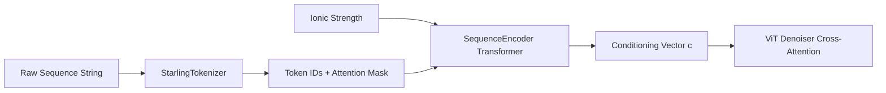

Starling implements a **latent diffusion model** that operates in the compressed representation space of a pre-trained VAE, generating protein distance maps conditioned on amino acid sequences. This design follows the foundational framework of Sohl-Dickstein et al. (2015), Ho et al. (2020), and Rombach et al. (2021), adapting it to the structural biology domain where the generated latents are decoded into pairwise distance maps representing protein conformations.

## Architectural Overview

The diffusion model in Starling is a discrete-time denoising diffusion probabilistic model (DDPM) that operates on **24×24 latent space representations** rather than raw distance maps. This latent-space design dramatically reduces computational cost while preserving structural fidelity — the VAE encoder compresses 384×384 distance maps into the compact 24×24 latent, and the diffusion process learns to denoise within this efficient representation.

```mermaid
graph TB
    subgraph Training Pipeline
        DM[Distance Map 384x384] --> VAE_E[VAE Encoder]
        VAE_E --> Z[Latent z 24x24]
        SEQ[Sequence Tokens] --> SE[Sequence Encoder]
        SE --> C[Conditioning c]
        Z --> QS[q_sample: Add Noise]
        QS --> ZT[Noised Latent z_t]
        ZT --> D[ViT Denoiser]
        C --> D
        T[Timestep t] --> D
        D --> EPS_PRED[Predicted Noise ε_θ]
        EPS[Predicted Noise ε_θ] --> LOSS[MSE / Min-SNR Loss]
    end

    subgraph Inference Pipeline
        NOISE[Noise ~ N 0 I] --> SAMPLE[Sampler]
        SEQ2[Sequence] --> SE2[Sequence Encoder]
        SE2 --> C2[Conditioning c]
        C2 --> SAMPLE
        SAMPLE --> Z_CLEAN[Clean Latent z_0]
        Z_CLEAN --> VAE_D[VAE Decoder]
        VAE_D --> DM_OUT[Distance Map 384x384]
    end

    style Training Pipeline fill:#f0f4ff,stroke:#4a6fa5
    style Inference Pipeline fill:#fff4f0,stroke:#a54a4a
```



The core `DiffusionModel` class inherits from `pl.LightningModule`, integrating the full training loop, loss computation, and optimizer configuration within a single cohesive module. The three key sub-components are: (1) the **ViT denoiser** that predicts noise given a noised latent, timestep, and sequence conditioning; (2) the **SequenceEncoder** that transforms tokenized amino acid sequences into conditioning vectors; and (3) the optional **frozen VAE distance-map encoder** used during training to produce latent-space targets from raw distance maps.

Sources: [diffusion.py](starling/models/diffusion.py#L55-L188), [diffusion_train.py](starling/training/diffusion_train.py#L81-L112)

## Forward Diffusion Process (q-sample)

The forward process gradually corrupts a clean latent **z₀** into pure Gaussian noise over **T** discrete timesteps. At each timestep *t*, the noised latent is computed via the closed-form reparameterization:

**z_t = √(ᾱ_t) · z₀ + √(1 - ᾱ_t) · ε**, where ε ~ N(0, I)

This is implemented in `q_sample`, which extracts the pre-computed √ᾱ_t and √(1 - ᾱ_t) buffers and applies the affine noise transformation. Mixed precision is explicitly **disabled** for this operation (`autocast(enabled=False)`) due to numerical instability observed with float16 in the noise scheduling math.

Sources: [diffusion.py](starling/models/diffusion.py#L196-L226)

## Noise Schedule Design

The diffusion process is governed by a **beta schedule** that defines how variance evolves across timesteps. Starling provides three schedule types, each producing a tensor of β values from which all derived quantities (α, ᾱ, posterior variance) are computed:

| Schedule | Formula / Behavior | Use Case |
|----------|-------------------|----------|
| **cosine** (default) | ᾱ_t = cos²(((t/T) + s)/(1+s) · π/2), s=0.008 | Smooth noise ramp; avoids near-zero signal at early steps; **recommended for latent diffusion** |
| **linear** | β linearly spaced from 0.0001 to 0.02 (scaled by 1000/T) | Simple baseline; can destroy structure too quickly at late steps |
| **sigmoid** | ᾱ_t derived from sigmoid transform with start/end/τ parameters | Flexible shape control; experimental |

The cosine schedule is the default and most principled choice for latent diffusion models — its offset parameter *s = 0.008* prevents the schedule from being too aggressive at the start, ensuring the model doesn't destroy latent structure prematurely. All schedules produce β values in `float64` precision to avoid accumulation errors in the cumulative product ᾱ_t.

Sources: [schedulers.py](starling/data/schedulers.py#L1-L83), [diffusion.py](starling/models/diffusion.py#L65-L69), [diffusion.yaml](starling/configs/diffusion/diffusion.yaml#L1-L12)

## Pre-computed Diffusion Buffers

Upon initialization, the `DiffusionModel` computes and registers as **non-persistent buffers** the full set of quantities needed for both training and inference. This avoids redundant computation at every step:

| Buffer | Definition | Purpose |
|--------|-----------|---------|
| `betas` | β_t | Noise variance per step |
| `alphas_cumprod` | ᾱ_t = ∏(1 - β_s) | Signal preservation factor |
| `alphas_cumprod_prev` | ᾱ_{t-1} | Previous step's signal factor |
| `sqrt_recip_alphas` | 1/√α_t | Denoising mean coefficient |
| `sqrt_alphas_cumprod` | √ᾱ_t | Forward process signal weight |
| `sqrt_one_minus_alphas_cumprod` | √(1 - ᾱ_t) | Forward process noise weight |
| `posterior_variance` | β_t · (1 - ᾱ_{t-1}) / (1 - ᾱ_t) | Reverse process variance |
| `latent_space_scaling_factor` | 1/σ_z | Z-scoring normalization (computed at first training step) |

The `extract` helper function indexes into these 1D buffers and reshapes them for broadcasting across batch and spatial dimensions — a pattern borrowed from the established DDPM implementations.

Sources: [diffusion.py](starling/models/diffusion.py#L162-L187)

## Latent Space Normalization

A critical design detail following Rombach et al. (2021) is the **latent space scaling factor**. The VAE encoder's latent distribution may not be unit variance, which would mismatch the diffusion model's assumption that z₀ ~ N(0, I) at timestep 0. On the **first training step** (`global_step == 0 and batch_idx == 0`), the model computes:

1. The standard deviation σ_z of the encoded batch across all processes via `all_gather`
2. The scaling factor = 1/σ_z
3. All subsequent latent encodings are multiplied by this factor: **z_scaled = z · (1/σ_z)**

During inference, the sampler reverses this: **z_original = z_denoised / (1/σ_z)** before passing to the VAE decoder. This ensures the diffusion model trains on a normalized latent space while the VAE operates in its original domain.

> [!TIP]
> The latent scaling factor is registered as a buffer and saved with model checkpoints. When loading a pre-trained model for inference, the factor is automatically restored — no manual normalization is needed. However, if fine-tuning with a *different* VAE encoder, the scaling factor will be recomputed on the first step, overwriting the previous value.

Sources: [diffusion.py](starling/models/diffusion.py#L354-L399), [ddpm_sampler.py](starling/samplers/ddpm_sampler.py#L233-L243), [ddim_sampler.py](starling/samplers/ddim_sampler.py#L242-L248)

## Training Objective and Min-SNR Weighting

The core training loss is the **simplified ε-prediction objective**: the model learns to predict the noise ε that was added to the latent, and the loss is MSE between predicted and actual noise. During each training step:

1. Random timesteps *t* ~ Uniform({0, ..., T-1}) are sampled per batch element
2. Noise ε ~ N(0, I) is drawn and applied via `q_sample`
3. The ViT denoiser predicts ε_θ(z_t, t, c) conditioned on sequence
4. Loss is computed as MSE(ε, ε_θ)

Starling optionally supports **Min-SNR-γ weighting** (Hang et al., 2023), which reweights the per-timestep loss by min(SNR(t), γ) / SNR(t). This addresses the well-known issue that the standard ε-prediction loss over-emphasizes high-noise timesteps. The SNR is computed as (α_t / σ_t)², and the weight clamps the effective SNR at γ (default 5.0), ensuring that low-noise timesteps (where the model can already denoise well) don't dominate the gradient. When `min_snr_loss=True`, the loss is computed per-sample with the SNR weight applied before the batch mean.

Sources: [diffusion.py](starling/models/diffusion.py#L253-L326), [diffusion.py](starling/models/diffusion.py#L450-L462)

## Sequence Conditioning Architecture

The diffusion model is **classifier-free** in design — conditioning is injected through the sequence encoder pathway rather than through a separate classifier model. The conditioning flow is:



The `sequence2labels` method tokenizes the input sequence, applies the sequence encoder (a transformer that processes amino acid tokens with positional and attention information), and produces a conditioning representation that the ViT denoiser attends to via cross-attention layers. The ionic strength (default 150 mM) is also passed as a scalar conditioning signal, allowing the model to modulate its predictions based on solution conditions.

Sources: [diffusion.py](starling/models/diffusion.py#L228-L251), [ddpm_sampler.py](starling/samplers/ddpm_sampler.py#L67-L90)

## Frozen VAE Encoder During Training

When a `distance_map_encoder` checkpoint path is provided, the VAE is loaded and **frozen** (`requires_grad = False`, eval mode). This means the training pipeline can accept raw distance maps as input and automatically encode them to latent space on-the-fly. The `training_step` and `validation_step` both check for the encoder's presence and, if found, apply `encode().mode()` (the mode of the variational posterior) to produce the deterministic latent target. Without a frozen encoder, the training data must already be pre-encoded latent vectors.

Sources: [diffusion.py](starling/models/diffusion.py#L138-L192), [diffusion.py](starling/models/diffusion.py#L379-L448)

## Optimizer and Learning Rate Schedule

The optimizer is **AdamW** with weight decay 0.01, applied jointly to the ViT denoiser and sequence encoder parameters. Four learning rate scheduler strategies are available:

| Scheduler | Interval | Characteristics |
|-----------|----------|-----------------|
| **LinearWarmupCosineAnnealingLR** (default) | step | 1% linear warmup → cosine decay to η_min=1e-8; most robust for diffusion training |
| **CosineAnnealingLR** | epoch | Pure cosine decay over max epochs; no warmup |
| **CosineAnnealingWarmRestarts** | epoch | Periodic restarts (T₀=5); enables cyclic exploration |
| **OneCycleLR** | step | Single-cycle policy with max_lr=0.01; aggressive but fast convergence |

> [!TIP]
> The `LinearWarmupCosineAnnealingLR` scheduler implements warmup as 1% of total steps (not epochs), which is critical for diffusion models where early training steps with random weights can produce extreme noise predictions that destabilize training. The warmup fraction is hardcoded at `0.01` — for very small datasets, consider increasing this proportion.

Sources: [diffusion.py](starling/models/diffusion.py#L464-L554)

## Configuration Reference

The diffusion model is configured via `configs/diffusion/diffusion.yaml`, which is consumed by the Hydra-based training script:

```yaml
type: discrete              # Only "discrete" is currently supported

discrete:
  beta_scheduler: cosine     # "linear", "cosine", or "sigmoid"
  timesteps: 1000            # Total diffusion timesteps T
  set_lr: 0.0001             # Initial learning rate
  config_scheduler: CosineAnnealingLR  # LR scheduler name
  min_snr_loss: False        # Enable Min-SNR-γ loss weighting
  min_snr_gamma: 5.0         # SNR clamp value γ
  distance_map_encoder: /path/to/vae.ckpt  # Frozen VAE checkpoint (optional)
```

During training setup, the ViT denoiser is instantiated as `ViT(12, 512, 8, 512)` — 12 DiT blocks, 512-dimensional embeddings, 8 attention heads, and 512-dimensional context — while the `SequenceEncoder` is configured from its own config block via Hydra `instantiate`.

Sources: [diffusion.yaml](starling/configs/diffusion/diffusion.yaml#L1-L12), [diffusion_train.py](starling/training/diffusion_train.py#L81-L112)

## Design Rationale: Why Latent Diffusion for Protein Structures

The decision to operate in latent space rather than pixel/voxel space is fundamental to Starling's efficiency. Protein distance maps at full resolution (384×384) would require a diffusion process over ~147K-dimensional space — computationally prohibitive and wasteful given the strong correlations in distance map structure. The VAE compression to 24×24 latents (a **256× reduction**) preserves the essential degrees of freedom while enabling:

- **Faster training**: The ViT denoiser operates on 576 spatial positions (24×24 with patch size 3 → 64 patches) instead of 147K
- **Faster sampling**: Each denoising step processes a 24×24 tensor, and the VAE decoder is a single forward pass
- **Better learned representations**: The VAE has already learned to disentangle distance map structure, so the diffusion model only needs to learn the distribution over well-structured latents

This design directly follows the insight from Rombach et al. (2021): diffusion in latent space achieves both perceptual fidelity and computational efficiency, a principle that transfers naturally to the structural biology domain where the "perceptual quality" analog is physically valid protein geometry.

Sources: [diffusion.py](starling/models/diffusion.py#L55-L63), [ddpm_sampler.py](starling/samplers/ddpm_sampler.py#L272-L286)

## Relationship to Other Components

The diffusion model sits at the center of Starling's generative pipeline. Understanding its connections to adjacent components clarifies the full generation flow:

- **[Sequence Encoder](5-sequence-encoder)**: Produces the conditioning vectors `c` that the ViT denoiser cross-attends to. The quality of sequence representation directly impacts conditional generation fidelity.
- **[VAE Latent Space](6-vae-latent-space)**: Defines the latent space geometry the diffusion model operates within. The VAE's encoder/decoder pair mediates between distance map space and latent space.
- **[Sampling Strategies](8-sampling-strategies)**: The DDPM, DDIM, and PLMS samplers implement the reverse diffusion process — the model provides the noise prediction ε_θ, and the sampler determines how to traverse the denoising trajectory.
- **[Vision Transformer Denoiser](14-vision-transformer-denoiser)**: The ViT architecture that implements the ε_θ prediction network, processing patchified latents with DiT blocks and adaptive layer normalization.
- **[Constraint-Guided Sampling](13-constraint-guided-sampling)**: Constraints are applied *during* the denoising loop within each sampler, modifying latents at intermediate timesteps to enforce physical properties.