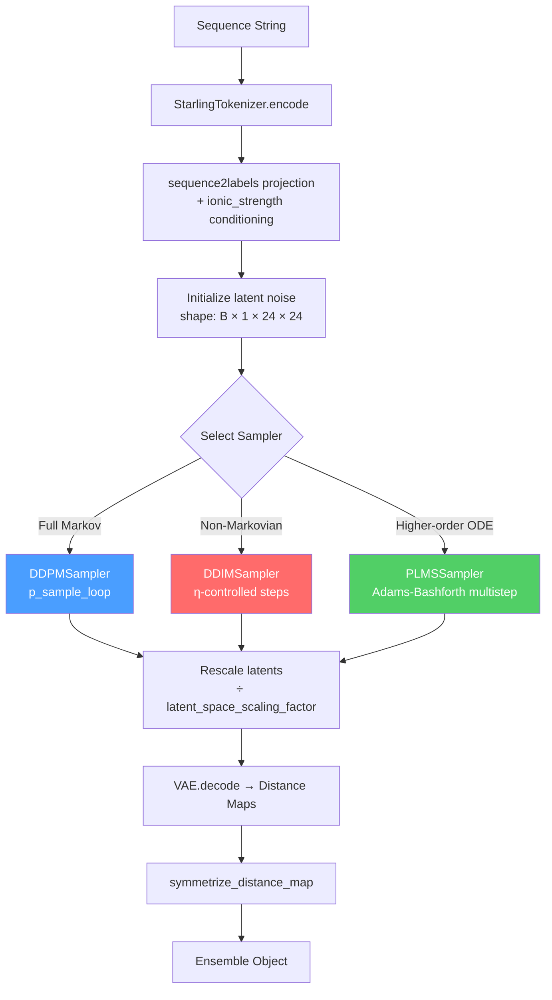
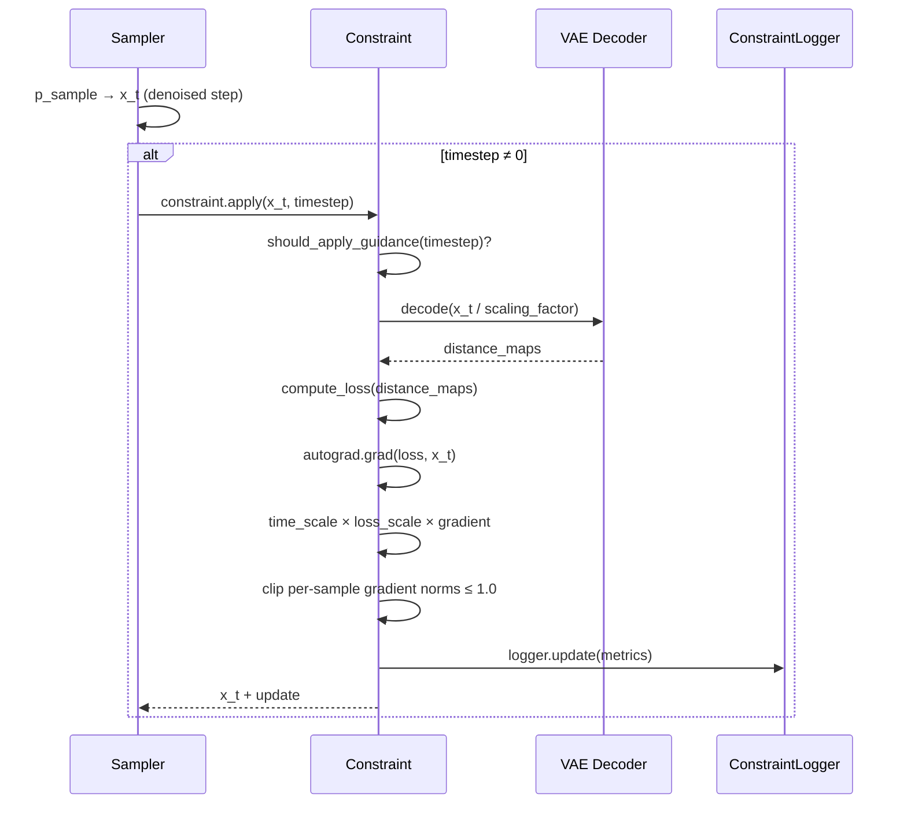

Starling implements three distinct diffusion sampling strategies — **DDPM**, **DDIM**, and **PLMS** — each offering a different trade-off between sample quality, stochastic diversity, and computational cost. All three samplers share a unified architecture: they ingest a trained diffusion model and VAE encoder, traverse timesteps in reverse to denoise Gaussian noise into VAE latents, then decode those latents into distance maps. The critical differentiator is *how* each sampler navigates the reverse process — whether it follows the full Markov chain (DDPM), takes a non-Markovian shortcut (DDIM), or accelerates further with higher-order ODE integration (PLMS).

Sources: [ddpm_sampler.py](starling/samplers/ddpm_sampler.py#L44-L287), [ddim_sampler.py](starling/samplers/ddim_sampler.py#L19-L364), [plms_sampler.py](starling/samplers/plms_sampler.py#L62-L348)

## Architectural Overview

Every sampler in Starling adheres to the same operational contract, orchestrated by the `generate_backend` function in the inference layer. The sampler receives a sequence string, encodes it into conditioning labels via the tokenizer and `sequence2labels` projection, initializes pure Gaussian noise in a **(B, 1, 24, 24)** latent shape, then iteratively denoises across timesteps. After the reverse diffusion completes, latents are rescaled by the `latent_space_scaling_factor` and decoded through the VAE to produce **(B, 1, N, N)** distance maps.



Sources: [generation.py](starling/inference/generation.py#L427-L454), [generation.py](starling/inference/generation.py#L492-L506)

## DDPM Sampler — The Baseline Markov Chain

The `DDPMSampler` implements the original Denoising Diffusion Probabilistic Model algorithm, stepping through **every training timestep** in reverse. Each denoising step computes the predicted noise via the model, then derives the posterior mean using the standard DDPM reparameterization:

**μ\_θ(x\_t, t) = (1/√α\_t) · (x\_t − (β\_t / √(1−ᾱ\_t)) · ε\_θ(x\_t, t))**

At every timestep except the final one (t = 0), Gaussian noise scaled by the posterior variance is added, preserving the stochastic nature of the reverse process. This full traversal guarantees the highest fidelity to the learned distribution but requires the complete timestep budget — typically **1000 steps** for Starling's models.

The `p_sample` method extracts precomputed schedule constants (`betas`, `sqrt_recip_alphas`, `sqrt_one_minus_alphas_cumprod`, `posterior_variance`) indexed by the current timestep, then applies the noise prediction to compute the posterior mean and add stochastic perturbation. The outer `p_sample_loop` iterates `reversed(timesteps)` with optional trajectory tracking and constraint application at each step.

Sources: [ddpm_sampler.py](starling/samplers/ddpm_sampler.py#L92-L148), [ddpm_sampler.py](starling/samplers/ddpm_sampler.py#L150-L243)

## DDIM Sampler — Deterministic Latent Traversal

The `DDIMSampler` implements Denoising Diffusion Implicit Models, which reparameterize the forward process using **non-Markovian diffusion**. This allows the generative chain to be simulated in a **substantially smaller number of steps** — typically 10–100× fewer than DDPM — while still producing high-quality samples.

The key parameter is **`ddim_eta`** (η), which interpolates between a fully deterministic process (η = 0.0) and a process equivalent to DDPM (η = 1.0). At η = 0, the DDIM update rule becomes:

**x\_{t−1} = √ᾱ\_{t−1} · x̂\_0 + √(1 − ᾱ\_{t−1}) · ε\_θ(x\_t, t)**

where x̂\_0 is the predicted clean sample: **x̂\_0 = (x\_t − √(1−ᾱ\_t) · ε\_θ) / √ᾱ\_t**

When η > 0, stochastic noise scaled by σ\_DDIM is added, where σ is computed from the alpha schedule and η. Starling defaults to η = 0.0, making the DDIM sampler **fully deterministic** — the same noise seed produces identical outputs, which is critical for reproducible ensemble generation.

### Timestep Discretization

DDIM supports two discretization strategies for selecting which training timesteps to visit:

| Discretization | Formula | Behavior |
|---|---|---|
| `uniform` | `range(0, T-1, T//n_steps) + 1` | Evenly spaced; default and recommended |
| `quad` | `(linspace(0, √(0.8·T), n_steps))² + 1` | Quadratic spacing; denser sampling at high noise levels |

Sources: [ddim_sampler.py](starling/samplers/ddim_sampler.py#L19-L101), [ddim_sampler.py](starling/samplers/ddim_sampler.py#L252-L364)

## PLMS Sampler — Pseudo Linear Multistep Acceleration

The `PLMSSampler` extends the DDIM framework with **higher-order ODE integration** using Adams-Bashforth multistep methods. Instead of relying on a single noise prediction per step, PLMS maintains a history of previous predictions (`old_eps`) and uses polynomial extrapolation to refine the denoising direction — analogous to using a higher-order Runge-Kutta solver instead of forward Euler.

The multistep schedule escalates order as history accumulates:

| History Size | Method | Formula | Order |
|---|---|---|---|
| 0 entries | Pseudo Improved Euler | `e'_t = (e_t + e_{t+1}) / 2` | 2nd |
| 1 entry | Adams-Bashforth | `e'_t = (3·e_t − e_{t−1}) / 2` | 2nd |
| 2 entries | Adams-Bashforth | `e'_t = (23·e_t − 16·e_{t−1} + 5·e_{t−2}) / 12` | 3rd |
| 3+ entries | Adams-Bashforth | `e'_t = (55·e_t − 59·e_{t−1} + 37·e_{t−2} − 9·e_{t−3}) / 24` | 4th |

The first step bootstraps with a Pseudo Improved Euler scheme: it computes the noise prediction at both the current and next position, averages them, and uses that corrected prediction as the effective denoising direction. Subsequent steps fall back to the Adams-Bashforth formulas, which extrapolate from the stored noise history. The history buffer is capped at 4 entries (`old_eps.pop(0)` when `len >= 4`), ensuring memory stability.

PLMS also incorporates **dynamic thresholding** via `dynamic_thresholding_fn`, which clamps predicted x\_0 values at a configurable quantile (default p = 0.995) to prevent latent space divergence. This thresholding is defined but available as a safeguard against numerical instability during aggressive step-skipping.

> [!TIP]
> The PLMS sampler is deterministic by design — it forces `ddim_eta = 0` internally. This makes it the fastest option for generating large ensembles where inter-sample diversity comes from the initial noise, not from stochasticity in the denoising process.

Sources: [plms_sampler.py](starling/samplers/plms_sampler.py#L26-L46), [plms_sampler.py](starling/samplers/plms_sampler.py#L289-L348)

## Comparative Analysis

| Property | DDPM | DDIM | PLMS |
|---|---|---|---|
| **Process type** | Stochastic Markov | Non-Markovian (η-tunable) | Non-Markovian (deterministic) |
| **Default steps** | 1000 (all timesteps) | 50–100 (configurable) | 50–100 (configurable) |
| **Speed** | 1× (baseline) | 10–20× | 10–100× |
| **Sample quality** | Highest distribution fidelity | High (η-dependent) | High (order-dependent) |
| **Determinism** | No (stochastic noise each step) | Yes if η = 0 | Yes (η forced to 0) |
| **Noise control** | None (full posterior variance) | `ddim_eta` ∈ [0, 1] | None (forced deterministic) |
| **Denoising method** | Single-step posterior | DDIM x\_0 prediction | Adams-Bashforth multistep |
| **Timestep selection** | All (reversed range) | Uniform or quadratic | Uniform or quadratic |
| **Constraint support** | ✅ | ✅ | ✅ |
| **Trajectory tracking** | ✅ (`return_all_timesteps`) | ❌ | ❌ |
| **Dynamic thresholding** | ❌ | ❌ | ✅ (available) |

The choice of sampler depends on the use case. **DDPM** is appropriate when maximum sample diversity and distribution fidelity are required and compute time is not a constraint. **DDIM** with η = 0 is the recommended default for most ensemble generation — it provides an excellent quality-speed trade-off with full determinism. **PLMS** offers the fastest generation for very large ensembles, leveraging its higher-order integration to maintain quality at aggressive step counts.

Sources: [ddpm_sampler.py](starling/samplers/ddpm_sampler.py#L44-L65), [ddim_sampler.py](starling/samplers/ddim_sampler.py#L19-L58), [plms_sampler.py](starling/samplers/plms_sampler.py#L62-L100)

## Constraint-Guided Sampling Integration

All three samplers share a uniform constraint application interface. During the denoising loop, after each denoising step, the sampler checks for an active `constraint` object and applies it to the current latents — except at the final timestep (t = 0), where constraints are skipped to allow the model's clean prediction to stand.

The constraint pipeline operates in latent space: it decodes the current latents through the VAE to distance maps, computes the constraint loss, backpropagates gradients through the decoder to the latents, and applies a scaled gradient update. This means **constraint guidance happens at every sampled timestep**, progressively steering the denoising trajectory toward physically valid conformations. The `ConstraintLogger` tracks loss, gradient norms, and time-scale factors throughout the process.



Sources: [constraints.py](starling/inference/constraints.py#L203-L272), [ddpm_sampler.py](starling/samplers/ddpm_sampler.py#L226-L228), [ddim_sampler.py](starling/samplers/ddim_sampler.py#L227-L229), [plms_sampler.py](starling/samplers/plms_sampler.py#L264-L266)

## Sampler Construction and Selection

Samplers are constructed by the `generate_backend` function based on a string identifier. Each sampler receives the shared `ddpm_model` (the trained diffusion model containing schedule buffers, the ViT denoiser, and the `sequence2labels` encoder) and the `encoder_model` (the VAE). The `ionic_strength` parameter defaults to 150 mM and conditions the sequence-to-label projection.

```python
# DDPM — uses all training timesteps
sampler = DDPMSampler(ddpm_model=diffusion, encoder_model=encoder_model, ionic_strength=150)

# DDIM — specify number of sub-steps and optionally η
sampler = DDIMSampler(ddpm_model=diffusion, encoder_model=encoder_model, n_steps=50, ddim_eta=0.0, ddim_discretize="uniform")

# PLMS — specify number of sub-steps (η is internally forced to 0)
sampler = PLMSSampler(ddpm_model=diffusion, encoder_model=encoder_model, n_steps=50, ddim_discretize="uniform")
```

The `n_steps` parameter for DDIM and PLMS controls **how many of the original training timesteps are visited**, not the total number of training timesteps. A smaller `n_steps` means larger gaps between visited timesteps, which increases speed but may degrade sample quality if pushed too aggressively. Empirically, **25–50 steps** with DDIM or PLMS provides an optimal balance for protein distance map generation.

> [!TIP]
> When generating large ensembles (>100 conformations), the `batch_size` parameter in `generate_backend` controls how many conformations are generated per forward pass. Larger batch sizes amortize the conditioning computation (`generate_labels`) across more samples but require proportionally more VRAM. The latent shape is always `(batch_size, 1, 24, 24)` regardless of sequence length.

Sources: [generation.py](starling/inference/generation.py#L427-L454), [ddim_sampler.py](starling/samplers/ddim_sampler.py#L19-L28), [plms_sampler.py](starling/samplers/plms_sampler.py#L62-L72)

## Label Conditioning Pipeline

All samplers share an identical `generate_labels` method that transforms a raw amino acid sequence into model-compatible conditioning signals. The pipeline first tokenizes the sequence via `StarlingTokenizer.encode`, reshapes it to `(1, L)` with a full-true attention mask, then projects through `ddpm_model.sequence2labels` — which incorporates both sequence embeddings and ionic strength conditioning. This label tensor and attention mask are passed to the denoiser at every reverse timestep, ensuring the generated distance map is **sequence-specific** and **environment-conditioned**.

Sources: [ddpm_sampler.py](starling/samplers/ddpm_sampler.py#L67-L90), [ddim_sampler.py](starling/samplers/ddim_sampler.py#L102-L124), [plms_sampler.py](starling/samplers/plms_sampler.py#L124-L147)

## Next Steps

- To understand how constraints are defined and composed for guided sampling, see [Constraint Types](12-constraint-types) and [Constraint-Guided Sampling](13-constraint-guided-sampling).
- For details on the ViT denoiser that underpins all three samplers, see [Vision Transformer Denoiser](14-vision-transformer-denoiser).
- To explore how sampled distance maps are assembled into structural ensembles, see [Ensemble Object API](9-ensemble-object-api).