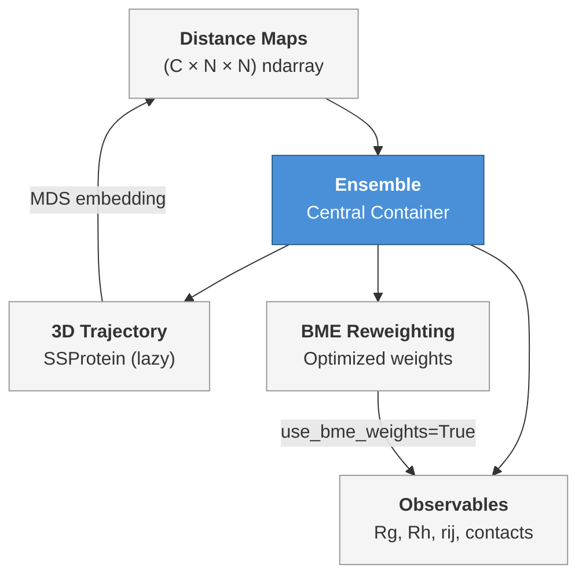

The **`Ensemble`** class is the central data structure in STARLING — a lightweight, distance-map-backed container for conformational ensembles of intrinsically disordered proteins. Rather than storing full 3D coordinates eagerly, an `Ensemble` holds the pairwise residue distance maps produced by the diffusion sampler and **lazily reconstructs 3D trajectories** only when needed. This design keeps memory overhead minimal during generation while still providing seamless access to coordinates, biophysical observables, BME reweighting, and serialization, all through a single, coherent object.

Sources: [ensemble.py](starling/structure/ensemble.py#L1-L75)

## Construction & Initialization

An `Ensemble` is most commonly obtained through the top-level [`generate()`](starling/frontend/ensemble_generation.py#L160-L400) function, but it can also be constructed directly from a NumPy array of distance maps:

```python
from starling.structure.ensemble import Ensemble
import numpy as np

# distance_maps: shape (n_conformations, n_residues, n_residues)
ensemble = Ensemble(distance_maps, sequence="GSWGSWGSWGSW")
```

| Parameter | Type | Description |
|-----------|------|-------------|
| `distance_maps` | `np.ndarray` | Shape `(C, N, N)` — symmetrized pairwise distance maps for `C` conformations of `N` residues |
| `sequence` | `str` | Amino-acid sequence; must contain only canonical residues |
| `ssprot_ensemble` | `SSProtein`, optional | Pre-existing SOURSOP trajectory to attach (skips later reconstruction) |

The constructor performs **validation** on every input: the array must be 3-dimensional, each map must be square with dimension matching the sequence length, and every residue character must belong to the canonical amino-acid alphabet. Invalid inputs raise `ValueError` immediately rather than failing silently downstream.

Sources: [ensemble.py](starling/structure/ensemble.py#L77-L129), [ensemble.py](starling/structure/ensemble.py#L131-L179)

### Generating Ensembles with `generate()`

The primary high-level entry point is `starling.generate()`, which handles input normalization, diffusion sampling, optional MDS refinement, and returns one or more `Ensemble` objects:

```python
from starling import generate

# Single sequence → single Ensemble
ensemble = generate("GSWGSWGSW" * 10, conformations=200, return_single_ensemble=True)

# Multiple sequences → dict of Ensembles
ensembles = generate(["GSWGSWGSW" * 10, "AEAEAEAE" * 10], conformations=100)
```

| Key Parameter | Default | Purpose |
|---------------|---------|---------|
| `conformations` | `configs.DEFAULT_NUMBER_CONFS` | Number of conformations to sample per sequence |
| `steps` | `configs.DEFAULT_STEPS` | Denoising diffusion steps |
| `return_structures` | `False` | If `True`, reconstruct 3D coordinates during generation |
| `return_single_ensemble` | `False` | Return a bare `Ensemble` instead of a dict when one sequence is provided |
| `output_directory` | `None` | Directory for on-disk output; `None` means nothing is saved |
| `constraint` | `None` | A `Constraint` object for guided sampling |

Sources: [ensemble_generation.py](starling/frontend/ensemble_generation.py#L160-L260), [ensemble_generation.py](starling/frontend/ensemble_generation.py#L261-L400)

## Core Architecture

The `Ensemble` object sits at the intersection of four functional domains. The diagram below shows how a single object bridges distance maps, biophysical observables, 3D reconstruction, and BME reweighting:



**Lazy evaluation** is the defining pattern. Expensive computations — trajectory reconstruction via multi-dimensional scaling, radius-of-gyration loops, hydrodynamic-radius summations — are performed once, cached as private attributes, and reused on subsequent calls. Setting `force_recompute=True` on any method invalidates the cache and recomputes from scratch.

Sources: [ensemble.py](starling/structure/ensemble.py#L42-L75), [ensemble.py](starling/structure/ensemble.py#L100-L129)

## Observable Methods

### Inter-Residue Distance: `rij(i, j)`

Returns the distance between residues `i` and `j` across all conformations. With `return_mean=True`, computes the ensemble average (optionally BME-weighted):

```python
# Per-conformation distances
d_05 = ensemble.rij(0, 5)                # shape: (n_conformations,)

# Ensemble average
d_05_mean = ensemble.rij(0, 5, return_mean=True)

# BME-reweighted average
d_05_bme = ensemble.rij(0, 5, return_mean=True, use_bme_weights=True)
```

Sources: [ensemble.py](starling/structure/ensemble.py#L344-L383)

### End-to-End Distance

Convenience wrapper around `rij(0, N-1)`, returning the N-to-C terminal distance for each frame or its mean:

```python
ete = ensemble.end_to_end_distance()                  # array
ete_mean = ensemble.end_to_end_distance(return_mean=True)
```

Sources: [ensemble.py](starling/structure/ensemble.py#L385-L416)

### Radius of Gyration: `radius_of_gyration()`

Computes Rg from the distance maps using the standard formula $R_g = \sqrt{\frac{\sum_{i<j} d_{ij}^2}{2N^2}}$. Supports BME-weighted means and forced recomputation:

```python
rg_all = ensemble.radius_of_gyration()                                   # per-frame
rg_mean = ensemble.radius_of_gyration(return_mean=True)                   # scalar
rg_bme  = ensemble.radius_of_gyration(return_mean=True, use_bme_weights=True)
```

A **local variant** computes Rg over a sub-region of the chain:

```python
rg_local = ensemble.local_radius_of_gyration(start=10, end=30, return_mean=True)
```

Sources: [ensemble.py](starling/structure/ensemble.py#L496-L540), [ensemble.py](starling/structure/ensemble.py#L542-L586)

### Hydrodynamic Radius: `hydrodynamic_radius()`

Offers two computation modes backed by published methods:

| Mode | Method | Reference |
|------|--------|-----------|
| `"nygaard"` (default) | Rg-based scaling with three tunable α parameters | Nygaard et al., *Biophys J* 2017 |
| `"kr"` | Kirkwood-Riseman inverse-distance sum | Kirkwood & Riseman, *J Chem Phys* 1948 |

```python
rh_nygaard = ensemble.hydrodynamic_radius(mode="nygaard", return_mean=True)
rh_kr      = ensemble.hydrodynamic_radius(mode="kr", return_mean=True)
```

The Nygaard mode accepts `alpha1`, `alpha2`, `alpha3` parameters (defaults: 0.216, 4.06, 0.821). Switching modes automatically invalidates the internal cache to prevent returning stale values from a different formula.

> [!TIP]
> The Kirkwood-Riseman mode is more accurate for comparison with NMR-derived Rh values (Pesce et al., 2023), while Nygaard mode better agrees with dynamic light scattering measurements.

Sources: [ensemble.py](starling/structure/ensemble.py#L589-L727)

### Distance Maps & Contact Maps

```python
# Raw or averaged distance maps
all_maps  = ensemble.distance_maps()                                      # (C, N, N)
mean_map  = ensemble.distance_maps(return_mean=True)                      # (N, N)
bme_map   = ensemble.distance_maps(return_mean=True, use_bme_weights=True)

# Contact maps with configurable threshold
contacts  = ensemble.contact_map(contact_thresh=11)                       # binary per-frame
avg_cm    = ensemble.contact_map(contact_thresh=11, return_mean=True)     # fractional occupancy
sum_cm    = ensemble.contact_map(contact_thresh=11, return_summed=True)   # integer counts
```

The default contact threshold is **11 Å**. The `return_mean` and `return_summed` flags are mutually exclusive.

Sources: [ensemble.py](starling/structure/ensemble.py#L418-L494)

## 3D Trajectory Reconstruction

Distance maps are the primary output of STARLING's diffusion model, but many downstream analyses require actual 3D coordinates. The `Ensemble` class bridges this gap through **on-demand multi-dimensional scaling (MDS)** powered by the `soursop` library:

```python
# Access trajectory (auto-reconstructs if not yet built)
traj = ensemble.trajectory          # returns soursop.ssprotein.SSProtein

# Explicit construction with control over MDS parameters
ensemble.build_ensemble_trajectory(
    num_cpus_mds=4,          # CPU workers for MDS
    num_mds_init=4,          # independent MDS initializations
    device="cpu",            # device for coordinate generation
    force_recompute=True,    # rebuild even if cached
    progress_bar=True,
)
```

| Method / Property | Returns | Lazy? |
|-------------------|---------|-------|
| `trajectory` | `soursop.ssprotein.SSProtein` | Yes — auto-reconstructs on first access |
| `build_ensemble_trajectory(...)` | `soursop.ssprotein.SSProtein` | Yes — skips if cached unless `force_recompute=True` |
| `has_structures` | `bool` | No — simple null check |

Increasing `num_mds_init` improves the quality of the MDS embedding by running multiple independent optimizations, at the cost of additional compute time. The reconstruction pipeline feeds distance maps through `generate_3d_coordinates_from_distances()` and wraps the result in a `soursop.SSTrajectory` → `SSProtein` object with a CA-only topology.

Sources: [ensemble.py](starling/structure/ensemble.py#L729-L807), [ensemble.py](starling/structure/ensemble.py#L809-L837)

## Error Detection

STARLING's generative pipeline can occasionally produce frames with physically impossible inter-residue distances. The `Ensemble` class provides two complementary error scanners:

### `check_for_errors()` — Distance Map Level

Scans the raw STARLING distance maps for frames where any residue pair exceeds the maximum physically allowed distance (bounded by bond-length geometry):

```python
bad_indices = ensemble.check_for_errors(remove_errors=True, verbose=True)
```

When `remove_errors=True`, flagged frames are deleted from the distance map array and cached derived values (Rg, Rh) are invalidated. If a trajectory is attached, setting `rebuild_trajectory=True` reconstructs it from the cleaned maps; otherwise the trajectory object is deleted.

Sources: [ensemble.py](starling/structure/ensemble.py#L181-L243)

### `check_for_errors_trajectory()` — Reconstructed Coordinate Level

Inspects the per-frame CA-CA distance maps derived from the 3D trajectory rather than the raw diffusion outputs. This catches **reconstruction artefacts** — cases where the MDS embedding introduces unphysical geometry even though the source distance map was well-behaved:

```python
bad_indices = ensemble.check_for_errors_trajectory(remove_errors=True, verbose=True)
```

When frames are removed, **both** the trajectory and the distance maps are pruned in sync so the two representations remain consistent. Raises `RuntimeError` if no trajectory has been built.

Sources: [ensemble.py](starling/structure/ensemble.py#L245-L342)

## BME Reweighting Integration

The `Ensemble` class provides a first-class interface to Bayesian Maximum Entropy reweighting through the `reweight_bme()` method, which creates optimized per-frame weights that balance fitting experimental observables against maintaining ensemble diversity. The result is cached and propagates to all observable methods via `use_bme_weights=True`.

```python
from starling.structure.bme import ExperimentalObservable
import numpy as np

# Define experimental targets
obs_rg  = ExperimentalObservable(25.0, 2.0, name="Rg")
obs_ete = ExperimentalObservable(70.0, 5.0, constraint="upper", name="ETE")

# Compute per-frame calculated values
rg_vals  = ensemble.radius_of_gyration()
ete_vals = ensemble.end_to_end_distance()
calculated = np.column_stack([rg_vals, ete_vals])

# Automatic theta selection (recommended)
result = ensemble.reweight_bme([obs_rg, obs_ete], calculated)

# Now use BME weights in any observable
reweighted_rg = ensemble.radius_of_gyration(return_mean=True, use_bme_weights=True)
```

### Theta Selection Modes

| Mode | Invocation | Behavior |
|------|-----------|----------|
| **Automatic** | `theta=None` (default) | L-curve scan across `theta_range`, selects optimal θ via knee detection |
| **Manual** | `theta=<float>` | Directly uses the specified θ; faster, no scan |

The automatic mode tests `theta_n_points` values across the range (default: 15, range: 0.01–10.0) and identifies the knee using one of two methods:

- `"perpendicular"` (default) — maximum perpendicular distance to the chord connecting the curve endpoints
- `"curvature"` — Menger curvature of the L-curve

```python
# Auto mode with custom scan parameters
result = ensemble.reweight_bme(
    [obs_rg, obs_ete], calculated,
    theta=None,
    theta_range=(0.1, 5.0),
    theta_n_points=20,
    theta_method="curvature",
    save_theta_scan_plot="theta_scan.png",
)

# Manual mode for known theta
result = ensemble.reweight_bme([obs_rg, obs_ete], calculated, theta=0.5)
```

### BME-Related Properties

| Property | Type | Description |
|----------|------|-------------|
| `has_bme_weights` | `bool` | `True` if `reweight_bme()` has been called and converged |
| `bme_result` | `BMEResult` or `None` | Cached optimization result with weights, χ², φ |
| `theta_scan_result` | `ThetaScanResult` or `None` | Diagnostics from the most recent auto-theta scan |

The `view_theta_scan()` method renders the L-curve diagnostic plot from the last automatic scan.

> [!TIP]
> All observable methods (`rij`, `radius_of_gyration`, `distance_maps`, `end_to_end_distance`, `local_radius_of_gyration`) accept `use_bme_weights=True` to seamlessly compute BME-weighted averages without manually multiplying weights.

Sources: [ensemble.py](starling/structure/ensemble.py#L939-L1221), [ensemble.py](starling/structure/ensemble.py#L1264-L1326)

## Serialization

### Saving

```python
# Save full STARLING object (distance maps + metadata)
ensemble.save("my_ensemble", compress=True, reduce_precision=True, compression_algorithm="lzma")

# Save only the 3D trajectory
ensemble.save_trajectory("my_traj")                # PDB topology + XTC trajectory
ensemble.save_trajectory("my_traj", pdb_trajectory=True)  # PDB only
```

The `.starling` format stores the distance maps, sequence, metadata (model version, creation date, weight paths), and optionally the reconstructed trajectory. Compression options:

| Algorithm | Compression Ratio | Speed | Best When |
|-----------|-------------------|-------|-----------|
| `"lzma"` | Higher | Slower | `reduce_precision=True` |
| `"gzip"` | Moderate | Faster | `reduce_precision=False` |

### Loading

```python
from starling.structure.ensemble import load_ensemble

ensemble = load_ensemble("my_ensemble.starling")
ensemble_no_structures = load_ensemble("my_ensemble.starling", ignore_structures=True)
```

Setting `ignore_structures=True` skips trajectory deserialization, which can significantly speed up loading when 3D coordinates are not needed.

Sources: [ensemble.py](starling/structure/ensemble.py#L839-L915), [ensemble.py](starling/structure/ensemble.py#L1332-L1383)

## Complete API Summary

| Method / Property | Returns | Key Flags |
|---|---|---|
| `sequence` | `str` | — |
| `sequence_length` | `int` | — |
| `number_of_conformations` | `int` | — |
| `__len__()` | `int` | — |
| `__str__()` / `__repr__()` | `str` | — |
| `rij(i, j)` | `np.ndarray` or `float` | `return_mean`, `use_bme_weights` |
| `end_to_end_distance()` | `np.ndarray` or `float` | `return_mean`, `use_bme_weights` |
| `distance_maps()` | `np.ndarray` | `return_mean`, `use_bme_weights` |
| `contact_map()` | `np.ndarray` | `contact_thresh`, `return_mean`, `return_summed` |
| `radius_of_gyration()` | `np.ndarray` or `float` | `return_mean`, `force_recompute`, `use_bme_weights` |
| `local_radius_of_gyration(start, end)` | `np.ndarray` or `float` | `return_mean`, `use_bme_weights` |
| `hydrodynamic_radius()` | `np.ndarray` or `float` | `return_mean`, `force_recompute`, `mode` |
| `build_ensemble_trajectory()` | `SSProtein` | `num_cpus_mds`, `num_mds_init`, `device`, `force_recompute` |
| `trajectory` | `SSProtein` | Auto-reconstructs on access |
| `has_structures` | `bool` | — |
| `check_for_errors()` | `list[int]` | `remove_errors`, `verbose`, `rebuild_trajectory` |
| `check_for_errors_trajectory()` | `list[int]` | `remove_errors`, `verbose` |
| `reweight_bme()` | `BMEResult` | `theta`, `theta_range`, `theta_method`, `force_recompute` |
| `has_bme_weights` | `bool` | — |
| `bme_result` | `BMEResult` or `None` | — |
| `theta_scan_result` | `ThetaScanResult` or `None` | — |
| `view_theta_scan()` | `Figure` | `save_path`, `show` |
| `save()` | `None` | `compress`, `reduce_precision`, `compression_algorithm` |
| `save_trajectory()` | `None` | `pdb_trajectory` |
| `load_ensemble(filename)` | `Ensemble` | `ignore_structures` |

Sources: [ensemble.py](starling/structure/ensemble.py#L42-L1384)

## What to Read Next

- **[Distance Map to 3D Coordinates](10-distance-map-to-3d-coordinates)** — deep dive into the MDS reconstruction pipeline that `build_ensemble_trajectory()` invokes internally
- **[BME Reweighting](11-bme-reweighting)** — full treatment of the Bayesian Maximum Entropy framework, `ExperimentalObservable` types, and θ-scan diagnostics
- **[Constraint-Guided Sampling](13-constraint-guided-sampling)** — how to pass `constraint` objects to `generate()` that shape the ensemble before it reaches the `Ensemble` container