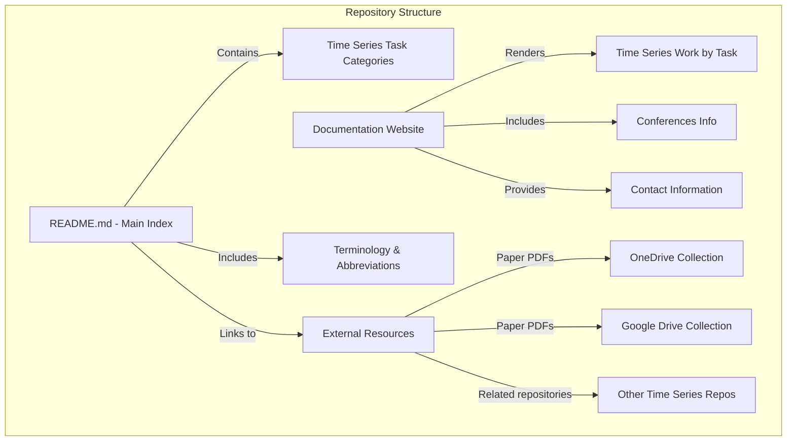
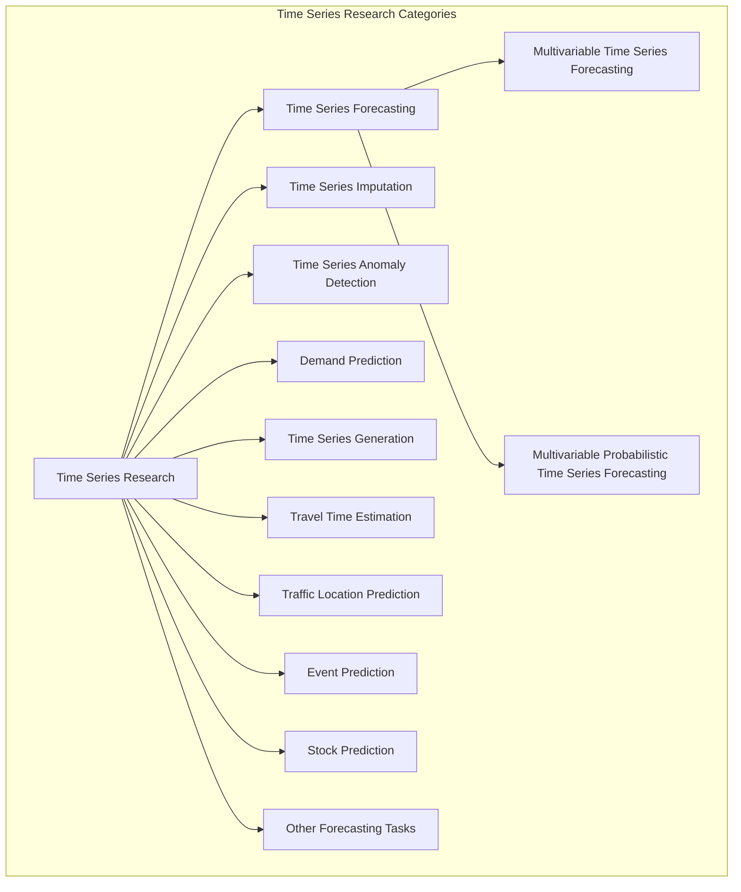
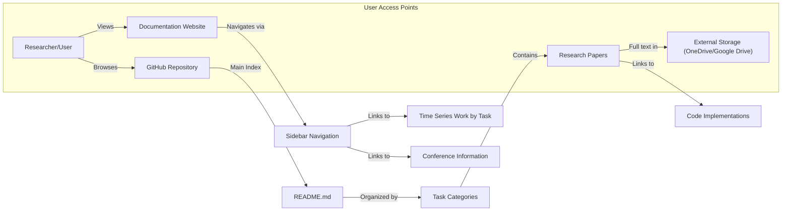
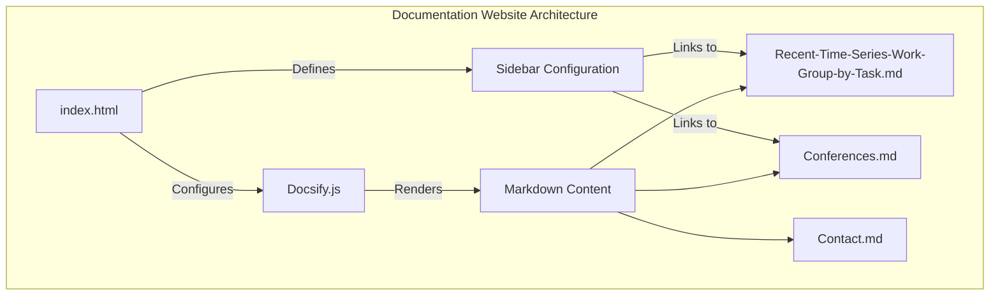
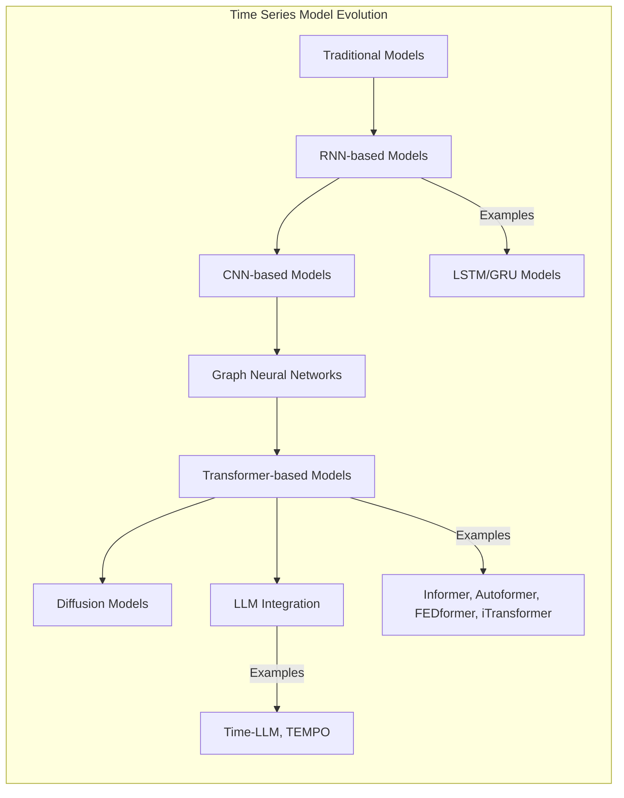

# Overview

Relevant source files

The following files were used as context for generating this wiki page:

- [README.md](README.md)
- [docs/README.md](docs/README.md)

This document provides a comprehensive introduction to the Time-Series-Works-Conferences repository, a curated knowledge base for time series research papers, methodologies, and resources. The repository serves as a centralized hub for researchers and practitioners interested in time series analysis, with a particular focus on organizing recent research work by task categories and providing access to relevant publications.

## Purpose and Scope

The Time-Series-Works-Conferences repository aims to:

1. Catalog and organize recent time series research papers by task categories
2. Provide links to code implementations and paper resources
3. Track relevant conferences and submission deadlines
4. Create a community resource for time series researchers

This overview introduces the repository's organization, content structure, and navigation. For detailed information about conference resources, see [Conference Resources](#4).

Sources: [README.md:4-13]()

## Repository Structure

The repository is organized into two main components: the core content in the GitHub repository (primarily in README.md) and an accompanying documentation website for improved navigation and readability.

The documentation website provides a more accessible interface to browse the same content organized in the GitHub README, with additional navigation features.

Sources: [README.md:5-20](), [README.md:44-46]()

## Content Organization by Research Task

The repository primarily organizes time series research by task categories, with Multivariable Time Series Forecasting being the most prominent category, followed by other specialized tasks.

Each research paper entry typically includes information about the model, dataset used, paper link, code implementation link (when available), and publication venue.

Sources: [README.md:81-93]()

## Paper Entry Structure

Papers are documented in a tabular format with consistent information to help researchers quickly understand and access relevant work. Each paper entry typically contains:

| Element | Description |
|---------|-------------|
| Task | The specific time series task addressed |
| Data | Datasets used in the paper |
| Model | The proposed model or methodology name |
| Paper | Link to the original publication |
| Code | Implementation links (often GitHub) with popularity metrics |
| Publication | Conference or journal name and year |

The repository includes hundreds of papers, with new ones being added regularly, particularly after major AI/ML conferences.

Sources: [README.md:96-200]()

## Terminology and Abbreviations

To maintain conciseness, the repository uses abbreviations for common methodologies and techniques. A glossary of these abbreviations is provided:

| Full Name | Abbreviation |
|-----------|--------------|
| Adaptive GNN | AGNN |
| Attention | Attn |
| AutoRegression | AR |
| Contrastive Learning | CL |
| Encoder Decoder | EncDec |
| Graph Convolutional Network | GCN |
| Transformer | Trans |
| Transfer Learning | TransL |
| Variational Auto-Encoder | VAE |

This standardized terminology helps in understanding model descriptions and methodologies across different papers.

Sources: [README.md:53-79]()

## Repository Navigation and Access

Users can access the repository content through multiple pathways:

All papers, including those not explicitly listed in the GitHub repository, are available through OneDrive and Google Drive links provided in the repository.

Sources: [README.md:40-46]()

## Related Resources

The repository includes links to other valuable time series research repositories:

1. Other time series collections repositories
2. External code implementations and benchmarks
3. Conference paper lists and resources

These related resources complement the main repository by providing additional context and materials for time series research.

Sources: [README.md:12-20]()

## Technical Implementation of Documentation Website

The documentation website is built using Docsify.js, which dynamically renders markdown content without requiring a build process.

This architecture allows for easy maintenance and updating of the documentation while providing a user-friendly interface for browsing the time series research content.

Sources: [README.md:5]()

## Research Evolution Tracking

The repository captures the evolution of time series models over time, from traditional approaches to the latest deep learning and transformer-based methods:

By tracking this evolution, the repository provides insight into research trends and progress in the time series field.

Sources: [README.md:97-132]()

## Summary

The Time-Series-Works-Conferences repository serves as a comprehensive resource for time series research, offering:

1. A structured organization of papers by task and methodology
2. Links to code implementations and paper resources
3. Conference information relevant to time series research
4. Terminology standardization for the field
5. Access to external paper collections

This knowledge base is continuously updated with new research, particularly after major AI/ML conferences, making it a valuable resource for both newcomers and experienced researchers in the time series domain.

---