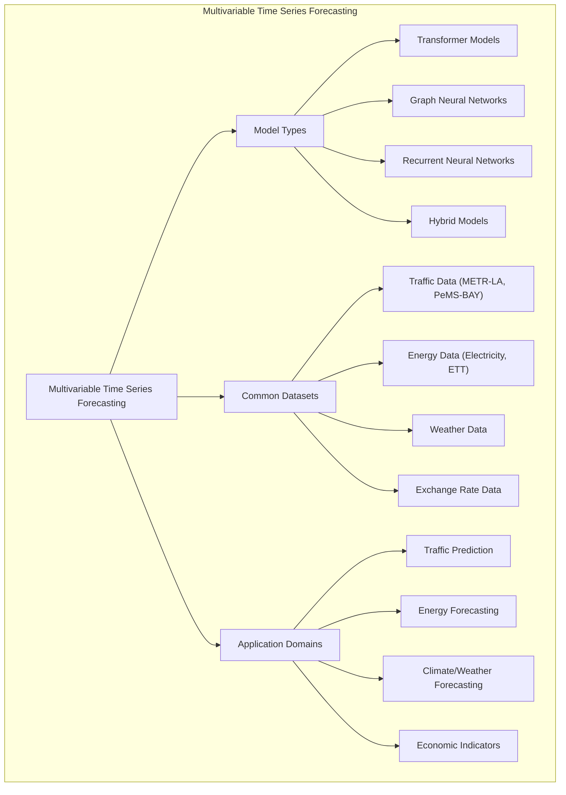
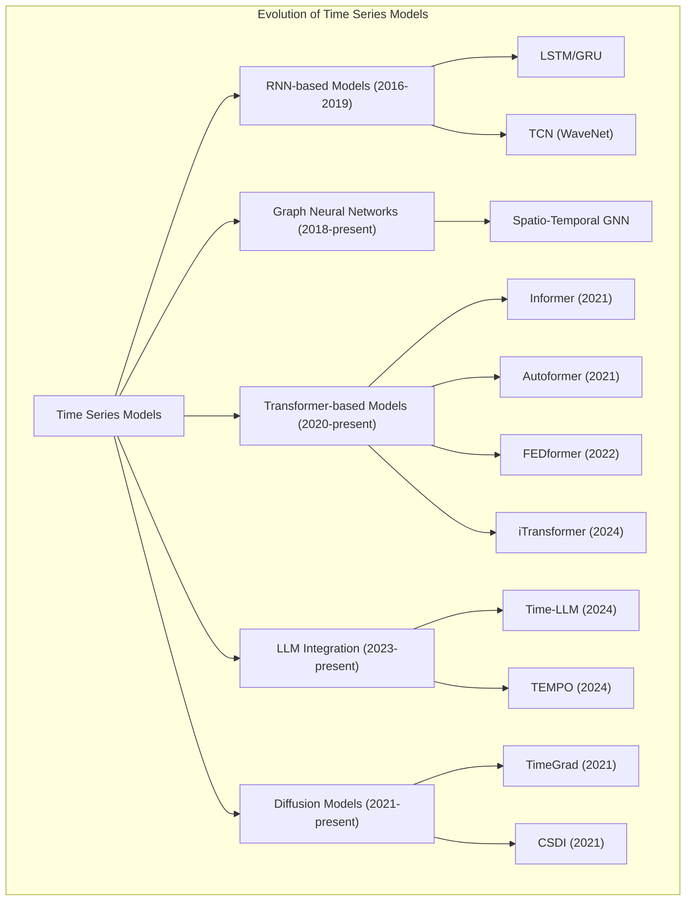

# Time Series Research Collection

<details>
<summary>Relevant source files</summary>

The following files were used as context for generating this wiki page:

- [README.md](README.md)
- [docs/Recent-Time-Series-Work-Group-by-Task.md](docs/Recent-Time-Series-Work-Group-by-Task.md)

</details>


This document describes the organization and content of the time series research papers that form the core of the Time-Series-Works-Conferences repository. It explains how time series research is categorized by tasks, methodologies, and provides an overview of the main research areas covered in the collection.

For information about conference resources, see [Conference Resources](#4).
For information about the documentation website structure, see [Documentation Website](#3).

## Purpose and Scope

The Time Series Research Collection serves as a comprehensive, structured repository of cutting-edge research papers in the field of time series analysis and forecasting. It aims to:

1. Provide a central hub for organized time series research papers categorized by task and methodology
2. Facilitate easy access to relevant papers, code implementations, and datasets
3. Support researchers and practitioners in staying current with the latest advances in time series analysis

The collection focuses on machine learning approaches to time series problems, with special emphasis on deep learning techniques applied to various domains including traffic prediction, energy forecasting, financial analysis, and more.

Sources: [README.md:33-40]()

## Organization Structure

The research papers in this collection are primarily organized by task type, with secondary organization by methodology. Each paper is presented with standardized metadata including the task type, datasets used, model name, paper reference, code implementation link (when available), and publication venue.

### Research Organization Hierarchy

```mermaid
flowchart TD
    TS["Time Series Research Collection"] --> Tasks["Organization by Task"]
    TS --> Methods["Secondary Organization by Methodology"]
    
    Tasks --> MTSF["Multivariable Time Series Forecasting"]
    Tasks --> PTSF["Probabilistic Time Series Forecasting"]
    Tasks --> TSI["Time Series Imputation"]
    Tasks --> TSAD["Time Series Anomaly Detection"]
    Tasks --> DP["Demand Prediction"]
    Tasks --> TSG["Time Series Generation"]
    Tasks --> TTE["Travel Time Estimation"]
    Tasks --> TLP["Traffic Location Prediction"]
    Tasks --> EP["Event Prediction"]
    Tasks --> SP["Stock Prediction"]
    Tasks --> Other["Other Forecasting"]
    
    Methods --> AR["Autoregression (RNN, GRU, LSTM)"]
    Methods --> Attn["Attention Mechanisms"]
    Methods --> Trans["Transformer-based"]
    Methods --> GNN["Graph Neural Networks"]
    Methods --> TCN["Temporal Convolutional Networks"]
    Methods --> CDE["Controlled Differential Equations"]
    Methods --> ODE["Ordinary Differential Equations"]
    Methods --> GAN["Generative Adversarial Networks"]
    Methods --> VAE["Variational Auto-Encoders"]
    
    class TS,MTSF emphasis;
    classDef emphasis stroke-width:3px;
```



Sources: [README.md:80-93](), [README.md:51-79]()

### Paper Information Structure

Each paper in the collection is documented with a consistent set of metadata fields to facilitate easy comparison and reference:

| Field | Description |
|-------|-------------|
| Task | The specific time series task (e.g., Multivariable Forecasting, Anomaly Detection) |
| Data | Datasets used in the paper (e.g., ETT, METR-LA, PeMS-BAY) |
| Model | The model name or approach proposed in the paper |
| Paper | Title and link to the paper |
| Code | Implementation links (with GitHub stars/forks when available) |
| Publication | Conference/journal name and year |

Sources: [README.md:97-131]()

## Task Categories

The collection is organized into several main task categories, with the largest being Multivariable Time Series Forecasting. Below is an overview of the major categories:

### Multivariable Time Series Forecasting

This is the largest category in the collection, focusing on predicting future values of multiple related time series simultaneously. It encompasses traffic forecasting, energy consumption prediction, weather forecasting, and other multivariate problems.



Sources: [README.md:97-176]()

### Other Major Task Categories

The repository includes several other significant task categories:

1. **Probabilistic Time Series Forecasting**: Models that predict probability distributions of future values rather than point estimates.

2. **Time Series Imputation**: Techniques for filling in missing values in time series data.

3. **Time Series Anomaly Detection**: Methods for identifying unusual patterns or outliers in time series.

4. **Specialized Forecasting Tasks**:
   - Demand Prediction
   - Travel Time Estimation
   - Traffic Location Prediction
   - Event Prediction
   - Stock Prediction

```mermaid
graph LR
    subgraph "Major Task Categories"
        MTSF["Multivariable Time Series Forecasting"]
        PTSF["Probabilistic Time Series Forecasting"]
        TSI["Time Series Imputation"]
        TSAD["Time Series Anomaly Detection"]
        DP["Demand Prediction"]
        Other["Other Specialized Tasks"]
    end
    
    MTSF --"100+ papers"--> Count1["Largest category"]
    PTSF --"39 papers"--> Count2[""]
    TSI --"22 papers"--> Count3[""]
    TSAD --"30 papers"--> Count4[""]
    DP --"23 papers"--> Count5[""]
    Other --> TTE["Travel Time Estimation"]
    Other --> TLP["Traffic Location Prediction"]
    Other --> EP["Event Prediction"]
    Other --> SP["Stock Prediction"]
    
    class MTSF emphasis;
    classDef emphasis stroke-width:3px;
```

Sources: [README.md:83-93](), [README.md:146-190](), [README.md:200-226](), [README.md:234-273](), [README.md:279-305]()

## Paper Storage and Accessibility

All papers mentioned in the repository are available through external storage services for easy access:

```mermaid
flowchart LR
    subgraph "Repository"
        README["README.md"]
        Index["Paper Index by Task"]
    end
    
    subgraph "External Storage"
        OD["OneDrive Collection"]
        GD["Google Drive Collection"]
    end
    
    README --> Index
    Index --> OD
    Index --> GD
    
    User["Researcher/User"] --> Repository
    User --> "External Storage"
```

Sources: [README.md:42-46]()

## Methodology and Terminology

To maintain consistency and reduce repetition, the collection uses standardized abbreviations for common technical terms and methodologies. These abbreviations are used throughout the paper listings.

### Key Abbreviations

| Full Name | Abbreviation |
|-----------|--------------|
| Adaptive Graph Neural Network | AGNN |
| Attention | Attn |
| AutoRegression (RNN, GRU, LSTM) | AR |
| Controlled Differential Equations | CDE |
| Contrastive Learning | CL |
| Encoder Decoder | EncDec |
| Ensemble | Ens |
| Feature Decomposed | FeaD |
| Federated Learning | FL |
| Generative Adversarial Network | GAN |
| Graph Convolutional Network | GCN |
| Heterogeneous GNN | HGNN |
| Multiple Graph | MGNN |
| Memory | Mem |
| Meta Learning | MetaL |
| MultiTask | MulT |
| Ordinary Differential Equations | ODE |
| Temporal Graph Network | TGN |
| Transformer | Trans |
| Transfer Learning | TransL |
| Variational Auto-Encoder | VAE |

This standardized terminology enables quick understanding of the methodological approaches used in different papers without requiring extensive repetition in the collection.

Sources: [README.md:51-79]()

## Research Evolution Over Time

The collection captures the evolution of time series modeling approaches over time, from traditional RNN-based methods to modern transformer-based and diffusion models. Recent trends include the integration of large language models (LLMs) with time series forecasting.



Sources: [README.md:100-196]()

## Related Resources

The Time Series Research Collection is part of a larger ecosystem of time series resources. Other related repositories that complement this collection include:

1. [xiyuanzh/time-series-papers](https://github.com/xiyuanzh/time-series-papers)
2. [qingsongedu/awesome-AI-for-time-series-papers](https://github.com/qingsongedu/awesome-AI-for-time-series-papers)
3. [xuehaouwa/Awesome-Trajectory-Prediction](https://github.com/xuehaouwa/Awesome-Trajectory-Prediction)

All papers are organized by task and methodology, including those not included in this GitHub repository, and are available for everyone to use on OneDrive and Google Drive.

Sources: [README.md:12-20](), [README.md:42-46]()

## Summary

The Time Series Research Collection provides a comprehensive, categorized repository of research papers in time series analysis, with a primary focus on deep learning approaches. It organizes papers by task type, with Multivariable Time Series Forecasting being the largest category. Each paper is presented with standardized metadata, and the collection includes links to code implementations when available. The repository continues to be updated with new papers, particularly in emerging areas such as LLM integration with time series forecasting.

Sources: [README.md:40-49]()

---