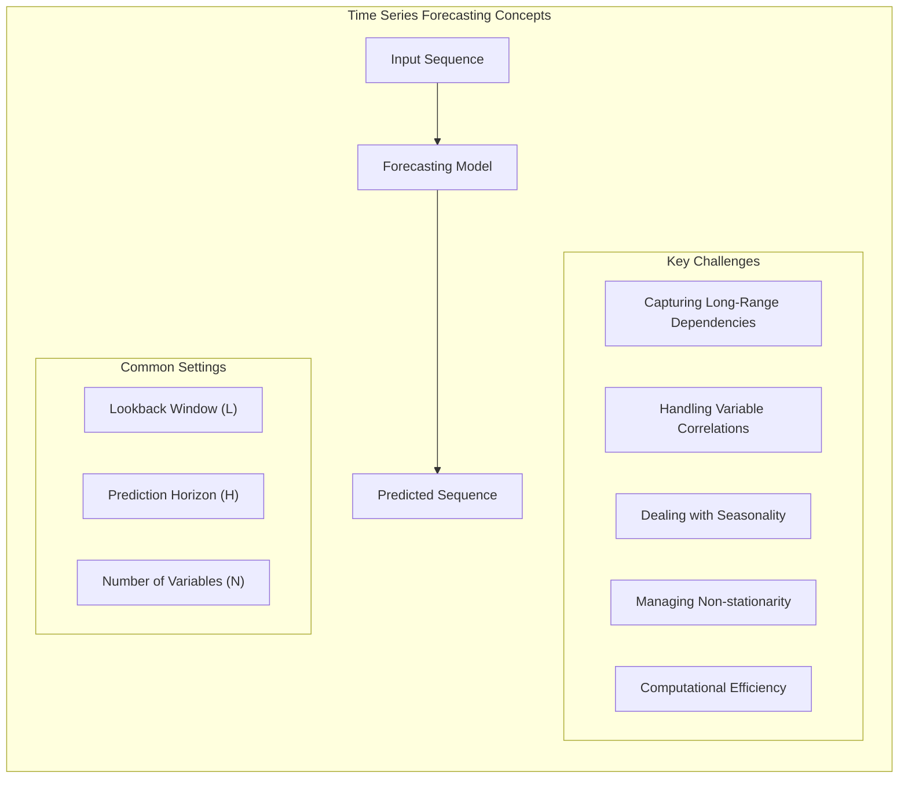
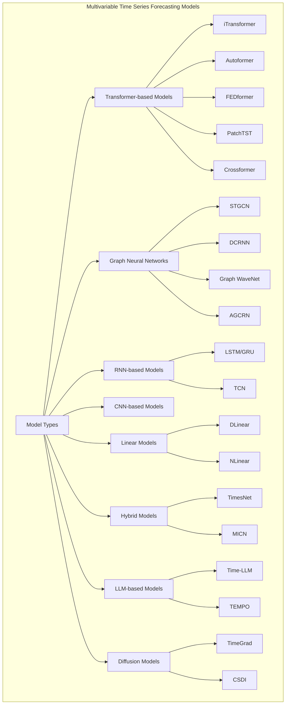
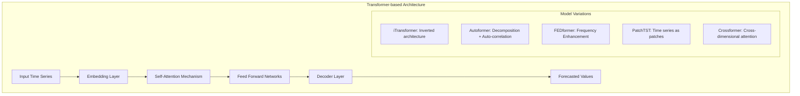
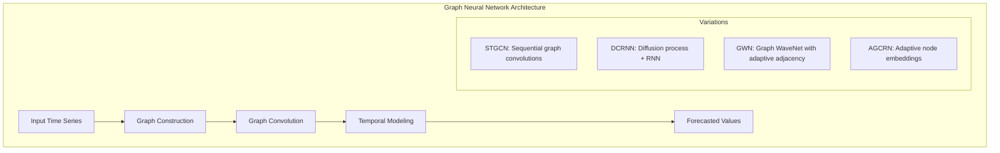
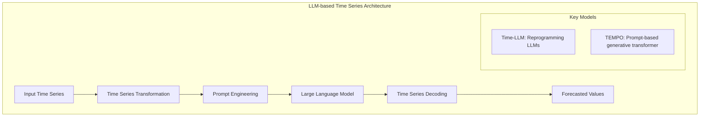
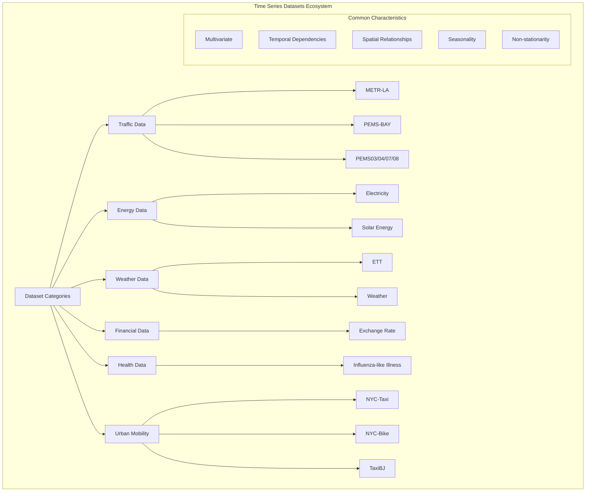
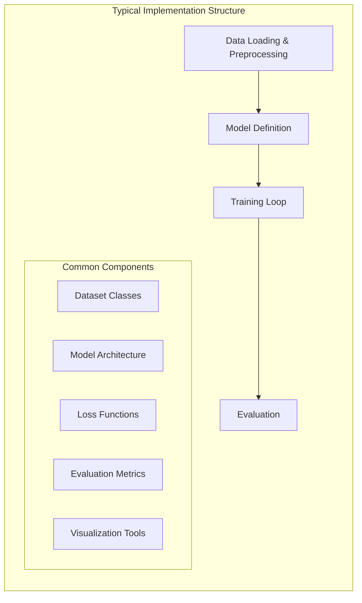

# Multivariable Time Series Forecasting

Relevant source files

The following files were used as context for generating this wiki page:

- [README.md](README.md)

## Purpose and Scope

This document covers multivariable time series forecasting, which is the largest category of time series research in the repository. It focuses on predicting future values of multiple interrelated variables based on their historical observations. Multivariable (also called multivariate) time series forecasting methods capture both temporal dependencies within each variable and relationships between different variables.

For information about probabilistic forecasting approaches, see [Probabilistic Forecasting and Imputation](#2.2). For domain-specific applications, see [Domain-Specific Applications](#2.3).

Sources: [README.md:97-99]()

## Overview of Time Series Forecasting 

Multivariable time series forecasting involves predicting future values of multiple related variables based on past observations. These techniques capture both:
1. Temporal dependencies within individual time series
2. Correlations between different variables
3. Spatial relationships between data points (for spatiotemporal data)

The repository contains over 100 research papers and implementations for multivariable time series forecasting models, representing the state-of-the-art in this rapidly evolving field.

### Key Forecasting Concepts

Sources: [README.md:81-97](), [README.md:97-403]()

## Model Taxonomy

The repository contains a rich collection of models that can be categorized based on their underlying architectural approaches:

Sources: [README.md:138-145](), [README.md:226-232](), [README.md:309-324](), [README.md:470-472]()

### Evolution of Model Architectures

The repository shows a clear progression of model architectures over time:

1. **Traditional Models**: Early approaches used statistical methods and basic neural networks
2. **RNN/LSTM-based Models**: Captured temporal dependencies but struggled with long sequences
3. **CNN and TCN-based Models**: Better at capturing local temporal patterns
4. **Graph Neural Networks**: Incorporated spatial dependencies for spatiotemporal data
5. **Transformer-based Models**: Leveraged attention mechanisms to model long-range dependencies
6. **Large Language Model Integration**: Recent trend of adapting LLMs for time series forecasting
7. **Diffusion Models**: Latest approach using generative modeling techniques

Sources: [README.md:137-152](), [README.md:226-233](), [README.md:366-367](), [README.md:470-472]()

## Key Model Architectures

### Transformer-based Models

Transformer-based architectures have become dominant in time series forecasting due to their ability to capture long-range dependencies through attention mechanisms. Notable models include:

1. **iTransformer** (Line 138): Inverted transformer architecture that processes variables as tokens
2. **Autoformer** (Line 366): Uses decomposition transformers with auto-correlation
3. **FEDformer** (Line 313): Frequency enhanced decomposed transformer
4. **PatchTST** (Line 232): Treats time series patches as tokens for long-term forecasting
5. **Crossformer** (Line 225): Cross-dimension transformer for multivariate forecasting

Sources: [README.md:138-145](), [README.md:226-232](), [README.md:313-314](), [README.md:366-367]()

### Graph Neural Network Models

Graph-based models are particularly effective for spatiotemporal data, where relationships between variables can be represented as a graph:

1. **STGCN** (Line 471): Spatio-temporal graph convolutional networks
2. **DCRNN** (Line 472): Diffusion convolutional recurrent neural network
3. **Graph WaveNet** (Line 461): Combines graph convolution with dilated casual convolution
4. **AGCRN** (Line 408): Adaptive graph convolutional recurrent network

Sources: [README.md:408-409](), [README.md:461-462](), [README.md:471-472]()

### LLM-based Models

Recent models leverage large language models for time series forecasting:

1. **Time-LLM** (Line 141): Using LLMs for time series forecasting
2. **TEMPO** (Line 142): Prompt-based generative pre-trained transformer

Sources: [README.md:141-142]()

## Datasets

The repository uses a variety of datasets for multivariable time series forecasting:

### Common Datasets

| Category | Datasets | Description |
|----------|----------|-------------|
| Traffic | METR-LA, PEMS-BAY, PEMS03/04/07/08 | Traffic speed and flow data from different locations |
| Energy | Electricity, Solar | Electricity consumption and solar power generation |
| Weather | ETT, Weather | Temperature, wind speed, humidity, etc. |
| Finance | Exchange | Exchange rate data between different currencies |
| Health | ILI | Influenza-like illness data |
| Urban | NYC-Taxi, NYC-Bike, TaxiBJ | Urban mobility data from taxis and bikes |

Many papers use a standard collection of datasets referred to as [TimesNet_data](https://github.com/thuml/Time-Series-Library), which provides a comprehensive benchmark.

Sources: [README.md:100-107](), [README.md:137-172]()

## Evaluation Methodology

Models are typically evaluated on multiple datasets using various metrics:

### Metrics

1. **MAE (Mean Absolute Error)**: Average absolute difference between predictions and actuals
2. **MSE (Mean Squared Error)**: Average squared difference between predictions and actuals
3. **RMSE (Root Mean Squared Error)**: Square root of MSE
4. **MAPE (Mean Absolute Percentage Error)**: Percentage version of MAE

### Evaluation Settings

Models are evaluated with different prediction horizons (often denoted as a value following the dataset, e.g., ETTh1_96 for 96-step ahead prediction on the ETTh1 dataset):

1. **Short-term forecasting**: Typically 12/24 steps ahead
2. **Medium-term forecasting**: Typically 48/96/192 steps ahead
3. **Long-term forecasting**: Typically 336/720 steps ahead

Sources: [README.md:97-403]()

## Recent Trends and Developments

The repository reveals several emerging trends in multivariable time series forecasting:

1. **Efficient Architectures**: Focus on simpler, more computationally efficient models (e.g., DLinear, FITS)
2. **Foundation Models**: Development of pre-trained models that can be fine-tuned for specific tasks
3. **LLM Integration**: Using large language models to enhance time series forecasting
4. **Diffusion Models**: Application of generative diffusion models for accurate forecasting
5. **Non-stationarity Handling**: Explicit mechanisms to handle non-stationary data
6. **Frequency Domain Analysis**: Leveraging frequency domain for more effective modeling

```mermaid
flowchart TD
    subgraph "Evolution of Time Series Forecasting Approaches"
        Statistical["Statistical Models"] --> |1990s-2000s| MLP["MLP & Traditional ML"]
        MLP --> |2010-2015| RNN["RNN/LSTM Models"]
        RNN --> |2015-2018| CNN["CNN & TCN Models"]
        CNN --> |2018-2020| GNN["Graph Neural Networks"]
        GNN --> |2020-2021| Trans["Transformer Models"]
        Trans --> |2021-2022| Decomp["Decomposition Models"]
        Decomp --> |2022-2023| FDM["Frequency Domain Models"]
        FDM --> |2023-Present| LLMInt["LLM Integration"]
        LLMInt --> |2023-Present| Foundation["Foundation Models"]
        Foundation --> |2023-Present| Diffusion["Diffusion Models"]
    end
```

Sources: [README.md:100-131](), [README.md:204-210]()

## Implementation and Code Structure

The repository contains implementations for numerous models. While specific implementation details vary, many follow similar patterns:

1. **Data Loading**: Processing time series datasets into appropriate formats
2. **Model Definition**: Architecture-specific neural network components
3. **Training Loop**: Optimization process with appropriate loss functions
4. **Evaluation**: Testing on held-out data with standard metrics

Many implementations are in PyTorch, with some in TensorFlow or other frameworks. The repository includes links to official implementations, often with GitHub star counts indicating their popularity.

Sources: [README.md:100-403]()

## Conclusion

Multivariable time series forecasting is a rapidly evolving field with numerous approaches and architectures. The repository provides a comprehensive collection of papers, implementations, and datasets in this domain, with transformer-based architectures, graph neural networks, and recent LLM integrations representing the current state-of-the-art. As newer methods continue to emerge, the repository serves as a valuable resource for tracking developments in this field.

---