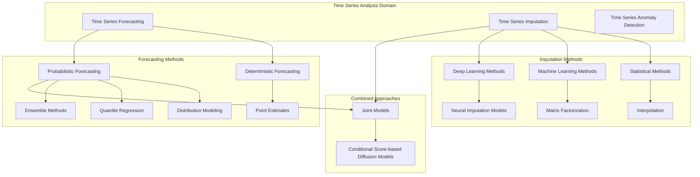
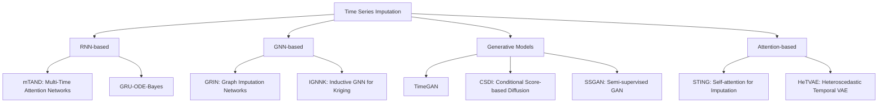
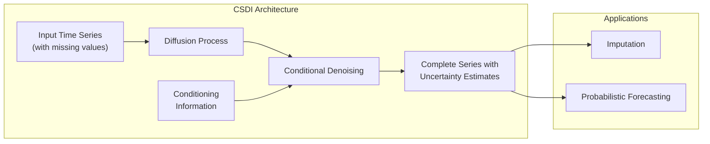
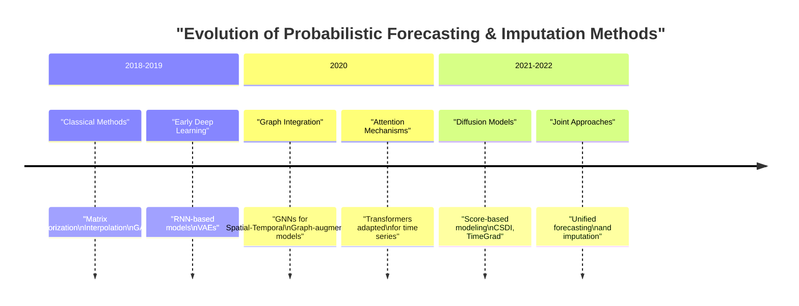

# Probabilistic Forecasting and Imputation

Relevant source files

The following files were used as context for generating this wiki page:

- [README.md](README.md)
- [docs/Recent-Time-Series-Work-Group-by-Task.md](docs/Recent-Time-Series-Work-Group-by-Task.md)

## Overview

This page documents two critical time series analysis tasks within the Time-Series-Works-Conferences repository: probabilistic forecasting and time series imputation. While the deterministic multivariable time series forecasting covered in [Multivariable Time Series Forecasting](#2.1) produces single-point predictions, probabilistic forecasting provides uncertainty estimates through probability distributions. Time series imputation addresses the challenge of missing values in temporal data. Together, these techniques form essential components of robust time series analysis systems.

Sources: [README.md:83-86](), [README.md:146-147](), [README.md:200-201]()

## Key Concepts

### Probabilistic Forecasting

Probabilistic forecasting extends traditional point forecasting by providing complete probability distributions over possible future values. This approach offers several advantages:

- **Uncertainty quantification**: Explicitly models prediction confidence
- **Risk assessment**: Enables better decision-making under uncertainty
- **Extreme event modeling**: Captures rare but significant occurrences

### Time Series Imputation

Time series imputation focuses on filling missing values in temporal data. This is crucial because:

- **Data completeness**: Many analytics methods require complete datasets
- **Information recovery**: Preserves valuable information that would otherwise be lost
- **Model robustness**: Prevents models from being biased by missing data patterns

## Relationship Between Components

Sources: [README.md:81-93](), [README.md:146-196](), [README.md:200-231]()

## Probabilistic Forecasting Methods

The repository catalogs 39 probabilistic forecasting models published between 2018-2022. These approaches can be categorized into several key methodologies:

### Distribution Modeling Approaches

These methods directly model the probability distribution of future values:

- **Normalizing Flows**: Models like EMF (Embedded-model flows) and conditional normalizing flows transform simple distributions into complex ones
- **Diffusion Models**: TimeGrad and CSDI use diffusion processes to generate realistic future distributions
- **Parametric Distributions**: Models like β-NLL and NatPN (Natural Posterior Network) parameterize specific distributions

### Quantile Regression Approaches

These methods estimate specific quantiles of the future distribution:

- **ISQF**: Incremental Spline Quantile Function avoids quantile crossing
- **MQF**: Multivariate Quantile Function forecaster for correlated variables
- **LSF**: Level-Set based forecasting approach

### Neural Network Architectures

Various neural architectures have been adapted for probabilistic forecasting:

| Architecture | Notable Models | Key Features |
|--------------|----------------|--------------|
| RNN-based | CF-RNN, VSMHN | Sequential modeling with uncertainty |
| Transformer-based | ProTran, HTML | Attention mechanisms for temporal dependencies |
| Graph-based | GTS, AGCGRU | Spatial-temporal correlations with uncertainty |
| Diffusion-based | TimeGrad, CSDI | Generative modeling for diverse futures |

Sources: [README.md:146-196](), [README.md:158-159](), [README.md:164-165](), [README.md:178-180]()

## Time Series Imputation Techniques

The repository includes 22 imputation models, which can be categorized into several approaches:

### Deep Learning-Based Imputation

### Model Categories and Examples

| Category | Notable Models | Key Capabilities |
|----------|----------------|------------------|
| RNN-based | GRU-ODE-Bayes, LatenODE | Continuous-time modeling of irregular observations |
| GNN-based | GRIN, IGNNK | Leverages spatial-temporal correlations for imputation |
| Generative | CSDI, TimeGAN, E2gan | Creates realistic synthetic values for missing data |
| Attention-based | mTAND, STING | Focuses on relevant temporal patterns for imputation |
| VAE-based | HeTVAE | Captures uncertainty in imputation values |

### Popular Datasets

Common datasets for evaluating imputation methods include:

- **Healthcare**: MIMIC-III, PhysioNet, Human Activity
- **Traffic**: METR-LA, PeMS-BAY, CER-E
- **Environmental**: Air Quality, Climate, Wind
- **Synthetic**: Various controlled missing patterns

Sources: [README.md:200-231](), [README.md:204-212](), [README.md:220-224]()

## Joint Probabilistic Forecasting and Imputation

Some approaches address both tasks simultaneously or in an integrated manner:

### CSDI: Conditional Score-based Diffusion Models

CSDI represents a significant advancement in addressing both imputation and probabilistic forecasting through a unified framework:

CSDI iteratively denoises data while conditioning on observed values, producing both imputed values for missing data and probabilistic forecasts for future time points.

### Other Integrated Approaches

- **BiTGraph**: Biased Temporal Convolution Graph Network handles missing values during forecasting
- **RadFlow**: Provides both imputation and prediction for network time series
- **CF-RNN**: Conformal recurrent networks for reliable prediction intervals

Sources: [README.md:158-159](), [README.md:148-151](), [README.md:214-215]()

## Research Trends and Evolution

The field has evolved significantly, with key trends including:

1. **Integration of spatial and temporal information**: Moving from purely temporal models to those that capture spatial dependencies
2. **Leveraging transformer architectures**: Adapting attention mechanisms for temporal uncertainty
3. **Diffusion models**: Newest generation of approaches using score-based generative modeling
4. **Domain adaptation**: Methods that transfer knowledge between different time series domains

Sources: [README.md:178-180](), [README.md:184-190](), [README.md:158-165]()

## Model Performance Considerations

When selecting models for probabilistic forecasting or imputation, consider:

1. **Data characteristics**: Multivariate vs. univariate, regular vs. irregular sampling
2. **Missing pattern**: Random vs. structured missingness affects imputation approach
3. **Uncertainty needs**: Whether calibrated probability distributions are required
4. **Computational constraints**: Some methods (especially diffusion-based) are more computationally intensive
5. **Domain knowledge**: Some models allow incorporating domain expertise as priors

## Integration with Other Repository Components

### Connection to Multivariable Forecasting

The probabilistic forecasting methods extend the deterministic approaches covered in [Multivariable Time Series Forecasting](#2.1) by adding uncertainty quantification. Many models share similar backbone architectures but output distributions rather than point estimates.

### Application to Domain-Specific Tasks

The techniques documented here are applied to various domains covered in [Domain-Specific Applications](#2.3), including:

- Healthcare: Patient trajectory prediction with uncertainty bounds
- Finance: Stock movement prediction with confidence intervals
- Transportation: Traffic flow forecasting with reliability estimates
- Environmental: Weather forecasting with prediction intervals

Sources: [README.md:83-93](), [README.md:282-306](), [README.md:418-451]()

## Conclusion

Probabilistic forecasting and imputation represent critical extensions to standard time series analysis, allowing for more robust decision-making under uncertainty and handling of incomplete data. The repository documents the rapid evolution of these fields, from traditional statistical approaches to modern deep learning architectures that leverage spatial-temporal patterns and generative modeling capabilities.

As these fields continue to advance, we expect to see further integration between different time series tasks, more efficient uncertainty quantification methods, and improved performance on complex real-world datasets.

---