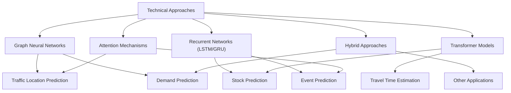
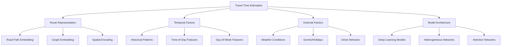
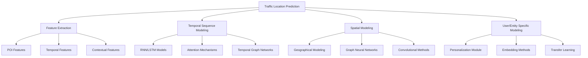
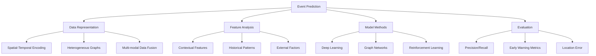
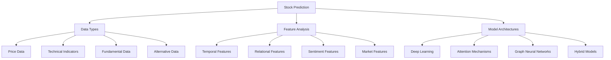
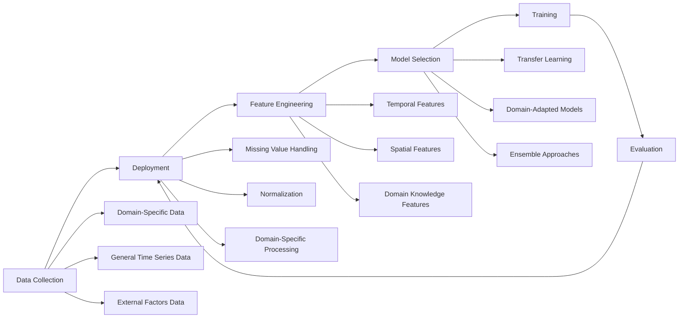

# Domain-Specific Applications

Relevant source files

The following files were used as context for generating this wiki page:

- [README.md](README.md)
- [docs/Recent-Time-Series-Work-Group-by-Task.md](docs/Recent-Time-Series-Work-Group-by-Task.md)

This page documents specialized time series applications in the Time-Series-Works-Conferences repository. While general time series forecasting models (covered in [Multivariable Time Series Forecasting](#2.1) and [Probabilistic Forecasting and Imputation](#2.2)) address a wide range of problems, certain domains require specialized approaches due to their unique characteristics and challenges. This section focuses on domain-specific time series applications including demand prediction, travel time estimation, traffic location prediction, event prediction, stock prediction, and other specialized forecasting areas.

## Overview of Domain-Specific Time Series Applications

The repository categorizes domain-specific applications into several major categories, each with its own unique modeling approaches and datasets:

```mermaid
graph TD
    TS["Time Series Domain Applications"] --> DP["Demand Prediction"]
    TS --> TTE["Travel Time Estimation"]
    TS --> TLP["Traffic Location Prediction"]
    TS --> EP["Event Prediction"]
    TS --> SP["Stock Prediction"]
    TS --> OSA["Other Specialized Applications"]
    
    DP --> TP["Traffic Demand"]
    DP --> MD["Market Demand"]
    DP --> HD["Health Demand"]
    
    TTE --> RTT["Road Travel Time"]
    TTE --> PTT["Public Transport Time"]
    
    TLP --> HPM["Human Mobility Prediction"]
    TLP --> VTP["Vehicle Trajectory Prediction"]
    
    EP --> CP["Crime Prediction"]
    EP --> TA["Traffic Accidents"]
    EP --> DIS["Disease Outbreak"]
    
    SP --> SPP["Stock Price Prediction"]
    SP --> SMP["Stock Movement Prediction"]
    SP --> STP["Stock Trend Prediction"]
    
    OSA --> CY["Crop Yield"]
    OSA --> WQ["Water Quality"]
    OSA --> PP["Popularity Prediction"]
```

Sources: [README.md:278-371]()

## Domain-Specific Models and Their Technical Approaches

Different domain applications leverage various model architectures based on their specific requirements. The following diagram shows the primary technical approaches used across domain applications:

Sources: [README.md:278-497](), [docs/Recent-Time-Series-Work-Group-by-Task.md:274-311]()

## Demand Prediction

Demand prediction is a crucial time series forecasting task focusing on predicting future resource needs across various domains including traffic flow, market demands, and health services.

### Key Characteristics

- **Spatial-Temporal Dependency**: Demand patterns often exhibit both spatial (between locations) and temporal (between timeframes) dependencies
- **Multi-factor Influence**: External factors like weather, events, and holidays significantly impact demand patterns
- **Data Heterogeneity**: Combines various data sources with different scales and formats

### Notable Approaches and Models

| Model Name | Architecture | Key Features | Primary Datasets |
|------------|--------------|--------------|-----------------|
| EAST-Net | Attention-based framework | Event-aware multimodal modeling | JONAS-NYC, COVID datasets |
| CCRNN | Coupled layer-wise GNN | Transportation demand modeling | NYC Bike, NYC Taxi |
| Ada-MSTNet | Multi-scale temporal network | Community-aware modeling | Baidu (Beijing, Shanghai) |
| STMGCN | Spatial-temporal multi-graph CNN | Multi-graph relationship modeling | Beijing, Shanghai data |
| CoST-Net | Co-prediction framework | Multiple transportation demands | NYC Bike, NYC Taxi |

### Implementation Examples

The repository provides links to various implementations using different frameworks:

- Graph-based implementations in PyTorch: CCRNN, STMGCN, MPGCN 
- Attention-based implementations: MultiAttConvLSTM, EAST-Net
- Temporal modeling: Ada-MSTNet, CAS, ST-ED

Sources: [README.md:278-305](), [docs/Recent-Time-Series-Work-Group-by-Task.md:285-290]()

## Travel Time Estimation

Travel time estimation (TTE) focuses on predicting the time required to travel between destinations, a critical component for navigation systems, ride-sharing platforms, and logistics planning.

### Key Characteristics

- **Road Network Constraints**: Models must consider the underlying road network topology
- **Dynamic Traffic Conditions**: Travel times vary significantly based on real-time traffic conditions
- **Route-specific Features**: Different route characteristics impact travel times
- **Temporal Patterns**: Daily and weekly patterns strongly influence travel time prediction

### Technical Approaches

### Notable Approaches and Models

| Model Name | Key Technical Approach | Distinctive Features | Datasets |
|------------|--------------|--------------|----------|
| SSML | Self-supervised meta-learner | Transfer learning across cities | Baidu Maps (Taiyuan, Huizhou, Hefei) |
| HetETA | Heterogeneous information network | Multi-source fusion | DiDi (Shenyang) |
| CompactETA | Efficient inference system | Lightweight model for mobile deployment | DiDi (Beijing, Suzhou, Shenyang) |
| ConSTGAT | Contextual spatial-temporal graph attention | Contextual awareness | Baidu Maps (Multiple cities) |
| DeepTTE | End-to-end framework | Spatio-temporal feature extraction | Chengdu, Beijing |

Sources: [README.md:316-336](), [docs/Recent-Time-Series-Work-Group-by-Task.md:320-334]()

## Traffic Location Prediction

Traffic location prediction focuses on forecasting the future locations or trajectories of moving entities (people, vehicles) based on historical patterns and contextual information.

### Types of Location Prediction Tasks

1. **Next Location Prediction**: Forecasting the next place a user will visit
2. **Trajectory Prediction**: Predicting the complete path an entity will follow
3. **Destination Prediction**: Estimating the final destination of a moving object

### Technical Approaches and Models

### Notable Approaches and Models

| Model | Primary Architecture | Key Innovation | Datasets |
|-------|---------------------|----------------|----------|
| GCDAN | Graph convolutional dual-attention | Dual-attention mechanism | Gowalla, Foursquare, WiFi-Trace |
| MobTCast | Trajectory forecasting | Auxiliary trajectory information | Gowalla, FS-NYC, FS-TKY |
| Social-BiGAT | Bicycle-GAN + attention | Social dynamics modeling | ETH-UCY datasets |
| DeepMove | Attentional RNN | Historical and current preferences | Foursquare, Mobile app data |
| STGAT | Spatial-temporal graph attention | Modeling spatial-temporal interactions | ETH, Hotel, Zara datasets |

Sources: [README.md:347-372](), [docs/Recent-Time-Series-Work-Group-by-Task.md:351-370]()

## Event Prediction

Event prediction focuses on forecasting discrete events such as traffic accidents, crimes, disease outbreaks, and other rare but significant occurrences based on historical patterns and contextual factors.

### Key Characteristics

- **Rare Event Challenge**: Most events of interest are relatively rare, creating class imbalance issues
- **Spatial-Temporal Dependencies**: Events often cluster in space and time with complex dependencies
- **Multi-factor Causality**: Multiple factors contribute to event occurrence with complex interactions
- **Heterogeneous Data Sources**: Requires integration of various data types (text, images, time series)

### Technical Framework

### Notable Approaches and Models

| Model | Primary Focus | Key Technical Approach | Datasets |
|-------|--------------|------------------------|----------|
| GSNet | Traffic accident risk | Geographical and semantic correlation | NYC, Chicago |
| STCGNN | Multi-incident co-prediction | Spatio-temporal-categorical graph networks | NYC/CHI/SF Incidents |
| RiskOracle | Citywide traffic accidents | Minute-level forecasting framework | Beijing, Suzhou, Shenyang |
| DynamicGCN | Social events | Dynamic context graphs | Thailand, Egypt, India, Russia |
| LANTERN | High-dimensional event sequences | Efficient sampling mechanism | MemeTracker, Weibo |

Sources: [README.md:383-406](), [docs/Recent-Time-Series-Work-Group-by-Task.md:387-403]()

## Stock Prediction

Stock prediction represents one of the most extensively studied domain-specific time series applications, focusing on forecasting stock prices, movements, and trends to enable informed investment decisions.

### Key Prediction Tasks

1. **Stock Price Prediction**: Forecasting exact stock price values
2. **Stock Movement Prediction**: Predicting directional movement (up/down)
3. **Stock Trend Prediction**: Identifying longer-term price patterns
4. **Stock Selection**: Selecting stocks with high expected returns

### Technical Approaches

### Notable Approaches and Models

| Model | Focus | Key Innovation | Datasets |
|-------|-------|----------------|----------|
| NumHTML | Financial forecasting | Numeric-oriented hierarchical transformer | Earnings calls |
| TRA | Stock trading patterns | Temporal routing adaptor | CSI800 |
| STHAN-SR | Stock selection | Spatiotemporal hypergraph attention | NASDAQ, NYSE, TSE |
| REST | Stock trend forecasting | Relational event-driven modeling | CSI300, CSI500 |
| LSTM-RGCN | Overnight movement | Stock relation graph modeling | TPX500, TPX100 |

### Model Categories and Technical Implementation

Stock prediction models in the repository generally fall into three technical categories:

1. **Temporal Models**: Primarily focus on capturing time dependencies (LSTM-RGCN, HMG-TF)
2. **Graph-based Models**: Model relationships between stocks (STHAN-SR, AD-GAT)
3. **NLP-augmented Models**: Incorporate textual information (NumHTML, HTML)

Sources: [README.md:418-450](), [docs/Recent-Time-Series-Work-Group-by-Task.md:422-449]()

## Other Specialized Applications

Beyond the major categories above, the repository covers a diverse range of other specialized time series applications spanning domains from healthcare to agriculture.

### Notable Application Areas

| Application Domain | Key Models | Distinctive Approaches | Datasets |
|--------------------|-----------|-----------------------|----------|
| Crop Yield Prediction | GNN-RNN | Geospatial-temporal modeling | American Crop data |
| Epidemic/Disease Prediction | CausalGNN, PopNet | Causal inference, population-level modeling | Global/US disease data |
| Crime Prediction | ST-SHN | Sequential hypergraph networks | NYC, Chicago |
| Health Risk Prediction | UNITE, HiTANet | Multi-source data fusion | NASH, AD, COPD, MIMIC-III |
| Water Quality | PDE-DGN | Differential equation driven networks | Stream water temperature |
| Lightning Prediction | HSTN, LightNet | Heterogeneous spatiotemporal modeling | Lightning datasets |

### Technical Implementation Pipeline

The implementation of domain-specific time series applications typically follows this pipeline:

Sources: [README.md:458-496](), [docs/Recent-Time-Series-Work-Group-by-Task.md:462-495]()

## Datasets for Domain-Specific Applications

The repository catalogs numerous datasets across different domains. The following table highlights key datasets for each domain-specific application:

| Domain | Major Datasets | Data Characteristics | Availability |
|--------|---------------|----------------------|--------------|
| Demand Prediction | NYC Bike/Taxi, DiDi, PeMS | Spatial-temporal, multiple cities | Many publicly available |
| Travel Time Estimation | Baidu, DiDi, GTFS, Porto | Road network, temporal, traffic | Some require application |
| Location Prediction | Gowalla, Foursquare, ETH-UCY | Human mobility, trajectories | Mostly public |
| Event Prediction | NYC/Chicago Incidents, MemeTracker | Discrete events, contextual | Public |
| Stock Prediction | CSI300/800, NASDAQ, NYSE | Financial time series, multi-factor | Many commercial |
| Healthcare | MIMIC-III, NASH, AD | Patient records, temporal, sparse | Often restricted |

Sources: [README.md:278-496](), [docs/Recent-Time-Series-Work-Group-by-Task.md:285-495]()

## Implementation Frameworks and Tools

The repository catalogs implementations across multiple frameworks, with the following distribution:

| Framework | Prevalence | Notable Models | Domain Strength |
|-----------|------------|----------------|----------------|
| PyTorch | Most common | iTransformer, GRIN, STGCN | Graph models, transformers |
| TensorFlow/Keras | Common | DeepMove, STDN, ARNN | RNN-based models |
| MXNet | Less common | STFGNN, STSGCN | Graph models |
| Others (R, Python) | Specialized | NGBoost, LightNet | Statistical approaches |

Sources: [README.md:100-272](), [docs/Recent-Time-Series-Work-Group-by-Task.md:285-495]()

## Integration with Other Time Series Tasks

Domain-specific applications often incorporate techniques from more general time series tasks:

1. **Forecasting Techniques**: Domain applications leverage general forecasting architectures but adapt them to domain characteristics
2. **Imputation Methods**: Many domain datasets contain missing values requiring specialized imputation
3. **Anomaly Detection**: Some domain applications (like stock prediction) incorporate anomaly detection

For more details on these general techniques, see [Multivariable Time Series Forecasting](#2.1) and [Time Series Imputation](#2.2).

Sources: [README.md:80-225]()

## Summary

Domain-specific time series applications represent specialized adaptations of general time series techniques to address unique challenges in fields ranging from transportation to finance and healthcare. These applications typically integrate domain knowledge with advanced modeling approaches to achieve superior performance on specific tasks.

The repository provides a comprehensive collection of papers, models, and implementations across these domain-specific applications, serving as a valuable resource for researchers and practitioners working in these fields.

---