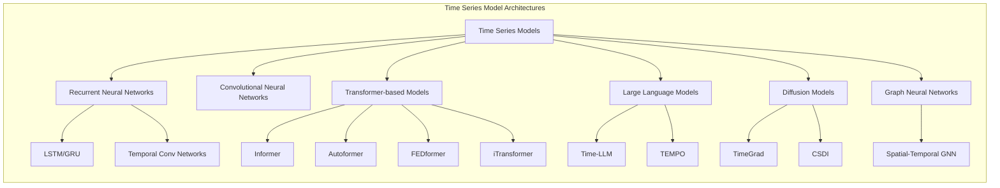
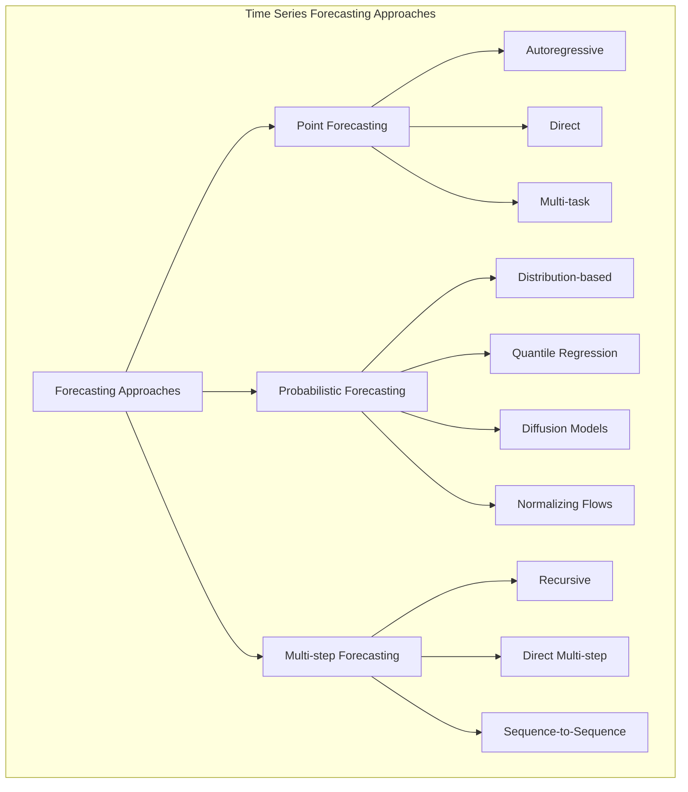
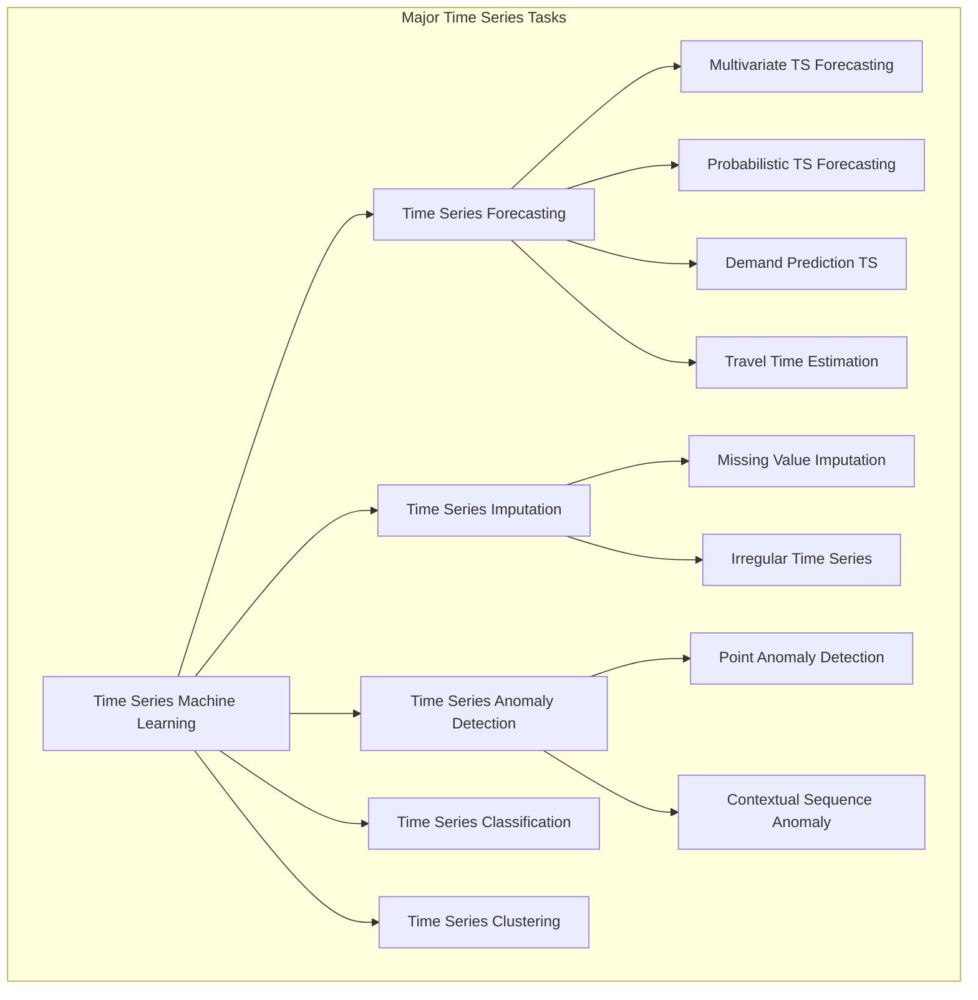
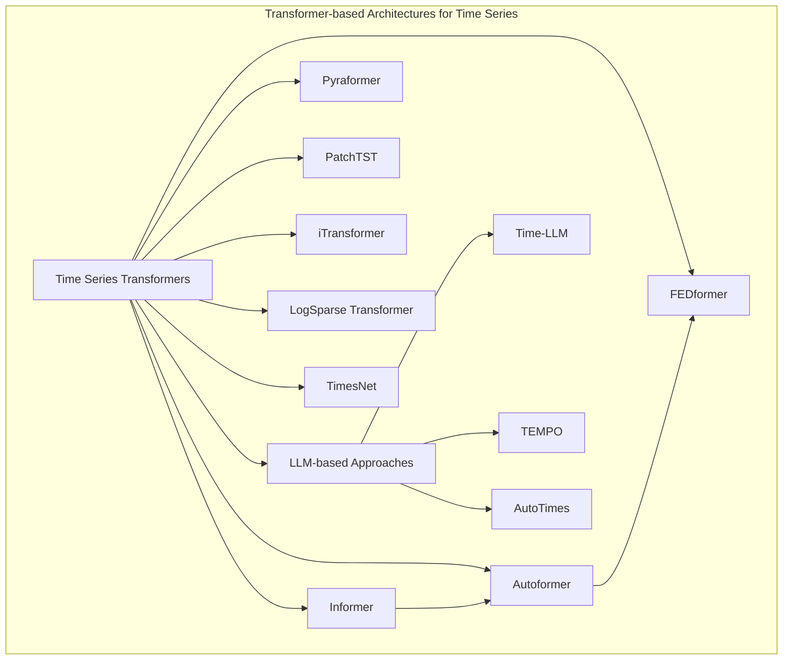
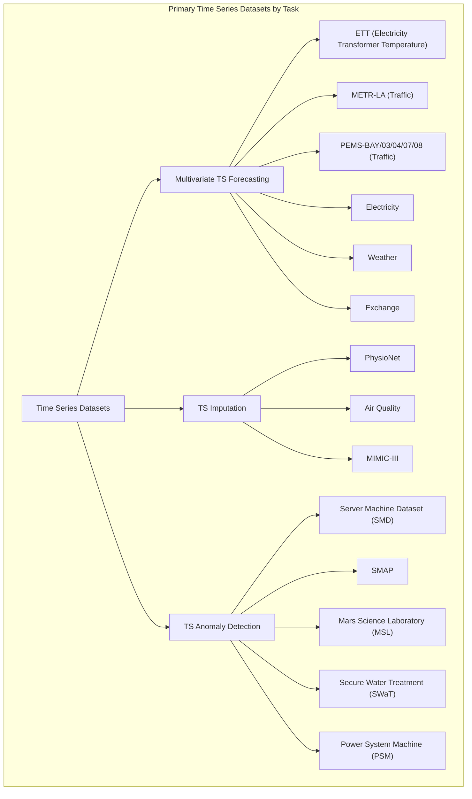
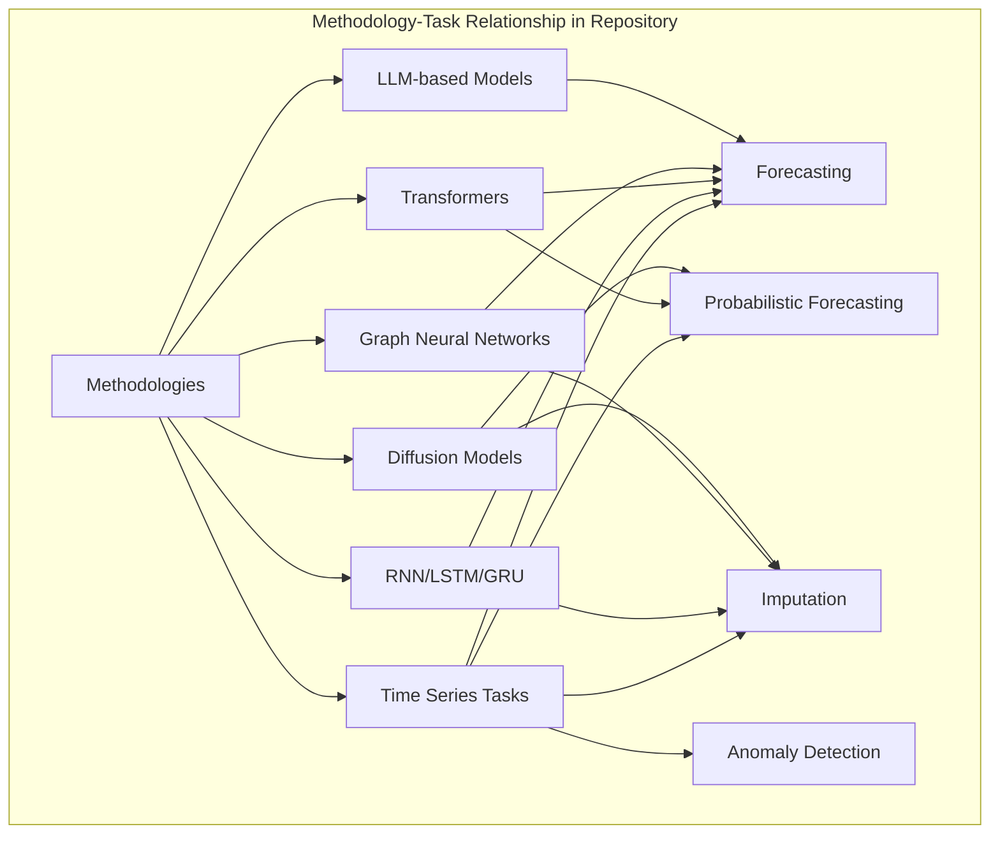

# Time Series Terminology and Abbreviations

Relevant source files

The following files were used as context for generating this wiki page:

- [README.md](README.md)

## Purpose and Scope

This document provides a comprehensive reference for terminology and abbreviations used throughout the Time-Series-Works-Conferences repository. It serves as a guide to help researchers and practitioners understand the specialized language used in time series analysis papers and methodologies. The focus is on terms related to deep learning and machine learning approaches for time series tasks.

For information on specific time series modeling approaches, see [Multivariable Time Series Forecasting](#2.1) and [Probabilistic Forecasting and Imputation](#2.2).

## Common Abbreviations

This section presents the standard abbreviations used throughout the repository's paper listings and categorizations. These abbreviations help reduce repetition while maintaining clarity in the extensive paper listings.

| Full Name | Abbreviation |
|:--|:--|
| Adaptive GNN | AGNN |
| Attention | Attn |  
| AutoRegression (RNN, GRU, LSTM) | AR |
| Controlled Differential Equations | CDE |  
| Contrastive Learning | CL |
| Encoder Decoder | EncDec |  
| Ensemble | Ens |
| Feature Decomposed | FeaD |
| Federated Learning | FL |  
| Generative Adversarial Network | GAN |
| Graph Convolutional Network | GCN |   
| Hour, Day, Week, Month, etc. | HA |
| Heterogeneous GNN | HGNN |
| Multiple Graph | MGNN |
| Memory | Mem |   
| Meta Learning | MetaL |   
| MultiTask | MulT |     
| Network Architecture Search | NAS |  
| Ordinary Differential Equations | ODE |
| Statistic | Stat |
| TCN (WaveNet) | TCN |   
| Temporal Graph Network | TGN |   
| Transformer | Trans |  
| Transfer Learning | TransL |    
| Variational Auto-Encoder | VAE |

Sources: [README.md:53-79](https://github.com/lixus7/Time-Series-Works-Conferences/blob/main/README.md)

## Time Series Modeling Paradigms

This section explains the main modeling paradigms used in time series analysis papers categorized in the repository.

### Temporal Model Architectures

Sources: [README.md:97-187](https://github.com/lixus7/Time-Series-Works-Conferences/blob/main/README.md)

### Forecasting Approaches

Sources: [README.md:81-93](https://github.com/lixus7/Time-Series-Works-Conferences/blob/main/README.md), [README.md:478-531](https://github.com/lixus7/Time-Series-Works-Conferences/blob/main/README.md)

## Time Series Tasks

The repository organizes papers by task categories. This section explains the primary tasks in time series analysis covered in the repository.

### Key Time Series Tasks

Sources: [README.md:82-93](https://github.com/lixus7/Time-Series-Works-Conferences/blob/main/README.md)

## Terminology by Domain

### General Time Series Concepts

| Term | Definition |
|:--|:--|
| Multivariate Time Series | Data that tracks multiple variables over time (e.g., traffic data from multiple sensors) |
| Univariate Time Series | Data that tracks a single variable over time |
| Stationarity | Property where statistical properties like mean and variance don't change over time |
| Seasonality | Regular patterns that repeat at fixed intervals |
| Trend | Long-term progression (increase or decrease) in the data |
| Autocorrelation | Correlation of a signal with a delayed copy of itself |
| Long-term Dependencies | Relationships between data points separated by large time intervals |
| Point Forecasting | Predicting a single future value |
| Probabilistic Forecasting | Predicting a distribution of possible future values |

Sources: [README.md:81-93](https://github.com/lixus7/Time-Series-Works-Conferences/blob/main/README.md), [README.md:478-533](https://github.com/lixus7/Time-Series-Works-Conferences/blob/main/README.md)

### Neural Network Models for Time Series

| Model Type | Description |
|:--|:--|
| RNN (Recurrent Neural Network) | Neural networks designed to process sequential data using recurrence |
| LSTM (Long Short-Term Memory) | Special RNN variant designed to capture long-term dependencies |
| GRU (Gated Recurrent Unit) | Simplified version of LSTM with fewer parameters |
| TCN (Temporal Convolutional Network) | Convolutional networks adapted for temporal data processing |
| Transformer | Architecture using self-attention mechanisms, originally for NLP but adapted for time series |
| GNN (Graph Neural Network) | Neural networks operating on graph-structured data, useful for spatial-temporal data |
| CNN (Convolutional Neural Network) | Neural networks using convolutional layers, adapted for time series |
| VAE (Variational Auto-Encoder) | Generative models using variational inference |
| GAN (Generative Adversarial Network) | Generative models with generator and discriminator components |

Sources: [README.md:53-79](https://github.com/lixus7/Time-Series-Works-Conferences/blob/main/README.md), [README.md:97-187](https://github.com/lixus7/Time-Series-Works-Conferences/blob/main/README.md)

### Time Series Transformer Architectures

Sources: [README.md:138-143](https://github.com/lixus7/Time-Series-Works-Conferences/blob/main/README.md), [README.md:204-207](https://github.com/lixus7/Time-Series-Works-Conferences/blob/main/README.md), [README.md:366-367](https://github.com/lixus7/Time-Series-Works-Conferences/blob/main/README.md)

## Specialized Terminology

### Probabilistic Forecasting Terms

| Term | Description |
|:--|:--|
| Quantile Forecasting | Predicting specific quantiles of the forecast distribution |
| Diffusion Models | Generative models that gradually add and remove noise |
| Normalizing Flows | Models that transform simple distributions into complex ones |
| Conformal Prediction | Method for creating prediction intervals with statistical guarantees |
| Copula | Statistical method for modeling multivariate dependencies |
| Score Matching | Technique for training models by matching score functions |

Sources: [README.md:482-488](https://github.com/lixus7/Time-Series-Works-Conferences/blob/main/README.md), [README.md:509-521](https://github.com/lixus7/Time-Series-Works-Conferences/blob/main/README.md)

### Imputation and Anomaly Detection Terms

| Term | Description |
|:--|:--|
| Missing Value Imputation | Filling in missing values in time series data |
| Irregularly Sampled Time Series | Time series with non-uniform time intervals between observations |
| Point Anomaly | Individual data points that deviate significantly from expected patterns |
| Contextual Anomaly | Data points that are anomalous in a specific context |
| Collective Anomaly | Collection of related data points that are anomalous as a group |
| Reconstruction-based Detection | Anomaly detection using reconstruction error from autoencoders |
| Forecasting-based Detection | Anomaly detection by comparing actual values with forecasts |

Sources: [README.md:558-593](https://github.com/lixus7/Time-Series-Works-Conferences/blob/main/README.md), [README.md:599-609](https://github.com/lixus7/Time-Series-Works-Conferences/blob/main/README.md)

## Common Datasets by Task

Sources: [README.md:97-187](https://github.com/lixus7/Time-Series-Works-Conferences/blob/main/README.md), [README.md:558-593](https://github.com/lixus7/Time-Series-Works-Conferences/blob/main/README.md), [README.md:599-609](https://github.com/lixus7/Time-Series-Works-Conferences/blob/main/README.md)

## Advanced Technical Terminology

### Model Components and Techniques

| Term | Description |
|:--|:--|
| Attention Mechanism | Technique for weighing different parts of the input data |
| Self-Attention | Attention mechanism where the input attends to itself |
| Encoder-Decoder | Architecture with separate components for encoding input and generating output |
| Autoregressive | Models that use past outputs as inputs for future predictions |
| Feature Decomposition | Breaking down time series into component parts (trend, seasonality, etc.) |
| Fourier Transform | Mathematical transform converting time domain to frequency domain |
| State-Space Models | Models representing systems with internal state variables |
| Spatio-Temporal | Models capturing both spatial and temporal relationships |
| Transfer Learning | Using knowledge from one task to improve performance on another |
| Meta-Learning | Learning how to learn, adapting quickly to new tasks |

Sources: [README.md:53-79](https://github.com/lixus7/Time-Series-Works-Conferences/blob/main/README.md), [README.md:178-187](https://github.com/lixus7/Time-Series-Works-Conferences/blob/main/README.md)

## Relationship Between Methodology and Tasks

Sources: [README.md:81-93](https://github.com/lixus7/Time-Series-Works-Conferences/blob/main/README.md), [README.md:97-187](https://github.com/lixus7/Time-Series-Works-Conferences/blob/main/README.md), [README.md:478-533](https://github.com/lixus7/Time-Series-Works-Conferences/blob/main/README.md)

## Conclusion

This terminology guide serves as a reference for understanding the specialized language used in time series research papers collected in the repository. The abbreviations and terms cover the main modeling approaches, tasks, and techniques in time series analysis, with a focus on deep learning methods. For detailed information about specific papers and implementations, refer to the corresponding task sections in the repository.

---