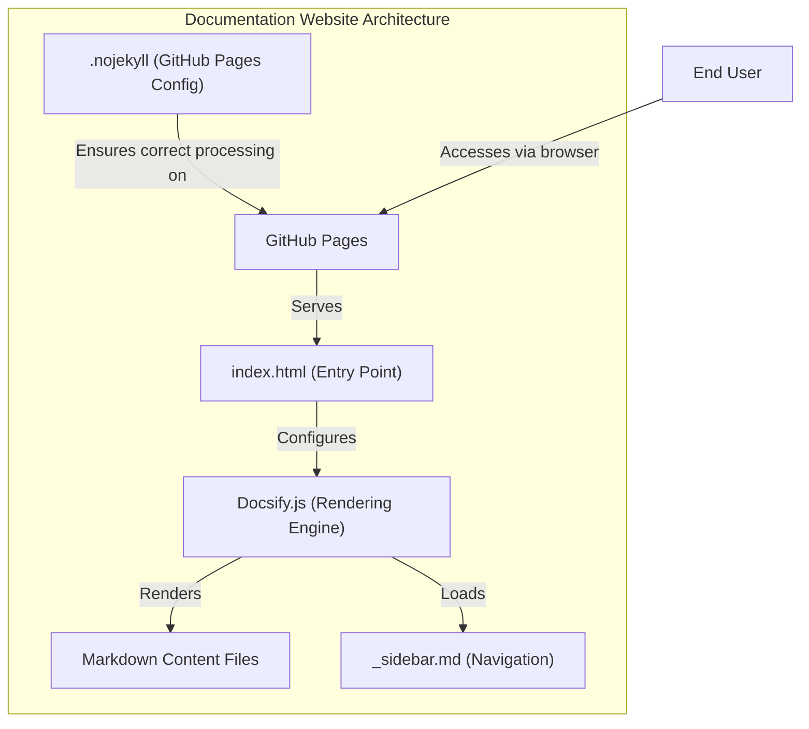
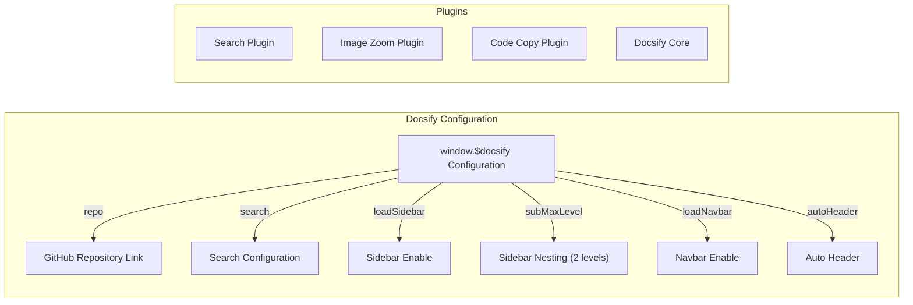
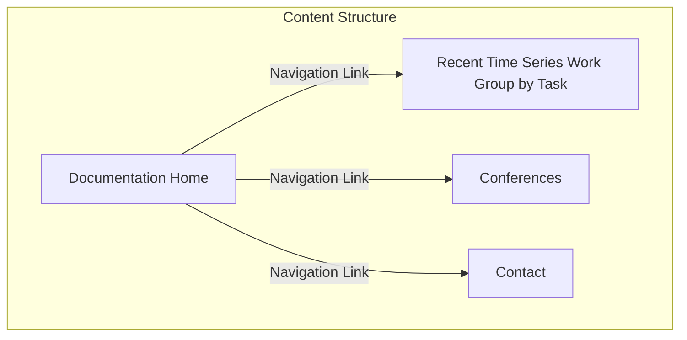
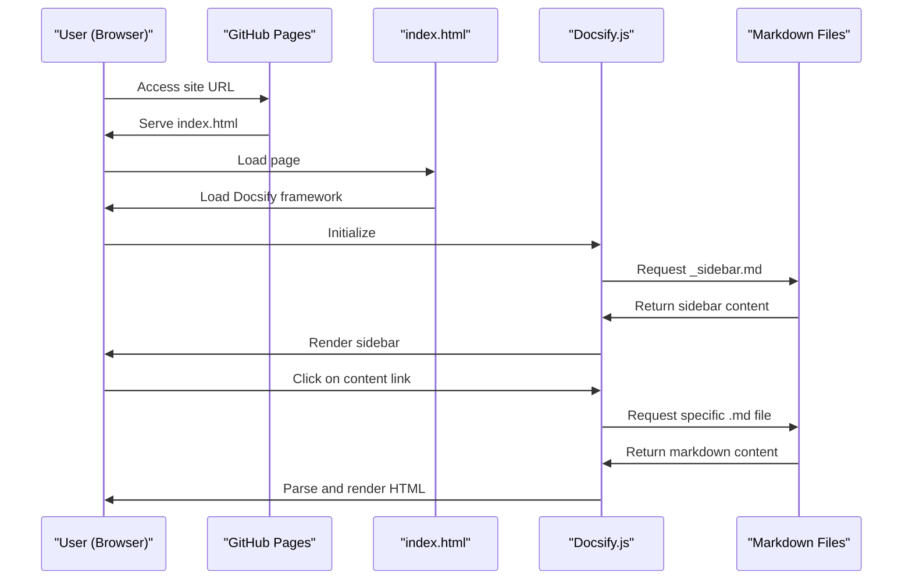

# Documentation Website

Relevant source files

The following files were used as context for generating this wiki page:

- [docs/.nojekyll](docs/.nojekyll)
- [docs/_sidebar.md](docs/_sidebar.md)
- [docs/index.html](docs/index.html)

The Documentation Website serves as the user-friendly interface for accessing the Time-Series-Works-Conferences repository content. This page explains the technical architecture of the documentation site, how it's configured, and how it renders content for users. For information about the actual research content organization, see [Time Series Research Collection](#2).

## Documentation Site Architecture

The documentation website uses Docsify.js, a lightweight documentation site generator that dynamically renders Markdown files into HTML. Unlike traditional static site generators, Docsify doesn't generate static HTML files but instead loads and parses Markdown files on-the-fly in the browser.

Sources: [docs/index.html:1-32](), [docs/_sidebar.md:1-3](), [docs/.nojekyll:1]()

## Core Configuration

The documentation site is configured in the main `index.html` file, which sets up Docsify and its various plugins. The key configuration parameters define how the site behaves and renders content.

Sources: [docs/index.html:13-23](), [docs/index.html:24-31]()

### Configuration Details

The `index.html` file contains the following key configuration settings for the documentation site:

| Configuration Parameter | Value | Purpose |
|------------------------|-------|---------|
| `repo` | https://github.com/lixus7/Time-Series-Works-Conferences | Links to the GitHub repository and displays the GitHub corner icon |
| `search` | 'auto' | Enables automatic global search functionality |
| `loadSidebar` | true | Loads the sidebar from `_sidebar.md` file |
| `subMaxLevel` | 2 | Sets maximum nesting level for sidebar navigation |
| `loadNavbar` | true | Enables navbar loading from `_navbar.md` |
| `autoHeader` | true | Automatically adds headers to content pages |

Sources: [docs/index.html:14-22]()

### Plugins

The documentation site utilizes several Docsify plugins to enhance functionality:

1. **Search Plugin**: Enables full-text search across all content pages
2. **Image Zoom Plugin**: Allows users to click and zoom in on images
3. **Code Copy Plugin**: Adds copy buttons to code blocks for easy copying

Sources: [docs/index.html:24-29]()

## Content Structure and Navigation

The documentation website's navigation is primarily controlled through the `_sidebar.md` file, which defines the main sections of the site. The current structure includes three main sections:

Sources: [docs/_sidebar.md:1-3]()

Each item in the sidebar links to a corresponding Markdown file in the `docs` directory. For example, the "Recent Time Series Work Group by Task" item links to the `Recent-Time-Series-Work-Group-by-Task.md` file.

## Rendering Process

When a user accesses the documentation website, the following process occurs:

Sources: [docs/index.html:1-32]()

### Key Features of the Rendering Process

1. **Dynamic Rendering**: Docsify converts Markdown to HTML on-the-fly in the browser
2. **No Build Step**: Unlike static site generators, Docsify doesn't require a build process
3. **GitHub Pages Integration**: The `.nojekyll` file ensures GitHub Pages doesn't process the site with Jekyll

Sources: [docs/.nojekyll:1](), [docs/index.html:11-32]()

## How To Navigate the Documentation Site

### Sidebar Navigation

The sidebar provides the main navigation structure for the documentation site. Currently, it contains three main sections:

1. **Recent Time Series Work Group by Task**: Contains the main research paper collection organized by task categories
2. **Conferences**: Lists relevant conferences and their details
3. **Contact**: Provides contact information for the repository maintainers

Sources: [docs/_sidebar.md:1-3]()

### Search Functionality

The documentation site includes a full-text search feature that allows users to search across all content pages. The search is configured with the `search: 'auto'` parameter in the Docsify configuration.

Sources: [docs/index.html:17](), [docs/index.html:25]()

## GitHub Pages Configuration

The documentation site is hosted on GitHub Pages and includes a `.nojekyll` file to prevent GitHub's Jekyll processor from processing the site. This is required for Docsify to function correctly on GitHub Pages.

Sources: [docs/.nojekyll:1]()

## Technical Implementation Summary

The documentation website is a lightweight, browser-based rendering system with these key components:

| Component | File | Purpose |
|-----------|------|---------|
| Entry Point | `index.html` | Main HTML file that loads Docsify and contains configuration |
| Navigation | `_sidebar.md` | Defines the sidebar navigation structure |
| GitHub Pages Config | `.nojekyll` | Prevents Jekyll processing on GitHub Pages |
| Content | `*.md` files | Markdown files containing the actual documentation content |
| Rendering Engine | Docsify.js | JavaScript library that converts Markdown to HTML |

Sources: [docs/index.html:1-32](), [docs/_sidebar.md:1-3](), [docs/.nojekyll:1]()

---