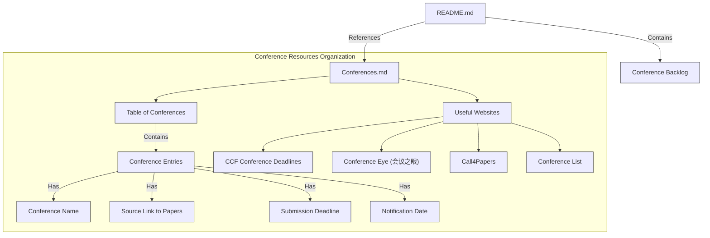
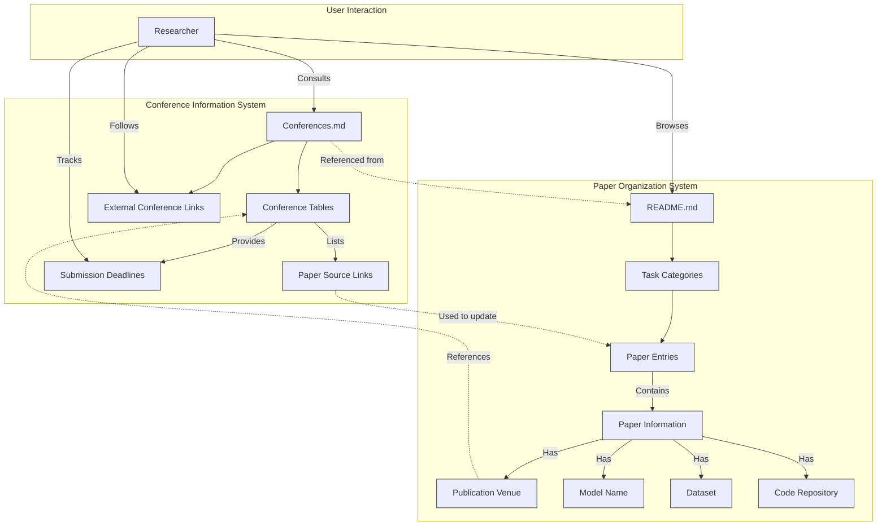
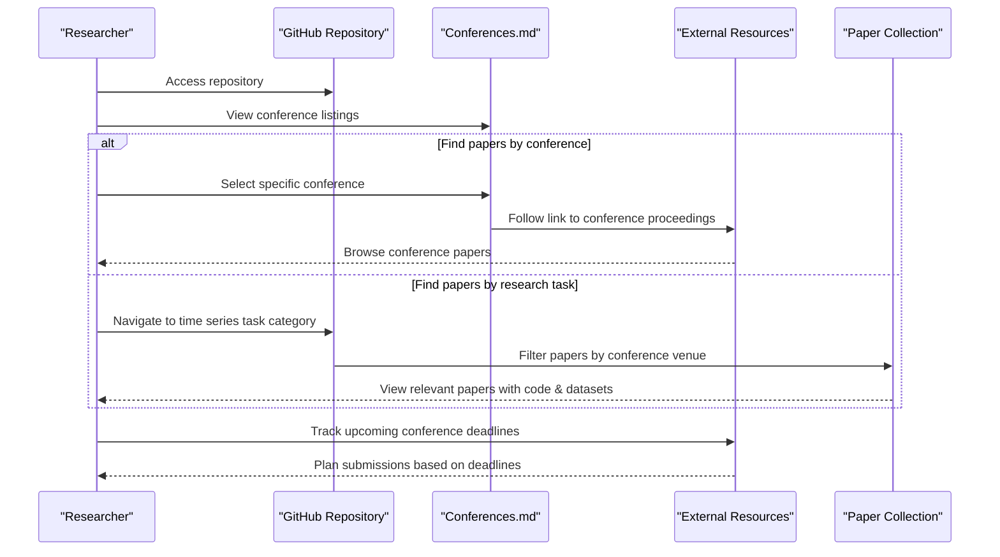
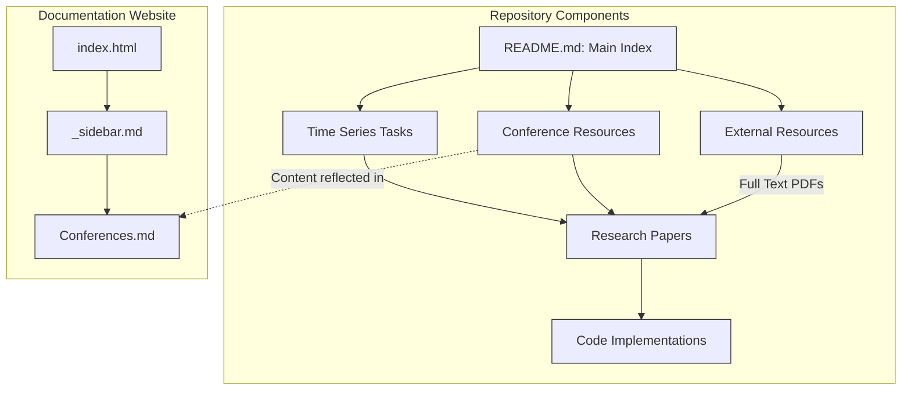

# Conference Resources

<details>
<summary>Relevant source files</summary>

The following files were used as context for generating this wiki page:

- [README.md](README.md)
- [docs/Conferences.md](docs/Conferences.md)

</details>


## Purpose and Scope

This page documents the conference resources available in the Time-Series-Works-Conferences repository. It covers how conference information is tracked, organized, and accessed to facilitate time series research. The conference resources provide a comprehensive reference for researchers to stay updated on relevant academic venues, submission deadlines, and accepted papers in the time series domain. For information about external resources like Google Drive and OneDrive paper collections, see [External Resources](#5).

Sources: [README.md:7-10]()

## Conference Tracking System

The repository maintains a structured system for tracking major AI/ML conferences relevant to time series research. This includes historical conference information as well as upcoming events. The tracking system serves several purposes:

1. Providing links to accepted papers from past conferences
2. Tracking submission deadlines for upcoming conferences
3. Maintaining a backlog of future conferences to monitor
4. Offering convenient access to conference websites and paper listings

### Conference Backlog System

The repository maintains a "Backlog" system at the top of the README file to track upcoming conferences that will be added to the resource list once their papers are published.

```
# Backlog (To do): KDD 2025, ...
```

This allows researchers to anticipate which conference proceedings will be added to the collection in the future.

Sources: [README.md:3]()

## Conference Information Structure

The conference information is primarily stored in the Conferences.md file, which provides a well-organized table of major AI/ML conferences relevant to time series research.



Sources: [docs/Conferences.md:11-21](), [docs/Conferences.md:22-33]()

## Major Tracked Conferences

The repository systematically tracks the following major conferences that frequently publish time series research:

| Conference | Description | Relevance to Time Series |
|------------|-------------|--------------------------|
| AAAI | Association for the Advancement of Artificial Intelligence | Publishes broad AI research including time series forecasting |
| IJCAI | International Joint Conference on Artificial Intelligence | Features various time series applications |
| KDD | Knowledge Discovery and Data Mining | Strong focus on time series mining and forecasting |
| WWW | The Web Conference | Web-based time series applications |
| ICLR | International Conference on Learning Representations | Deep learning approaches for time series |
| ICML | International Conference on Machine Learning | Core machine learning techniques for time series |
| NeurIPS | Neural Information Processing Systems | Neural approaches to time series problems |
| CIKM | Conference on Information and Knowledge Management | Information extraction from time series |
| WSDM | Web Search and Data Mining | Web-related time series mining |

Each conference section provides links to accepted papers, submission deadlines, and notification dates when available.

Sources: [docs/Conferences.md:34-136]()

## Conference Resource Integration

The conference resources are integrated with the paper collection system to provide a comprehensive research reference. The following diagram illustrates how conference information is connected to the paper listings in the repository:



Sources: [README.md:82-93](), [docs/Conferences.md:22-33]()

## External Conference Resources

The repository provides links to several external websites for tracking conference deadlines and calls for papers:

1. **CCF Conference Deadlines** - A resource from the China Computer Federation for tracking submission deadlines
2. **Conference Eye (会议之眼)** - A Chinese website for conference tracking
3. **Call4Papers** - A website aggregating calls for papers
4. **Conference List** - A listing of upcoming conferences

Additionally, the repository recommends using the following databases for querying conference information:
- **DBLP** - A comprehensive computer science bibliography database
- **Aminer** - A free online academic search and mining system (with Chinese interface option)

These external resources complement the internal conference tracking and provide additional ways to discover relevant conferences.

Sources: [docs/Conferences.md:11-21](), [docs/Conferences.md:6-8]()

## Conference Paper Access Flow

The following diagram illustrates how a researcher would typically access conference papers through this resource:



Sources: [README.md:82-93](), [docs/Conferences.md:22-136]()

## Conference Papers in Research Collection

The conference information system directly supports the main paper collection, which organizes time series research by task and methodology. Each paper entry in the collection includes the publication venue, linking back to the relevant conference.

Example paper entry format:

| Task | Data | Model | Paper | Code | Publication |
|------|------|-------|-------|------|-------------|
| Multivariable | Dataset Name | Model Name | Paper Title | Repository Link | Conference Year |

This integration allows researchers to:
1. Find relevant papers from specific conferences
2. Track which conferences publish the most relevant time series research
3. Identify trends in time series research across different conferences over time

Sources: [README.md:98-199]()

## Relationship to Other Repository Components

The Conference Resources component is one part of the larger repository ecosystem, as shown in the following diagram:



The Conference Resources component provides the contextual information about where time series research is published, complementing the task-based organization of papers in the main collection.

Sources: [README.md:7-10](), [README.md:82-93]()

## Alternative AI/ML Conference Resources

In addition to the built-in conference tracking, the repository also links to an external GitHub repository specifically focused on conference papers:

```
[AI ML Summary Github](https://github.com/Lionelsy/Conference-Accepted-Paper-List)
```

This resource provides an alternative way to browse AI/ML conference papers and may include conferences not directly tracked in the Time-Series-Works-Conferences repository.

Sources: [README.md:10]()

## Maintaining and Updating Conference Information

The conference information is maintained through regular updates to both the README.md and Conferences.md files. As new conferences occur, their proceedings are added to the respective conference sections, and papers relevant to time series research are integrated into the task-based paper collection.

The backlog system at the top of the README.md file ensures that upcoming conferences are tracked and eventually incorporated into the resource collection.

Sources: [README.md:3](), [docs/Conferences.md:22-136]()

---