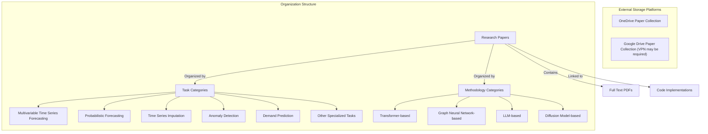
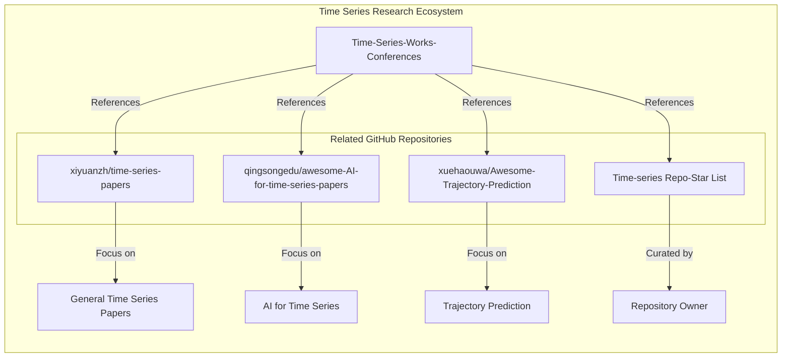
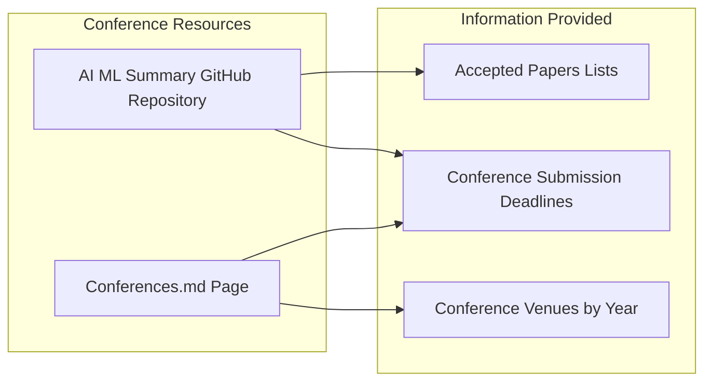
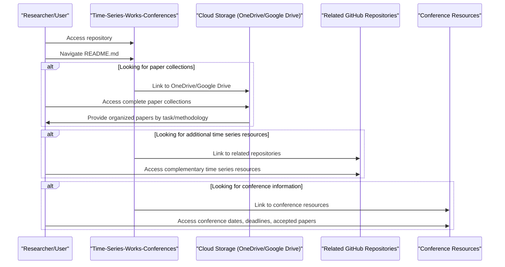
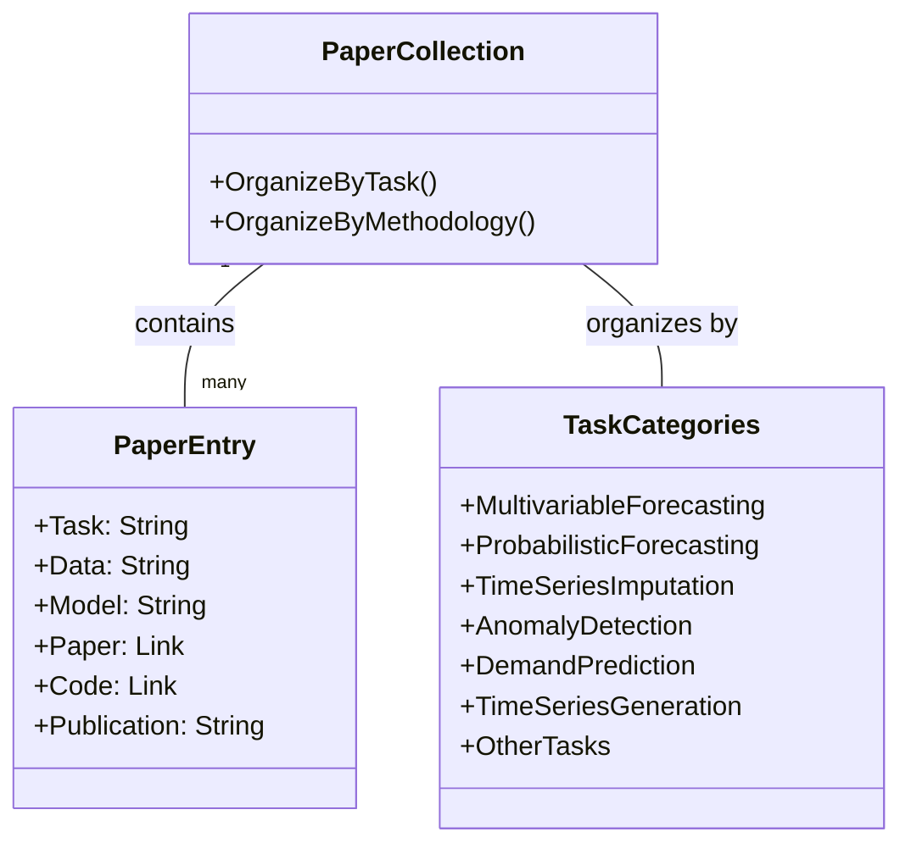

# External Resources

Relevant source files

The following files were used as context for generating this wiki page:

- [README.md](README.md)
- [docs/README.md](docs/README.md)

This page documents the external resources linked from the Time-Series-Works-Conferences repository. These resources include cloud storage platforms hosting comprehensive paper collections, related GitHub repositories focusing on time series research, and other online resources that complement the repository's content. For conference-specific information, see [Conference Resources](#4).

## Paper Collections on Cloud Storage

The Time-Series-Works-Conferences repository links to external cloud storage platforms that host complete collections of time series research papers. These collections include papers that might not be directly listed in the GitHub repository and are organized by both task and methodology categories.

**Diagram: Paper Collections Organization Structure**

The paper collections are accessible through:

- **OneDrive**: [https://1drv.ms/u/s!Au2cJRs-_u93lDbLrSDkDy8htv2V?e=ftuaXd](https://1drv.ms/u/s!Au2cJRs-_u93lDbLrSDkDy8htv2V?e=ftuaXd)
- **Google Drive**: [https://drive.google.com/drive/folders/17bILWdDxUrufRp3yilYfoU5VKywwS1g6?usp=sharing](https://drive.google.com/drive/folders/17bILWdDxUrufRp3yilYfoU5VKywwS1g6?usp=sharing)

These collections feature:

- Papers organized by research task (forecasting, imputation, anomaly detection, etc.)
- Papers organized by methodology approach (transformer-based, GNN-based, etc.)
- Full-text PDFs available for download
- Comprehensive coverage of papers mentioned in the GitHub repository and additional related work

Sources: [README.md:42-47]()

## Related GitHub Repositories

The repository links to several other high-quality GitHub repositories that also focus on time series research. These repositories offer complementary perspectives, organizations, and collections of time series papers and resources.

**Diagram: Related GitHub Repositories Ecosystem**

The related repositories include:

| Repository | Description | Link |
|------------|-------------|------|
| xiyuanzh/time-series-papers | Collection of time series research papers | [GitHub Link](https://github.com/xiyuanzh/time-series-papers) |
| qingsongedu/awesome-AI-for-time-series-papers | Comprehensive list of AI applications for time series | [GitHub Link](https://github.com/qingsongedu/awesome-AI-for-time-series-papers) |
| xuehaouwa/Awesome-Trajectory-Prediction | Focused on trajectory prediction papers | [GitHub Link](https://github.com/xuehaouwa/Awesome-Trajectory-Prediction) |
| Time-series Repo-Star List | Repository owner's curated list of time series repositories | [GitHub Link](https://github.com/stars/lixus7/lists/time-series-list) |

Each of these repositories offers a different organization or focus on time series research, providing complementary resources to the main repository.

Sources: [README.md:12-20]()

## AI/ML Conference Resources

The repository links to external resources for tracking AI/ML conferences relevant to time series research.

**Diagram: Conference Resource Structure**

The main external resource for conference information is:

- **AI ML Summary GitHub**: A repository that tracks conference information including accepted papers. Available at [GitHub Link](https://github.com/Lionelsy/Conference-Accepted-Paper-List)

This complements the repository's internal Conferences page, which provides more structured information about conferences relevant to time series research.

Sources: [README.md:10]()

## Resource Access Integration

The following diagram illustrates how users typically interact with the repository and its external resources:

**Diagram: User Interaction Flow with External Resources**

This integration enables users to:

1. Browse the repository for a curated index of time series papers
2. Access full-text PDFs through cloud storage links
3. Explore complementary resources through related repositories
4. Stay updated on relevant conferences through linked conference resources

Sources: [README.md:5-47]()

## External Resource Data Organization

The time series papers in the external resources are organized in a consistent structure that mirrors the repository's organization. The main categorization is by task, with each paper entry containing detailed information.

**Diagram: Paper Entry Structure in External Resources**

The typical paper entry structure includes:

1. Task type (e.g., Multivariable Forecasting, Imputation)
2. Dataset information
3. Model name and approach
4. Link to the original paper
5. Link to code implementation (if available)
6. Publication venue and date

This consistent organization makes it easy to find relevant papers across both the repository and external resources.

Sources: [README.md:97-198]()

## Using the External Resources

To effectively use the external resources linked from this repository:

1. **For comprehensive paper access:**
   - Visit the OneDrive or Google Drive links to access full-text PDFs
   - Papers are organized by task and methodology categories

2. **For exploring complementary time series resources:**
   - Visit the related GitHub repositories for different organizational approaches
   - The repository owner's starred list provides additional curated resources

3. **For conference information:**
   - Check the AI ML Summary GitHub for up-to-date information about conferences
   - Visit the repository's Conferences page for structured conference information

4. **For finding specific papers:**
   - Use the repository's task-based tables to find paper details
   - Follow the cloud storage links to access full papers

These external resources complement the repository's main content, providing comprehensive access to time series research papers and related information.

Sources: [README.md:42-47](), [README.md:12-20](), [README.md:10]()

---