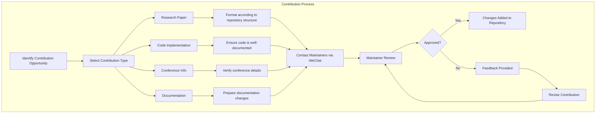

# Contact and Contribution

Relevant source files

The following files were used as context for generating this wiki page:

- [.gitignore](.gitignore)
- [docs/Contact.md](docs/Contact.md)
- [docs/img/WeChat.jpeg](docs/img/WeChat.jpeg)

This page provides information on how to contact the repository maintainers and how to contribute to the Time-Series-Works-Conferences repository. It outlines the various methods of communication and explains the procedures for submitting contributions to enhance this curated knowledge base of time series research.

## Contact Information

The primary method to contact the repository maintainers is through WeChat. You can scan the QR code below to connect:

Feel free to reach out for:
- Questions about specific papers or models
- Suggestions for new content categories
- Requests for additional resources
- Clarification on research implementations
- Discussion of time series methodologies

Sources: [docs/Contact.md]()

## Contribution Methods

There are several ways to contribute to this repository:

| Contribution Type | Description | Recommended Format |
|-------------------|-------------|-------------------|
| Research Papers | Suggest new papers related to time series tasks | Include title, authors, publication venue, link to paper, and relevant task category |
| Code Implementations | Share implementations of time series models | Provide GitHub repository link with clear documentation |
| Conference Information | Update details on upcoming conferences | Include submission deadlines, conference dates, and website links |
| Dataset Resources | Contribute new or updated datasets | Share dataset link, description, and sample usage |
| Documentation Improvements | Enhance the existing documentation | Submit specific changes with clear rationale |
| Bug Reports | Report issues with the repository | Describe the problem with steps to reproduce |

## Contribution Workflow

The diagram below illustrates the typical workflow for contributing to this repository:

Sources: [docs/Contact.md]()

## Repository Structure and Contribution Areas

This diagram shows how contributions fit into the overall repository structure, highlighting the specific areas where contributions are most valuable:

```mermaid
graph TD
    subgraph "Repository Components"
        README["README.md"] --> TST["Time Series Tasks"]
        README --> Resources["External Resources"]
        README --> Glossary["Terminology & Abbreviations"]
        
        TST --> MTSF["Multivariable Time Series Forecasting"]
        TST --> PTF["Probabilistic Time Series Forecasting"]
        TST --> TSI["Time Series Imputation"]
        TST --> TSAD["Time Series Anomaly Detection"]
        TST --> OtherTasks["Other Specialized Tasks"]
        
        Resources --> Conferences["Conference Information"]
        Resources --> Datasets["Dataset Resources"]
        Resources --> CodeImpl["Code Implementations"]
        
        DocsWebsite["Documentation Website"] --> TSWorks["Time Series Work by Task"]
        DocsWebsite --> ConfPage["Conferences Page"]
        DocsWebsite --> ContactPage["Contact Page"]
    end
    
    subgraph "Contribution Areas" 
        ContribPapers["Paper Contributions"] -.->|"Add to"| TST
        ContribCode["Code Contributions"] -.->|"Enhance"| CodeImpl
        ContribConf["Conference Updates"] -.->|"Update"| Conferences
        ContribDocs["Documentation Improvements"] -.->|"Improve"| DocsWebsite
        ContribTerms["Terminology & Abbreviations"] -.->|"Expand"| Glossary
    end
```

Sources: [docs/Contact.md](), Repository structure diagrams from prompt

## Contribution Guidelines

When contributing to this repository, please follow these guidelines:

### For Research Papers
- Verify that the paper hasn't already been included in the repository
- Categorize the paper according to its primary time series task (forecasting, imputation, anomaly detection, etc.)
- Include all relevant details: title, authors, conference/journal, year, links to paper and code (if available)
- Briefly describe the key contributions and methodology

### For Code Implementations
- Ensure code is well-documented and includes clear instructions for usage
- Specify dependencies and requirements
- Include references to the original research paper (if applicable)
- Provide examples of input/output formats

### For Conference Information
- Verify all dates and deadlines
- Include links to the official conference website
- Note any special tracks or workshops related to time series analysis

### For Documentation Improvements
- Be specific about what content needs to be updated
- Provide suggested text for changes
- Explain the rationale for the proposed improvements

## Contribution Review Process

All contributions are reviewed by the repository maintainers before inclusion. The review process focuses on:

1. Relevance to time series research
2. Quality and accuracy of information
3. Adherence to the repository's structure and formatting
4. Value added to the existing collection

Feedback will be provided through WeChat, and contributors may be asked to make revisions before their contributions are accepted.

## Submitting Large Contributions

For substantial contributions (multiple papers, extensive code, or new sections), please:

1. Contact the maintainers first to discuss the scope of your contribution
2. Provide an outline of what you plan to contribute
3. Agree on a timeline and format for the submission

## Acknowledgment of Contributions

Contributors will be acknowledged in the repository. If you would like to be acknowledged in a specific way, please mention this when submitting your contribution.

---

Thank you for your interest in improving this time series research knowledge base. Your contributions help make this repository a valuable resource for the time series research community.

Sources: Repository structure diagrams from prompt