Welcome to the Time-Series Works and Conferences repository - your comprehensive resource for time series research papers, implementations, and conference information. This project serves as a meticulously curated collection of cutting-edge research in time series forecasting, analysis, and applications, organized by both task categories and methodological approaches.


The repository is maintained by researchers at UNSW, Sydney, under the supervision of Prof. Flora Salim and Hao Xue, with ongoing updates to include the latest advances in time series research from top-tier conferences.

Sources: [README.md](README.md#L1-L30), [docs/README.md](docs/README.md#L1-L25)

## Project Structure

The repository follows a clear, hierarchical structure designed to help you navigate efficiently through time series research resources. All documentation is powered by Docsify, providing a clean and interactive reading experience through the GitHub Pages site.

```
Time-Series-Works-Conferences/
├── README.md                    # Main entry point with project overview
├── docs/                        # Documentation root
│   ├── README.md               # Docs landing page
│   ├── Recent-Time-Series-Work-Group-by-Task.md    # Core paper collection
│   ├── Conferences.md          # Conference deadlines and rankings
│   ├── Contact.md              # Author contact information
│   ├── _sidebar.md             # Navigation sidebar configuration
│   ├── index.html              # Docsify configuration
│   └── img/                    # Image assets
└── license                     # Repository license
```


Sources: [docs/index.html](docs/index.html#L1-L33), [docs/_sidebar.md](docs/_sidebar.md#L1-L3)

## Architecture Overview

The repository is built around a dual-organization system: task-based categorization and methodology-based classification. This dual approach enables multiple navigation pathways depending on whether you're searching by application domain or by technical approach.

```mermaid
graph TD
    A[Time-Series Repository] --> B[Task-Based Organization]
    A --> C[Methodology-Based Organization]
    A --> D[Conference Resources]
    A --> E[External Resources]
    
    B --> B1[Multivariate Forecasting]
    B --> B2[Probabilistic Forecasting]
    B --> B3[Time Series Imputation]
    B --> B4[Anomaly Detection]
    B --> B5[Time Series Generation]
    B --> B6[Specialized Applications]
    
    C --> C1[Transformer Models]
    C --> C2[Graph Neural Networks]
    C --> C3[LLM-Empowered Models]
    C --> C4[Foundation Models]
    C --> C5[Classical Methods]
    
    D --> D1[CCF Rankings]
    D --> D2[Conference Deadlines]
    D --> D3[Paper Collections]
    
    E --> E1[OneDrive Papers]
    E --> E2[Google Drive Resources]
    E --> E3[Related Repositories]
    
    style A fill:#e1f5ff
    style B fill:#fff3e0
    style C fill:#f3e5f5
    style D fill:#e8f5e9
    style E fill:#fce4ec
```



Sources: [README.md](README.md#L55-L80), [docs/Recent-Time-Series-Work-Group-by-Task.md](docs/Recent-Time-Series-Work-Group-by-Task.md#L1-L30)

## Core Resources

The repository provides three primary categories of resources to support your time series research journey:

### Paper Collection

A comprehensive collection of 100+ research papers from top-tier conferences (NeurIPS, ICML, ICLR, KDD, AAAI, IJCAI), each paper includes:
- **Task Category**: Specific application domain (e.g., Multivariate Forecasting, Anomaly Detection)
- **Dataset**: Benchmark datasets used in evaluation
- **Model Name**: Methodology or model architecture
- **Paper Link**: Direct access to the full publication
- **Code Repository**: Official implementations when available
- **Publication Venue**: Conference/journal with CCF ranking

### Conference Information

Detailed conference resources including:
- **CCF Rankings**: CCF-A, CCF-B, and CCF-C classifications
- **Deadlines**: Submission and notification dates
- **Paper Lists**: Links to accepted papers by year
- **Quality Ranking**: Conference quality assessment based on average paper quality

### Methodology Guide

A standardized abbreviation system to navigate technical approaches efficiently:

| Full Name | Abbreviation | Category |
|-----------|--------------|----------|
| Transformer | Trans | Neural Architecture |
| Graph Convolutional Network | GCN | Graph Learning |
| Temporal Graph Network | TGN | Graph Learning |
| Attention | Attn | Mechanism |
| Memory | Mem | Component |
| Encoder Decoder | EncDec | Architecture |
| AutoRegression | AR | Classical Method |
| Variational Auto-Encoder | VAE | Generative Model |
| Contrastive Learning | CL | Learning Paradigm |
| Federated Learning | FL | Learning Paradigm |

Sources: [README.md](README.md#L55-L85), [docs/Conferences.md](docs/Conferences.md#L1-L50)

## Key Features

### Comprehensive Coverage

The repository spans multiple research domains and applications, organized into specialized categories:

- **Core Task Categories**: Foundational time series analysis tasks including forecasting, imputation, and generation
- **Specialized Applications**: Domain-specific implementations in traffic prediction, demand forecasting, event prediction, and financial markets
- **Research Methodology**: Detailed exploration of modern approaches including Transformers, GNNs, and LLM-empowered models
- **Conference Resources**: Up-to-date information on submission deadlines, rankings, and paper collections

### Practical Resources

Beyond paper listings, the repository provides:

| Resource Type | Description | Access Method |
|---------------|-------------|---------------|
| **Paper Files** | Complete PDF collection including unpublished work | OneDrive / Google Drive |
| **Code Repositories** | Official implementations with star counts | GitHub links |
| **Related Projects** | Curated list of complementary repositories | External links |
| **Contact Information** | Direct communication with maintainers | WeChat / GitHub Issues |

> [!TIP]
> The repository maintains papers both in GitHub and external cloud storage (OneDrive/Google Drive), ensuring access to comprehensive resources including those not yet incorporated into the main repository structure.

### Quality Assurance

Papers are systematically evaluated based on:
- **Publication Venue**: CCF ranking and conference prestige
- **Code Availability**: Implementation quality and community adoption
- **Reproducibility**: Dataset availability and experimental clarity
- **Impact**: Citation metrics and community interest

The maintainers rank conferences by average paper quality: NeurIPS > ICML > ICLR > KDD > AAAI > IJCAI > WWW > CIKM > ICDM > WSDM, providing guidance for resource prioritization.

Sources: [README.md](README.md#L45-L65), [docs/Recent-Time-Series-Work-Group-by-Task.md](docs/Recent-Time-Series-Work-Group-by-Task.md#L1-L20)

## Getting Started

To make the most of this repository, follow this recommended progression based on your background and goals:

### For Beginners

If you're new to time series research, start with the foundational concepts:

1. **Understand the Landscape**: Read this overview and explore the [Quick Start](2-quick-start) guide for practical navigation tips
2. **Learn Core Tasks**: Begin with [Multivariate Time Series Forecasting](4-multivariate-time-series-forecasting) as the most common research area
3. **Study Methodologies**: Review the [Methodology Abbreviations Guide](14-methodology-abbreviations-guide) to understand technical terminology
4. **Explore Implementations**: Follow code repositories to see how theoretical approaches are applied

### For Researchers

If you're looking for specific research areas or methodologies:

1. **Browse by Task**: Navigate to your domain of interest (e.g., [Time Series Imputation](6-time-series-imputation), [Time Series Anomaly Detection](7-time-series-anomaly-detection))
2. **Study Methodology**: Explore specific approaches like [Transformer-based Models](15-transformer-based-models) or [Graph Neural Networks](16-graph-neural-networks-for-time-series)
3. **Check Conferences**: Review [Conference Rankings and CCF Standards](19-conference-rankings-and-ccf-standards) for publication targets
4. **Access Papers**: Use OneDrive/Google Drive for comprehensive paper collections

### For Practitioners

If you're implementing time series solutions:

1. **Review Applications**: Explore specialized domains like [Traffic Flow Prediction](9-traffic-flow-and-speed-prediction) or [Demand Prediction](10-demand-prediction)
2. **Study Code**: Follow official implementations linked in paper tables
3. **Check Foundation Models**: Review [Foundation Models for Time Series](18-foundation-models-for-time-series) for pre-trained solutions
4. **Use Tools**: Explore [Research Tools and External Resources](23-research-tools-and-external-resources)

> [!TIP]
> For optimal navigation, use the GitHub Pages site (https://lixus7.github.io/Time-Series-Works-Conferences/) which provides a better viewing experience with search functionality and integrated navigation.

Sources: [README.md](README.md#L5-L10), [docs/README.md](docs/README.md#L20-L25)

## Repository Statistics and Maintenance

The repository represents an active, community-driven project with the following characteristics:

| Metric | Status | Details |
|--------|--------|---------|
| **Paper Coverage** | 100+ papers | Continuously updated with latest research |
| **Task Categories** | 12+ domains | From forecasting to specialized applications |
| **Conference Coverage** | 9+ venues | Spanning CCF-A, B, and C rankings |
| **Code Availability** | High percentage | Many papers include official implementations |
| **Maintenance Status** | Active | Regular updates with new conference papers |
| **Community Contribution** | Open | Issues and pull requests welcomed |

The maintainers encourage community participation through:
- **Issue Reporting**: Report missing resources or errors
- **Pull Requests**: Contribute new papers or corrections
- **Discussions**: Collaborate on research directions
- **Contact**: Direct communication via WeChat or GitHub

Sources: [README.md](README.md#L30-L40), [docs/Contact.md](docs/Contact.md#L1-L6)

## Next Steps

Now that you understand the repository structure and resources, continue your journey through the documentation:

### Immediate Next Steps

- **[Quick Start](2-quick-start)**: Learn practical navigation tips and how to efficiently search for papers
- **[Repository Navigation Guide](3-repository-navigation-guide)**: Master the organization system and find resources quickly

### Deep Dive into Topics

- **Core Tasks**: Explore [Multivariate Time Series Forecasting](4-multivariate-time-series-forecasting) or [Probabilistic Time Series Forecasting](5-probabilistic-time-series-forecasting)
- **Methodologies**: Study [Transformer-based Models](15-transformer-based-models) or [LLM-Empowered Time Series Models](17-llm-empowered-time-series-models)
- **Conference Resources**: Check [Conference Deadlines and Submission Guide](20-conference-deadlines-and-submission-guide)

### External Resources

Access additional paper collections through:
- **[OneDrive Repository](https://1drv.ms/u/s!Au2cJRs-_u93lDbLrSDkDy8htv2V?e=ftuaXd)**: Comprehensive paper archive
- **[Google Drive Resources](https://drive.google.com/drive/folders/17bILWdDxUrufRp3yilYfoU5VKywwS1g6?usp=sharing)**: Alternative access with full collection
- **Related Repositories**: Explore curated lists from the research community
