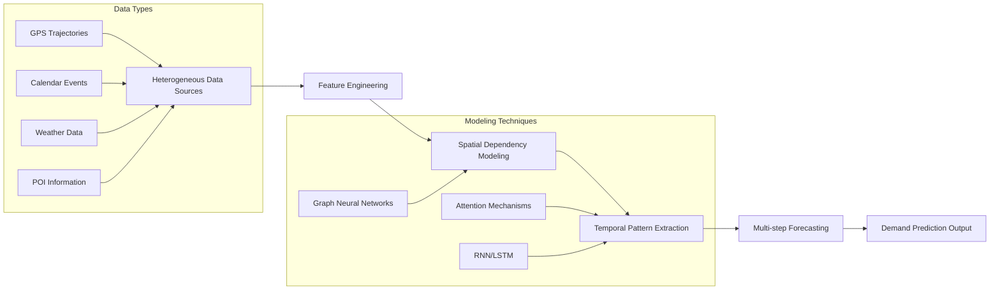

Demand Prediction represents a critical application of time series forecasting, focusing on predicting resource requirements across urban mobility, healthcare, and commercial domains. This task addresses the fundamental challenge of anticipating demand fluctuations in complex systems characterized by **spatio-temporal dependencies** and **external influences** such as weather, events, and socio-economic factors. For intermediate developers, demand prediction offers rich opportunities to apply advanced neural architectures including **Graph Neural Networks**, **attention mechanisms**, and **meta-learning approaches** to real-world optimization problems.

Sources: [Recent-Time-Series-Work-Group-by-Task.md](docs/Recent-Time-Series-Work-Group-by-Task.md#L278-L315)

## Task Architecture and Classification

Demand prediction encompasses diverse application domains, each requiring specialized modeling approaches. The repository classifies 23 research papers into six primary categories: **Traffic Demand** (taxi, bike-sharing, ride-hailing, metro systems), **Supply & Demand** (urban mobility during events), **Health Demand** (ambulance, mobile clinics), **Job Demand** (online labor markets), **Market Demand** (e-commerce segments), and **Drug Demand** (darknet markets). This taxonomy reflects the interdisciplinary nature of demand forecasting, where **spatio-temporal correlations** must be modeled across different granularities and time horizons.

The architectural approach to demand prediction typically follows a **multi-stage pipeline**: data integration from heterogeneous sources (GPS trajectories, calendar events, weather, POI data), feature engineering capturing temporal patterns (daily, weekly, seasonal cycles), spatial dependency modeling (graph structures representing regions or stations), and multi-step forecasting using deep learning architectures. The most successful approaches leverage **graph-based representations** where nodes correspond to spatial regions and edges capture adjacency or similarity relationships, enabling the model to propagate information across the spatial domain.

Sources: [Recent-Time-Series-Work-Group-by-Task.md](docs/Recent-Time-Series-Work-Group-by-Task.md#L278-L315)

## Core Model Architectures and Methodologies

The demand prediction literature demonstrates a clear evolution from **traditional statistical methods** to **deep learning architectures** that explicitly model spatio-temporal dependencies. The most prominent architectural families include **Graph Convolutional Networks (GCN)** for spatial relationship modeling, **Recurrent Neural Networks (RNN/LSTM)** for temporal dynamics, and **attention mechanisms** for capturing long-range dependencies. Notably, many advanced models adopt **multi-task learning** frameworks, where predicting demand for multiple regions or transportation modes simultaneously improves generalization through shared representations.

The **EAST-Net** model ([Event-Aware Multimodal Mobility Nowcasting](https://aaai-2022.virtualchair.net/poster_aaai10914), AAAI 2022) exemplifies the state-of-the-art approach by integrating **event awareness** with multimodal data sources. This model predicts supply and demand dynamics across major cities (NYC, DC, COVID-19 hotspots) using graph neural networks that incorporate external event information. The **CCRNN** model ([Coupled Layer-wise Graph Convolution](https://ojs.aaai.org/index.php/AAAI/article/view/16591), AAAI 2021) introduces coupled layer-wise graph convolutions specifically for transportation demand prediction, achieving strong performance on NYC bike and taxi datasets by jointly modeling the dependencies between different transportation modes.

> [!TIP]
> For traffic demand prediction, consider using **multi-view graph construction** where spatial relationships are modeled through multiple graph structures (adjacency graphs, similarity graphs, semantic graphs) to capture different types of spatial dependencies. Many top-performing models like **STMGCN** and **ST-MGCN** demonstrate that combining multiple graph perspectives significantly improves prediction accuracy.

Sources: [Recent-Time-Series-Work-Group-by-Task.md](docs/Recent-Time-Series-Work-Group-by-Task.md#L280-L290), [README.md](README.md#L1-L100)

## Data Sources and Evaluation

Demand prediction research utilizes a diverse ecosystem of **real-world datasets** that capture urban dynamics at varying scales. **Traffic demand** models are primarily evaluated on taxi and bike-sharing datasets from major metropolitan areas including NYC (Taxi, CitiBike), Didi (Chengdu, Shanghai, Beijing), and Metro systems (Beijing Metro 2016/2018). These datasets provide high-resolution spatio-temporal demand matrices where the granularity typically ranges from 30-minute to hourly intervals and spatial units range from individual stations to census tracts or grid cells. **Health demand** prediction studies utilize ambulance service data from Tokyo and mobile health clinic deployment records, while **job demand** research employs online labor market datasets.

The evaluation methodology follows standard time series forecasting protocols with **train-validation-test splits** respecting temporal ordering to prevent look-ahead bias. Performance metrics typically include **Root Mean Square Error (RMSE)**, **Mean Absolute Error (MAE)**, and **Mean Absolute Percentage Error (MAPE)** for point predictions. More recent work incorporates **uncertainty quantification**, particularly for healthcare and emergency service applications where reliable confidence intervals are crucial for resource allocation decisions. The **fairness-aware** demand prediction models (FairST, AAAI 2020) introduce additional evaluation metrics to ensure equitable service distribution across different demographic groups.

| Application Domain | Primary Datasets | Typical Granularity | Key Challenges |
|:---|:---|:---|:---|
| **Traffic Demand** | NYC Taxi/Bike, Didi, Metro | 15-60 min temporal, station/region spatial | Extreme demand spikes, mode coupling |
| **Health Demand** | Tokyo EMS, Mobile Clinics | Hourly/daily temporal, district spatial | Limited historical data, urgency prioritization |
| **Job Demand** | Online Labor Markets | Daily/weekly temporal, skill-category spatial | Seasonality, skill emergence |
| **Market Demand** | E-commerce Platforms | Daily temporal, segment spatial | Cold start for new segments |

Sources: [Recent-Time-Series-Work-Group-by-Task.md](docs/Recent-Time-Series-Work-Group-by-Task.md#L278-L315)

## Advanced Techniques and Emerging Trends

Recent advances in demand prediction focus on addressing three critical challenges: **data scarcity for new regions/services**, **fairness and equity considerations**, and **integration of external contextual information**. The **Ada-MSTNet** model ([Community-Aware Multi-Task Transportation Demand Prediction](https://ojs.aaai.org/index.php/AAAI/article/view/16107), AAAI 2021) introduces community-aware multi-task learning to share knowledge across regions with similar demand patterns, addressing the cold-start problem for newly launched transportation services. The **FairST** framework ([Fairness-Aware Demand Prediction](https://ojs.aaai.org/index.php/AAAI/article/view/5458), AAAI 2020) explicitly incorporates fairness constraints to prevent predictive models from systematically underserving disadvantaged neighborhoods.

**Meta-learning approaches** have emerged as powerful solutions for demand prediction with limited historical data. The **RMLDP** model ([Relation-aware Meta-learning for E-commerce Market Segment Demand Prediction](https://doi.org/10.1145/3437963.3441750), WSDM 2021) demonstrates how meta-learning can enable accurate demand forecasting for market segments with only a few observations by learning from related segments. Similarly, **TDAN** ([Talent Demand Forecasting](https://dl.acm.org/doi/abs/10.1145/3447548.3467131), KDD 2021) applies attentive neural sequential models with meta-learning capabilities to online job demand prediction.

The integration of **heterogeneous graphs** represents another significant advancement. The **EMS-Pred** model ([Forecasting Ambulance Demand with Profiled Human Mobility](https://ieeexplore.ieee.org/abstract/document/9458623), ICDE 2021) uses heterogeneous multi-graph neural networks to incorporate diverse mobility profiles, while **DAGNN** ([Dynamic Auto-structuring Graph Neural Network](https://ieeexplore.ieee.org/abstract/document/9657493), TKDE 2021) automatically learns graph structures from data rather than relying on predefined spatial relationships.

Sources: [Recent-Time-Series-Work-Group-by-Task.md](docs/Recent-Time-Series-Work-Group-by-Task.md#L286-L310), [README.md](README.md#L1-L100)

## Implementation Guidance and Best Practices

For developers implementing demand prediction systems, several **practical considerations** distinguish successful deployments from research prototypes. First, **data preprocessing** must handle irregular timestamps, missing values, and outliers common in real-world demand data. Second, **feature engineering** should incorporate both temporal features (hour of day, day of week, holidays) and spatial features (POI density, demographics, land use). Third, **model serving** infrastructure must support efficient inference on high-dimensional demand matrices, often requiring specialized optimizations for graph neural networks.

The code availability for demand prediction models is relatively high compared to other time series tasks. The **CCRNN** model ([PyTorch implementation](https://github.com/Essaim/CGCDemandPrediction)), **EAST-Net** ([PyTorch implementation](https://github.com/underdoc-wang/EAST-Net)), and **STMGCN** ([PyTorch implementation](https://github.com/underdoc-wang/ST-MGCN)) provide excellent starting points for development. When adapting these models to new domains, developers should focus on: (1) validating graph construction assumptions, (2) tuning temporal receptive field sizes based on demand periodicity, (3) implementing proper evaluation protocols with temporal splitting, and (4) developing monitoring dashboards to track prediction drift over time.

> [!TIP]
> For production deployments, consider implementing **ensemble methods** that combine predictions from models with different architectures (e.g., GNN-based + RNN-based). The **CoST-Net** model ([Co-Prediction of Multiple Transportation Demands](https://doi.org/10.1145/3292500.3330887), KDD 2019) demonstrates that jointly predicting multiple related demand variables (e.g., taxi and bike-sharing) through shared representations improves robustness and generalization compared to independent models.

Sources: [Recent-Time-Series-Work-Group-by-Task.md](docs/Recent-Time-Series-Work-Group-by-Task.md#L290-L315), [README.md](README.md#L1-L100)

## Research Frontiers and Future Directions

The demand prediction field continues to evolve toward more **complex and realistic scenarios**. Current research frontiers include: (1) **Cross-city transfer learning** where models trained on data-rich cities can be adapted to cities with limited data, (2) **Explainable demand prediction** providing interpretable insights into demand drivers, (3) **Hierarchical demand forecasting** simultaneously predicting demand at multiple spatial and temporal granularities, and (4) **Integration with optimization algorithms** for closed-loop resource allocation systems.

The **intersection with probabilistic forecasting** represents another promising direction. While most demand prediction research focuses on point estimates, real-world resource allocation requires understanding prediction uncertainty. Recent advances in [Probabilistic Time Series Forecasting](5-probabilistic-time-series-forecasting) provide methodologies that could be adapted to demand prediction domains. Similarly, **LLM-empowered approaches** ([LLM-Empowered Time Series Models](17-llm-empowered-time-series-models)) may enable better integration of unstructured information (news, social media, event descriptions) into demand prediction systems.

For developers looking to contribute to this field, several opportunities exist: developing standardized benchmarks for demand prediction across domains, creating open-source datasets for underrepresented applications (health demand, market demand), and improving accessibility through user-friendly APIs for demand prediction models. The **interdisciplinary nature** of demand prediction makes it an exciting area for collaboration between time series researchers, urban planners, healthcare professionals, and business analysts.

Sources: [Recent-Time-Series-Work-Group-by-Task.md](docs/Recent-Time-Series-Work-Group-by-Task.md#L278-L315), [README.md](README.md#L1-L100)

## Next Steps

To continue your exploration of demand prediction and related time series tasks, we recommend the following progression through the documentation:

- **[Traffic Flow and Speed Prediction](9-traffic-flow-and-speed-prediction)** - Explore closely related forecasting tasks in transportation networks
- **[Probabilistic Time Series Forecasting](5-probabilistic-time-series-forecasting)** - Learn uncertainty quantification techniques applicable to demand prediction
- **[Transformer-based Models](15-transformer-based-models)** - Understand attention architectures that are increasingly used in demand prediction
- **[Graph Neural Networks for Time Series](16-graph-neural-networks-for-time-series)** - Deepen your knowledge of spatial modeling techniques
- **[Event Prediction](11-event-prediction)** - Discover how external events influence demand patterns
- **[Methodology Abbreviations Guide](14-methodology-abbreviations-guide)** - Reference the methodology abbreviations used throughout this repository

For practical implementation, explore the available code repositories linked in the Demand Prediction section and consider joining the community discussions through the [Contact](Contact) page. The comprehensive collection of demand prediction papers in this repository provides a solid foundation for both research and application development.
