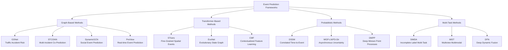

Event Prediction in time series analysis focuses on forecasting discrete occurrences or incidents that significantly impact system dynamics. This specialized task differs from traditional forecasting by targeting irregular, high-impact events rather than continuous value predictions, with applications spanning traffic safety, social dynamics, healthcare, and urban planning. The research landscape has evolved from basic statistical methods to sophisticated deep learning architectures that incorporate spatio-temporal dependencies, hierarchical contexts, and rich multimodal features.

## Architectural Frameworks and Model Families

Event prediction approaches have coalesced around several dominant architectural paradigms, each addressing specific challenges in modeling irregular, sparse, and complex event dynamics. Graph Neural Networks (GNNs) dominate the spatio-temporal domain, with models like GSNet learning spatial-temporal correlations from both geographical and semantic aspects for traffic accident risk forecasting [Recent-Time-Series-Work-Group-by-Task.md](docs/Recent-Time-Series-Work-Group-by-Task.md#L389-L390). These architectures leverage graph structures to capture relationships between spatial units while modeling temporal dependencies through recurrent or attention mechanisms.

Spatio-Temporal-Categorical Graph Neural Networks (STCGNN) extend this paradigm by incorporating categorical information for fine-grained multi-incident co-prediction, enabling simultaneous forecasting of different event types with their inter-relationships [Recent-Time-Series-Work-Group-by-Task.md](docs/Recent-Time-Series-Work-Group-by-Task.md#L390-L391). Dynamic Graph approaches like DynamicGCN learn evolving context graphs for social event prediction, recognizing that relationships between entities change over time [Recent-Time-Series-Work-Group-by-Task.md](docs/Recent-Time-Series-Work-Group-by-Task.md#L401-L402).

Transformer-based architectures have emerged for capturing long-range dependencies in event sequences. STrans employs hierarchically structured transformer networks for fine-grained spatial event forecasting, while EvoNet utilizes evolutionary state graphs for time-series event prediction [Recent-Time-Series-Work-Group-by-Task.md](docs/Recent-Time-Series-Work-Group-by-Task.md#L392-L393-L396). These models excel at capturing complex temporal patterns and state evolution that precede event occurrences.

## Core Application Domains

Traffic accident forecasting represents the most mature application area within event prediction, with models operating at different temporal granularities and spatial resolutions. RiskOracle provides minute-level citywide traffic accident forecasting, enabling real-time intervention strategies for urban safety [Recent-Time-Series-Work-Group-by-Task.md](docs/Recent-Time-Series-Work-Group-by-Task.md#L395-L396). RiskSeq addresses the challenge of sparse traffic accidents through a spatio-temporal multi-granularity perspective, recognizing that accident data is inherently imbalanced and sparse [Recent-Time-Series-Work-Group-by-Task.md](docs/Recent-Time-Series-Work-Group-by-Task.md#L398-L399). Early impact forecasting models like AGWN predict traffic accident impact based on single-snapshot observations, crucial for emergency response planning [Recent-Time-Series-Work-Group-by-Task.md](docs/Recent-Time-Series-Work-Group-by-Task.md#L387-L388).

Social event prediction has gained significant attention, particularly for applications in public safety and resource allocation. DynamicGCN learns dynamic context graphs for predicting social events across multiple geographic regions, capturing the evolving nature of social dynamics [Recent-Time-Series-Work-Group-by-Task.md](docs/Recent-Time-Series-Work-Group-by-Task.md#L401-L402). The CMF approach understands event predictions through contextualized multilevel feature learning, processing complex contextual factors from diverse data sources [Recent-Time-Series-Work-Group-by-Task.md](docs/Recent-Time-Series-Work-Group-by-Task.md#L391-L392). Citywide abnormal event forecasting through frameworks like MiST leverages multiview and multimodal spatial-temporal learning, combining heterogeneous data streams for comprehensive urban anomaly prediction [Recent-Time-Series-Work-Group-by-Task.md](docs/Recent-Time-Series-Work-Group-by-Task.md#L404-L405).

Healthcare and clinical event prediction forms another critical domain, with applications in patient monitoring and resource planning. DSSM employs deep state-space generative models for correlated time-to-event predictions, modeling dependencies between multiple clinical events [Recent-Time-Series-Work-Group-by-Task.md](docs/Recent-Time-Series-Work-Group-by-Task.md#L394-L395). The LANTERN framework learns latent processes from high-dimensional event sequences via efficient sampling, addressing the challenge of processing complex, high-frequency clinical data streams [Recent-Time-Series-Work-Group-by-Task.md](docs/Recent-Time-Series-Work-Group-by-Task.md#L399-L401).

## Technical Innovations and Methodological Advances

Probabilistic modeling has emerged as a critical component in event prediction, addressing inherent uncertainty in event timing and occurrence. Deep Mixture Point Processes (DMPP) leverage spatio-temporal event prediction with rich contextual information, providing principled uncertainty quantification through probabilistic frameworks [Recent-Time-Series-Work-Group-by-Task.md](docs/Recent-Time-Series-Work-Group-by-Task.md#L402-L403). Uncertainty modeling approaches like WGP-LN and FD-Dir specifically handle uncertainty in asynchronous time event prediction, recognizing that events often occur at irregular intervals with varying reliability [Recent-Time-Series-Work-Group-by-Task.md](docs/Recent-Time-Series-Work-Group-by-Task.md#L400-L401).

Multi-task and hierarchical learning approaches address the challenge of leveraging related tasks to improve prediction performance. SIMDA employs incomplete label multi-task deep learning for spatio-temporal event subtype forecasting, valuable when detailed event annotations are unavailable [Recent-Time-Series-Work-Group-by-Task.md](docs/Recent-Time-Series-Work-Group-by-Task.md#L403-L404). The MiST framework integrates multiview and multimodal learning for citywide abnormal event forecasting, combining diverse data sources for robust predictions [Recent-Time-Series-Work-Group-by-Task.md](docs/Recent-Time-Series-Work-Group-by-Task.md#L404-L405). Hierarchical approaches like STrans structure prediction from coarse to fine-grained spatial resolutions, enabling efficient multi-scale event forecasting [Recent-Time-Series-Work-Group-by-Task.md](docs/Recent-Time-Series-Work-Group-by-Task.md#L396-L397).

> [!TIP]
> Event prediction models must handle extreme data imbalance - events are rare relative to non-event periods. Techniques like multi-granularity modeling (RiskSeq) and retrieval augmentation (RETE) are essential for capturing subtle precursor patterns without being overwhelmed by the overwhelming majority of non-event timesteps.

## Datasets and Evaluation Protocols

Traffic accident datasets form the backbone of event prediction research, with real-world data from major metropolitan areas serving as standard benchmarks. NYC, Chicago, and San Francisco incident datasets support spatial event forecasting research, providing rich contextual information including timestamps, locations, and event types [Recent-Time-Series-Work-Group-by-Task.md](docs/Recent-Time-Series-Work-Group-by-Task.md#L390-L393-L396). PeMS traffic data, while primarily used for flow prediction, has been extended for accident impact forecasting through models like AGWN [Recent-Time-Series-Work-Group-by-Task.md](docs/Recent-Time-Series-Work-Group-by-Task.md#L387-L388). Beijing, Suzhou, and Shenyang datasets support minute-level citywide accident forecasting through RiskOracle [Recent-Time-Series-Work-Group-by-Task.md](docs/Recent-Time-Series-Work-Group-by-Task.md#L395-L396).

Social event prediction utilizes diverse datasets spanning international geographic regions, with studies collecting data from Thailand, Egypt, India, and Russia for cross-cultural event pattern analysis [Recent-Time-Series-Work-Group-by-Task.md](docs/Recent-Time-Series-Work-Group-by-Task.md#L391-L392-L401). Online social media platforms like MemeTracker and Weibo provide high-dimensional event sequences for testing latent process learning algorithms [Recent-Time-Series-Work-Group-by-Task.md](docs/Recent-Time-Series-Work-Group-by-Task.md#L399-L400). E-commerce datasets support temporal event forecasting applications through unified query product evolutionary graphs in frameworks like RETE [Recent-Time-Series-Work-Group-by-Task.md](docs/Recent-Time-Series-Work-Group-by-Task.md#L388-L389).

Healthcare event prediction leverages electronic health record datasets, with MIMIC-III serving as a standard benchmark for correlated time-to-event prediction [Recent-Time-Series-Work-Group-by-Task.md](docs/Recent-Time-Series-Work-Group-by-Task.md#L394-L395). Specialized healthcare datasets support specific applications like air quality and civil event forecasting, demonstrating the domain versatility of event prediction frameworks [Recent-Time-Series-Work-Group-by-Task.md](docs/Recent-Time-Series-Work-Group-by-Task.md#L403-L404).

> [!TIP]
> Event prediction evaluation metrics differ significantly from traditional forecasting - precision-recall curves, F1-scores, and event-based accuracy metrics are more informative than MSE or MAE due to extreme class imbalance. Spatial-temporal hit rate within specified windows is crucial for assessing practical utility in applications like traffic safety.

## Implementation Resources and Available Code

The research community has made substantial progress in reproducibility, with multiple high-quality implementations available for event prediction models. GSNet for traffic accident risk forecasting provides PyTorch implementation with comprehensive documentation [Recent-Time-Series-Work-Group-by-Task.md](docs/Recent-Time-Series-Work-Group-by-Task.md#L389-L390). STCGNN offers PyTorch code for fine-grained multi-incident co-prediction, enabling researchers to experiment with categorical graph neural network architectures [Recent-Time-Series-Work-Group-by-Task.md](docs/Recent-Time-Series-Work-Group-by-Task.md#L390-L391).

Deep Mixture Point Processes (DMPP) provides implementation for spatio-temporal event prediction with rich contextual information [Recent-Time-Series-Work-Group-by-Task.md](docs/Recent-Time-Series-Work-Group-by-Task.md#L402-L403). DynamicGCN's PyTorch implementation for social event prediction supports research into dynamic graph neural networks [Recent-Time-Series-Work-Group-by-Task.md](docs/Recent-Time-Series-Work-Group-by-Task.md#L401-L402). Early impact forecasting through AGWN provides PyTorch implementation for traffic accident impact prediction based on single-snapshot observations [Recent-Time-Series-Work-Group-by-Task.md](docs/Recent-Time-Series-Work-Group-by-Task.md#L387-L388).

Several high-impact papers lack publicly available code, representing opportunities for reproducible research implementations. Models like PreView for real-time event prediction, STrans for fine-grained spatial event forecasting, and RiskOracle for minute-level citywide accident forecasting would benefit from community implementations [Recent-Time-Series-Work-Group-by-Task.md](docs/Recent-Time-Series-Work-Group-by-Task.md#L393-L396).

## Current Challenges and Research Frontiers

The field faces several persistent challenges that drive ongoing research innovation. Handling extreme class imbalance remains fundamental - rare events must be detected against a background of overwhelming non-event periods. Approaches like risk oracle's minute-level forecasting and RiskSeq's multi-granularity perspective represent advances in this direction, but fundamental improvements in loss functions and sampling strategies are needed [Recent-Time-Series-Work-Group-by-Task.md](docs/Recent-Time-Series-Work-Group-by-Task.md#L395-L396-L398-L399).

Incorporating exogenous and contextual factors at scale presents both opportunities and challenges. Frameworks like RETE leverage retrieval-enhanced approaches to incorporate product evolutionary graphs into temporal event forecasting [Recent-Time-Series-Work-Group-by-Task.md](docs/Recent-Time-Series-Work-Group-by-Task.md#L388-L389). CMF's contextualized multilevel feature learning represents progress in this direction, but systematic methods for fusing heterogeneous data streams remain underdeveloped [Recent-Time-Series-Work-Group-by-Task.md](docs/Recent-Time-Series-Work-Group-by-Task.md#L391-L392).

Uncertainty quantification in asynchronous event sequences requires sophisticated probabilistic approaches. Models like WGP-LN and FD-Dir address uncertainty in asynchronous time event prediction, but more comprehensive frameworks for communicating prediction confidence to decision-makers are needed [Recent-Time-Series-Work-Group-by-Task.md](docs/Recent-Time-Series-Work-Group-by-Task.md#L400-L401). DSSM's deep state-space generative model for correlated time-to-event predictions advances this frontier through structured probabilistic modeling [Recent-Time-Series-Work-Group-by-Task.md](docs/Recent-Time-Series-Work-Group-by-Task.md#L394-L395).

## Next Steps in Research and Practice

For researchers entering event prediction, we recommend starting with well-established baselines in specific domains before exploring novel architectures. GSNet's codebase provides an accessible entry point for traffic accident risk forecasting, demonstrating how to integrate spatial-temporal dependencies effectively [Recent-Time-Series-Work-Group-by-Task.md](docs/Recent-Time-Series-Work-Group-by-Task.md#L389-L390). The DynamicGCN implementation offers insights into dynamic graph neural network design for social event prediction [Recent-Time-Series-Work-Group-by-Task.md](docs/Recent-Time-Series-Work-Group-by-Task.md#L401-L402).

Practitioners implementing event prediction systems should prioritize domain-specific data collection and preprocessing pipelines over model architecture sophistication. Event prediction quality depends heavily on the availability of rich contextual features and accurate event annotations. Frameworks like MiST demonstrate the value of multiview and multimodal data integration for robust event forecasting [Recent-Time-Series-Work-Group-by-Task.md](docs/Recent-Time-Series-Work-Group-by-Task.md#L404-L405).

Explore related time series tasks to understand how event prediction connects to broader research themes. [Traffic Flow and Speed Prediction](9-traffic-flow-and-speed-prediction) shares modeling challenges with traffic event prediction, particularly in spatio-temporal dependency modeling. [Stock and Financial Prediction](12-stock-and-financial-prediction) offers insights into rare event modeling and extreme value detection. [Time Series Anomaly Detection](7-time-series-anomaly-detection) provides complementary approaches for identifying irregular patterns in time series data.
