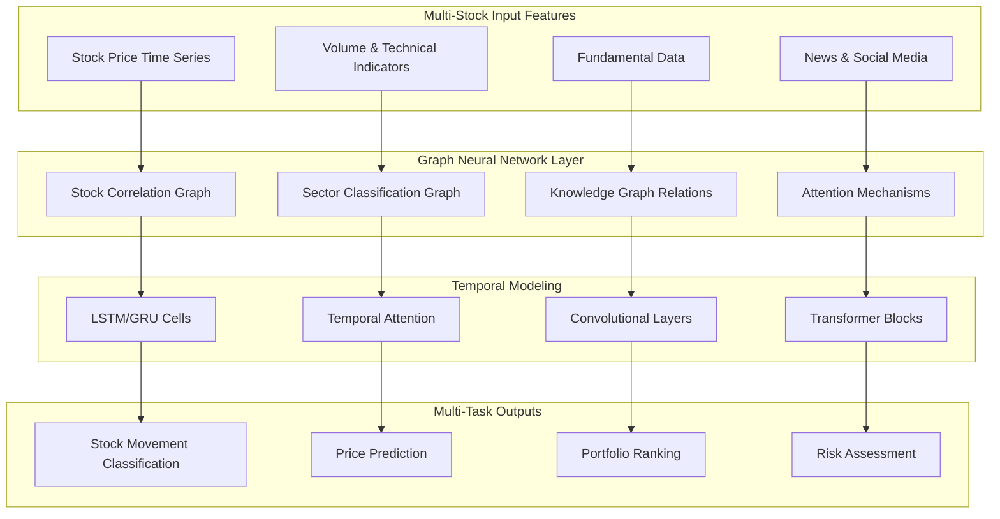
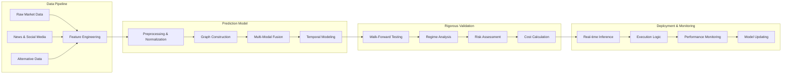

This page provides a comprehensive overview of state-of-the-art research in stock and financial prediction using time series analysis. Financial markets represent one of the most challenging and high-stakes applications of time series forecasting, characterized by extreme volatility, non-stationary patterns, and complex interdependencies between multiple market factors. The research presented here spans 29 papers from top-tier venues, showcasing advanced deep learning architectures, graph neural networks, transformers, and multi-modal approaches that tackle various financial prediction tasks including stock movement prediction, trend forecasting, price prediction, volatility modeling, and quantitative investment strategies.

Sources: [Recent-Time-Series-Work-Group-by-Task.md](/docs/Recent-Time-Series-Work-Group-by-Task.md#L398-L428)

## Research Landscape and Methodological Approaches

Stock and financial prediction research has evolved significantly in recent years, moving beyond traditional time series models (ARIMA, GARCH) to sophisticated deep learning architectures that can capture complex temporal dependencies, market relationships, and multi-modal information sources. The current research landscape can be characterized by several key methodological trends: **graph-based approaches** that model relationships between stocks and market entities, **attention mechanisms** that focus on relevant temporal patterns and cross-sectional correlations, **harchical models** that capture multi-scale temporal dynamics from intraday to long-term trends, and **multi-modal frameworks** that integrate numerical market data with textual information from news, social media, and expert opinions.

The research papers collected here represent contributions from premier AI and data mining venues including AAAI, KDD, IJCAI, WWW, CIKM, ICDM, NeurIPS, ACL, WSDM, and SIGIR, with publication years spanning 2016-2022. This diversity of venues reflects the interdisciplinary nature of financial prediction research, which combines insights from machine learning, econometrics, natural language processing, and financial theory. A key observation from the literature is the shift from single-stock prediction to portfolio-level and market-wide modeling, recognizing that stocks do not move in isolation but are influenced by complex network effects, sector dynamics, and macroeconomic factors.

Sources: [Recent-Time-Series-Work-Group-by-Task.md](/docs/Recent-Time-Series-Work-Group-by-Task.md#L398-L428)

## Task Categories and Applications

Financial prediction research encompasses multiple distinct but related tasks, each requiring specialized modeling approaches and evaluation metrics. The primary task categories include **Stock Movement Prediction** (binary or multi-class classification of future price direction), **Stock Trend Prediction** (forecasting longer-term directional movements beyond simple up/down classification), **Stock Price Forecasting** (regression to predict future price levels or returns), **Stock Volatility Forecasting** (predicting the magnitude of price fluctuations for risk management), **Stock Selection** (ranking stocks to identify the most promising investments), and **Quantitative Investment Strategies** (comprehensive frameworks for automated trading and portfolio management).

These tasks vary significantly in their temporal horizons, data requirements, and practical applications. For example, high-frequency trading systems may focus on very short-term price movements (minutes to hours) using tick-level data, while long-term investment strategies may forecast trends over months or years using fundamental and macroeconomic indicators. Movement and trend prediction tasks typically use classification metrics (accuracy, precision/recall, F1-score), while price forecasting uses regression metrics (MSE, RMSE, MAE). Volatility prediction is critical for risk management and options pricing, often evaluated using realized volatility measures and Value-at-Risk (VaR) backtesting.

> [!TIP]
> The distinction between movement prediction (short-term directional change) and trend prediction (longer-term sustained direction) is crucial for selecting appropriate model architectures. Movement prediction often focuses on capturing intraday patterns and immediate market reactions, while trend prediction requires modeling structural market dynamics and fundamental factors that unfold over longer time scales.

Sources: [Recent-Time-Series-Work-Group-by-Task.md](/docs/Recent-Time-Series-Work-Group-by-Task.md#L398-L428)

## Architectural Patterns and Model Architectures

### Graph Neural Network-Based Approaches

Graph neural networks have emerged as a powerful paradigm for financial prediction, enabling the modeling of complex relationships between stocks, market sectors, and influencing entities. Key models in this category include **AD-GAT** (Attribute-Driven Graph Attention Networks), which models momentum spillover effects between stocks using graph attention mechanisms to capture how price movements in one stock influence others [Recent-Time-Series-Work-Group-by-Task.md](/docs/Recent-Time-Series-Work-Group-by-Task.md#L407-L408). **STHGCN** (Spatiotemporal Hypergraph Convolution Network) extends this concept using hypergraphs to capture higher-order relationships among multiple stocks simultaneously [Recent-Time-Series-Work-Group-by-Task.md](/docs/Recent-Time-Series-Work-Group-by-Task.md#L415-L416). **LSTM-RGCN** (Recurrent Graph Convolutional Network) combines recurrent neural networks with graph convolutions for overnight stock movement prediction, capturing both temporal dynamics and cross-stock relationships [Recent-Time-Series-Work-Group-by-Task.md](/docs/Recent-Time-Series-Work-Group-by-Task.md#L411-L412). These graph-based approaches are particularly valuable for portfolio-level predictions where understanding inter-stock correlations and sector dynamics is essential.

Sources: [Recent-Time-Series-Work-Group-by-Task.md](/docs/Recent-Time-Series-Work-Group-by-Task.md#L407-L408), [Recent-Time-Series-Work-Group-by-Task.md](/docs/Recent-Time-Series-Work-Group-by-Task.md#L411-L412), [Recent-Time-Series-Work-Group-by-Task.md](/docs/Recent-Time-Series-Work-Group-by-Task.md#L415-L416)

### Transformer and Attention-Based Architectures

Transformer architectures have revolutionized financial time series modeling by enabling long-range dependency modeling and adaptive attention to relevant historical patterns. **NumHTML** (Numeric-Oriented Hierarchical Transformer) introduces a hierarchical structure specifically designed for multi-task financial forecasting, enabling simultaneous prediction of multiple financial targets while maintaining computational efficiency [Recent-Time-Series-Work-Group-by-Task.md](/docs/Recent-Time-Series-Work-Group-by-Task.md#L399-L400). **DTML** (Data-Axis Transformer) addresses multivariate prediction by organizing the data axis itself, enabling efficient modeling of inter-stock relationships within the transformer framework [Recent-Time-Series-Work-Group-by-Task.md](/docs/Recent-Time-Series-Work-Group-by-Task.md#L402-L403). **HMG-TF** (Hierarchical Multi-Scale Gaussian Transformer) combines hierarchical attention with Gaussian kernels to capture multi-scale temporal patterns, recognizing that financial markets exhibit dynamics at multiple time scales simultaneously [Recent-Time-Series-Work-Group-by-Task.md](/docs/Recent-Time-Series-Work-Group-by-Task.md#L412-L413). **HTML** (Hierarchical Transformer) focuses on multi-task learning for volatility prediction, leveraging hierarchical attention to share information across related prediction tasks [Recent-Time-Series-Work-Group-by-Task.md](/docs/Recent-Time-Series-Work-Group-by-Task.md#L417-L418).

The transformer approach offers several advantages for financial modeling: the ability to handle irregularly sampled data through positional encoding, efficient capture of long-term dependencies that may be relevant for financial cycles (monthly, quarterly, yearly), and flexible attention mechanisms that can adapt to changing market regimes. However, computational efficiency and handling the non-stationary nature of financial time series remain significant challenges.

> [!TIP]
> Financial time series exhibit concept drift due to changing market conditions, regulatory environments, and structural economic shifts. Successful transformer implementations for financial prediction typically incorporate adaptive attention mechanisms or explicit handling of distribution shifts to maintain performance across different market regimes.

Sources: [Recent-Time-Series-Work-Group-by-Task.md](/docs/Recent-Time-Series-Work-Group-by-Task.md#L399-L400), [Recent-Time-Series-Work-Group-by-Task.md](/docs/Recent-Time-Series-Work-Group-by-Task.md#L402-L403), [Recent-Time-Series-Work-Group-by-Task.md](/docs/Recent-Time-Series-Work-Group-by-Task.md#L412-L413), [Recent-Time-Series-Work-Group-by-Task.md](/docs/Recent-Time-Series-Work-Group-by-Task.md#L417-L418)

### Multi-Modal and Event-Driven Approaches

The integration of multiple data modalities has become a dominant trend in financial prediction, recognizing that market movements are influenced by a wide range of factors beyond historical price data. **StockNet** pioneered this approach by combining historical price data with social media sentiment from tweets, demonstrating that public sentiment provides valuable predictive signal [Recent-Time-Series-Work-Group-by-Task.md](/docs/Recent-Time-Series-Work-Group-by-Task.md#L424-L425). **HAN** (Hierarchical Attention Network) extends this concept with news-oriented stock trend prediction, using hierarchical attention to process news articles at the word, sentence, and document levels [Recent-Time-Series-Work-Group-by-Task.md](/docs/Recent-Time-Series-Work-Group-by-Task.md#L425-L426). **KGEEF** (Knowledge Graph-based Event Embedding Framework) constructs knowledge graphs from financial events and learns event embeddings for quantitative investment strategies [Recent-Time-Series-Work-Group-by-Task.md](/docs/Recent-Time-Series-Work-Group-by-Task.md#L418-L419). **REST** (Relational Event-driven Stock Trend Forecasting) explicitly models relational structures between events and stocks for trend prediction [Recent-Time-Series-Work-Group-by-Task.md](/docs/Recent-Time-Series-Work-Group-by-Task.md#L409-L410). **MFN** (Multimodal Fusion Network) incorporates expert-based investment opinion signals as an additional modality alongside market data [Recent-Time-Series-Work-Group-by-Task.md](/docs/Recent-Time-Series-Work-Group-by-Task.md#L410-L411).

The multi-modal approach addresses a fundamental limitation of purely price-based models: financial markets are efficient information processors where news, rumors, expert opinions, and social sentiment all contribute to price formation. By combining these diverse information sources, models can anticipate market movements before they are fully reflected in prices. However, this approach introduces challenges in aligning different data modalities, handling noise and misinformation in social media, and ensuring causal rather than spurious correlations.

| Modality | Data Sources | Key Models | Contribution |
|----------|-------------|------------|--------------|
| Price & Volume | OHLCV data, technical indicators | GARCH-LSTM, SFM, Adv-ALSTM | Core market dynamics, momentum and mean-reversion patterns |
| News & Text | Financial news, earnings reports, SEC filings | HAN, KGEEF-CNN, REST | Company fundamentals, regulatory changes, market sentiment |
| Social Media | Twitter, Reddit, Weibo | StockNet, HAN | Retail sentiment, viral narratives, market chatter |
| Expert Signals | Analyst recommendations, institutional research | MFN, KGEEF | Professional insights, sophisticated analysis |
| Graph Relations | Correlation networks, sector classifications, supply chains | AD-GAT, STHGCN, LSTM-RGCN | Cross-stock influence, sector dynamics, systemic risk |
| Alternative Data | Satellite imagery, web traffic, shipping data | (implicit in multi-modal frameworks) | Unique alpha sources, leading economic indicators |

Sources: [Recent-Time-Series-Work-Group-by-Task.md](/docs/Recent-Time-Series-Work-Group-by-Task.md#L409-L411), [Recent-Time-Series-Work-Group-by-Task.md](/docs/Recent-Time-Series-Work-Group-by-Task.md#L418-L419), [Recent-Time-Series-Work-Group-by-Task.md](/docs/Recent-Time-Series-Work-Group-by-Task.md#L424-L426)

### Hierarchical and Multi-Scale Approaches

Financial markets exhibit dynamics across multiple temporal scales, from high-frequency trading (milliseconds to seconds) to long-term investing (months to years). Hierarchical and multi-scale approaches explicitly model this multi-scale nature. **HATR** (Hierarchical Adaptive Temporal-Relational modeling) organizes temporal modeling at multiple hierarchical levels, capturing short-term reactions, medium-term trends, and long-term structural changes simultaneously [Recent-Time-Series-Work-Group-by-Task.md](/docs/Recent-Time-Series-Work-Group-by-Task.md#L406-L407). **CMLF** (Contrastive Multi-granularity Learning Framework) uses contrastive learning to fuse multi-granularity data, learning representations that capture patterns at different temporal resolutions while maintaining their relationships [Recent-Time-Series-Work-Group-by-Task.md](/docs/Recent-Time-Series-Work-Group-by-Task.md#L410-L411). **SFM** (State-Frequency Memory) discovers multi-frequency trading patterns through state-frequency memory components, recognizing that different trading strategies may be optimal at different frequencies [Recent-Time-Series-Work-Group-by-Task.md](/docs/Recent-Time-Series-Work-Group-by-Task.md#L426-L427). **MTDNN** (Multi-scale Two-way Deep Neural Network) processes data at multiple scales through parallel pathways with different receptive fields, then combines predictions using a two-way fusion mechanism [Recent-Time-Series-Work-Group-by-Task.md](/docs/Recent-Time-Series-Work-Group-by-Task.md#L413-L414).

The hierarchical approach is motivated by the observation that different market participants operate at different time scales: high-frequency traders react to micro-level order flow imbalances, while institutional investors consider quarterly earnings and macroeconomic cycles. A model that can capture these multi-scale dynamics simultaneously can better predict how different types of information will propagate through the market at different speeds.

Sources: [Recent-Time-Series-Work-Group-by-Task.md](/docs/Recent-Time-Series-Work-Group-by-Task.md#L406-L407), [Recent-Time-Series-Work-Group-by-Task.md](/docs/Recent-Time-Series-Work-Group-by-Task.md#L410-L411), [Recent-Time-Series-Work-Group-by-Task.md](/docs/Recent-Time-Series-Work-Group-by-Task.md#L413-L414), [Recent-Time-Series-Work-Group-by-Task.md](/docs/Recent-Time-Series-Work-Group-by-Task.md#L426-L427)

## State-of-the-Art Models by Publication Venue

### AAAI Publications

AAAI (Association for the Advancement of Artificial Intelligence) has been a premier venue for financial prediction research, with publications spanning 2020-2022. Recent highlights include **NumHTML** (2022), which introduced numeric-oriented hierarchical transformers for multi-task financial forecasting, demonstrating that specialized attention architectures can improve performance across related prediction tasks [Recent-Time-Series-Work-Group-by-Task.md](/docs/Recent-Time-Series-Work-Group-by-Task.md#L399-L400). **AD-GAT** (2021) addressed the critical challenge of modeling momentum spillover effects using attribute-driven graph attention networks, showing how attention mechanisms can be designed to capture directional influence patterns in stock networks [Recent-Time-Series-Work-Group-by-Task.md](/docs/Recent-Time-Series-Work-Group-by-Task.md#L407-L408). **STHAN-SR** (2021) tackled stock selection using spatiotemporal hypergraph attention networks with a learning-to-rank formulation, bridging prediction and decision-making for practical portfolio construction [Recent-Time-Series-Work-Group-by-Task.md](/docs/Recent-Time-Series-Work-Group-by-Task.md#L408-L409). **MFN** (2020) incorporated expert-based investment opinion signals, recognizing that combining algorithmic signals with human expertise can improve robustness [Recent-Time-Series-Work-Group-by-Task.md](/docs/Recent-Time-Series-Work-Group-by-Task.md#L410-L411).

These AAAI publications reflect several key trends: increasing sophistication in graph-based modeling, integration of diverse data modalities, and a move from pure prediction to decision-oriented frameworks that directly support investment decisions.

Sources: [Recent-Time-Series-Work-Group-by-Task.md](/docs/Recent-Time-Series-Work-Group-by-Task.md#L399-L400), [Recent-Time-Series-Work-Group-by-Task.md](/docs/Recent-Time-Series-Work-Group-by-Task.md#L407-L409), [Recent-Time-Series-Work-Group-by-Task.md](/docs/Recent-Time-Series-Work-Group-by-Task.md#L410-L411)

### KDD Publications

KDD (Knowledge Discovery and Data Mining) has featured highly impactful financial prediction research emphasizing practical applications and large-scale deployment. **TRA** (2021) introduced temporal routing adaptors with optimal transport for learning multiple stock trading patterns, recognizing that different market conditions may require different trading strategies and that models should be able to adaptively select between them [Recent-Time-Series-Work-Group-by-Task.md](/docs/Recent-Time-Series-Work-Group-by-Task.md#L400-L401). **DTML** (2021) presented data-axis transformers with multi-level contexts for accurate multivariate stock movement prediction, addressing the challenge of modeling cross-stock correlations in large portfolios [Recent-Time-Series-Work-Group-by-Task.md](/docs/Recent-Time-Series-Work-Group-by-Task.md#L402-L403). **IMTR** (2019) explored how investment behaviors can reveal intrinsic stock properties for trend prediction, using behavioral signals as proxies for fundamental company health [Recent-Time-Series-Work-Group-by-Task.md](/docs/Recent-Time-Series-Work-Group-by-Task.md#L419-L420). **TTIO** (2019) developed individualized technical indicators optimized through stock embedding, moving beyond fixed technical indicators to learn trading signals optimized for each stock's unique characteristics [Recent-Time-Series-Work-Group-by-Task.md](/docs/Recent-Time-Series-Work-Group-by-Task.md#L421-L422).

KDD publications are characterized by their practical orientation, often addressing real-world challenges in deploying prediction models at scale, handling large datasets, and integrating prediction systems into trading workflows.

Sources: [Recent-Time-Series-Work-Group-by-Task.md](/docs/Recent-Time-Series-Work-Group-by-Task.md#L400-L403), [Recent-Time-Series-Work-Group-by-Task.md](/docs/Recent-Time-Series-Work-Group-by-Task.md#L419-L422)

### IJCAI Publications

IJCAI (International Joint Conference on Artificial Intelligence) has contributed significant advances in stock prediction architectures and techniques. **CGM** (2021) addressed trading volume movement prediction using graph-based multi-view modeling, recognizing that volume patterns provide complementary information to price movements [Recent-Time-Series-Work-Group-by-Task.md](/docs/Recent-Time-Series-Work-Group-by-Task.md#L405-L406). **HATR** (2021) introduced hierarchical adaptive temporal-relational modeling for stock trend prediction, providing a systematic framework for organizing multi-scale temporal and relational information [Recent-Time-Series-Work-Group-by-Task.md](/docs/Recent-Time-Series-Work-Group-by-Task.md#L406-L407). **LSTM-RGCN** (2020) modeled stock relations with graph networks for overnight stock movement prediction, addressing the specific challenge of predicting price movements during market closures when no trading occurs but information continues to accumulate [Recent-Time-Series-Work-Group-by-Task.md](/docs/Recent-Time-Series-Work-Group-by-Task.md#L411-L412). **HMG-TF** (2020) developed hierarchical multi-scale Gaussian transformers for stock movement prediction, combining hierarchical attention with Gaussian kernels to capture multi-scale temporal patterns [Recent-Time-Series-Work-Group-by-Task.md](/docs/Recent-Time-Series-Work-Group-by-Task.md#L412-L413). **MTDNN** (2020) created multi-scale two-way deep neural networks for stock trend prediction, processing data at multiple scales through parallel pathways [Recent-Time-Series-Work-Group-by-Task.md](/docs/Recent-Time-Series-Work-Group-by-Task.md#L413-L414).

IJCAI contributions have been particularly influential in advancing architectural innovations, introducing novel network structures specifically designed for the unique challenges of financial time series.

Sources: [Recent-Time-Series-Work-Group-by-Task.md](/docs/Recent-Time-Series-Work-Group-by-Task.md#L405-L407), [Recent-Time-Series-Work-Group-by-Task.md](/docs/Recent-Time-Series-Work-Group-by-Task.md#L411-L414)

### WWW and CIKM Publications

WWW (The Web Conference) and CIKM (Conference on Information and Knowledge Management) have published innovative approaches leveraging web data, knowledge graphs, and advanced learning frameworks. **HyperStockGAT** (WWW 2021) applied graph attention networks to learn multiple stock trading patterns across different markets [Recent-Time-Series-Work-Group-by-Task.md](/docs/Recent-Time-Series-Work-Group-by-Task.md#L408-L409). **REST** (WWW 2021) developed relational event-driven stock trend forecasting, explicitly modeling how different types of events influence stocks in relation to each other [Recent-Time-Series-Work-Group-by-Task.md](/docs/Recent-Time-Series-Work-Group-by-Task.md#L409-L410). **Dandelion** (WWW 2020) introduced domain-adaptive multi-modality neural attention networks for financial forecasting, addressing the challenge of transferring models across different market domains [Recent-Time-Series-Work-Group-by-Task.md](/docs/Recent-Time-Series-Work-Group-by-Task.md#L416-L417). **HAN** (WSDM 2018) pioneered hierarchical attention networks for news-oriented stock trend prediction, establishing a framework for processing news text at multiple levels of granularity [Recent-Time-Series-Work-Group-by-Task.md](/docs/Recent-Time-Series-Work-Group-by-Task.md#L425-L426). **CMLF** (CIKM 2021) developed stock trend prediction with multi-granularity data using contrastive learning with adaptive fusion, introducing contrastive learning techniques to financial prediction [Recent-Time-Series-Work-Group-by-Task.md](/docs/Recent-Time-Series-Work-Group-by-Task.md#L410-L411).

These venues have been particularly strong in approaches that integrate diverse data sources (especially web and social data) and apply advanced learning techniques (attention, contrastive learning, adaptation) to financial prediction challenges.

Sources: [Recent-Time-Series-Work-Group-by-Task.md](/docs/Recent-Time-Series-Work-Group-by-Task.md#L408-L411), [Recent-Time-Series-Work-Group-by-Task.md](/docs/Recent-Time-Series-Work-Group-by-Task.md#L416-L417), [Recent-Time-Series-Work-Group-by-Task.md](/docs/Recent-Time-Series-Work-Group-by-Task.md#L425-L426)

### ACL, NeurIPS, and Other Venues

Financial prediction research has also appeared in venues specializing in natural language processing (ACL), neural networks (NeurIPS), and other specialized conferences. **StockNet** (ACL 2018) demonstrated how to combine tweets and historical prices for stock movement prediction, establishing social media as a valuable data source for financial prediction [Recent-Time-Series-Work-Group-by-Task.md](/docs/Recent-Time-Series-Work-Group-by-Task.md#L424-L425). **KGEB-CNN** (COLING 2016) introduced knowledge-driven event embeddings for stock prediction, pioneering the use of structured knowledge about financial events [Recent-Time-Series-Work-Group-by-Task.md](/docs/Recent-Time-Series-Work-Group-by-Task.md#L427-L428). **GNNs** (NeurIPS 2019) explored graph neural networks for stock market predictions with rolling window analysis, investigating how temporal dynamics of graph relationships affect prediction performance [Recent-Time-Series-Work-Group-by-Task.md](/docs/Recent-Time-Series-Work-Group-by-Task.md#L418-L419). **Adv-ALSTM** (IJCAI 2019) enhanced stock movement prediction with adversarial training, addressing the challenge of overfitting and improving model robustness [Recent-Time-Series-Work-Group-by-Task.md](/docs/Recent-Time-Series-Work-Group-by-Task.md#L423-L424). **RSR** (TOIS 2019) developed temporal relational ranking for stock prediction, framing stock prediction as a ranking problem rather than simple classification [Recent-Time-Series-Work-Group-by-Task.md](/docs/Recent-Time-Series-Work-Group-by-Task.md#L423-L424).

These diverse venue contributions highlight the interdisciplinary nature of financial prediction research, drawing on advances from natural language processing, graph learning, adversarial training, and information retrieval.

Sources: [Recent-Time-Series-Work-Group-by-Task.md](/docs/Recent-Time-Series-Work-Group-by-Task.md#L418-L419), [Recent-Time-Series-Work-Group-by-Task.md](/docs/Recent-Time-Series-Work-Group-by-Task.md#L423-L425), [Recent-Time-Series-Work-Group-by-Task.md](/docs/Recent-Time-Series-Work-Group-by-Task.md#L427-L428)

## Data Sources and Datasets

Financial prediction research utilizes a wide variety of data sources, reflecting the multi-factor nature of market dynamics. Primary market data includes **price data** (Open, High, Low, Close - OHLC) and **volume data**, which form the foundation for most prediction models. **Technical indicators** derived from price and volume (moving averages, RSI, MACD, Bollinger Bands, etc.) provide additional features capturing momentum, trend strength, and volatility. **Fundamental data** (earnings per share, price-to-earnings ratios, debt levels, cash flow, etc.) provides information about company financial health and intrinsic value.

Beyond traditional market data, researchers increasingly incorporate **textual data** from multiple sources: financial news articles from major outlets (Bloomberg, Reuters, Wall Street Journal), **earnings call transcripts** from SEC filings, **social media posts** from Twitter/X, Reddit, and specialized financial forums (StockTwits, Seeking Alpha), and **analyst reports** and recommendations. **Alternative data** sources include satellite imagery of retail parking lots, web traffic to company websites, shipping and logistics data, and credit card transaction aggregates.

**Graph and relational data** has become increasingly important: stock correlation graphs based on price co-movement, sector and industry classification hierarchies, supply chain relationships between companies, and knowledge graphs linking companies to people, events, and concepts. The papers in this collection reference datasets from multiple markets: US markets (NASDAQ, NYSE), Chinese markets (CSI indices), Japanese markets (Nikkei 225), European markets (FTSE 100, TOPIX 100), and global indices (NDX 100, SPX 500).

| Dataset Type | Examples | Use Cases |
|-------------|----------|-----------|
| Market Data | Yahoo Finance, TAQ, CSI indices | Price prediction, movement prediction |
| News Data | Reuters, Bloomberg, Wall Street Journal | Event-driven prediction, sentiment analysis |
| Social Media | Twitter, Reddit, StockTwits, Weibo | Sentiment mining, viral narrative detection |
| Fundamental Data | SEC filings, quarterly reports, accounting data | Value investing, earnings prediction |
| Graph Data | Correlation networks, sector classifications | Portfolio optimization, systemic risk |
| Alternative Data | Satellite imagery, web traffic, shipping | Unique alpha sources, leading indicators |

> [!TIP]
> Financial data presents unique challenges for machine learning: extreme noise levels, non-stationary distributions (statistical properties change over time), and survivorship bias (failing companies disappear from historical records). Successful models typically incorporate robust validation strategies (walk-forward testing rather than simple train/test splits) and explicit handling of regime changes.

Sources: [Recent-Time-Series-Work-Group-by-Task.md](/docs/Recent-Time-Series-Work-Group-by-Task.md#L398-L428)

## Challenges and Open Research Directions

Despite significant advances, stock and financial prediction remains a challenging research area with several open problems. **Non-stationarity and concept drift** represents a fundamental challenge: financial markets evolve over time due to regulatory changes, technological advances, and shifts in market structure. Models trained on historical data may perform poorly if market dynamics change. **Market efficiency** poses another challenge: if markets are efficient, all available information is already reflected in prices, leaving little room for consistent prediction advantages. However, the existence of persistent market inefficiencies and patterns suggests that while markets may be efficient in the long run, short to medium-term predictability may exist.

**Data quality and noise** presents practical challenges: financial data contains errors, missing values, and outliers. Alternative data sources may be sparse, noisy, or biased. **Overfitting and false discoveries** are particularly problematic given the high dimensionality of financial data and the potential for spurious correlations. Rigorous validation with out-of-sample testing and adjustment for multiple hypothesis testing is essential but often neglected.

**Explainability and interpretability** are increasingly important: financial institutions and regulators require understanding of model decisions, especially for high-stakes trading and risk management applications. **Integration with trading constraints** represents another challenge: predictions must be converted into actionable trading strategies that account for transaction costs, position limits, market impact, and risk constraints. **Regulatory and ethical considerations** include concerns about market manipulation through algorithmic trading, fairness in access to data and computing resources, and systemic risk from correlated automated strategies.

Promising research directions include **causal inference for financial time series** to distinguish correlation from causation, **quantum computing** for optimization and simulation problems in finance, **federated learning** for privacy-preserving collaboration across institutions, and **reinforcement learning** for developing complete trading policies rather than just prediction models.

Sources: [Recent-Time-Series-Work-Group-by-Task.md](/docs/Recent-Time-Series-Work-Group-by-Task.md#L398-L428)

## Practical Implementation Considerations

For practitioners implementing financial prediction models, several practical considerations are critical. **Backtesting** must be conducted with rigorous methodology: using walk-forward validation rather than simple random splits, incorporating realistic transaction costs and slippage, accounting for survivorship bias by including delisted stocks, and testing across different market regimes (bull markets, bear markets, high-volatility periods). **Model selection** should consider not just prediction accuracy but also computational efficiency for real-time trading requirements, interpretability for regulatory compliance, and robustness to adversarial market conditions.

**Feature engineering** remains important despite advances in representation learning: domain knowledge about financial markets, economic indicators, and market microstructure can provide valuable features that complement learned representations. Technical indicators, sentiment scores, calendar effects (day of week, month of year effects), and regime indicators should all be considered.

**Risk management** is paramount: prediction models should be accompanied by position sizing rules, stop-loss mechanisms, portfolio diversification strategies, and Value-at-Risk calculations. Models should be designed to fail gracefully and with clear exit strategies when performance degrades.

> [!TIP]
> Production deployment of financial prediction models requires extensive infrastructure beyond the research environment: low-latency data pipelines, robust error handling, real-time monitoring systems, failover mechanisms, and comprehensive logging for audit and compliance. The gap between research performance and production results is often substantial due to these practical considerations.

Sources: [Recent-Time-Series-Work-Group-by-Task.md](/docs/Recent-Time-Series-Work-Group-by-Task.md#L398-L428)

## Recommended Reading Path

For developers and researchers looking to enter or advance in the field of stock and financial prediction, we recommend the following progression:

**Foundational Reading**: Start with [Overview](1-overview) to understand the broader time series prediction landscape, then review [Multivariate Time Series Forecasting](4-multivariate-time-series-forecasting) for fundamental techniques applicable to financial data. The **SFM** and **GARCH-LSTM** papers provide good starting points for understanding price prediction approaches [Recent-Time-Series-Work-Group-by-Task.md](/docs/Recent-Time-Series-Work-Group-by-Task.md#L417-L418), [Recent-Time-Series-Work-Group-by-Task.md](/docs/Recent-Time-Series-Work-Group-by-Task.md#L417-L418).

**Graph-Based Approaches**: Explore [Graph Neural Networks for Time Series](16-graph-neural-networks-for-time-series) for background on graph neural networks, then study **AD-GAT**, **STHGCN**, and **LSTM-RGCN** for financial applications [Recent-Time-Series-Work-Group-by-Task.md](/docs/Recent-Time-Series-Work-Group-by-Task.md#L407-L408), [Recent-Time-Series-Work-Group-by-Task.md](/docs/Recent-Time-Series-Work-Group-by-Task.md#L411-L412), [Recent-Time-Series-Work-Group-by-Task.md](/docs/Recent-Time-Series-Work-Group-by-Task.md#L415-L416).

**Advanced Architectures**: Review [Transformer-based Models](15-transformer-based-models) for transformer fundamentals, then examine **NumHTML**, **DTML**, and **HMG-TF** for financial-specific transformer innovations [Recent-Time-Series-Work-Group-by-Task.md](/docs/Recent-Time-Series-Work-Group-by-Task.md#L399-L400), [Recent-Time-Series-Work-Group-by-Task.md](/docs/Recent-Time-Series-Work-Group-by-Task.md#L402-L403), [Recent-Time-Series-Work-Group-by-Task.md](/docs/Recent-Time-Series-Work-Group-by-Task.md#L412-L413).

**Multi-Modal and Event-Driven**: Study **StockNet** and **HAN** for integrating textual data [Recent-Time-Series-Work-Group-by-Task.md](/docs/Recent-Time-Series-Work-Group-by-Task.md#L424-L426), then explore **REST** and **KGEEF** for event-driven approaches [Recent-Time-Series-Work-Group-by-Task.md](/docs/Recent-Time-Series-Work-Group-by-Task.md#L409-L410), [Recent-Time-Series-Work-Group-by-Task.md](/docs/Recent-Time-Series-Work-Group-by-Task.md#L418-L419).

**Advanced Topics**: For cutting-edge approaches, study **CMLF** for contrastive learning applications [Recent-Time-Series-Work-Group-by-Task.md](/docs/Recent-Time-Series-Work-Group-by-Task.md#L410-L411) and **TRA** for optimal transport and multi-pattern learning [Recent-Time-Series-Work-Group-by-Task.md](/docs/Recent-Time-Series-Work-Group-by-Task.md#L400-L401).

**Related Applications**: Consider exploring related time series domains for cross-pollination of ideas: [Demand Prediction](10-demand-prediction) for techniques applicable to trading volume prediction, [Event Prediction](11-event-prediction) for event-driven forecasting methodologies, and [Methodology Abbreviations Guide](14-methodology-abbreviations-guide) for understanding common techniques and acronyms.
