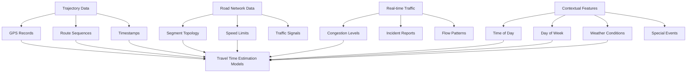

Travel Time Estimation (TTE) stands as a critical application domain within spatio-temporal time series analysis, addressing the fundamental prediction problem of estimating the duration required for vehicles or packages to travel between origins and destinations. This field has evolved from traditional statistical approaches to sophisticated deep learning architectures that leverage heterogeneous data sources including GPS trajectories, road network topology, real-time traffic conditions, and contextual features such as weather and time-of-day patterns. The practical significance spans navigation services (Baidu Maps, Google Maps), ride-hailing platforms (DiDi, Uber), and logistics operations (Cainiao, JD, Amazon), where accurate ETA predictions directly impact user satisfaction and operational efficiency.

Sources: [README.md](/README.md#L739-L777), [Recent-Time-Series-Work-Group-by-Task.md](/docs/Recent-Time-Series-Work-Group-by-Task.md#L350-L382)

## Core Challenges in Travel Time Estimation

Travel Time Estimation presents unique methodological challenges that distinguish it from general time series forecasting tasks. The primary difficulty stems from the need to model complex spatio-temporal dependencies within road networks, where travel times are influenced by interconnected factors including road segment correlations, traffic congestion propagation patterns, and route-dependent dynamics. Unlike multivariate forecasting where temporal patterns are relatively stationary, TTE must handle highly non-linear relationships between route characteristics and travel duration, particularly accounting for multi-modal distributions caused by heterogeneous driving behaviors and time-varying traffic conditions.

A critical challenge lies in data sparsity and coverage, particularly for long-haul routes or under-served regions where historical trajectory data may be insufficient for reliable estimation. Modern approaches address this through meta-learning frameworks like **SSML** which adapt knowledge across different geographical regions and **MetaER-TTE** which employs adaptive meta-learning for en route estimation. Additionally, real-time inference requirements demand computationally efficient models, leading to innovations like **CompactETA** specifically designed for fast inference systems while maintaining prediction accuracy.

Sources: [README.md](/README.md#L744-L763), [Recent-Time-Series-Work-Group-by-Task.md](/docs/Recent-Time-Series-Work-Group-by-Task.md#L350-L362)

## Data Sources and Representations

Travel Time Estimation models leverage diverse data sources capturing different dimensions of urban mobility. The primary data modality consists of GPS trajectory records from ride-hailing platforms, including DiDi datasets from Beijing, Shanghai, Suzhou, and Shenyang, and open datasets like Porto taxi trajectories and San Francisco taxi records. These trajectory datasets provide rich spatio-temporal information including timestamps, coordinates, and route sequences that serve as the foundation for learning travel time patterns.

Road network information provides structural context essential for understanding route characteristics. Models like **DeepJMT** and **TTPNet** explicitly incorporate graph embeddings of road segments, where nodes represent intersections or road segments and edges capture connectivity patterns. Topological features such as segment length, speed limits, number of lanes, and traffic signal configurations serve as static attributes complementing dynamic traffic flow data. Public transit systems introduce additional complexity through **BusTr** which integrates GTFS (General Transit Feed Specification) data to model bus travel times accounting for scheduled stops and passenger boarding patterns.

Sources: [README.md](/README.md#L739-L777), [Recent-Time-Series-Work-Group-by-Task.md](/docs/Recent-Time-Series-Work-Group-by-Task.md#L356-L370)

## Model Architectures and Methodological Approaches

Travel Time Estimation research has witnessed remarkable evolution in model architectures, progressing from traditional statistical methods to sophisticated deep learning frameworks. Contemporary approaches can be categorized based on their core methodological innovations and how they model the spatio-temporal dependencies inherent in travel time prediction.

> [!TIP]
> Heterogeneous Information Network (HIN) embedding approaches like HetETA represent the road network as a multi-modal graph connecting trajectories, road segments, and traffic conditions, learning rich node embeddings that capture complex interdependencies beyond simple spatial adjacency.

| Architecture Category | Representative Models | Key Innovation | Best Suited For |
|---------------------|----------------------|----------------|------------------|
| Graph Neural Networks | HetETA, TTPNet, GBTTE | Road network topology modeling | Complex urban road networks |
| Spatial-Temporal Attention | ConSTGAT, HierETA, DuETA | Contextual spatio-temporal dependencies | Real-time traffic conditions |
| Sequence Models | DeepTTE, DeepETA, DeepIST | Trajectory sequential patterns | GPS trajectory data |
| Meta-Learning | SSML, MetaER-TTE | Cross-region knowledge transfer | Low-data regions |
| Multi-Modal Fusion | DeepJMT, AtHy-TNet | Heterogeneous data integration | Multi-source scenarios |
| Probabilistic Models | GMDNet, STTD | Uncertainty quantification | Reliability-critical applications |

Graph-based approaches leverage the natural representation of road networks as graphs where nodes capture road segments or intersections and edges model connectivity. **HetETA** applies heterogeneous information network embedding techniques to learn representations for different node types including trajectories, road segments, and traffic conditions. **TTPNet** combines tensor decomposition with graph embedding to capture both temporal patterns and spatial relationships, while **GBTTE** specifically addresses bus travel time estimation using graph attention networks that account for public transit route structures. These approaches excel at modeling the influence of upstream road segments on downstream travel times through message passing mechanisms.

Spatial-temporal attention mechanisms represent a significant advancement in modeling dynamic traffic conditions. **ConSTGAT** introduces contextual spatial-temporal graph attention networks that learn adaptive attention weights based on both spatial proximity and temporal correlations, enabling the model to focus on the most relevant road segments and historical time periods for each prediction. **HierETA** employs a hierarchical self-attention network that interprets trajectories from multiple views, capturing patterns at different temporal resolutions. **DuETA** extends this by explicitly modeling traffic congestion propagation patterns through efficient graph learning, demonstrating how delays propagate through road networks during peak hours.

Sources: [README.md](/README.md#L744-L773), [Recent-Time-Series-Work-Group-by-Task.md](/docs/Recent-Time-Series-Work-Group-by-Task.md#L350-L376)

## Specialized Applications and Domain Adaptations

While general travel time estimation methods apply broadly across transportation scenarios, specific applications have inspired specialized models that account for domain-specific characteristics. Package delivery logistics presents unique challenges addressed by models like **GMDNet**, which employs a graph-based mixture density network to capture multimodal travel time distributions inherent in delivery scenarios where package handling times introduce additional variability. Similarly, **IGT** introduces inductive graph transformers specifically designed for delivery time estimation, leveraging inductive learning capabilities to handle novel routes and locations not seen during training.

Public transit systems require specialized approaches due to their scheduled nature and passenger service constraints. **BusTr** represents a dedicated model for predicting bus travel times from real-time traffic data, accounting for factors unique to public transit including predetermined stops, dwell times for passenger boarding and alighting, and schedule adherence pressures. The model integrates GTFS data containing static route and schedule information with real-time traffic feeds to provide accurate arrival time predictions that respect both traffic conditions and transit schedule constraints.

> [!TIP]
> Delivery-focused models like GMDNet employ mixture density networks to explicitly model the multi-modality of package delivery travel times, where the same physical route may exhibit dramatically different durations depending on factors like delivery difficulty, package handling time, and customer availability—dimensions not present in passenger vehicle travel time estimation.

Personalized and adaptive travel time estimation addresses the heterogeneity in driving behaviors across different user groups. **CTTE** introduces multi-task learning for customized travel time estimation, exploring whether aggressive driving behaviors systematically lead to shorter travel times and enabling personalized ETA predictions that account for individual driver characteristics. This approach represents an important shift from one-size-fits-all models toward personalized prediction systems that can adapt to user-specific patterns while leveraging collective intelligence from the broader user base.

Sources: [README.md](/README.md#L740-L744), [README.md](/README.md#L756-L763), [Recent-Time-Series-Work-Group-by-Task.md](/docs/Recent-Time-Series-Work-Group-by-Task.md#L368-L376)

## Temporal Dynamics and Real-Time Adaptation

Travel time estimation models must handle temporal dynamics across multiple time scales, from diurnal patterns capturing rush hour variations to seasonal fluctuations reflecting weather and holiday effects. Sequence-based approaches like **DeepTTE** and **DeepETA** treat travel time estimation as a sequential prediction problem where the model processes ordered sequences of trajectory segments or time steps to capture temporal dependencies. These models typically employ recurrent neural networks (RNNs), LSTMs, or transformer architectures to model how travel time accumulates along routes while accounting for the influence of historical patterns on future segments.

Real-time adaptation capabilities distinguish production-ready systems from research prototypes. **SSML** introduces a self-supervised meta-learner specifically designed for en route travel time estimation at Baidu Maps, enabling the model to adapt predictions mid-journey based on observed travel progress and evolving traffic conditions. This meta-learning approach learns initialization parameters that can be rapidly fine-tuned for specific routes or time periods using minimal data, addressing the challenge of deployment to new cities with limited historical records. Similarly, **MetaER-TTE** applies adaptive meta-learning to enable efficient adaptation across different geographical regions and traffic conditions.

The table below summarizes temporal modeling approaches across representative models:

| Temporal Aspect | Modeling Approach | Example Models | Time Horizon |
|----------------|------------------|----------------|--------------|
| Diurnal Patterns | Time embedding, periodic encoding | DeepTTE, ConSTGAT | 24-hour cycles |
| Traffic Evolution | RNNs, Temporal attention | HierETA, DuETA | Minutes to hours |
| Seasonal Variations | Calendar features, weather integration | DeepJMT, IGT | Days to months |
| En Route Updates | Meta-learning, online adaptation | SSML, MetaER-TTE | Real-time (seconds) |
| Multi-step Prediction | Sequence-to-sequence architectures | DeepETA, DeepIST | Entire journey |

Sources: [README.md](/README.md#L750-L756), [README.md](/README.md#L759-L763), [Recent-Time-Series-Work-Group-by-Task.md](/docs/Recent-Time-Series-Work-Group-by-Task.md#L350-L358)

## Uncertainty Quantification and Reliability

As travel time estimation systems increasingly support critical decision-making in navigation, logistics, and transportation planning, the ability to quantify prediction uncertainty becomes essential. Traditional deterministic models provide single-point estimates without conveying prediction confidence, which can lead to suboptimal decisions when models are uncertain. Probabilistic approaches explicitly model the distribution of possible travel times rather than just the expected value, enabling downstream applications to make risk-aware decisions and communicate reliability information to end users.

**GMDNet** represents a significant advancement in uncertainty quantification for package delivery travel time estimation through its graph-based mixture density network architecture. By modeling the travel time distribution as a mixture of Gaussians, GMDNet can capture multi-modal distributions where a single route may exhibit distinct clusters of travel times depending on factors like delivery difficulty or traffic patterns. Similarly, **STTD** introduces a spatial-temporal Tweedie model specifically designed for zero-inflated and long-tail travel demand prediction, addressing the challenge that demand distributions in transportation systems often contain excess zeros and heavy tails that standard Gaussian assumptions cannot adequately capture.

The importance of uncertainty quantification is particularly pronounced in logistics applications where delivery time estimates impact customer expectations and resource allocation. A travel time estimate of 45 minutes with high confidence warrants different operational decisions than an identical point estimate with high uncertainty representing a wide confidence interval. Modern probabilistic models enable these distinctions through techniques including ensemble methods, Bayesian neural networks, and explicit distribution modeling, supporting applications ranging from reliable arrival time promises in package delivery to risk-aware route recommendation in navigation systems.

Sources: [README.md](/README.md#L740-L744), [Recent-Time-Series-Work-Group-by-Task.md](/docs/Recent-Time-Series-Work-Group-by-Task.md#L350-L354)

## Evaluation Metrics and Benchmark Practices

Travel time estimation research employs diverse evaluation metrics reflecting different aspects of prediction quality appropriate for various application scenarios. Mean Absolute Error (MAE) and Mean Absolute Percentage Error (MAPE) remain the most widely reported metrics, measuring average prediction accuracy relative to ground truth travel times. However, these metrics have limitations for applications where large errors are disproportionately harmful or where model calibration matters as much as point accuracy.

| Metric Category | Specific Metrics | Formula | Application Focus |
|----------------|------------------|---------|-------------------|
| Point Accuracy | MAE, RMSE, MAPE | | Overall prediction quality |
| Rank Correlation | NDCG@K, Kendall's τ | | Route ranking quality |
| Probabilistic Quality | CRPS, NLL | | Distribution calibration |
| Threshold Metrics | P@error ≤ ε, | | Service level targets |
| Early Prediction | Error@partial_trajectory | | En route estimation |

Recent benchmarks increasingly emphasize metrics that reflect real-world deployment concerns. **NASF** specifically addresses travel time estimation for fastest route recommendation, evaluating not just prediction accuracy but the resulting quality of route recommendations when predictions are integrated into routing algorithms. This shift reflects recognition that the ultimate goal is often supporting routing decisions rather than producing accurate travel time estimates in isolation. Similarly, **RNML-ETA** introduces road network metric learning approaches that optimize directly for ETA prediction objectives rather than intermediate representation learning objectives.

Evaluation practices vary significantly across domains. Ride-hailing platforms like DiDi typically evaluate on large-scale proprietary datasets covering specific cities, while academic benchmarks often rely on open datasets like Porto taxi trajectories or GTFS public transit data. The field lacks a universally accepted benchmark dataset, making direct comparisons between papers challenging. Recent efforts toward standardization include the **DeepTTE** dataset release and benchmark establishment, providing consistent evaluation across models for trajectory-based travel time estimation using taxi GPS data.

Sources: [README.md](/README.md#L764-L767), [Recent-Time-Series-Work-Group-by-Task.md](/docs/Recent-Time-Series-Work-Group-by-Task.md#L372-L382)

## Research Trends and Future Directions

Travel time estimation research exhibits clear evolutionary trends reflecting advances in deep learning architectures and increasing availability of spatio-temporal data. Early work (2018-2019) focused on establishing deep learning baselines with models like **DeepTTE**, **DeepETA**, and **NoisyOR** demonstrating that neural networks could substantially outperform traditional statistical approaches and heuristic methods. These models primarily relied on sequence modeling of trajectory data and simple feature engineering.

The 2019-2020 period witnessed significant architectural innovations with the introduction of graph-based approaches (HetETA, TTPNet) that explicitly modeled road network topology, attention mechanisms (ConSTGAT) for adaptive spatio-temporal dependency modeling, and specialized models for public transit (BusTr). This era also saw increased emphasis on model efficiency (CompactETA) and real-time inference requirements, reflecting deployment considerations from industry applications.

Recent developments (2021-2023) demonstrate maturation in several directions. Meta-learning approaches (SSML, MetaER-TTE) address cross-region transfer and adaptation challenges, probabilistic modeling (GMDNet, STTD) incorporates uncertainty quantification, and domain-specific innovations target logistics delivery scenarios. The emergence of transformer architectures in other time series domains suggests future travel time estimation research may increasingly adopt transformer-based approaches for capturing long-range dependencies across road networks.

Future research directions likely include: foundation models pre-trained on massive transportation datasets for efficient fine-tuning to new cities; improved integration of emerging data modalities including satellite imagery, social media, and connected vehicle data; enhanced causal reasoning capabilities to understand not just predict but explain traffic patterns; and increased focus on fairness and equity in transportation prediction services. The convergence of these trends suggests travel time estimation will increasingly leverage advancements in foundation models, causal inference, and multi-modal learning to deliver more accurate, reliable, and interpretable predictions.

Sources: [README.md](/README.md#L739-L777), [Recent-Time-Series-Work-Group-by-Task.md](/docs/Recent-Time-Series-Work-Group-by-Task.md#L350-L382)

## Next Steps in Your Exploration

Having surveyed Travel Time Estimation, you may want to explore related specialized application areas within time series. For broader traffic prediction beyond travel time estimation, [Traffic Flow and Speed Prediction](9-traffic-flow-and-speed-prediction) covers complementary approaches for forecasting traffic volume and velocity at road segment or network levels. If you're interested in demand forecasting aspects related to transportation, [Demand Prediction](10-demand-prediction) examines methods for predicting ride-hailing, public transit, and logistics demand. Researchers working on probabilistic aspects should consult [Probabilistic Time Series Forecasting](5-probabilistic-time-series-forecasting) for foundational uncertainty quantification techniques. Finally, for understanding the methodological foundations of graph-based approaches commonly used in travel time estimation, [Graph Neural Networks for Time Series](16-graph-neural-networks-for-time-series) provides comprehensive coverage of GNN architectures for spatio-temporal data.
