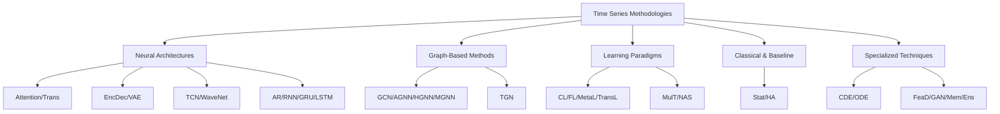

This guide provides a comprehensive reference for understanding the abbreviations used throughout the Time-Series Works and Conferences repository. These abbreviations are designed to reduce repetition in paper listings and streamline the representation of complex methodological approaches used in time series research. Understanding these abbreviations will help you navigate the extensive collection of time series papers and efficiently identify methodologies relevant to your research interests.

Sources: [README.md](/README.md#L45-L75)

## Understanding the Abbreviation System

The repository employs a systematic abbreviation system to categorize methodologies across different time series tasks. These abbreviations appear primarily in the "Model" column of the paper tables in [Recent-Time-Series-Work-Group-by-Task.md](Recent-Time-Series-Work-Group-by-Task.md). It's important to note that some terms may not represent general interpretations and apply specifically to this repository's classification system. The abbreviations serve multiple purposes: reducing redundancy in documentation, enabling quick methodological scanning, and facilitating comparative analysis across different papers and tasks.

The methodology categories are organized into logical groupings that reflect the major approaches in time series research. Understanding these categories will help you quickly locate papers employing specific techniques or approaches, whether you're interested in neural architectures, graph-based methods, probabilistic modeling, or learning paradigms.

Sources: [README.md](/README.md#L45-L50), [Recent-Time-Series-Work-Group-by-Task.md](docs/Recent-Time-Series-Work-Group-by-Task.md#L1-L10)

## Complete Abbreviation Reference

| Full Name | Abbreviation | Description & Context |
|:--|:--|:--|
| Adaptive GNN | AGNN | Graph Neural Networks with adaptive mechanisms that adjust their architecture or parameters based on data characteristics |
| Attention | Attn | Attention mechanisms that focus on specific parts of the time series, commonly used in Transformer architectures |
| AutoRegression(RNN,GRU,LSTM) | AR | Classical autoregressive approaches using recurrent neural networks including RNNs, GRUs, and LSTMs |
| Controlled Differential Equations | CDE | Differential equation-based models with control terms for modeling continuous-time dynamics |
| Contrastive Learning | CL | Self-supervised learning approach that learns representations by contrasting positive and negative pairs |
| Encoder Decoder | EncDec | Architectures with separate encoding and decoding phases, commonly used in sequence-to-sequence tasks |
| Ensemble | Ens | Methods that combine multiple models to improve prediction accuracy and robustness |
| Feature Decomposed | FeaD | Approaches that decompose time series into interpretable feature components |
| Federated Learning | FL | Distributed learning paradigm where models are trained across multiple decentralized devices |
| Generative Adversarial Network | GAN | Framework with generator and discriminator networks, used for time series generation |
| Graph Convolutional Network | GCN | Neural networks operating on graph structures, commonly used for spatial dependencies |
| Hour, Day, Week, Month, etc | HA | Historical averaging baselines using seasonal patterns at different time scales |
| Heterogeneous GNN | HGNN | Graph neural networks designed for graphs with different types of nodes and edges |
| Multiple Graph | MGNN | Methods that utilize multiple graph structures to capture different relationship types |
| Memory | Mem | Architectures incorporating explicit memory mechanisms for storing and retrieving patterns |
| Meta Learning | MetaL | Learning to learn approaches that enable models to adapt quickly to new tasks |
| MultiTask | MulT | Frameworks that simultaneously learn multiple related time series tasks |
| Network Architecture Search | NAS | Automated approaches for discovering optimal neural network architectures |
| Ordinary Differential Equations | ODE | Continuous-time modeling using ordinary differential equations |
| Statistic | Stat | Classical statistical methods and baselines for time series analysis |
| TCN (WaveNet) | TCN | Temporal Convolutional Networks including WaveNet-style architectures |
| Temporal Graph Network | TGN | Graph networks specifically designed for temporal dynamics and evolving graphs |
| Transformer | Trans | Self-attention based architectures that have become dominant in many time series tasks |
| Transfer Learning | TransL | Approaches that transfer knowledge from source domains to target time series tasks |
| Variational Auto-Encoder | VAE | Probabilistic generative models with encoder-decoder architecture for representation learning |

Sources: [README.md](/README.md#L45-L75)

## Methodology Categories

The abbreviations can be organized into five primary categories based on their fundamental approaches. This categorization helps researchers understand the landscape of time series methodologies and identify techniques that align with their research goals.

This architectural overview illustrates how different methodologies relate to each other and can be combined in innovative ways. For example, a modern time series model might combine Transformer architectures (B1) with Graph Neural Networks (C1) and employ Contrastive Learning (D1) for representation learning.

Sources: [README.md](/README.md#L45-L75), [Recent-Time-Series-Work-Group-by-Task.md](docs/Recent-Time-Series-Work-Group-by-Task.md#L1-L200)

## Usage Examples in Paper Listings

To illustrate how these abbreviations are used in practice, consider the following examples from the multivariate time series forecasting section:

- **FEDformer** (Frequency Enhanced Decomposed Transformer): Uses decomposition with Transformer architecture, appearing in the Model column alongside its full methodology description
- **PM-MemNet** (Pattern Matching Memory Networks): Combines Memory (Mem) mechanisms with pattern matching, showing how abbreviations can describe key architectural components
- **CoST** (Contrastive Learning of Disentangled Seasonal-Trend): Employs Contrastive Learning (CL) with decomposition approaches, demonstrating methodology combinations

The abbreviations serve as quick identifiers while the full paper titles provide detailed methodological information. This dual approach enables both rapid scanning and deep understanding of each contribution.

Sources: [Recent-Time-Series-Work-Group-by-Task.md](docs/Recent-Time-Series-Work-Group-by-Task.md#L20-L30)

## Frequently Used Methodology Combinations

Advanced time series models often combine multiple methodologies. Here are common combinations you'll encounter:

| Combination | Typical Use Case | Example Models |
|:--|:--|:--|
| Trans + GCN | Spatial-temporal forecasting with attention | MTGNN, AGCRN, STGNN |
| EncDec + Attn | Long sequence prediction | Informer, Autoformer, FEDformer |
| CL + FeaD | Representation learning with decomposition | CoST, TS2Vec |
| Mem + MetaL | Pattern-based adaptation | PM-MemNet, ST-MetaNet |
| ODE/CDE + Graph | Continuous-time dynamics on graphs | STG-NCDE, Neural CDEs |
| GAN + Trans | Adversarial training with transformers | Curb-GAN, TimeGrad |
| MulT + Ens | Robust multi-domain learning | UniTS, Multi-task models |
| VAE + CL | Probabilistic representation learning | Contrastive VAEs, TimeVAE |

> [!TIP]
> When encountering combined methodologies, prioritize understanding the primary component first (typically the base architecture), then examine how auxiliary components enhance the model's capabilities. For example, in "Trans + GCN" combinations, focus on how the Transformer processes temporal features while the GCN captures spatial dependencies.

Sources: [Recent-Time-Series-Work-Group-by-Task.md](docs/Recent-Time-Series-Work-Group-by-Task.md#L1-L200)

## Methodology Trends by Publication Year

The abbreviations also reveal research trends over time. Here's how methodology usage has evolved:

| Era | Dominant Methodologies | Characteristics |
|:--|:--|:--|
| 2018-2019 | GCN, AR, TCN, Stat | Early adoption of graph methods and temporal convolutions |
| 2020-2021 | Trans, Mem, CL, EncDec | Rise of transformers and self-supervised learning |
| 2022-2023 | TransL, MetaL, MulT | Focus on adaptation and multi-task learning |
| 2024+ | ODE/CDE, FeaD, FL | Emerging continuous-time modeling and federated approaches |

This evolution shows the field's progression from traditional methods to sophisticated neural architectures, and toward more generalizable and efficient learning paradigms.

Sources: [README.md](/README.md#L97-L200), [Recent-Time-Series-Work-Group-by-Task.md](docs/Recent-Time-Series-Work-Group-by-Task.md#L1-L200)

> [!TIP]
> Use this trend analysis to identify both established methodologies (safe choices for production systems) and emerging approaches (cutting-edge research directions). For implementation guidance, favor methodologies with mature codebases and established baselines from 2020-2022, while exploring 2023+ innovations for novel research contributions.

## Searching by Methodology

To find papers using specific methodologies, use the following strategies:

1. **Direct Abbreviation Search**: Many paper tables include methodology codes in the Model column or methodology descriptions
2. **Pattern Recognition**: Look for methodology names in paper titles (e.g., "Transformer-based," "Graph Convolutional," "Memory Network")
3. **Code Repository Filters**: Some code repositories include methodology tags or descriptions
4. **Task-Methodology Matrix**: Cross-reference task categories with methodology abbreviations to find domain-specific applications

For example, if you're interested in **Graph Neural Networks for Time Series**, you would search for papers mentioning GCN, AGNN, HGNN, or MGNN across different task sections, particularly in traffic forecasting and multivariate prediction tasks.

Sources: [README.md](/README.md#L97-L1157), [Recent-Time-Series-Work-Group-by-Task.md](docs/Recent-Time-Series-Work-Group-by-Task.md#L1-L506)

## Quick Reference by Research Goal

| Research Goal | Recommended Methodologies | Key Abbreviations |
|:--|:--|:--|
| Long-term forecasting | Decomposition + Attention | FeaD, Trans, EncDec |
| Short-term prediction | Autoregressive + Convolution | AR, TCN, Stat |
| Spatial-temporal data | Graph networks + Attention | GCN, AGNN, HGNN, Trans |
| Uncertainty quantification | Probabilistic models | VAE, GAN, ODE/CDE |
| Few-shot adaptation | Meta learning + Transfer | MetaL, TransL, Mem |
| Multi-domain learning | Multi-task + Ensemble | MulT, Ens, FL |
| Representation learning | Contrastive + Autoencoders | CL, VAE, EncDec |
| Continuous dynamics | Differential equations | ODE, CDE |

This reference helps you quickly identify relevant methodologies based on your specific research objectives or application requirements.

Sources: [README.md](/README.md#L45-L75), [Recent-Time-Series-Work-Group-by-Task.md](docs/Recent-Time-Series-Work-Group-by-Task.md#L1-L506)

## Next Steps

Now that you understand the methodology abbreviations, explore these related resources:

- **Transformer-based Models**: Deep dive into attention architectures with [Transformer-based Models](15-transformer-based-models)
- **Graph Neural Networks**: Learn about spatial-temporal modeling with [Graph Neural Networks for Time Series](16-graph-neural-networks-for-time-series)  
- **Advanced Paradigms**: Explore cutting-edge approaches with [LLM-Empowered Time Series Models](17-llm-empowered-time-series-models) and [Foundation Models for Time Series](18-foundation-models-for-time-series)
- **Task-Specific Applications**: Apply these methodologies to specific domains like [Multivariate Time Series Forecasting](4-multivariate-time-series-forecasting), [Time Series Anomaly Detection](7-time-series-anomaly-detection), or [Time Series Generation](8-time-series-generation)
- **Conference Navigation**: Find where these methodologies are published with [Conference Rankings and CCF Standards](19-conference-rankings-and-ccf-standards)

For implementation guidance and code examples, visit the main repository homepage and explore the linked code repositories for each methodology of interest.