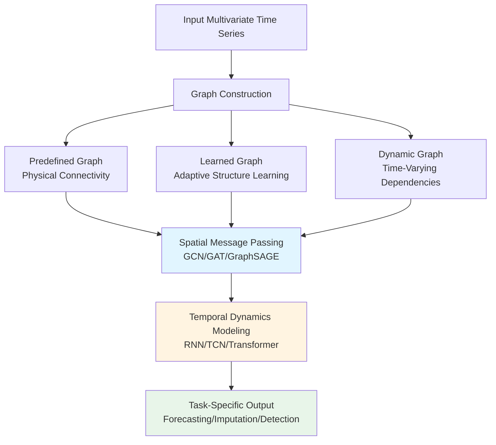

This page provides a comprehensive overview of Graph Neural Networks (GNN) applied to time series analysis. GNNs have emerged as a powerful paradigm for capturing complex spatiotemporal dependencies in time series data, particularly when sensors, stations, or entities exhibit structural relationships through connectivity, proximity, or functional correlation. The documentation synthesizes key models, architectural patterns, and applications across forecasting, imputation, and anomaly detection tasks.

Sources: [Recent-Time-Series-Work-Group-by-Task.md](/docs/Recent-Time-Series-Work-Group-by-Task.md#L14-L146)

## Core Architectural Paradigms

Graph Neural Networks for time series typically operate by representing multivariate time series as nodes in a graph where edges encode spatial, temporal, or functional relationships. The architecture generally integrates three components: graph construction, spatial message passing, and temporal dynamics modeling. The graph structure can be pre-defined based on physical connectivity (e.g., road networks, sensor topologies), learned adaptively from data, or dynamically updated to capture evolving dependencies.

The spatial component typically employs graph convolution layers that aggregate information from neighboring nodes. Common approaches include spectral graph convolution (DCRNN, STGCN), spatial attention mechanisms (Graph WaveNet, GMAN), and adaptive graph structure learning (AGCRN, GTS). The temporal component handles sequential dependencies through recurrent architectures (GRU, LSTM), temporal convolution networks (TCN), or transformer-based attention mechanisms.

Sources: [Recent-Time-Series-Work-Group-by-Task.md](/docs/Recent-Time-Series-Work-Group-by-Task.md#L44-L46), [Recent-Time-Series-Work-Group-by-Task.md](/docs/Recent-Time-Series-Work-Group-by-Task.md#L64-L66)

## Key Models by Task Category

### Traffic Flow and Speed Forecasting

Traffic forecasting represents the most prolific application area for GNN-based time series models, with datasets like METR-LA and PeMS-BAY serving as standard benchmarks. These models leverage road network topologies where sensors are connected based on physical distance and traffic flow patterns.

| Model | Publication | Core Innovation | Code |
|-------|-------------|-----------------|------|
| **DCRNN** | ICLR 2018 | Diffusion convolution with bidirectional random walks | [TensorFlow](https://github.com/liyaguang/DCRNN) |
| **STGCN** | IJCAI 2018 | Chebyshev graph convolution with temporal gating | [TensorFlow](https://github.com/VeritasYin/STGCN_IJCAI-18) |
| **Graph WaveNet** | IJCAI 2019 | Adaptive adjacency matrix with gated dilation convolutions | [PyTorch](https://github.com/nnzhan/Graph-WaveNet) |
| **AGCRN** | NeurIPS 2020 | Adaptive graph convolutional recurrent network | [PyTorch](https://github.com/LeiBAI/AGCRN) |
| **MTGNN** | KDD 2020 | Mix-hop propagation and graph structure learning | [PyTorch](https://github.com/nnzhan/MTGNN) |
| **GTS** | ICLR 2021 | Discrete graph structure learning | [PyTorch](https://github.com/chaoshangcs/GTS) |
| **STGODE** | KDD 2021 | Spatial-temporal graph ODE networks | [PyTorch](https://github.com/square-coder/STGODE) |
| **CNFGNN** | KDD 2021 | Cross-node federated graph neural network | [PyTorch](https://github.com/mengcz13/KDD2021_CNFGNN) |

Sources: [Recent-Time-Series-Work-Group-by-Task.md](/docs/Recent-Time-Series-Work-Group-by-Task.md#L92-L94), [Recent-Time-Series-Work-Group-by-Task.md](/docs/Recent-Time-Series-Work-Group-by-Task.md#L54-L56), [Recent-Time-Series-Work-Group-by-Task.md](/docs/Recent-Time-Series-Work-Group-by-Task.md#L69-L71)

### Multivariate Time Series Forecasting

Beyond traffic forecasting, GNNs generalize to arbitrary multivariate time series where inter-variable relationships can be modeled as graphs. This includes electricity grids, meteorological stations, financial instruments, and sensor networks.

| Model | Publication | Application Domain | Key Features |
|-------|-------------|-------------------|-------------|
| **StemGNN** | NeurIPS 2020 | Electricity, Traffic, Energy | Spectral-temporal graph learning |
| **Z-GCNETs** | ICML 2021 | Cryptocurrency, Traffic | Time zigzags at graph convolution |
| **STFGNN** | AAAI 2021 | Traffic, Electricity | Spatial-temporal fusion with multi-head attention |
| **TAMP-S2GCNets** | ICLR 2022 | COVID-19, PeMS | Time-aware multipersistence knowledge representation |
| **AGCNT** | CIKM 2021 | ETT, Electricity | Adaptive GCN for transformer-based forecasting |

Sources: [Recent-Time-Series-Work-Group-by-Task.md](/docs/Recent-Time-Series-Work-Group-by-Task.md#L51-L53), [Recent-Time-Series-Work-Group-by-Task.md](/docs/Recent-Time-Series-Work-Group-by-Task.md#L47-L49), [Recent-Time-Series-Work-Group-by-Task.md](/docs/Recent-Time-Series-Work-Group-by-Task.md#L73-L75)

### Time Series Imputation

GNN-based imputation models leverage graph structures to propagate information from observed time steps and neighboring sensors to fill missing values. The graph captures spatial dependencies that help reconstruct missing observations.

| Model | Publication | Datasets | Methodology |
|-------|-------------|----------|-------------|
| **GRIN** | ICLR 2022 | Air Quality, METR-LA, PeMS-BAY | Graph neural networks for multivariate imputation |
| **IGNNK** | AAAI 2021 | METR-LA, NREL, USHCN | Inductive graph neural networks for spatiotemporal kriging |
| **STI** | WWW 2019 | PhysioNet, Air Quality | Social-aware time series imputation |

Sources: [Recent-Time-Series-Work-Group-by-Task.md](/docs/Recent-Time-Series-Work-Group-by-Task.md#L200-L220), [Recent-Time-Series-Work-Group-by-Task.md](/docs/Recent-Time-Series-Work-Group-by-Task.md#L207-L209)

### Anomaly Detection

Anomaly detection models utilize GNNs to learn normal patterns in spatiotemporal data, with deviations from learned representations indicating anomalies. These are particularly important for cybersecurity, industrial monitoring, and system health applications.

| Model | Publication | Application | Architecture |
|-------|-------------|-------------|--------------|
| **GDN** | AAAI 2021 | SWaT, WADI | Graph neural network for multivariate anomaly detection |
| **GANF** | ICLR 2022 | PMU-B, PMU-C, SWaT | Graph-augmented normalizing flows |
| **MTAD-GAT** | ICDM 2019 | SMAP, MSL, TSA | Multivariate time-series via graph attention network |

Sources: [Recent-Time-Series-Work-Group-by-Task.md](/docs/Recent-Time-Series-Work-Group-by-Task.md#L234-L270), [Recent-Time-Series-Work-Group-by-Task.md](/docs/Recent-Time-Series-Work-Group-by-Task.md#L259-L261)

## Graph Construction Strategies

The effectiveness of GNN-based time series models depends critically on how the graph structure is defined. Three main approaches dominate the literature:

### Predefined Static Graphs

Physical or geographic relationships provide graph structures that remain constant over time. For traffic networks, this includes road connectivity and distance-based adjacency. For meteorological data, spatial proximity between weather stations defines edges. Predefined graphs require domain knowledge but provide interpretable structure and efficient implementation. Models like DCRNN, STGCN, and Graph WaveNet employ this strategy with adjacency matrices derived from road networks or distance metrics.

### Learned Adaptive Graphs

Rather than relying on predefined topology, models learn graph structures directly from time series data. This approach discovers latent relationships that may not align with physical connectivity. AGCRN learns node-specific parameters to capture hidden dependencies. GTS employs discrete graph structure learning with gradient-based optimization. The advantage is flexibility—the model discovers optimal representations—but requires careful regularization to avoid overfitting and ensure meaningful graph structures.

### Dynamic Time-Varying Graphs

Relationships between variables evolve over time due to changing conditions (e.g., traffic patterns, weather systems). Dynamic graphs update edge weights at each time step, capturing temporal shifts in dependency strength. STGODE models this through ordinary differential equations. Dynamic architectures are computationally expensive but provide maximum expressiveness for time-sensitive applications.

Sources: [Recent-Time-Series-Work-Group-by-Task.md](/docs/Recent-Time-Series-Work-Group-by-Task.md#L52-L54), [Recent-Time-Series-Work-Group-by-Task.md](/docs/Recent-Time-Series-Work-Group-by-Task.md#L59-L61)

## Temporal-Spatial Integration Mechanisms

The core challenge in spatiotemporal modeling is effectively integrating spatial and temporal information. Several architectural patterns address this:

### Sequential Integration (Spatial → Temporal)

Models first aggregate spatial information across the graph, then process the resulting sequences temporally. DCRNN exemplifies this with diffusion convolutions followed by GRU layers. This approach is intuitive and efficient but may lose fine-grained spatial details during temporal processing.

### Parallel Integration

Spatial and temporal modules operate independently before fusion. STFGNN employs separate spatial and temporal branches that are combined later. This preserves detailed spatial features throughout the pipeline but increases model complexity.

### Coupled Integration

Spatial and temporal information interact at each layer rather than being processed sequentially. Graph WaveNet uses adaptive adjacency matrices within temporal convolution layers, creating tightly coupled spatiotemporal representations. Coupled integration is theoretically principled but harder to implement and tune.

### Alternating Integration

Models alternate between spatial and temporal operations in a stacked architecture. STGCN applies graph convolution, temporal convolution, and another graph convolution in sequence. This pattern captures hierarchical dependencies and remains computationally tractable for deep architectures.

Sources: [Recent-Time-Series-Work-Group-by-Task.md](/docs/Recent-Time-Series-Work-Group-by-Task.md#L54-L56), [Recent-Time-Series-Work-Group-by-Task.md](/docs/Recent-Time-Series-Work-Group-by-Task.md#L69-L71)

## Popular Datasets

GNN-based time series models are evaluated on standardized benchmarks across domains:

| Dataset | Type | Nodes | Edges | Time Granularity |
|---------|------|-------|-------|------------------|
| **METR-LA** | Traffic | 207 | Distance-based | 5 minutes |
| **PeMS-BAY** | Traffic | 325 | Distance-based | 5 minutes |
| **PeMSD3/4/7/8** | Traffic | 358/307/882/170 | Distance-based | 5 minutes |
| **Electricity** | Grid | 321 | Transmission | 1 hour |
| **Weather** | Meteorology | 21 | Location-based | 10 minutes |
| **SWaT** | Industrial | Sensors | System topology | 1 second |

> [!TIP]
> PeMS datasets (California Performance Measurement System) remain the most widely used traffic benchmarks, with PeMSD7 (882 sensors) and PeMSD8 (170 sensors) offering different scales for evaluating scalability. Researchers should validate on multiple datasets to ensure generalization beyond traffic forecasting.

Sources: [Recent-Time-Series-Work-Group-by-Task.md](/docs/Recent-Time-Series-Work-Group-by-Task.md#L44-L46), [Recent-Time-Series-Work-Group-by-Task.md](/docs/Recent-Time-Series-Work-Group-by-Task.md#L23-L25)

## Implementation Considerations

When developing or applying GNN models for time series, several practical considerations affect performance:

### Graph Sparsity

Real-world networks are sparse—most sensors connect to only a few neighbors. Exploiting sparse matrix operations (scipy.sparse, torch.sparse) reduces computational complexity from O(N²) to O(E), where E is number of edges. This is crucial for large graphs with thousands of nodes.

### Temporal Horizon

Forecasting horizon influences architecture choice. Short-term predictions (minutes to hours) benefit from recurrent architectures capturing local dynamics. Long-term forecasts (hours to days) require attention mechanisms or hierarchical decomposition to handle accumulation of error and multi-scale patterns.

### Scalability

For large-scale deployment, consider model parallelization across graph nodes and temporal batching. Federated approaches like CNFGNN enable distributed learning across multiple institutions while preserving data privacy—a critical consideration for sensitive infrastructure data.

### Regularization

Graph structure learning requires careful regularization to prevent degenerate solutions. Common techniques include: (1) L1 regularization on adjacency matrices to encourage sparsity, (2) symmetry constraints on undirected graphs, (3) normalization to maintain stable training, and (4) early stopping based on validation performance.

Sources: [Recent-Time-Series-Work-Group-by-Task.md](/docs/Recent-Time-Series-Work-Group-by-Task.md#L59-L61), [Recent-Time-Series-Work-Group-by-Task.md](/docs/Recent-Time-Series-Work-Group-by-Task.md#L66-L68)

## Research Frontiers

Current research directions extend GNN-based time series modeling in several promising directions:

### Heterogeneous Graphs

Real-world systems involve multiple entity types with different relationships. Heterogeneous GNNs model these complex interactions, such as road networks with nodes representing sensors, road segments, and traffic lights with different edge semantics.

### Physics-Informed GNNs

Incorporating domain knowledge through physics-based constraints improves generalization and interpretability. STDEN combines neural networks with physics-guided constraints for traffic flow prediction, ensuring outputs satisfy conservation laws and boundary conditions.

### Cross-Modal Learning

Integrating multiple data modalities—images, text, trajectories—with time series through graph structures enables richer representations. EAST-Net models multimodal mobility by connecting time series, events, and spatial features in a unified graph architecture.

### Foundation Models

Pre-training GNNs on diverse time series datasets creates transferable representations that can be fine-tuned for specific tasks. This paradigm reduces data requirements and improves performance on limited-data scenarios.

> [!TIP]
> When selecting a GNN architecture for your time series application, start with simpler models (DCRNN, STGCN) on predefined graphs to establish baselines before exploring adaptive or dynamic graph learning, which requires more tuning and computational resources but may capture hidden dependencies that physical graphs miss.

Sources: [Recent-Time-Series-Work-Group-by-Task.md](/docs/Recent-Time-Series-Work-Group-by-Task.md#L18-L20), [Recent-Time-Series-Work-Group-by-Task.md](/docs/Recent-Time-Series-Work-Group-by-Task.md#L278-L290)

## Recommended Reading Path

For comprehensive understanding of time series modeling with GNNs, follow this progression:

1. **Foundational Models**: Begin with [DCRNN](https://github.com/liyaguang/DCRNN) and [STGCN](https://github.com/VeritasYin/STGCN_IJCAI-18) to understand basic spatiotemporal convolution patterns

2. **Structure Learning**: Explore [AGCRN](https://github.com/LeiBAI/AGCRN) and [GTS](https://github.com/chaoshangcs/GTS) for adaptive graph learning approaches

3. **Advanced Architectures**: Investigate [MTGNN](https://github.com/nnzhan/MTGNN) and [Graph WaveNet](https://github.com/nnzhan/Graph-WaveNet) for sophisticated attention mechanisms

4. **Task-Specific Extensions**: Examine [GRIN](https://github.com/Graph-Machine-Learning-Group/grin) for imputation and [GDN](https://github.com/d-ailin/GDN) for anomaly detection

5. **Related Methodologies**: Compare with [Transformer-based Models](17-llm-empowered-time-series-models) and [LLM-Empowered Time Series Models](17-llm-empowered-time-series-models) to understand architectural trade-offs
