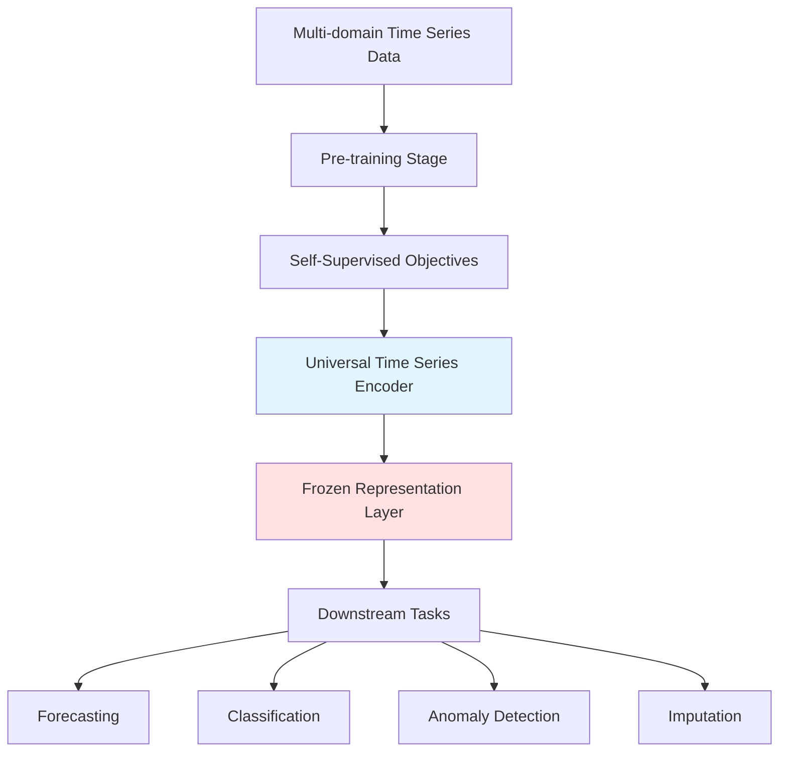

This page explores the emerging paradigm of **Foundation Models for Time Series** — large-scale pre-trained models designed to provide universal representations that can be adapted across diverse time series tasks and domains. Unlike traditional task-specific models, foundation models leverage massive pre-training on diverse datasets to learn transferable temporal patterns, enabling few-shot adaptation and cross-domain generalization capabilities.

## Conceptual Framework

Foundation models for time series represent a paradigm shift from specialized architectures to **universal representation learning** approaches. These models are characterized by their ability to learn rich temporal representations from large-scale heterogeneous time series data, which can then be fine-tuned or adapted to downstream tasks with minimal supervision. The core hypothesis is that temporal dynamics across different domains (traffic, weather, finance, healthcare) share underlying structural patterns that can be captured through large-scale pre-training.

## Key Architectural Approaches

### Universal Representation Learning

The **TS2Vec** model represents a pioneering approach in foundation model development for time series. Published at AAAI 2022, TS2Vec introduces a contrastive learning framework for learning universal time series representations. The model processes multiple datasets including ETT, Electricity, and Weather, demonstrating its cross-domain applicability. Unlike traditional forecasting models, TS2Vec focuses on learning **task-agnostic embeddings** that capture the essential temporal structure of time series data. This enables zero-shot or few-shot transfer to downstream tasks like classification, forecasting, and anomaly detection.

Sources: [Recent-Time-Series-Work-Group-by-Task.md](/docs/Recent-Time-Series-Work-Group-by-Task.md#L29-L30)

### Pre-training Paradigms

Foundation models typically employ **self-supervised pre-training** objectives that can be applied without task-specific labels:

1. **Masked Modeling**: Mask random segments of time series and train models to reconstruct them, learning temporal dependencies
2. **Contrastive Learning**: Maximize agreement between differently augmented views of the same time series
3. **Next-step Prediction**: Train models to predict future segments conditioned on past context

These approaches enable models to learn from **massive unlabeled datasets** across diverse domains, creating representations that capture fundamental temporal dynamics.

> [!TIP]
> The key advantage of foundation models is their ability to generalize across domains. For example, a model pre-trained on traffic data can be adapted to financial forecasting or weather prediction with minimal fine-tuning, leveraging learned temporal patterns rather than starting from scratch.

## Technical Architecture

The architecture typically consists of a **backbone encoder** (often transformer-based or CNN-based) that processes time series windows into compact representations. During pre-training, the model learns to capture temporal patterns through self-supervised objectives. The encoder weights can then be **frozen** and used as feature extractors for downstream tasks, or fine-tuned end-to-end with minimal task-specific data.

## Current Research Landscape

Based on the repository analysis, foundation model research for time series is in its early stages but rapidly evolving:

| Model | Pre-training Approach | Datasets Used | Key Capability | Publication |
|-------|---------------------|---------------|----------------|-------------|
| TS2Vec | Contrastive Learning | ETT, Electricity, Weather | Universal representations | AAAI 2022 A |
| TimeGrad | Denoising Diffusion | Exchange, Solar, Traffic | Probabilistic generation | NeurIPS 2021 A |
| CoST | Contrastive Decomposition | ETT, Electricity, Weather | Seasonal-trend disentanglement | ICLR 2022 |

Sources: [Recent-Time-Series-Work-Group-by-Task.md](/docs/Recent-Time-Series-Work-Group-by-Task.md#L21-L30), [Recent-Time-Series-Work-Group-by-Task.md](/docs/Recent-Time-Series-Work-Group-by-Task.md#L163-L164)

## Advantages Over Traditional Models

### Cross-domain Generalization

Traditional models like **Autoformer**, **FEDformer**, and **Informer** are designed for specific forecasting tasks on particular datasets. Foundation models, in contrast, learn **domain-invariant representations** that transfer across applications. A single foundation model can be adapted for traffic forecasting, electricity load prediction, weather forecasting, and even financial time series without architectural changes.

Sources: [Recent-Time-Series-Work-Group-by-Task.md](/docs/Recent-Time-Series-Work-Group-by-Task.md#L18-L19), [Recent-Time-Series-Work-Group-by-Task.md](/docs/Recent-Time-Series-Work-Group-by-Task.md#L38-L39), [Recent-Time-Series-Work-Group-by-Task.md](/docs/Recent-Time-Series-Work-Group-by-Task.md#L52-L53)

### Few-shot Learning Capabilities

Foundation models excel in **low-data regimes** where traditional models struggle. By leveraging pre-trained knowledge, they can achieve strong performance with only a few examples from the target domain. This is particularly valuable in specialized applications where labeled data is scarce, such as rare medical event prediction or emerging financial instruments.

### Unified Multi-task Learning

A single foundation model can simultaneously address multiple time series tasks — forecasting, classification, anomaly detection, and imputation — through different **task heads** sharing the same backbone. This unified approach simplifies deployment and reduces computational overhead compared to maintaining separate models for each task.

## Challenges and Limitations

### Data Heterogeneity

Time series data across domains varies dramatically in sampling rates, dimensionality, noise characteristics, and temporal patterns. Designing foundation models that can handle this **heterogeneity effectively** remains an open challenge. Different domains may require specialized preprocessing or normalization strategies.

### Computational Requirements

Pre-training foundation models requires **massive computational resources** and large-scale datasets. The infrastructure costs for training and storing these models can be prohibitive for many research groups, potentially limiting accessibility and democratization of these technologies.

### Evaluation Frameworks

Establishing standardized **evaluation benchmarks** for foundation models is challenging. Unlike task-specific models with clear metrics (MSE for forecasting, F1 for classification), foundation models need to demonstrate value across diverse tasks and domains, requiring comprehensive evaluation protocols.

> [!TIP]
> When selecting foundation models for production use, consider the trade-off between model size and adaptation efficiency. Smaller foundation models may offer better latency-critical applications, while larger models provide superior few-shot performance for complex tasks.

## Integration with Existing Methodologies

Foundation models complement rather than replace traditional time series methodologies. They can be combined with:

- **Task-specific fine-tuning**: Adapting pre-trained models to specific forecasting or classification tasks
- **Hybrid architectures**: Using foundation model embeddings as inputs to specialized models like transformers or GNNs
- **Multi-modal fusion**: Integrating time series foundation models with text, image, or graph models for complex applications

For advanced integration patterns, refer to [LLM-Empowered Time Series Models](17-llm-empowered-time-series-models) which explores combining foundation models with language models for enhanced capabilities.

## Practical Implementation Considerations

### Model Selection

When choosing a foundation model approach, consider:

1. **Domain relevance**: Models pre-trained on similar domains typically adapt better
2. **Task alignment**: Some foundation models optimize for specific tasks (forecasting vs. classification)
3. **Resource constraints**: Larger models offer better performance but require more compute
4. **Data availability**: Foundation models are most beneficial when task-specific data is limited

### Fine-tuning Strategies

Effective fine-tuning strategies include:

- **Linear probing**: Training only the task-specific head while keeping the encoder frozen
- **Full fine-tuning**: Updating all parameters with lower learning rates
- **Layer-wise learning rates**: Applying different learning rates to different layers
- **Parameter-efficient fine-tuning**: Using adapters or LoRA for minimal parameter updates

## Future Directions

The field is evolving rapidly with several promising research directions:

- **Multi-modal foundation models**: Integrating time series with other modalities (text, images, graphs)
- **Continual learning**: Models that can update knowledge without catastrophic forgetting
- **Domain-aware pre-training**: Incorporating domain-specific knowledge during pre-training
- **Efficient architectures**: Reducing computational overhead while maintaining performance

## Recommended Reading Path

For developers interested in foundation models for time series, the recommended progression is:

1. **Start here**: Understanding the foundation model paradigm and current research landscape
2. **Task-specific expertise**: Explore [Multivariate Time Series Forecasting](4-multivariate-time-series-forecasting) and [Probabilistic Time Series Forecasting](5-probabilistic-time-series-forecasting) for specialized models
3. **Advanced architectures**: Study [Transformer-based Models](15-transformer-based-models) and [Graph Neural Networks for Time Series](16-graph-neural-networks-for-time-series) for architectural insights
4. **Emerging paradigms**: Review [LLM-Empowered Time Series Models](17-llm-empowered-time-series-models) for cutting-edge integration approaches

## Resources and Codebases

The repository includes implementations of foundation model approaches:

- **TS2Vec**: PyTorch implementation available at [github.com/yuezhihan/ts2vec](https://github.com/yuezhihan/ts2vec)
- **TimeGrad**: PyTorch implementation for probabilistic generation
- **CoST**: Contrastive learning implementation with seasonal-trend decomposition

Sources: [Recent-Time-Series-Work-Group-by-Task.md](/docs/Recent-Time-Series-Work-Group-by-Task.md#L29-L30)

## Conclusion

Foundation models for time series represent a transformative approach to temporal modeling, offering universal representations that transfer across tasks and domains. While still in early stages, models like TS2Vec demonstrate the potential for **large-scale pre-training** to learn rich temporal patterns that generalize beyond traditional task-specific boundaries. As the field matures, foundation models are likely to become a foundational component in time series analysis, enabling new applications and reducing the barrier to entry for complex temporal modeling tasks.

Researchers and practitioners should monitor developments in this space, as foundation models have the potential to democratize access to sophisticated time series modeling capabilities while pushing the boundaries of what's possible with temporal data analysis.