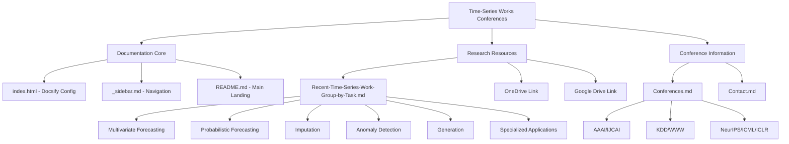

Welcome to the Time-Series Works and Conferences repository—your comprehensive resource for cutting-edge time series research papers, methodologies, and conference information. This Quick Start guide will help beginners navigate the repository structure, understand the organization, and quickly find relevant research materials for time series tasks.

Sources: [README.md](/README.md#L1-L50), [docs/README.md](/docs/README.md#L1-L25)

## Repository Architecture

This repository is structured as a documentation hub built with Docsify, providing a clean and searchable interface for exploring time series research. The architecture follows a dual-organization principle: papers are grouped both by task categories and by methodology approaches, making it easy to find research based on your specific interests.

The repository serves two primary purposes: maintaining an up-to-date collection of recent time series works across major AI conferences, and providing conference information including deadlines, rankings, and accepted paper lists. All content is accessible through the GitHub Pages site, offering an optimized reading experience with built-in search functionality and responsive design.

Sources: [docs/index.html](/docs/index.html#L1-L33), [README.md](/README.md#L1-L30)

## Project Structure Overview

Sources: [README.md](/README.md#L1-L115), [docs/Recent-Time-Series-Work-Group-by-Task.md](/docs/Recent-Time-Series-Work-Group-by-Task.md#L1-L50), [docs/Conferences.md](/docs/Conferences.md#L1-L30)

## Getting Started with the Documentation

### Step 1: Access the Platform

The repository is accessible through multiple interfaces. For the optimal reading experience with search functionality and improved navigation, visit the GitHub Pages site. The documentation is rendered using Docsify, which provides features like full-text search, image zoom, code copying, and mobile responsiveness.

Sources: [docs/index.html](/docs/index.html#L1-L33), [README.md](/README.md#L8-L15)

### Step 2: Understand the Paper Organization System

The repository uses a comprehensive abbreviation system for methodology classification to reduce repetition and improve readability. These abbreviations appear throughout the paper tables and help quickly identify research approaches.

| Abbreviation | Full Name |
|:--|:--|
| Attn | Attention |
| Trans | Transformer |
| GCN | Graph Convolutional Network |
| GAN | Generative Adversarial Network |
| VAE | Variational Auto-Encoder |
| CL | Contrastive Learning |
| EncDec | Encoder Decoder |
| MGNN | Multiple Graph |
| ODE | Ordinary Differential Equations |
| TransL | Transfer Learning |

The publication quality is ranked using CCF (China Computer Federation) standards (A, B, C), and conferences are ordered by average paper quality: NeurIPS > ICML > ICLR > KDD > AAAI > IJCAI > WWW > CIKM > ICDM > WSDM.

Sources: [README.md](/README.md#L38-L68), [docs/Recent-Time-Series-Work-Group-by-Task.md](/docs/Recent-Time-Series-Work-Group-by-Task.md#L4-L10)

### Step 3: Navigate Research Papers

The main research content is organized in the "Recent Time Series Work Group by Task" document, which contains comprehensive tables for each task category. Each paper entry includes: Task type, Dataset used, Model name, Paper title with link, Code availability (Pytorch, TensorFlow, etc.), and Publication venue with CCF ranking.

Here's a sample of what you'll find in the tables:

| Task | Data | Model | Paper | Code | Publication |
| :-: | :-: | :-: | :-: | :-: | - |
| Multivariate | ETT, Electricity | Autoformer | Autoformer: Decomposition Transformers with Auto-Correlation for Long-Term Series Forecasting | [Pytorch](https://github.com/thuml/Autoformer) | NeurIPS 2021 A |
| Traffic Flow | PeMSD7, PeMSD8 | MTGNN | Connecting the Dots: Multivariate Time Series Forecasting with Graph Neural Networks | [Pytorch](https://github.com/nnzhan/MTGNN) | KDD 2020 A |
| Multivariate | ETT, Weather | Informer | Informer: Beyond Efficient Transformer for Long Sequence Time-Series Forecasting | [Pytorch](https://github.com/zhouhaoyi/Informer2020) | AAAI 2021 A |

Sources: [docs/Recent-Time-Series-Work-Group-by-Task.md](/docs/Recent-Time-Series-Work-Group-by-Task.md#L1-L80)

## Core Task Categories

The repository covers twelve primary task categories, each with curated research papers and methodologies. Understanding these categories will help you quickly locate relevant research for your specific domain.

| Task Category | Description | Paper Count |
|:--|:--|:--|
| Multivariate Time Series Forecasting | Predicting multiple correlated time series variables simultaneously | 100+ |
| Probabilistic Time Series Forecasting | Forecasting with uncertainty quantification | 39 |
| Time Series Imputation | Filling missing values in time series data | 25+ |
| Time Series Anomaly Detection | Identifying unusual patterns or outliers | 30+ |
| Time Series Generation | Synthetic time series data creation | 20+ |
| Demand Prediction | Forecasting service or product demand | 15+ |
| Event Prediction | Predicting occurrence of future events | 10+ |
| Stock and Financial Prediction | Financial market forecasting | 20+ |
| Travel Time Estimation | Predicting journey duration | 10+ |
| Traffic Flow and Speed Prediction | Transportation network forecasting | 80+ |
| Other Forecasting | Miscellaneous forecasting tasks | 15+ |

Sources: [README.md](/README.md#L69-L83), [docs/Recent-Time-Series-Work-Group-by-Task.md](/docs/Recent-Time-Series-Work-Group-by-Task.md#L12-L14)

## Conference Resources

The repository maintains comprehensive information about major AI and ML conferences relevant to time series research. Conference data includes deadline information, notification dates, and links to accepted paper lists.

| Conference | Coverage Period | Notable Feature |
|:--|:--|:--|
| NeurIPS | to 2021 | Top-ranked for theoretical ML |
| ICML | to 2021 | Highest quality average |
| ICLR | to 2022 | OpenReview platform |
| KDD | to 2021 | Premier data mining conference |
| AAAI | to 2022 | Broad AI coverage |
| IJCAI | to 2021 | International AI conference |
| WWW | to 2022 | Web and social networks |
| CIKM | to 2021 | Information and knowledge management |

The repository also recommends using external tools like [dblp](https://dblp.uni-trier.de/) and [Aminer](https://www.aminer.cn/conf) for comprehensive conference searches and paper discovery.

Sources: [docs/Conferences.md](/docs/Conferences.md#L1-L45)

## External Resource Access

In addition to papers directly included in the repository, the maintainer provides comprehensive collections via cloud storage platforms. These external resources contain additional papers and materials that may not be directly linked in the GitHub repository.

| Platform | Access | Notes |
|:--|:--|:--|
| OneDrive | [Access Link](https://1drv.ms/u/s!Au2cJRs-_u93lDbLrSDkDy8htv2V?e=ftuaXd) | Papers organized by task and methodology |
| Google Drive | [Access Link](https://drive.google.com/drive/folders/17bILWdDxUrufRp3yilYfoU5VKywwS1g6?usp=sharing) | VPN may be required for access |

These external drives contain nearly complete collections including methodology sections that are still being updated in the main repository.

Sources: [README.md](/README.md#L25-L35), [docs/README.md](/docs/README.md#L18-L22)

## Community and Contribution

This is a living, community-driven project actively maintained by researchers passionate about time series analysis. The maintainer encourages participation through multiple channels.

| Contribution Type | How to Participate |
|:--|:--|
| Report Issues | Open a GitHub issue for missing resources or errors |
| Submit Papers | Make a pull request to add new papers or code |
| Collaboration | Contact the maintainer for collaborative research opportunities |
| Discussions | Join community discussions about time series research |

The project is maintained by a doctoral researcher at UNSW, supervised by Prof. Flora Salim and Hao Xue, with expertise in time series forecasting, traffic prediction, and spatio-temporal modeling.

Sources: [README.md](/README.md#L17-L24), [docs/Contact.md](/docs/Contact.md#L1-L6)

## Recommended Learning Path

For beginners new to time series research, we suggest following this structured progression through the repository content:

1. **Start here**: Review the abbreviations table to understand methodology classifications
2. **Choose your domain**: Identify which task category aligns with your research interests
3. **Explore foundational papers**: Begin with highly-cited papers from top conferences (NeurIPS, ICML)
4. **Examine code implementations**: Use available code links to understand practical implementations
5. **Explore methodologies**: Dive into specific approaches like Transformers, GNNs, or probabilistic methods
6. **Stay updated**: Check conference deadlines and recent accepted papers for cutting-edge research

> [!TIP]
> Focus on papers from NeurIPS, ICML, and ICLR first—these venues typically have the highest average quality and most rigorous peer review in the time series domain. The repository's ranking system (A/B/C) provides a quick quality indicator.

Sources: [README.md](/README.md#L38-L68), [docs/Recent-Time-Series-Work-Group-by-Task.md](/docs/Recent-Time-Series-Work-Group-by-Task.md#L4-L10)

## Next Steps

Now that you understand the repository structure and navigation, you're ready to dive deeper into specific areas of time series research. Continue your journey with these recommended next sections:

- [Overview](1-overview) - Learn more about the project's scope and objectives
- [Repository Navigation Guide](3-repository-navigation-guide) - Master advanced navigation techniques
- [Multivariate Time Series Forecasting](4-multivariate-time-series-forecasting) - Explore the largest research category with 100+ papers

For methodology-specific exploration, consider reviewing:
- [Transformer-based Models](15-transformer-based-models) - Understanding attention mechanisms in time series
- [Graph Neural Networks for Time Series](16-graph-neural-networks-for-time-series) - Spatial-temporal modeling approaches
- [LLM-Empowered Time Series Models](17-llm-empowered-time-series-models) - Latest advances in large language model applications
