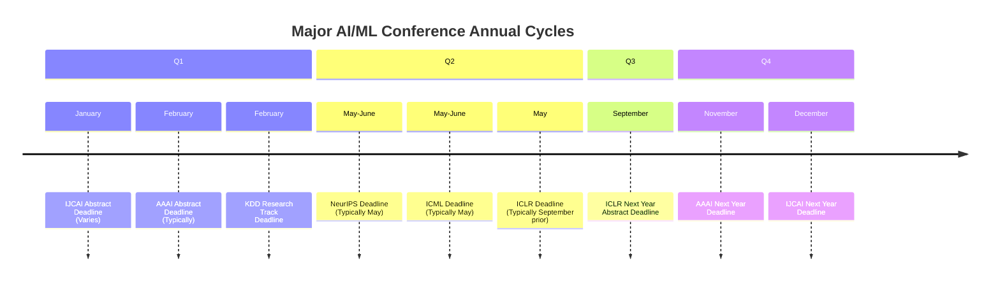
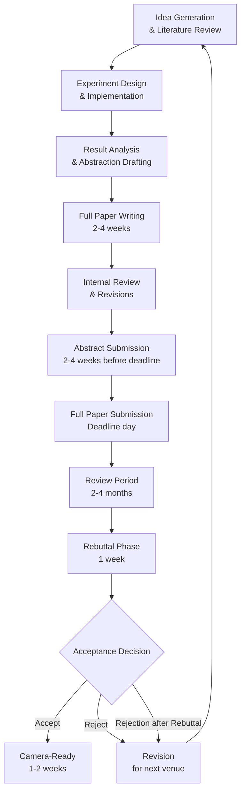

This guide serves as your comprehensive roadmap for navigating the academic conference landscape in time series research. Whether you're preparing your first submission or planning a long-term research trajectory, understanding conference cycles, deadlines, and submission workflows is crucial for success in the field.

## Understanding the AI/ML Conference Landscape

The academic publishing ecosystem for time series research revolves around several key venues, each with distinct submission cycles, focus areas, and competitive pressure. The repository's conference collection reveals a **hierarchical structure** based on research quality and impact, with venues ranked as: NeurIPS > ICML > ICLR > KDD > AAAI > IJCAI > WWW > CIKM > ICDM > WSDM [Sources: docs/Recent-Time-Series-Work-Group-by-Task.md](docs/Recent-Time-Series-Work-Group-by-Task.md#L7-L10).

Understanding this hierarchy helps you strategically target venues that match your research contribution level. For beginners, it's important to recognize that **top-tier venues like NeurIPS and ICML** typically require groundbreaking innovations, while **AAAI and IJCAI** often welcome solid incremental advances with thorough experimental validation.

## Major Conference Calendar and Cycles

> [!TIP]
> Conference deadlines can shift by 1-3 weeks annually. Always verify dates on official conference websites rather than relying solely on secondary trackers. Some conferences operate on a fixed calendar (e.g., NeurIPS always in December), but submission dates may move to avoid holidays.

The repository provides historical data for major conferences, showing typical submission patterns. For example, AAAI-22 had a deadline of September 8, 2021, with notification on November 29, 2021 [Sources: docs/Conferences.md](docs/Conferences.md#L43-L46). This **approximately 2.5-month review cycle** is representative across most venues, though some extend to 3-4 months.

## Conference Categories and Focus Areas

| Conference | CCF Rank | Time Series Research Focus | Typical Timeline | Key Features |
|:---|:---|:---|:---|:---|
| **NeurIPS** | A | Foundation models, LLMs, theoretical advances | May deadline, December conference | Highest impact, highly competitive |
| **ICML** | A | Theoretical ML, deep learning advances | May deadline, June/July conference | Strong theory focus, rigorous review |
| **ICLR** | None (but top-tier) | Architecture innovations, representation learning | September deadline, May conference | Open review process, reproducibility emphasis |
| **KDD** | A | Applied ML, data mining, spatio-temporal prediction | February deadline, August conference | Industry connections, application focus |
| **AAAI** | A | Broad AI, including time series forecasting | September deadline, February conference | Diverse topics, larger acceptance rate |
| **IJCAI** | A | AI systems, applications | January deadline, July/August conference | International scope, application-oriented |
| **WWW** | A | Web applications, social media forecasting | October deadline, April/May conference | Real-world data emphasis |
| **CIKM** | B | Information management, knowledge discovery | Summer deadline, Fall conference | Balanced theory/applications |
| **WSDM** | B | Web search, data mining | Spring deadline, Winter conference | Smaller community, focused scope |

*Based on conference rankings and paper collections in the repository [Sources: docs/Recent-Time-Series-Work-Group-by-Task.md](docs/Recent-Time-Series-Work-Group-by-Task.md#L7-L10), [docs/Conferences.md](docs/Conferences.md)*

> [!TIP]
> For time series research specifically, KDD and AAAI have historically shown strong acceptance rates for forecasting papers, as evidenced by the numerous entries in the repository's paper collections across multiple years [Sources: docs/Recent-Time-Series-Work-Group-by-Task.md](docs/Recent-Time-Series-Work-Group-by-Task.md#L1-L100).

## Essential Deadline Tracking Resources

Rather than manually tracking multiple conference websites, leverage centralized platforms maintained by the research community:

- **CCF Conference Deadlines** (ccfddl.github.io) - Comprehensive tracker for CCF-ranked conferences with filtering options by field and deadline proximity [Sources: docs/Conferences.md](docs/Conferences.md#L14-L15)
- **会议之眼** (conferenceeye.cn) - Chinese-language resource with detailed conference information and acceptance statistics [Sources: docs/Conferences.md](docs/Conferences.md#L17-L18)
- **Call4Papers** (123.57.137.208) - Aggregated calls for papers across disciplines [Sources: docs/Conferences.md](docs/Conferences.md#L20-L21)
- **dblp** (dblp.uni-trier.de) and **Aminer** (aminer.cn) - Academic databases for paper search and conference proceedings [Sources: docs/Conferences.md](docs/Conferences.md#L9-L11)

These platforms provide **automated deadline notifications**, calendar exports, and historical acceptance data to help you plan submissions strategically.

## Submission Workflow and Timeline Planning

### Paper Submission Lifecycle

### Strategic Timeline Planning

For optimal submission planning, work backwards from conference deadlines:

**3-4 Months Before Deadline**
- Complete core experiments and initial results
- Begin literature review gap analysis
- Identify potential target conferences based on fit

**2-3 Months Before Deadline**
- Draft complete paper including related work
- Conduct thorough experiments for ablation studies
- Begin internal review process with colleagues

**1-2 Months Before Deadline**
- Finalize paper with all revisions
- Prepare supplementary materials (code, data)
- Submit abstract (if required by conference)

**1-2 Weeks Before Deadline**
- Final proofreading and formatting compliance check
- Prepare submission system account and metadata
- Buffer time for technical issues

**Deadline Day**
- Submit early (morning in conference timezone)
- Verify successful submission through confirmation email
- Record submission ID for tracking

## Conference Selection Strategy

### Matching Research to Venue

The repository's extensive paper collection reveals patterns in where different types of time series research are published:

1. **Foundation Models and Large-Scale Architectures**: Target NeurIPS, ICML, or ICLR. Papers like Time-LLM, MOMENT, and UniTS typically appear in these venues [Sources: README.md](README.md#L103-L109).

2. **Applied Forecasting with Real Data**: KDD and WWW are strong choices. The repository shows numerous traffic prediction and demand forecasting papers in these venues [Sources: docs/Recent-Time-Series-Work-Group-by-Task.md](docs/Recent-Time-Series-Work-Group-by-Task.md#L31-L50).

3. **Incremental Advances and Benchmarking**: AAAI and IJCAI welcome thorough experimental studies. Many papers comparing multiple baselines appear in these conferences [Sources: docs/Recent-Time-Series-Work-Group-by-Task.md](docs/Recent-Time-Series-Work-Group-by-Task.md#L51-L80).

4. **Specialized Applications**: Domain-specific conferences may provide better fit. Traffic prediction work appears in transportation venues, while financial forecasting may target business analytics conferences.

### Backup Planning Strategy

Given the high rejection rates at top venues (often 80-90%), always plan a submission cascade:

1. **Primary Target**: Highest-impact venue where your work could realistically be accepted
2. **Secondary Target**: Venue with similar focus but slightly lower competition
3. **Tertiary Target**: Venue with broader scope that welcomes the contribution
4. **ArXiv Preprint**: Upload simultaneously to establish priority regardless of conference outcome

## Paper Organization by Task and Venue

The repository organizes papers not just by conference, but by task categories, which helps identify the right venue for specific research directions:

- **Multivariate Time Series Forecasting**: Strong presence across NeurIPS, ICML, KDD, AAAI with over 100 papers cataloged [Sources: README.md](README.md#L88-L90)
- **Probabilistic Time Series Forecasting**: Primarily appears in NeurIPS and ICML [Sources: README.md](README.md#L91-L93)
- **Time Series Imputation and Anomaly Detection**: Mixed across KDD, AAAI, IJCAI [Sources: README.md](README.md#L94-L99)
- **Domain-Specific Applications** (Traffic, Finance, Healthcare): Often appears in specialized tracks of KDD, WWW, or domain conferences [Sources: README.md](README.md#L100-L110)

This categorization helps you identify **venue preferences for specific task types** and adjust your targeting strategy accordingly.

## Common Submission Mistakes to Avoid

Based on the repository's collection of accepted papers, several patterns emerge for successful submissions:

1. **Insufficient Baseline Comparisons**: Top papers consistently compare against multiple strong baselines, not just simple methods. The repository shows extensive baseline tables in accepted papers [Sources: docs/Recent-Time-Series-Work-Group-by-Task.md](docs/Recent-Time-Series-Work-Group-by-Task.md#L1-L100).

2. **Limited Datasets**: Strong papers test on multiple diverse datasets. The repository's papers commonly use ETT, Electricity, Weather, Traffic, and domain-specific datasets [Sources: docs/Recent-Time-Series-Work-Group-by-Task.md](docs/Recent-Time-Series-Work-Group-by-Task.md#L1-L50).

3. **Poor Code Availability**: Many accepted papers provide open-source code. Check if your target venue encourages reproducibility and prepare code repositories accordingly.

4. **Weak Related Work**: Thorough literature review is essential. The repository's extensive paper list can help identify key references [Sources: README.md](README.md#L1-L50).

5. **Formatting Violations**: Each conference has specific formatting requirements. Adhere strictly to avoid desk rejection.

## Leveraging the Repository for Conference Research

This repository provides several valuable resources for conference submission planning:

1. **Historical Paper Collections**: Review accepted papers from previous years to understand what types of contributions each venue accepts [Sources: docs/Conferences.md](docs/Conferences.md#L30-L138).

2. **Benchmarks and Datasets**: The repository references common datasets like TimesNet_data, which are frequently used across multiple conferences [Sources: README.md](README.md#L97-L100).

3. **Code References**: Many papers link to GitHub repositories, providing implementation examples and baseline comparisons [Sources: docs/Recent-Time-Series-Work-Group-by-Task.md](docs/Recent-Time-Series-Work-Group-by-Task.md#L1-L100).

4. **Abbreviation Guide**: Understanding methodology abbreviations helps you navigate the literature efficiently [Sources: README.md](README.md#L61-L89).

## Next Steps for Conference Preparation

Now that you understand the conference landscape and submission process, consider these next steps:

1. **Explore Conference Rankings**: Understand the prestige and requirements of different venues with [Conference Rankings and CCF Standards](19-conference-rankings-and-ccf-standards).

2. **Study Accepted Papers**: Review top conference paper collections to understand what constitutes successful submissions in [Top Conference Paper Collections](21-top-conference-paper-collections-neurips-icml-iclr) and [Domain-Specific Conference Collections](22-domain-specific-conference-collections-kdd-www-aaai-ijcai).

3. **Plan Your Research Timeline**: Use the calendar and workflow information to plan your research schedule around target conference deadlines.

4. **Leverage Research Tools**: Explore available [Research Tools and External Resources](23-research-tools-and-external-resources) to streamline your paper preparation process.

By strategically planning your conference submissions and understanding the landscape, you can maximize your chances of acceptance and build a strong publication record in time series research. Remember that persistence is key—even top researchers face multiple rejections before acceptance at premier venues.