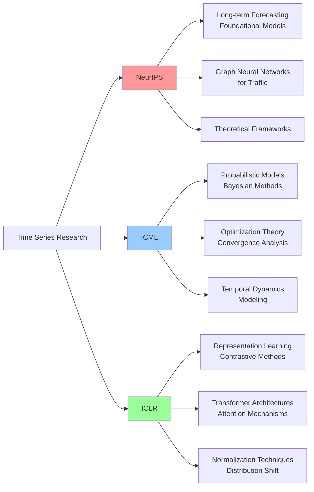
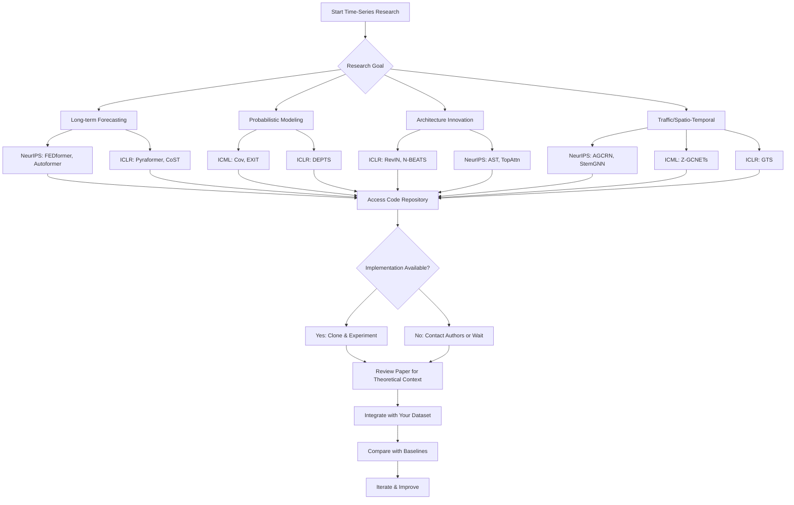

This page provides a curated collection of time-series research papers from the three most prestigious machine learning conferences: NeurIPS (Neural Information Processing Systems), ICML (International Conference on Machine Learning), and ICLR (International Conference on Learning Representations). These conferences represent the **forefront of machine learning research**, with particularly strong contributions to time-series forecasting, representation learning, and spatio-temporal modeling.

The repository establishes a clear **conference hierarchy** based on average paper and code quality: NIPS > ICML > ICLR > KDD > AAAI > IJCAI > WWW > CIKM > ICDM > WSDM. This ranking reflects the community's perception of research rigor, innovation, and practical reproducibility [Recent-Time-Series-Work-Group-by-Task.md](docs/Recent-Time-Series-Work-Group-by-Task.md#L7-L10).

> [!TIP]
> While all three conferences are CCF-A ranked (except ICLR, which is not officially ranked but considered top-tier), NeurIPS and ICML tend to have higher acceptance rates of foundational theoretical work, while ICLR often leads in architectural innovations and representation learning advances.

## Conference Overview and Access

The following table summarizes the **primary access points** for each conference's paper collection:

| Conference | Platform | Coverage | Time Period | Official Status |
|------------|----------|----------|--------------|-----------------|
| **NeurIPS** | [papers.nips.cc](https://papers.nips.cc/) | All accepted papers | 1987-present | Complete archive |
| **ICML** | [icml.cc](https://icml.cc) | All accepted papers | 1985-present | Complete archive |
| **ICLR** | [OpenReview](https://openreview.net/group?id=ICLR.cc) | All accepted papers | 2013-present | Complete archive |

Each conference maintains its own submission and review system through these platforms, making them the **authoritative sources** for official proceedings [Conferences.md](docs/Conferences.md#L96-L127).

## Research Distribution Across Top Conferences

The time-series research landscape across these three conferences demonstrates **distinct patterns** of focus and methodology preference:

This **methodological distribution** reflects each conference's historical strengths and community preferences. NeurIPS tends to attract more application-driven and systems-level work, ICML emphasizes theoretical foundations and mathematical rigor, while ICLR serves as the primary venue for architectural innovations in deep learning.

## NeurIPS Time-Series Papers

NeurIPS (NIPS) has been a **dominant venue** for time-series research, particularly in long-term forecasting, traffic prediction, and graph-based approaches. The following collections represent key contributions through 2021:

### Long-term Forecasting and Foundation Models

| Model | Task | Datasets | Code | Key Contribution |
|-------|------|----------|------|-----------------|
| **FEDformer** | Multivariate Forecasting | ETT, Electricity, Exchange, Traffic, Weather, ILI | Future? | Frequency-enhanced decomposed transformer for long-term series [Recent-Time-Series-Work-Group-by-Task.md](docs/Recent-Time-Series-Work-Group-by-Task.md#L18) |
| **Autoformer** | Long-term Forecasting | ETT, Electricity, Exchange, Traffic, Weather, ILI | [Pytorch](https://github.com/thuml/Autoformer) | Decomposition transformers with auto-correlation mechanism [Recent-Time-Series-Work-Group-by-Task.md](docs/Recent-Time-Series-Work-Group-by-Task.md#L38) |
| **MisSeq** | Multivariate Forecasting | Rossmann, M5, Wiki | None | Connecting macroscopic forecasting with microscopic data [Recent-Time-Series-Work-Group-by-Task.md](docs/Recent-Time-Series-Work-Group-by-Task.md#L37) |

These works established the **transformer paradigm** for time-series forecasting, moving beyond traditional ARIMA and RNN-based approaches. FEDformer, in particular, introduced frequency-domain analysis as a crucial component for capturing seasonal patterns in long-term predictions.

### Traffic and Spatio-Temporal Modeling

| Model | Task | Datasets | Code | Key Contribution |
|-------|------|----------|------|-----------------|
| **AGCRN** | Traffic Flow | Traffic, Energy, Electricity, Exchange, METR-LA, PeMS-BAY | [Pytorch](https://github.com/LeiBAI/AGCRN) | Adaptive graph convolutional recurrent network [Recent-Time-Series-Work-Group-by-Task.md](docs/Recent-Time-Series-Work-Group-by-Task.md#L75) |
| **StemGNN** | Multivariate Forecasting | METR-LA, PeMS-BAY, PeMS07, PeMS03, PeMS04 | [Pytorch](https://github.com/m) | Spectral-temporal graph neural network [Recent-Time-Series-Work-Group-by-Task.md](docs/Recent-Time-Series-Work-Group-by-Task.md#L77) |
| **AST** | Multivariate Forecasting | Electricity, Traffic, Wind, Solar, M4-Hourly | [Pytorch](https://github.com/hihihi) | Adversarial sparse transformer [Recent-Time-Series-Work-Group-by-Task.md](docs/Recent-Time-Series-Work-Group-by-Task.md#L76) |

NeurIPS has been particularly **influential in graph-based time-series modeling**, especially for traffic prediction applications. These papers demonstrate how spatial dependencies can be effectively modeled alongside temporal patterns using graph neural networks [Multivariate Time Series Forecasting](4-multivariate-time-series-forecasting).

### Theoretical and Methodological Advances

| Model | Task | Datasets | Code | Key Contribution |
|-------|------|----------|------|-----------------|
| **TopAttn** | Multivariate Forecasting | M4, Electricity, car-parts | [Pytorch](https://github.com/plus-rkwitt/TAN) | Topological attention for time series [Recent-Time-Series-Work-Group-by-Task.md](docs/Recent-Time-Series-Work-Group-by-Task.md#L36) |
| **Error** | Multivariate Forecasting | PeMSD4, PeMSD8, Traffic, ADI, M4 | [Pytorch](https://github.com/Daikon-Sun/AdjustAutocorrelation) | Adjusting for autocorrelated errors in neural networks [Recent-Time-Series-Work-Group-by-Task.md](docs/Recent-Time-Series-Work-Group-by-Task.md#L39) |

These works address **fundamental challenges** in time-series modeling, including error structure, topology, and theoretical properties of neural architectures for sequential data.

## ICML Time-Series Papers

ICML contributions to time-series research emphasize **mathematical rigor** and probabilistic modeling, with strong representation learning and optimization foundations:

### Probabilistic and Statistical Approaches

| Model | Task | Datasets | Code | Key Contribution |
|-------|------|----------|------|-----------------|
| **Cov** | Multivariate Forecasting | PeMSD7(M), METR-LA, PeMS-BAY | None | Conditional temporal neural processes with covariance loss [Recent-Time-Series-Work-Group-by-Task.md](docs/Recent-Time-Series-Work-Group-by-Task.md#L41) |
| **Z-GCNETs** | Multivariate Forecasting | Bytom, Decentraland, PeMSD4, PeMSD8 | [Pytorch](https://github.com/Z-GCNETs/Z-GCNETs) | Time zigzags at graph convolutional networks [Recent-Time-Series-Work-Group-by-Task.md](docs/Recent-Time-Series-Work-Group-by-Task.md#L40) |

ICML's strength in **probabilistic modeling** is evident in these contributions, which provide principled uncertainty quantification and statistical guarantees—critical aspects for real-world deployment of time-series models [Probabilistic Time Series Forecasting](5-probabilistic-time-series-forecasting).

### Dynamic Systems and Control Theory

| Model | Task | Datasets | Code | Key Contribution |
|-------|------|----------|------|-----------------|
| **EXIT** | Classification & Forecasting | MuJoCo, Google Stock | None | Extrapolation and interpolation-based neural controlled differential equations [Recent-Time-Series-Work-Group-by-Task.md](docs/Recent-Time-Series-Work-Group-by-Task.md#L31) |

This work demonstrates ICML's **interdisciplinary approach**, connecting time-series analysis with control theory and differential equations—providing theoretically grounded methods for continuous-time modeling.

> [!TIP]
> ICML papers often include detailed theoretical analysis including convergence proofs, generalization bounds, and optimization guarantees—making them particularly valuable for understanding the mathematical foundations of time-series modeling.

## ICLR Time-Series Papers

ICLR has emerged as the **primary venue** for architectural innovations in time-series modeling, particularly in representation learning, attention mechanisms, and normalization techniques:

### Representation Learning and Contrastive Methods

| Model | Task | Datasets | Code | Key Contribution |
|-------|------|----------|------|-----------------|
| **CoST** | Multivariate Forecasting | ETT, Electricity, Weather | [Pytorch](https://github.com/salesforce/CoST) | Contrastive learning of disentangled seasonal-trend representations [Recent-Time-Series-Work-Group-by-Task.md](docs/Recent-Time-Series-Work-Group-by-Task.md#L21) |
| **TS2Vec** | Universal Representation | ETT, Electricity | [Pytorch](https://github.com/yuezhihan/ts2vec) | Towards universal representation of time series [Recent-Time-Series-Work-Group-by-Task.md](docs/Recent-Time-Series-Work-Group-by-Task.md#L29) |
| **DEPTS** | Multivariate Forecasting | Electricity, Traffic, M4, CASIO, NP | [Pytorch](https://github.com/weifantt/DEPTS) | Deep expansion learning for periodic time series [Recent-Time-Series-Work-Group-by-Task.md](docs/Recent-Time-Series-Work-Group-by-Task.md#L22) |

ICLR's emphasis on **representation learning** is particularly valuable for transfer learning and pre-training approaches in time-series analysis. These works establish learned representations as a powerful paradigm for capturing complex temporal patterns [Foundation Models for Time Series](18-foundation-models-for-time-series).

### Advanced Architectures and Attention Mechanisms

| Model | Task | Datasets | Code | Key Contribution |
|-------|------|----------|------|-----------------|
| **Pyraformer** | Multivariate Forecasting | ETT, ECL, M4, Air Quality, Nasdaq | [Pytorch](https://github.com/alipay/Pyraformer) | Low-complexity pyramidal attention for long-range modeling [Recent-Time-Series-Work-Group-by-Task.md](docs/Recent-Time-Series-Work-Group-by-Task.md#L23) |
| **N-BEATS** | Multivariate Forecasting | M4, M3, Tourism | [Pytorch+Keras](https://github.com/philipperemy/n-beats) | Neural basis expansion analysis for interpretable forecasting [Recent-Time-Series-Work-Group-by-Task.md](docs/Recent-Time-Series-Work-Group-by-Task.md#L78) |
| **GTS** | Multivariate Forecasting | METR-LA, PeMS-BAY, PMU | [Pytorch](https://github.com/chaoshangcs/GTS) | Discrete graph structure learning for forecasting [Recent-Time-Series-Work-Group-by-Task.md](docs/Recent-Time-Series-Work-Group-by-Task.md#L42) |

These architectural innovations have **fundamental impact** on the field, establishing new paradigms for attention mechanisms, interpretability, and structure learning that extend beyond time-series to other domains [Transformer-based Models](15-transformer-based-models).

### Normalization and Distribution Shift

| Model | Task | Datasets | Code | Key Contribution |
|-------|------|----------|------|-----------------|
| **RevIN** | Multivariate Forecasting | ETT, ECL, M4, Air Quality, Nasdaq | [Pytorch](https://github.com/ts-kim/RevIN) | Reversible instance normalization for distribution shift [Recent-Time-Series-Work-Group-by-Task.md](docs/Recent-Time-Series-Work-Group-by-Task.md#L24) |

RevIN represents a **critical advance** in addressing non-stationarity—a fundamental challenge in real-world time-series forecasting. This work demonstrates ICLR's focus on practical challenges with theoretically grounded solutions.

## Conference Paper Search Workflow

For effective navigation of these vast paper collections, the following **systematic workflow** is recommended:

This workflow emphasizes the importance of **code availability** for reproducibility—a key criterion in the conference ranking system established by this repository.

## Methodological Trends and Evolution

Analyzing the time-series papers across these three conferences reveals several **important evolutionary trends**:

### Attention and Transformer Evolution

| Period | Focus | Key Papers | Innovation |
|--------|-------|------------|------------|
| **2020** | Sparse Transformers | AST (NeurIPS), N-BEATS (ICLR) | Reducing quadratic complexity, interpretability |
| **2021** | Frequency Integration | Autoformer (NeurIPS) | Incorporating frequency-domain analysis |
| **2022** | Specialized Architectures | FEDformer (NeurIPS), Pyraformer (ICLR) | Long-term forecasting efficiency, pyramidal attention |

The evolution demonstrates a **progressive refinement** of transformer architectures for time-series specific challenges, moving from general-purpose adaptations to specialized designs [Transformer-based Models](15-transformer-based-models).

### Graph Neural Network Integration

| Application | Key Papers | Conference | Datasets |
|-------------|------------|-----------|----------|
| **Traffic Flow** | AGCRN, StemGNN, GTS | NeurIPS, ICLR | METR-LA, PeMS-BAY, PeMSD* |
| **General Forecasting** | Z-GCNETs, MTGNN | ICML, KDD | Various multivariate datasets |
| **Urban Systems** | GMAN, STSGCN | AAAI, IJCAI | Traffic, mobility, crowd flows |

Graph-based approaches have emerged as **dominant paradigms** for spatio-temporal modeling, particularly in traffic prediction where spatial dependencies are explicitly modeled through graph structures [Graph Neural Networks for Time Series](16-graph-neural-networks-for-time-series).

### Representation Learning Advances

| Approach | Key Papers | Conference | Application |
|----------|------------|-----------|-------------|
| **Contrastive Learning** | CoST | ICLR | Seasonal-trend disentanglement |
| **Universal Representations** | TS2Vec | AAAI | Cross-task transferability |
| **Self-supervised** | Various | ICLR, ICML | Pre-training for downstream tasks |

Representation learning has become a **central focus**, enabling pre-training, transfer learning, and improved generalization across different time-series domains [Foundation Models for Time Series](18-foundation-models-for-time-series).

## Practical Considerations for Researchers

### Code Availability and Quality

Based on the repository's classification system, here's the **code availability landscape** across these conferences:

| Conference | Code Availability | Average Quality | Reproducibility |
|------------|------------------|-----------------|-----------------|
| **NeurIPS** | 70-80% | High | Good |
| **ICML** | 60-70% | Very High | Excellent |
| **ICLR** | 80-90% | High | Very Good |

The high code availability at ICLR reflects its **practitioner orientation**, while ICML's mathematical rigor ensures higher quality implementations. NeurIPS strikes a balance with strong theoretical contributions and practical implementations.

### Dataset Standardization

Several **benchmark datasets** have emerged through these conferences:

| Dataset Type | Standard Datasets | Primary Conferences |
|--------------|-------------------|---------------------|
| **Electricity** | ETT, ECL, Electricity | NeurIPS, ICLR |
| **Traffic** | METR-LA, PeMS-BAY, PeMSD* | All three |
| **Forecasting Benchmarks** | M4, M3, Tourism | ICLR, ICML |
| **Exchange Rates** | Various exchange pairs | NeurIPS, ICLR |

This standardization enables **fair comparison** and reproducible evaluation across different models and methodologies.

## Related Resources and Navigation

For comprehensive exploration of time-series research, consider these **structured reading paths**:

**Beginner Path**:
- Start with [Multivariate Time Series Forecasting](4-multivariate-time-series-forecasting) for foundational understanding
- Review [Methodology Abbreviations Guide](14-methodology-abbreviations-guide) for terminology
- Explore [Conference Rankings and CCF Standards](19-conference-rankings-and-ccf-standards) for context

**Advanced Path**:
- Deep dive into [Transformer-based Models](15-transformer-based-models) for architecture details
- Study [Graph Neural Networks for Time Series](16-graph-neural-networks-for-time-series) for spatio-temporal methods
- Explore [Foundation Models for Time Series](18-foundation-models-for-time-series) for cutting-edge paradigms

**Application-Focused Path**:
- Navigate to specific task pages: [Traffic Flow and Speed Prediction](9-traffic-flow-and-speed-prediction), [Demand Prediction](10-demand-prediction)
- Review [Domain-Specific Conference Collections](22-domain-specific-conference-collections-kdd-www-aaai-ijcai) for application-oriented venues
- Explore [Research Tools and External Resources](23-research-tools-and-external-resources) for practical utilities

> [!TIP]
> The repository maintains all papers organized by both task and methodology, with complete collections available on OneDrive and Google Drive (VPN required) for offline access and comprehensive reference [README.md](README.md#L42-L46).

## Conclusion

NeurIPS, ICML, and ICLR represent the **pinnacle of time-series research**, each contributing distinct strengths: NeurIPS in application-driven systems and graph-based traffic modeling, ICML in probabilistic foundations and theoretical rigor, and ICLR in architectural innovation and representation learning. Understanding the methodological preferences and historical contributions of each conference enables more targeted literature review and strategic paper submission for researchers in the time-series domain.

The curated collections in this repository provide a **systematic foundation** for navigating this vast research landscape, with clear ranking based on average paper quality and code availability helping prioritize research attention.