This page provides comprehensive coverage of four domain-specific conferences that publish significant time series research: **KDD** (Knowledge Discovery and Data Mining), **WWW** (The Web Conference), **AAAI** (Association for the Advancement of Artificial Intelligence), and **IJCAI** (International Joint Conference on Artificial Intelligence). These CCF A-ranked conferences serve as premier venues for time series forecasting, anomaly detection, imputation, and spatio-temporal modeling research, each with distinct thematic orientations and methodological contributions.

## Conference Overview and Research Focus

The repository establishes a quality ranking among major conferences: **NIPS > ICML > ICLR > KDD > AAAI > IJCAI > WWW > CIKM > ICDM > WSDM** [Recent-Time-Series-Work-Group-by-Task.md#L7-L9], indicating their relative impact on time series research. These four conferences occupy critical positions in the hierarchy, with KDD leading among domain-specific venues due to its strong data mining focus.

**KDD** (ACM SIGKDD Conference on Knowledge Discovery and Data Mining) specializes in data mining and knowledge discovery from large-scale datasets. Time series work at KDD typically emphasizes **spatio-temporal graph neural networks**, **traffic flow prediction**, and **real-world industrial applications**. The conference maintains a consistent annual cycle with accepted paper collections available from 2017-2022 [Conferences.md#L72-L80].

**WWW** (The Web Conference) focuses on web technologies, social networks, and internet-scale applications. Time series research at WWW often centers on **web analytics**, **social media time series**, **user behavior prediction**, and **mobility forecasting**. The conference features comprehensive proceedings from 2017-2022 [Conferences.md#L87-L94].

**AAAI** (AAAI Conference on Artificial Intelligence) represents broad AI research with significant time series contributions in **machine learning theory**, **neural architectures**, and **methodological innovations**. AAAI maintains the longest archival coverage with accepted paper lists spanning 2013-2022 [Conferences.md#L37-L48].

**IJCAI** (International Joint Conference on Artificial Intelligence) serves as the premier international AI venue, publishing time series work on **theoretical foundations**, **learning paradigms**, and **novel modeling approaches**. The conference provides historical coverage from 2015-2022 [Conferences.md#L54-L64].

## Accepted Paper Collections by Conference

### KDD Paper Collection (2017-2022)

KDD maintains a structured format for accepted papers accessible through standardized URLs (https://www.kdd.org/kdd20xx/accepted-papers) [Conferences.md#L70]. The collections include:

| Conference | Collection Access | Papers Coverage |
|------------|------------------|-----------------|
| KDD-2022 | Not listed in current data | Feb 10, 2022 deadline |
| KDD-2021 | [Accepted Papers](https://kdd.org/kdd2021/accepted-papers) | Full collection available |
| KDD-2020 | [Accepted Papers](https://www.kdd.org/kdd2020/accepted-papers) | Full collection available |
| KDD-2019 | [Accepted Papers](https://www.kdd.org/kdd2019/accepted-papers) | Full collection available |
| KDD-2018 | [Accepted Papers](https://www.kdd.org/kdd2018/accepted-papers) | Full collection available |
| KDD-2017 | [Accepted Papers](https://www.kdd.org/kdd2017/accepted-papers) | Full collection available |

**Notable time series papers** from KDD include:
- **CNFGNN** (KDD 2021): Cross-Node Federated Graph Neural Network for spatio-temporal modeling with code available [Recent-Time-Series-Work-Group-by-Task.md#L44]
- **DMSTGCN** (KDD 2021): Dynamic and multi-faceted spatio-temporal deep learning for traffic speed forecasting with PyTorch implementation [Recent-Time-Series-Work-Group-by-Task.md#L45]
- **STGODE** (KDD 2021): Spatial-Temporal Graph ODE Networks combining graph neural networks with ordinary differential equations [Recent-Time-Series-Work-Group-by-Task.md#L46]
- **USAD** (KDD 2020): UnSupervised Anomaly Detection on multivariate time series with PyTorch code [Recent-Time-Series-Work-Group-by-Task.md#L253]

### WWW Paper Collection (2017-2022)

WWW accepts papers through TheWebConf platform with comprehensive archives on ACM Digital Library and conference websites:

| Conference | Collection Access | Coverage |
|------------|------------------|----------|
| WWW-2022 | [Accepted Papers](https://www2022.thewebconf.org/accepted-papers/) | Deadline: 2021-10-21, Notification: 2022-01-13 |
| WWW-2021 | [Program/Papers](https://www2021.thewebconf.org/program/papers/) | Full proceedings available |
| WWW-2020 | [ACM Proceedings](https://dl.acm.org/doi/proceedings/10.1145/3366423) | ACM Digital Library archive |
| WWW-2019 | [Accepted Papers](https://www2019.thewebconf.org/accepted-papers) | Historical archive |
| WWW-2018 | [ACM Proceedings](https://dl.acm.org/doi/proceedings/10.5555/3178876) | IWSM historical archive |
| WWW-2017 | [ACM Proceedings](https://dl.acm.org/doi/proceedings/10.1145/3308558) | ACM Digital Library archive |

**Key time series contributions** from WWW include:
- **MRLF** (WWW 2022): Multi-Granularity Residual Learning with Confidence Estimation for time series prediction [Recent-Time-Series-Work-Group-by-Task.md#L32]
- **EXIT** (WWW 2022): Extrapolation and Interpolation-based Neural Controlled Differential Equations for classification and forecasting [Recent-Time-Series-Work-Group-by-Task.md#L33]
- **HyperStockGAT** (WWW 2021): Attribute-Driven Graph Attention Networks for stock prediction with momentum spillover modeling [Recent-Time-Series-Work-Group-by-Task.md#L429]
- **REST** (WWW 2021): Relational Event-driven Stock Trend Forecasting combining news events with price movements [Recent-Time-Series-Work-Group-by-Task.md#L430]

### AAAI Paper Collection (2013-2022)

AAAI maintains the most comprehensive historical coverage with official links to accepted paper lists:

| Conference | Collection Access | Deadline/Notification |
|------------|------------------|----------------------|
| AAAI-2022 | [Accepted Papers](https://aaai.org/Conferences/AAAI-22/wp-content/uploads/2021/12/AAAI-22_Accepted_Paper_List_Main_Technical_Track.pdf) | Sep 8, 2021 deadline |
| AAAI-2021 | [Accepted Papers](https://aaai.org/Conferences/AAAI-21/wp-content/uploads/2020/12/AAAI-21_Accepted-Paper-List.Main_.Technical.Track_.pdf) | Not specified |
| AAAI-2020 | [Accepted Papers](https://aaai.org/Conferences/AAAI-20/wp-content/uploads/2020/01/AAAI-20-Accepted-Paper-List.pdf) | Not specified |
| AAAI-2019 | [Accepted Papers](https://aaai.org/Conferences/AAAI-19/wp-content/uploads/2018/11/AAAI-19_Accepted_Papers.pdf) | Not specified |
| AAAI-2018 | [Accepted Papers](https://aaai.org/Conferences/AAAI-18/wp-content/uploads/2017/12/AAAI-18-Accepted-Paper-List.Web_.pdf) | Not specified |
| AAAI-2017 through 2013 | Historical archives available via official AAAI links | Historical coverage |

**Significant time series research** from AAAI includes:
- **CLCRN** (AAAI 2022): Conditional Local Convolution for spatio-temporal meteorological forecasting [Recent-Time-Series-Work-Group-by-Task.md#L25]
- **STG-NCDE** (AAAI 2022): Graph Neural Controlled Differential Equations for traffic forecasting [Recent-Time-Series-Work-Group-by-Task.md#L26]
- **STDEN** (AAAI 2022): Physics-guided Neural Networks for traffic flow prediction incorporating domain knowledge [Recent-Time-Series-Work-Group-by-Task.md#L27]
- **TS2Vec** (AAAI 2022): Universal representation learning for time series with PyTorch implementation [Recent-Time-Series-Work-Group-by-Task.md#L29]
- **GMAN** (AAAI 2020): Graph Multi-Attention Network for traffic prediction with TensorFlow and PyTorch implementations [Recent-Time-Series-Work-Group-by-Task.md#L84]
- **AGCRN** (AAAI 2020): Adaptive Graph Convolutional Recurrent Network combining graph learning with temporal modeling [Recent-Time-Series-Work-Group-by-Task.md#L75]

### IJCAI Paper Collection (2015-2022)

IJCAI maintains archives through past proceedings with extensive historical coverage:

| Conference | Collection Access | Deadline/Notification |
|------------|------------------|----------------------|
| IJCAI-2022 | Not explicitly linked | Jan 14, 2022 deadline, Apr 20, 2022 notification |
| IJCAI-2021 | [Program](https://ijcai-21.org/program-main-track/) | Not specified |
| IJCAI-2020 | [Accepted Papers](http://static.ijcai.org/2020-accepted_papers.html) | Not specified |
| IJCAI-2019 | [Accepted Papers](https://www.ijcai19.org/accepted-papers.html) | Not specified |
| IJCAI-2018 | [Accepted Papers](https://www.ijcai-18.org/accepted-papers/index.html) | Not specified |
| IJCAI-2017 | [Accepted Papers](https://ijcai-17.org/accepted-papers.html) | Not specified |
| IJCAI-2016 | [Proceedings](https://www.ijcai.org/proceedings/2016) | Historical archive |
| IJCAI-2015 | [Proceedings](https://www.ijcai.org/Proceedings/2015) | Historical archive |
| IJCAI-2014 | None listed | Historical gap |

**Notable time series contributions** from IJCAI include:
- **Triformer** (IJCAI 2022): Triangular, Variable-Specific Attentions for long sequence multivariate time series forecasting [Recent-Time-Series-Work-Group-by-Task.md#L30]
- **CGM** (IJCAI 2021): Graph-based multi-view modeling for long-term and sudden event trading volume prediction with PyTorch code [Recent-Time-Series-Work-Group-by-Task.md#L427]
- **HATR** (IJCAI 2021): Hierarchical Adaptive Temporal-Relational Modeling for stock trend prediction [Recent-Time-Series-Work-Group-by-Task.md#L428]
- **MTDNN** (IJCAI 2020): Multi-scale Two-way Deep Neural Network for stock trend prediction [Recent-Time-Series-Work-Group-by-Task.md#L435]
- **SMV-NMF** (IJCAI 2020): Spatial missing value imputation for multi-view urban statistical data with MATLAB implementation [Recent-Time-Series-Work-Group-by-Task.md#L218]

## Time Series Research Distribution by Conference

The repository organizes time series research across multiple task categories, revealing distinct research concentrations at each conference:

```mermaid
graph TD
    A[Time Series Research Tasks] --> B[Multivariate Forecasting]
    A --> C[Anomaly Detection]
    A --> D[Imputation]
    A --> E[Demand Prediction]
    A --> F[Stock Prediction]
    
    B --> K1[KDD: 6+ papers - Spatio-temporal GNNs, Traffic]
    B --> W1[WWW: 5+ papers - Web analytics, Mobility]
    B --> A1[AAAI: 15+ papers - Methodological innovations]
    B --> I1[IJCAI: 8+ papers - Theoretical foundations]
    
    C --> K2[KDD: 4+ papers - Industrial applications]
    C --> W2[WWW: 3+ papers - Web systems monitoring]
    C --> A2[AAAI: 6+ papers - Detection frameworks]
    C --> I2[IJCAI: 5+ papers - Theoretical approaches]
    
    D --> A3[AAAI: 4+ papers - Learning paradigms]
    D --> I3[IJCAI: 3+ papers - Missing value methods]
    
    E --> A4[AAAI: 5+ papers - Transportation demand]
    E --> K4[KDD: 3+ papers - Urban mobility]
    
    F --> W5[WWW: 6+ papers - Financial time series]
    F --> A5[AAAI: 6+ papers - Market prediction]
    F --> I5[IJCAI: 7+ papers - Trading strategies]
```

> [!TIP]
> **Research Pattern**: KDD demonstrates strong emphasis on **practical applications** with spatio-temporal graph networks for traffic prediction, while AAAI and IJCAI focus more on **theoretical innovations** and **methodological contributions**. WWW occupies a unique position bridging **web technologies** with time series analysis.

## Conference Comparison and Strategic Selection

| Characteristic | KDD | WWW | AAAI | IJCAI |
|----------------|-----|-----|------|-------|
| **Primary Focus** | Data Mining, Knowledge Discovery | Web Technologies, Social Networks | General AI, Machine Learning | International AI Research |
| **Time Series Strength** | Spatio-temporal GNNs, Traffic Prediction | Web Analytics, User Behavior | Neural Architectures, Methodologies | Theoretical Foundations, Learning Paradigms |
| **Code Availability** | High (60-70%) | Medium (40-50%) | Medium-High (50-60%) | Medium (40-50%) |
| **Application Domain** | Urban Computing, Transportation | Web Systems, Social Media | Broad AI Applications | Cross-domain AI Systems |
| **Research Quality Rank** | 4th overall | 7th overall | 5th overall | 6th overall |
| **Accepted Paper Coverage** | 2017-2022 | 2017-2022 | 2013-2022 | 2015-2022 |
| **Deadline Pattern** | February | October | August/September | January |

> [!TIP]
> **Submission Strategy**: Researchers should prioritize KDD for spatio-temporal graph neural networks and traffic applications, WWW for web-scale time series and social media analytics, AAAI for novel neural architectures and methodological innovations, and IJCAI for theoretical contributions and learning paradigm research.

## Navigation and Access Guide

### Official Conference Resources

- **CCF Conference Deadlines**: [https://ccfddl.github.io/](https://ccfddl.github.io/) for comprehensive deadline tracking [Conferences.md#L14]
- **会议之眼**: [https://www.conferenceeye.cn/](https://www.conferenceeye.cn/#/layout/home) for Chinese users [Conferences.md#L16]
- **Call4Papers**: [http://123.57.137.208/ccf/ccf-8.jsp](http://123.57.137.208/ccf/ccf-8.jsp) for paper call notifications [Conferences.md#L18]
- **Conference List**: [http://www.conferencelist.info/upcoming.html](http://www.conferencelist.info/upcoming.html) for general conference information [Conferences.md#L20]

### Paper Search Tools

The repository strongly recommends using specialized search tools for comprehensive literature discovery:

- **dblp**: [https://dblp.uni-trier.de/](https://dblp.uni-trier.de/) for comprehensive publication databases [Conferences.md#L6]
- **Aminer**: [https://www.aminer.cn/conf](https://www.aminer.cn/conf) for conference-specific searching (in Chinese) [Conferences.md#L8]

### Accessing Accepted Papers

**KDD Papers**: Navigate to `https://www.kdd.org/kdd[year]/accepted-papers` replacing `[year]` with the desired conference year (2017-2022) [Conferences.md#L70]

**WWW Papers**: Access through conference websites for recent years (2019-2022) or ACM Digital Library for historical proceedings (2017-2018) [Conferences.md#L87-L94]

**AAAI Papers**: Use official AAAI conference links provided in the accepted paper lists, covering 2013-2022 archives [Conferences.md#L37-L48]

**IJCAI Papers**: Access through IJCAI past proceedings portal at `https://www.ijcai.org/past_proceedings` or individual conference program pages [Conferences.md#L52]

## Integration with Repository Resources

The time series papers from these conferences are integrated into the repository's task-based organization system:

- **Multivariate Time Series Forecasting**: 100+ papers including KDD's CNFGNN, DMSTGCN, STGODE; AAAI's CLCRN, TS2Vec, GMAN; WWW's MRLF, NET; and IJCAI's Triformer [Recent-Time-Series-Work-Group-by-Task.md#L14-L100]
- **Time Series Anomaly Detection**: 30+ papers including KDD's RANSynCoders, NSIBF, USAD; AAAI's GDN, MSCRED; and IJCAI's BeatGAN, OED, E2gan [Recent-Time-Series-Work-Group-by-Task.md#L234-L274]
- **Time Series Imputation**: 22 papers featuring AAAI's IGNNK, SSGAN; IJCAI's SMV-NMF, E2gan; and WWW's STI [Recent-Time-Series-Work-Group-by-Task.md#L200-L226]
- **Demand Prediction**: 23 papers with KDD's talent demand forecasting; AAAI's traffic demand models (CCRNN, Ada-MSTNet, STMGCN); and WWW's drug demand prediction [Recent-Time-Series-Work-Group-by-Task.md#L278-L305]
- **Stock Prediction**: 29 papers emphasizing WWW's financial time series research (HyperStockGAT, REST, HTML); AAAI's stock selection models; and IJCAI's trading strategy frameworks [Recent-Time-Series-Work-Group-by-Task.md#L420-L451]

## Recommended Reading Progression

For effective navigation through domain-specific conference collections:

1. **Start with conference characteristics**: Review the comparison table above to identify the most relevant conference for your research area
2. **Explore task-based organization**: Navigate to specific task categories in [Recent-Time-Series-Work-Group-by-Task.md](docs/Recent-Time-Series-Work-Group-by-Task.md) to see concrete examples from each conference
3. **Access accepted paper collections**: Use the provided links to explore full paper lists from your target conferences
4. **Leverage search tools**: Use dblp and Aminer for comprehensive literature discovery across all four venues
5. **Review code availability**: Check the code column in task-based tables to identify implementations for reproducibility

## Next Steps

- Explore **[Conference Rankings and CCF Standards](19-conference-rankings-and-ccf-standards)** for detailed CCF ranking information
- Review **[Conference Deadlines and Submission Guide](20-conference-deadlines-and-submission-guide)** for submission planning
- Compare with **[Top Conference Paper Collections (NeurIPS, ICML, ICLR)](21-top-conference-paper-collections-neurips-icml-iclr)** for top-tier machine learning venues
- Delve into specific task categories: **[Multivariate Time Series Forecasting](4-multivariate-time-series-forecasting)**, **[Time Series Anomaly Detection](7-time-series-anomaly-detection)**, or specialized applications like **[Stock and Financial Prediction](12-stock-and-financial-prediction)**
- Utilize **[Research Tools and External Resources](23-research-tools-and-external-resources)** for additional literature discovery and research support
