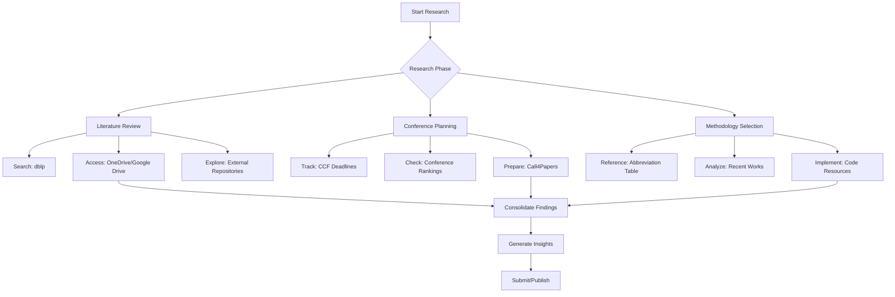

This guide consolidates essential research tools and external resources to support your time series research journey. Whether you're searching for papers, tracking conference deadlines, or understanding methodology abbreviations, this page provides quick access to valuable resources both within and outside this repository.

## Cloud Storage for Research Papers

The repository hosts comprehensive collections of time series papers organized by task and methodology. These collections include papers not present in the main repository and are available through cloud storage platforms for convenient access.


### Access Points

| Platform | Link | Description |
| :--- | :--- | :--- |
| **OneDrive** | [Access Papers](https://1drv.ms/u/s!Au2cJRs-_u93lDbLrSDkDy8htv2V?e=ftuaXd) | Direct download access |
| **Google Drive** | [Access Papers](https://drive.google.com/drive/folders/17bILWdDxUrufRp3yilYfoU5VKywwS1g6?usp=sharing) | Requires VPN in some regions |

Both platforms contain the same comprehensive collection of papers categorized by research tasks and methodologies. The Google Drive version is actively maintained and includes ongoing updates to the methodology section (approximately 90% complete).

Sources: [README.md](README.md#L38-L41)

## External Time Series Repositories

Explore complementary repositories that focus on time series research to expand your knowledge and resource network.

| Repository | Focus Area | Maintainer |
| :--- | :--- | :--- |
| [xiyuanzh/time-series-papers](https://github.com/xiyuanzh/time-series-papers) | General time series papers | xiyuanzh |
| [qingsongedu/awesome-AI-for-time-series-papers](https://github.com/qingsongedu/awesome-AI-for-time-series-papers) | AI applications in time series | qingsongedu |
| [xuehaouwa/Awesome-Trajectory-Prediction](https://github.com/xuehaouwa/Awesome-Trajectory-Prediction) | Trajectory prediction | xuehaouwa |
| [My Time-series Repo-Star List](https://github.com/stars/lixus7/lists/time-series-list) | Curated collection by lixus7 | lixus7 |

These repositories provide additional perspectives and resources that complement the task-based organization of this project. They can help you discover papers across different domains and research communities.

Sources: [README.md](README.md#L8-L14)

## Conference Research Tools

Effective conference research requires specialized tools for paper discovery, deadline tracking, and submission planning. The following resources are recommended for managing your conference workflow.

### Academic Search Engines

- **dblp** ([https://dblp.uni-trier.de/](https://dblp.uni-trier.de/)): Comprehensive bibliographic database for computer science, essential for finding author publications and citation networks
- **Aminer** ([https://www.aminer.cn/conf](https://www.aminer.cn/conf)): Chinese-language academic search engine with strong conference paper coverage

### Deadline Tracking Services

| Platform | Features | Best For |
| :--- | :--- | :--- |
| [CCF Conference Deadlines](https://ccfddl.github.io/) | CCF conference timeline tracking | Mainstream CS conferences |
| [会议之眼](https://www.conferenceeye.cn/#/layout/home) | Chinese interface, deadline alerts | Chinese researchers |
| [Call4Papers](http://123.57.137.208/ccf/ccf-8.jsp) | Call for paper listings | Submission preparation |
| [Conference List](http://www.conferencelist.info/upcoming.html) | Broad conference catalog | Exploring new venues |

These services help you plan your submission schedule effectively. The CCF Deadlines platform is particularly valuable for tracking top-tier conferences relevant to time series research.

Sources: [docs/Conferences.md](docs/Conferences.md#L5-L15)

> [!TIP]
> For comprehensive conference information beyond deadlines, visit the dedicated [Conference Rankings and CCF Standards](19-conference-rankings-and-ccf-standards) page to understand conference quality tiers and the detailed [Conference Deadlines and Submission Guide](20-conference-deadlines-and-submission-guide) for submission strategies.

## Methodology Abbreviation Reference

This repository uses abbreviations throughout paper listings to reduce redundancy and improve readability. These abbreviations are specific to this repository and may not represent standard academic conventions.

### Common Methodology Abbreviations

| Full Name | Abbreviation | Typical Applications |
| :--- | :--- | :--- |
| Attention | **Attn** | Attention mechanisms in transformers |
| AutoRegression (RNN, GRU, LSTM) | **AR** | Sequential modeling |
| Contrastive Learning | **CL** | Representation learning |
| Encoder Decoder | **EncDec** | Sequence-to-sequence tasks |
| Ensemble | **Ens** | Multiple model combination |
| Feature Decomposed | **FeaD** | Temporal feature separation |
| Generative Adversarial Network | **GAN** | Synthetic data generation |
| Graph Convolutional Network | **GCN** | Spatial relationship modeling |
| Memory | **Mem** | Long-term dependency capture |
| Meta Learning | **MetaL** | Few-shot learning adaptation |
| Neural Architecture Search | **NAS** | Model architecture optimization |
| Ordinary Differential Equations | **ODE** | Continuous-time modeling |
| Transformer | **Trans** | Long-range dependency modeling |
| Transfer Learning | **TransL** | Domain adaptation |

### Specialized Abbreviations

| Category | Abbreviation | Description |
| :--- | :--- | :--- |
| **Graph Methods** | AGNN | Adaptive GNN |
| | HGNN | Heterogeneous GNN |
| | MGNN | Multiple Graph |
| | TGN | Temporal Graph Network |
| **Advanced Architectures** | CDE | Controlled Differential Equations |
| | FL | Federated Learning |
| | VAE | Variational Auto-Encoder |
| **Temporal Analysis** | HA | Historical Average (Hour, Day, Week, Month) |
| | MulT | MultiTask |
| | Stat | Statistic methods |

Understanding these abbreviations will help you quickly scan methodology tables and identify relevant research approaches for your specific tasks.

Sources: [README.md](README.md#L47-L78)

## Research Workflow Integration

To effectively utilize these tools and resources, consider integrating them into your research workflow as shown below:



This workflow visualization demonstrates how external tools complement the internal resources of this repository. Starting with your research phase, you can identify which tools will be most helpful for your current objectives.

> [!TIP]
> For detailed information about specific conference paper collections organized by top-tier venues, explore [Top Conference Paper Collections (NeurIPS, ICML, ICLR)](21-top-conference-paper-collections-neurips-icml-iclr) and [Domain-Specific Conference Collections (KDD, WWW, AAAI, IJCAI)](22-domain-specific-conference-collections-kdd-www-aaai-ijcai) for curated reading lists.

## Community and Collaboration

This repository is actively maintained with opportunities for community contribution and collaboration.

### Contribution Guidelines

If you discover:
- **Missing resources** (papers or code implementations)
- **Errors** in existing entries
- **Improvement opportunities** for organization or completeness

You are encouraged to:
1. Open an issue to report the problem
2. Submit a pull request to contribute directly
3. Contact the maintainer for collaboration opportunities

### Contact Information

The repository maintainer welcomes discussions and collaboration opportunities with researchers interested in time series topics. Contact details are available through the [Contact page](docs/Contact.md).


Sources: [docs/README.md](docs/README.md#L19-L21), [README.md](README.md#L25-L28), [docs/Contact.md](docs/Contact.md#L1-L6)

## Getting Started with Research

For new researchers entering time series analysis, the following path is recommended:

```mermaid
flowchart LR
    Step1[Start: Overview] --> Step2[Quick Start Guide]
    Step2 --> Step3[Select Research Area]
    Step3 --> Step4[Explore External Tools]
    Step4 --> Step5[Consult Abbreviation Guide]
    Step5 --> Step6[Access Paper Collections]
    Step6 --> Step7[Deep Dive into Tasks]
    
    subgraph Navigation
    Step1 -->[Overview](1-overview)
    Step2 -->[Quick Start](2-quick-start)
    Step7 -->[Task Categories](4-multivariate-time-series-forecasting)
    end
```

Begin with the [Overview](1-overview) to understand the repository structure, then proceed to [Quick Start](2-quick-start) for immediate orientation. Once you've identified your research area, the tools and resources on this page will support your deep dive into specific time series tasks.

## Next Steps

Now that you're equipped with essential research tools and external resources, you may want to explore:

- **Core Tasks**: Begin with [Multivariate Time Series Forecasting](4-multivariate-time-series-forecasting) for the most comprehensive task coverage
- **Methodologies**: Study [Transformer-based Models](15-transformer-based-models) to understand modern approaches
- **Conference Resources**: Review [Conference Rankings and CCF Standards](19-conference-rankings-and-ccf-standards) to target appropriate venues for publication

These resources, combined with the external tools documented here, provide a solid foundation for your time series research journey.