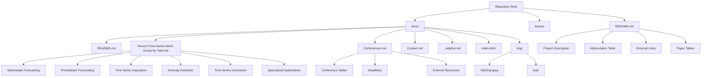

This guide serves as your comprehensive roadmap for navigating the Time-Series Works and Conferences repository—a curated collection of cutting-edge time series research papers, conference resources, and methodology references maintained by PhD researchers at UNSW. Whether you're exploring time series forecasting, anomaly detection, or conference submission strategies, this guide will help you efficiently locate and utilize the repository's extensive resources.

## Repository Architecture Overview

The repository follows a **documentation-first architecture** using Docsify, providing a seamless web-based browsing experience. The structure is designed to separate content presentation (Docsify site) from the project landing page (GitHub README), creating a dual-view experience for different user contexts. The repository contains over **100+ research papers** organized across multiple time series tasks, with accompanying code implementations and conference metadata.


The architectural foundation is built on three core pillars: **paper organization by task** (not by methodology or conference), **comprehensive conference resources**, and **methodology abbreviation standards** to facilitate efficient research discovery. This task-centric organization aligns with how practitioners typically approach time series problems—by identifying their specific research need first.

Sources: [README.md](README.md#L1-L50), [docs/README.md](docs/README.md#L1-L25)

## Repository Structure Visualization

To help you visualize the repository organization, here's a detailed breakdown of the file structure and the purpose of each component:



This hierarchical structure separates concerns effectively: the root README serves as the project landing page for GitHub visitors, while the docs folder contains the complete documentation system powered by Docsify. The **Recent-Time-Series-Work-Group-by-Task.md** file is the primary content repository, containing all research papers organized by their application tasks.

Sources: [docs/index.html](docs/index.html#L14-L22), [docs/_sidebar.md](docs/_sidebar.md#L1-L3)

## Key Files and Their Purposes

Understanding the role of each file will help you navigate efficiently and locate the information you need without confusion.

| File Path | Purpose | Target Audience | Key Contents |
|-----------|---------|-----------------|--------------|
| **README.md** | Project landing page for GitHub | First-time visitors, researchers | Abbreviation table, external links, paper previews, repository description |
| **docs/README.md** | Documentation homepage | Docsify users, researchers | Navigation links, contact info, brief overview |
| **docs/Recent-Time-Series-Work-Group-by-Task.md** | Main research database | Researchers, practitioners | 100+ papers organized by task with code links |
| **docs/Conferences.md** | Conference resource hub | Researchers submitting papers | Conference deadlines, acceptance lists, external resources |
| **docs/Contact.md** | Communication channel | Collaborators, community | WeChat contact for discussions |
| **docs/_sidebar.md** | Navigation configuration | Docsify users | Sidebar menu structure (3 main links) |
| **docs/index.html** | Docsify configuration | Repository maintainers | Plugin setup, theme configuration |

Sources: [README.md](README.md#L53-L80), [docs/Conferences.md](docs/Conferences.md#L1-L33), [docs/_sidebar.md](docs/_sidebar.md#L1-L3)

## Core Content Organization

### Paper Collection Structure

The research papers are organized primarily by **task type**, which reflects the practical workflow of time series researchers. This organization strategy enables you to quickly find papers relevant to your specific problem domain. Each paper entry includes six key attributes:

1. **Task**: The specific time series problem addressed (e.g., Multivariate Forecasting, Anomaly Detection)
2. **Data**: Datasets used for evaluation (e.g., ETT, Electricity, Traffic, Weather)
3. **Model**: The model architecture or methodology name
4. **Paper**: Link to the published paper or preprint
5. **Code**: Link to implementation (PyTorch, TensorFlow, etc.) with GitHub stars indicator
6. **Publication**: Conference/journal name with year and CCF ranking

This comprehensive metadata structure allows you to filter and compare papers across multiple dimensions. The repository uses **methodology abbreviations** consistently throughout, so refer to the abbreviation table in the main README before exploring the paper collections.

Sources: [docs/Recent-Time-Series-Work-Group-by-Task.md](docs/Recent-Time-Series-Work-Group-by-Task.md#L14-L100), [README.md](README.md#L53-L80)

### Conference Resource System

The conference resources provide essential information for researchers preparing submissions. The Conferences page includes:

- **Conference Rankings**: Qualitative ranking based on average paper quality (NeurIPS > ICML > ICLR > KDD > AAAI > IJCAI > WWW > CIKM > ICDM > WSDM)
- **Historical Data**: Accepted paper lists and deadlines from 2013-2022
- **External Tools**: Links to DBLP, Aminer, CCF Deadlines, and other submission tracking resources
- **Conference Coverage**: AAAI, IJCAI, KDD, WWW, ICLR, ICML, NeurIPS, CIKM, WSDM

> [!TIP]
> The repository maintains a **conference quality assessment** based on average paper quality rather than official rankings—this subjective ranking helps researchers prioritize reading and submission targets but should be considered alongside official CCF rankings for academic evaluations.

Sources: [docs/Recent-Time-Series-Work-Group-by-Task.md](docs/Recent-Time-Series-Work-Group-by-Task.md#L5-L12), [docs/Conferences.md](docs/Conferences.md#L1-L33)

## Navigation Workflow

Understanding how to navigate the repository efficiently will save you time and help you find the most relevant resources for your research needs.

```mermaid
flowchart TD
    Start[Enter Repository] --> Entry{What is your goal?}
    
    Entry -->|Explore papers by task| TaskPath
    Entry -->|Submit to conference| ConfPath
    Entry -->|Contact for collaboration| ContactPath
    Entry -->|Understand abbreviations| AbbrPath
    
    TaskPath --> Review[Review abbreviations in README]
    Review --> Select[Select task category]
    Select --> Browse[Browse Recent-Time-Series-Work-Group-by-Task.md]
    Browse --> Analyze[Analyze papers by data/model/publication]
    Analyze --> Access[Access code via GitHub links]
    
    ConfPath --> Check[Check conference rankings]
    Check --> ReviewDeadlines[Review historical deadlines]
    ReviewDeadlines --> AccessResources[Access external submission tools]
    AccessResources --> Submit[Prepare and submit]
    
    ContactPath --> ViewContact[View Contact.md]
    ViewContact --> Connect[Connect via WeChat]
    
    AbbrPath --> ReadTable[Read abbreviation table in README]
    ReadTable --> Return[Return to exploration]
    
    Access --> NextStep{Next step?}
    Submit --> NextStep
    Connect --> NextStep
    Return --> NextStep
    
    NextStep -->|Explore methodology| MethodologyPath
    NextStep -->|Read specific papers| PaperPath
    NextStep -->|Exit| End[Exit]
    
    MethodologyPath --> [See: Transformer-based Models]
    PaperPath --> [See: Deep Dive sections]
```

This workflow guides you through the repository based on your immediate goals. The **critical first step** is to review the abbreviation table in the main README, as methodology abbreviations are used consistently throughout the paper collections and understanding them is essential for effective navigation.

Sources: [README.md](README.md#L53-L80), [docs/_sidebar.md](docs/_sidebar.md#L1-L3)

## Methodology Abbreviation System

The repository employs a systematic abbreviation system to maintain compact references while preserving clarity. Before diving into the paper collections, familiarize yourself with these core abbreviations:

| Category | Abbreviations | Examples |
|----------|---------------|----------|
| **Deep Learning** | Trans, Attn, TCN, VAE, GAN | Transformer, Attention, Temporal Convolutional Network |
| **Graph Methods** | GCN, HGNN, MGNN, TGN | Graph Convolutional Network, Heterogeneous GNN |
| **Traditional** | AR, HA, Stat | AutoRegression, Historical Average, Statistical |
| **Learning Types** | CL, FL, MetaL, TransL, Ens | Contrastive Learning, Federated Learning |
| **Advanced** | ODE, CDE, NAS, EncDec | Ordinary Differential Equations, AutoEncoder |

These abbreviations appear in the methodology columns of paper tables and are essential for quickly scanning and comparing research approaches. The abbreviation table in the README provides comprehensive coverage of all terms used throughout the repository.

Sources: [README.md](README.md#L53-L80)

## Recommended Reading Paths

Based on your background and research interests, different navigation paths will yield the most value. Choose the path that aligns with your current objectives.

### Path 1: Beginner Researchers

Start with foundational understanding before diving into specific papers:

1. **Review abbreviations** in README.md (L53-L80)
2. **Explore Overview** for repository context
3. **Browse Quick Start** for practical guidance
4. **Select your task** from the Deep Dive categories

### Path 2: Practitioners Seeking Solutions

Focus on practical implementations and code:

1. **Identify your problem domain** (e.g., Traffic Prediction, Anomaly Detection)
2. **Navigate to the specific task page** in the catalog
3. **Filter papers by dataset** to match your data characteristics
4. **Access code repositories** via GitHub links (stars indicate community adoption)
5. **Review publication rankings** to assess paper quality

### Path 3: Researchers Preparing Submissions

Utilize conference resources strategically:

1. **Review conference rankings** in Conferences.md
2. **Check historical deadlines** for timeline planning
3. **Browse accepted paper lists** in your target venues
4. **Use external tools** (DBLP, Aminer) for comprehensive literature review
5. **Contact maintainers** via WeChat for collaboration opportunities

> [!TIP]
> The repository's **task-based organization** mirrors the practical workflow of time series practitioners—start by identifying your problem type, then explore solutions within that domain rather than browsing by methodology or conference.

Sources: [docs/Recent-Time-Series-Work-Group-by-Task.md](docs/Recent-Time-Series-Work-Group-by-Task.md#L1-L100), [docs/Conferences.md](docs/Conferences.md#L1-L33)

## Getting Started with Paper Exploration

When you're ready to explore the paper collections, follow this systematic approach to maximize efficiency:

### Step 1: Define Your Research Context

Clarify these parameters before browsing:
- **Task Type**: Are you forecasting, detecting anomalies, generating data, or imputing missing values?
- **Data Characteristics**: What type of time series data do you have? (multivariate, spatial-temporal, irregular)
- **Scale**: What's the temporal horizon and spatial extent of your problem?

### Step 2: Navigate to Your Task Section

Use the catalog structure to locate your relevant section:

- For **multivariate forecasting** problems: [Multivariate Time Series Forecasting](4-multivariate-time-series-forecasting)
- For **uncertainty quantification**: [Probabilistic Time Series Forecasting](5-probabilistic-time-series-forecasting)
- For **data quality issues**: [Time Series Imputation](6-time-series-imputation) or [Time Series Anomaly Detection](7-time-series-anomaly-detection)
- For **synthetic data needs**: [Time Series Generation](8-time-series-generation)
- For **domain applications**: Browse specialized applications (Traffic, Demand, Stock, etc.)

### Step 3: Filter and Analyze Papers

Within each task section, apply these filters:

| Filter Criteria | How to Apply | What to Look For |
|----------------|--------------|------------------|
| **Dataset Compatibility** | Match your data type to the "Data" column | Similar data characteristics and scale |
| **Code Availability** | Look for GitHub links with stars | Higher stars often indicate better maintenance |
| **Publication Quality** | Check CCF rankings (A/B/C) in "Publication" column | Higher venues typically indicate rigorous peer review |
| **Methodology Fit** | Match methodology abbreviations to your expertise | Algorithms you can understand and implement |
| **Recency** | Sort by publication year | Recent papers may use more advanced techniques |

### Step 4: Access and Evaluate Resources

Once you've identified promising papers:

1. **Read the paper** via the provided link (OpenReview, arXiv, or conference proceedings)
2. **Explore the codebase** through the GitHub repository link
3. **Check code documentation** and replication instructions
4. **Review citation context** using DBLP or Google Scholar
5. **Consider contacting authors** for clarification or collaboration

Sources: [README.md](README.md#L81-L200), [docs/Recent-Time-Series-Work-Group-by-Task.md](docs/Recent-Time-Series-Work-Group-by-Task.md#L14-L100)

## External Resources Integration

The repository strategically integrates with external resources to provide comprehensive coverage beyond its immediate content. Understanding these integrations will enhance your research workflow.

### Cloud Storage for Papers

The maintainers provide access to **comprehensive paper collections** via cloud storage, including papers not directly included in the GitHub repository:

- **OneDrive**: [Access Link](https://1drv.ms/u/s!Au2cJRs-_u93lDbLrSDkDy8htv2V?e=ftuaXd)
- **Google Drive**: [Access Link](https://drive.google.com/drive/folders/17bILWdDxUrufRp3yilYfoU5VKywwS1g6?usp=sharing)

These resources are particularly valuable for:
- **Offline reading**: Download papers for offline access
- **Comprehensive coverage**: Access papers not directly linked in the repository
- **VPN considerations**: Google Drive may require VPN access in some regions

### Literature Search Tools

The repository recommends several external tools for comprehensive literature searches:

| Tool | Purpose | Language | Access |
|------|---------|----------|--------|
| **DBLP** | Bibliographic database | English/Multilingual | [dblp.uni-trier.de](https://dblp.uni-trier.de/) |
| **Aminer** | Academic search engine | Chinese/English | [aminer.cn](https://www.aminer.cn/conf) |
| **CCF Deadlines** | Conference deadline tracker | English | [ccfddl.github.io](https://ccfddl.github.io/) |
| **Conference Eye** | Conference information hub | Chinese | [conferenceeye.cn](https://www.conferenceeye.cn) |

### Complementary Repositories

The maintainers recommend these related repositories for broader exploration:

- **[xiyuanzh/time-series-papers](https://github.com/xiyuanzh/time-series-papers)**: Alternative time series paper collection
- **[qingsongedu/awesome-AI-for-time-series-papers](https://github.com/qingsongedu/awesome-AI-for-time-series-papers)**: AI-focused time series research
- **[xuehaouwa/Awesome-Trajectory-Prediction](https://github.com/xuehaouwa/Awesome-Trajectory-Prediction)**: Specialized in trajectory prediction
- **[Lionelsy/Conference-Accepted-Paper-List](https://github.com/Lionelsy/Conference-Accepted-Paper-List)**: General conference paper lists

Sources: [README.md](README.md#L12-L20), [README.md](README.md#L42-L46), [docs/Conferences.md](docs/Conferences.md#L6-L20)

## Contribution and Collaboration

The repository actively encourages community participation to maintain its quality and comprehensiveness. Understanding the contribution channels will help you engage effectively.

### Reporting Issues and Missing Resources

If you discover errors or missing information:

1. **Open an issue** on GitHub to report bugs or missing papers
2. **Provide details**: Include paper title, DOI/arXiv link, and any available code repositories
3. **Categorize clearly**: Specify the task category and methodology
4. **Be respectful**: Remember maintainers are researchers volunteering their time

### Making Direct Contributions

For more direct involvement:

1. **Fork the repository** and create a feature branch
2. **Follow existing format**: Match the table structure and abbreviation conventions
3. **Include all metadata**: Task, Data, Model, Paper, Code, Publication
4. **Submit pull request** with clear description of additions
5. **Engage in discussion**: Respond to reviewer feedback constructively

### Collaboration Opportunities

The repository maintainer explicitly invites collaboration:

> "If you're interested in collaborating on this work, please feel free to contact me for discussions and collaborative efforts." — [docs/README.md](docs/README.md#L16-L17)

Collaboration contexts include:
- **Paper curation**: Help expand coverage in specific task domains
- **Code maintenance**: Update or verify code repositories
- **Methodology documentation**: Expand abbreviation guides and explanations
- **Conference updates**: Maintain current deadline and submission information

### Contact Information

For direct communication:
- **WeChat**: Available in docs/Contact.md with QR code image
- **GitHub Issues**: For bug reports and public discussions
- **Pull Requests**: For direct contributions to content

Sources: [README.md](README.md#L40-L41), [docs/README.md](docs/README.md#L16-L17), [docs/Contact.md](docs/Contact.md#L1-L6)

## Next Steps in Your Navigation Journey

Having completed this navigation guide, you now have the foundational knowledge to explore the repository efficiently. Based on your goals, consider these recommended next steps:

### If You're New to Time Series Research

1. **Start with [Overview](1-overview)** to understand the repository's scope and organization
2. **Review [Quick Start](2-quick-start)** for practical guidance on using the repository
3. **Explore** the abbreviation table in the main README.md
4. **Select your first task** from the Deep Dive categories based on your interests

### If You're Working on a Specific Problem

1. **Navigate directly** to your relevant task section in the catalog
2. **Filter papers** by dataset and methodology to find matches
3. **Access code repositories** for implementations and baselines
4. **Consult [Conference Rankings](19-conference-rankings-and-ccf-standards)** if preparing submissions

### If You're Preparing Conference Submissions

1. **Review** [Conference Rankings and CCF Standards](19-conference-rankings-and-ccf-standards)
2. **Check** [Conference Deadlines](20-conference-deadlines-and-submission-guide)
3. **Explore** [Top Conference Paper Collections](21-top-conference-paper-collections-neurips-icml-iclr) or [Domain-Specific Collections](22-domain-specific-conference-collections-kdd-www-aaai-ijcai)
4. **Utilize external tools** linked in Conferences.md for comprehensive submission tracking

The repository is designed to be both a **discovery tool** and a **reference resource**—use it to find relevant papers, access implementations, understand conference landscapes, and connect with the research community. Your systematic navigation of this resource will accelerate your time series research and keep you informed about the latest developments in this rapidly evolving field.
